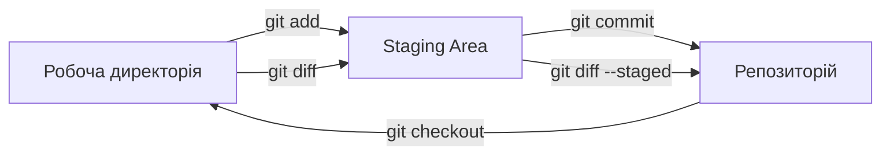
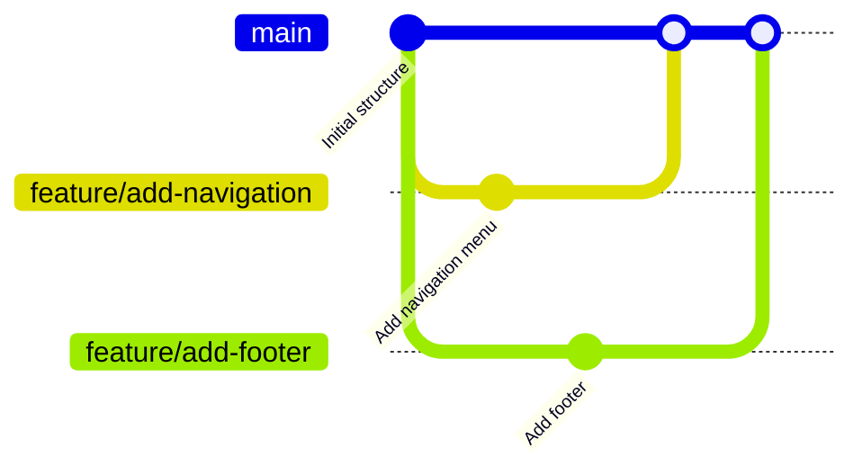

# Лабораторна робота 1 Налаштування Git та робота з локальним сховищем

## Мета

Опанувати базові навички роботи з системою контролю версій Git, навчитися налаштовувати локальне середовище для роботи з Git, освоїти основні операції з репозиторіями, гілками та комітами, отримати практичний досвід використання Git для відстеження змін у коді проєкту.

## Завдання

### Рівень 1 (обов'язковий мінімум)

Створити локальний Git репозиторій для простого вебдодатка, виконати базові операції з контролю версій.

Необхідно виконати наступне:

- Встановити Git на локальному комп'ютері та налаштувати базову конфігурацію користувача.
- Створити SSH ключі для автентифікації на GitHub.
- Ініціалізувати новий Git репозиторій для простого вебпроєкту.
- Створити базову структуру проєкту з HTML, CSS та JavaScript файлами.
- Виконати серію комітів, демонструючи розуміння атомарності змін.
- Створити та перемикатися між гілками для розробки різних функцій.
- Об'єднати гілки за допомогою merge операцій.

### Рівень 2 (додаткова функціональність)

Розширити базовий функціонал роботою з віддаленим репозиторієм та більш складними операціями Git.

Додатково до рівня 1:

- Створити віддалений репозиторій на GitHub та налаштувати зв'язок з локальним сховищем.
- Виконати push змін у віддалений репозиторій.
- Створити та налаштувати файл .gitignore для виключення непотрібних файлів.
- Використати git log з різними параметрами для аналізу історії змін.
- Виконати операцію git reset для скасування комітів.
- Створити теги для маркування важливих версій проєкту.

### Рівень 3 (творче розширення)

Продемонструвати глибоке розуміння внутрішньої структури Git та розширених можливостей.

Додатково до рівня 2:

- Використати git stash для збереження незавершених змін.
- Виконати інтерактивний rebase для редагування історії комітів.
- Застосувати git cherry-pick для вибіркового переносу комітів між гілками.
- Використати git reflog для відновлення втрачених комітів.
- Налаштувати Git hooks для автоматизації перевірок перед комітом.
- Створити Git aliases для оптимізації робочого процесу.

## Критерії оцінювання

### Середній рівень (оцінка "задовільно")

Здобувач освіти демонструє базове розуміння роботи з Git. Успішно встановлює Git та виконує початкову конфігурацію, створює SSH ключі за інструкцією. Може ініціалізувати репозиторій, створити декілька файлів та виконати прості коміти. Розуміє концепцію гілок на базовому рівні, може створити гілку та виконати просте злиття без конфліктів. Допускає помилки у форматуванні commit messages, не завжди дотримується принципу атомарності комітів. Звіт містить основні скріншоти виконаних команд, але без детальних пояснень. Не всі етапи роботи задокументовані належним чином.

### Достатній рівень (оцінка "добре")

Здобувач освіти впевнено працює з базовими командами Git та розуміє принципи контролю версій. Правильно налаштовує Git конфігурацію та SSH автентифікацію, створює осмислену структуру проєкту. Виконує атомарні коміти з інформативними повідомленнями, дотримується загальноприйнятих практик оформлення commit messages. Ефективно працює з гілками, виконує merge операції, розуміє різницю між fast-forward та 3-way merge. Налаштовує віддалений репозиторій, коректно використовує push та pull команди. Створює правильно структурований .gitignore файл. Використовує git log для аналізу історії. Звіт добре структурований, містить пояснення виконаних операцій, але може мати незначні недоліки в оформленні чи повноті документації.

### Високий рівень (оцінка "відмінно")

Здобувач освіти демонструє глибоке розуміння Git як інструменту контролю версій та його внутрішньої архітектури. Виконує всі завдання трьох рівнів бездоганно. Ефективно використовує розширені можливості Git, такі як interactive rebase, cherry-pick, reflog. Створює чисту та логічну історію комітів, застосовує різні стратегії роботи з гілками залежно від ситуації. Налаштовує Git hooks для автоматизації робочого процесу, створює корисні aliases. Демонструє розуміння того, як Git зберігає дані та управляє об'єктами. Створює професійно оформлений звіт з детальними поясненнями кожної операції, аналізом результатів, скріншотами з анотаціями. Документація повна, структурована.

# Порядок оформлення та здачі лабораторної роботи

Виконання лабораторної роботи відбувається через GitHub Classroom з фінальним підтвердженням здачі в системі Moodle.

[**GitHub Classroom assignment лабораторної роботи**](https://classroom.github.com/a/0sdPRI1z)

Перейдіть за наданим посиланням. При першому використанні GitHub Classroom система може запитати дозвіл на доступ до вашого GitHub акаунту. Підтвердіть авторизацію для продовження роботи.

GitHub Classroom автоматично створить персональний репозиторій для вашої лабораторної роботи. Назва репозиторію зазвичай має формат lab-номер-ваш-github-username. Цей репозиторій містить початковий шаблон з необхідною структурою директорій.

Весь програмний код, конфігураційні файли та інші артефакти лабораторної роботи розміщуються виключно у папці `src`. Структура директорії `src` залежить від специфіки конкретної лабораторної роботи.

Звіт про виконання лабораторної роботи оформлюється у файлі `README.md`, розташованому в кореневій директорії репозиторію. Використовуйте markdown форматування для покращення читабельності звіту. Code blocks з підсвіткою синтаксису для команд та коду, списки для переліку виконаних завдань, таблиці для структурованої інформації де доцільно.

Скріншоти зберігайте у папці `screenshots` в кореневій директорії репозиторію та вставляйте у `README.md` через відносні посилання.

Після завершення всіх завдань та оформлення звіту необхідно виконати фінальний коміт, який зафіксує остаточний стан вашої роботи. Після відправлення фінального коміту gерейдіть до курсу на платформі Moodle та знайдіть завдання лабораторної роботи. Відкрийте завдання для здачі. У текстовому полі для відповіді напишіть слово **виконано**.

## Політика щодо дедлайнів

При порушенні встановленого терміну здачі лабораторної роботи максимальна можлива оцінка становить "добре", незалежно від якості виконаної роботи. Винятки можливі лише за поважних причин, підтверджених документально.

## Теоретичні відомості

### Система контролю версій Git

Git є розподіленою системою контролю версій, створеною Лінусом Торвальдсом у 2005 році для управління розробкою ядра Linux. На відміну від централізованих систем контролю версій, таких як SVN або CVS, Git зберігає повну копію репозиторію на кожному комп'ютері розробника, що забезпечує високу швидкість роботи, можливість працювати офлайн та надійність зберігання даних.

Основною філософією Git є ефективне відстеження змін у файлах проєкту через створення знімків стану файлової системи замість збереження різниць між версіями. Кожен коміт у Git представляє собою повний знімок всіх файлів проєкту на певний момент часу, що робить операції з історією швидкими та надійними.

### Архітектура Git

Git організовує дані за допомогою чотирьох основних типів об'єктів. Blob об'єкти зберігають вміст файлів, tree об'єкти представляють структуру директорій та посилання на blob або інші tree об'єкти, commit об'єкти містять метадані про автора, час створення та посилання на кореневий tree об'єкт, а tag об'єкти використовуються для маркування важливих комітів.

Всі об'єкти Git ідентифікуються за допомогою SHA-1 хешу їхнього вмісту, що забезпечує цілісність даних та унеможливлює непомітну зміну історії. Цей механізм робить Git надзвичайно надійним інструментом для контролю версій.

### Три області Git

Робота з Git передбачає розуміння трьох основних областей, між якими переміщуються файли. Робоча директорія містить файли проєкту, з якими ви безпосередньо працюєте. Область індексування, також відома як staging area, є проміжним буфером, куди додаються зміни перед комітом. Репозиторій зберігає всю історію комітів та об'єкти Git.

Типовий робочий процес включає модифікацію файлів у робочій директорії, додавання змін до індексу за допомогою git add, створення коміту командою git commit, який переносить зміни з індексу до репозиторію. Розуміння цього процесу є фундаментальним для ефективної роботи з Git.



### SSH автентифікація

SSH протокол забезпечує безпечний спосіб взаємодії з віддаленими Git репозиторіями без необхідності вводити пароль при кожній операції. SSH використовує асиметричне шифрування з парою ключів: приватним, який зберігається на вашому комп'ютері та ніколи не передається, та публічним, який розміщується на сервері Git.

Процес автентифікації відбувається через криптографічне підтвердження володіння приватним ключем без його передачі по мережі. Це робить SSH автентифікацію набагато безпечнішою за використання паролів, особливо при роботі з публічними репозиторіями.

### Гілки в Git

Гілки є одним з найпотужніших механізмів Git, що дозволяють розробникам працювати над різними функціями ізольовано, не впливаючи на основну кодову базу. Технічно, гілка в Git є просто рухомим вказівником на певний коміт, що робить створення та перемикання між гілками надзвичайно швидкою операцією.

Основна гілка традиційно називається main або master та містить стабільний код проєкту. Розробники створюють feature гілки для роботи над новим функціоналом, bugfix гілки для виправлення помилок, hotfix гілки для термінових виправлень у production коді.

### Операції злиття

Git підтримує кілька стратегій злиття гілок. Fast-forward merge відбувається, коли одна гілка повністю включає іншу, і Git просто переміщує вказівник без створення нового коміту злиття. Three-way merge створює новий коміт, який об'єднує зміни з двох гілок, коли вони мають спільного предка але розійшлися в історії.

Під час злиття можуть виникати конфлікти, коли одні й ті самі рядки коду були змінені в обох гілках. Git позначає конфліктні місця спеціальними маркерами, і розробник повинен вручну вирішити конфлікт, обравши потрібні зміни або об'єднавши їх.

### Форматування commit messages

Якісні commit messages є важливою частиною професійної роботи з Git. Перший рядок повинен містити короткий опис зміни довжиною до 50 символів, написаний в наказовому способі. Після порожнього рядка може йти детальний опис, що пояснює контекст зміни, причини її необхідності та потенційні наслідки.

Добре написані повідомлення комітів допомагають іншим розробникам розуміти історію проєкту, спрощують процес code review та полегшують пошук конкретних змін у майбутньому. Багато команд використовують префікси типу feat, fix, docs, refactor для категоризації комітів.

## Хід роботи

### Початок роботи з GitHub Classroom

Викладач надає вам посилання на assignment у GitHub Classroom. Після переходу за посиланням автоматично створюється ваш персональний репозиторій для виконання лабораторної роботи.

Приймаєте assignment, після чого GitHub створює репозиторій з шаблоном. Копіюйте URL вашого репозиторію для подальшого клонування. Структура репозиторію включає файл README.md для вашого звіту та директорію src для розміщення коду проєкту.

### Встановлення та налаштування Git

Завантажуйте Git з офіційного сайту git-scm.com відповідно до вашої операційної системи. Для Windows використовуйте Git for Windows, для macOS можна встановити через Homebrew, для Linux використовуйте пакетний менеджер вашого дистрибутива.

Після встановлення перевірте версію Git командою git --version. Налаштуйте глобальну конфігурацію користувача, вказавши ім'я та електронну адресу, які будуть відображатися в історії комітів.

```bash
git config --global user.name "Ваше Ім'я"
git config --global user.email "your.email@example.com"
```

Налаштуйте текстовий редактор за замовчуванням для написання commit messages. Для Visual Studio Code використовуйте команду git config --global core.editor "code --wait". Перегляньте поточну конфігурацію командою git config --list.

### Генерація SSH ключів

Перевірте наявність існуючих SSH ключів у директорії ~/.ssh. Якщо файли id_rsa та id_rsa.pub відсутні, згенеруйте нову пару ключів командою ssh-keygen -t ed25519 -C "your.email@example.com". Для старіших систем використовуйте ssh-keygen -t rsa -b 4096 -C "your.email@example.com".

Під час генерації ключів програма запитає місце збереження та парольну фразу. Рекомендується використовувати парольну фразу для додаткової безпеки. Після генерації скопіюйте вміст публічного ключа командою cat ~/.ssh/id_ed25519.pub або використовуючи утиліту pbcopy на macOS.

Додайте публічний SSH ключ до вашого GitHub акаунту. Перейдіть в Settings, виберіть SSH and GPG keys, натисніть New SSH key, вставте скопійований ключ та збережіть. Перевірте з'єднання командою ssh -T git@github.com.

### Клонування репозиторію

Клонуйте ваш репозиторій з GitHub Classroom на локальний комп'ютер командою git clone, використовуючи SSH URL. Структура команди виглядає як git clone git@github.com:organization/repository-name.git.

Перейдіть у створену директорію проєкту. Перевірте статус репозиторію командою git status та переглянте налаштовані віддалені репозиторії командою git remote -v. За замовчуванням віддалений репозиторій має назву origin.

### Створення структури проєкту

У директорії src створіть базову структуру вебдодатка. Додайте файл index.html з базовою HTML структурою, файл styles.css для стилів, файл script.js для JavaScript коду.

Приклад вмісту index.html:

```html
<!DOCTYPE html>
<html lang="uk">
<head>
    <meta charset="UTF-8">
    <meta name="viewport" content="width=device-width, initial-scale=1.0">
    <title>Git Lab Project</title>
    <link rel="stylesheet" href="styles.css">
</head>
<body>
    <h1>Проєкт для вивчення Git</h1>
    <div id="content"></div>
    <script src="script.js"></script>
</body>
</html>
```

Створіть файл .gitignore у кореневій директорії проєкту для виключення непотрібних файлів з контролю версій. Додайте туди типові патерни, такі як node_modules, .DS_Store, *.log, .env.

### Виконання перших комітів

Перевірте статус робочої директорії командою git status. Додайте всі створені файли до staging area командою git add. Можна додавати файли окремо або використати git add . для додавання всіх змінених файлів.

Створіть перший коміт з інформативним повідомленням git commit -m "Initial project structure with HTML, CSS and JavaScript files". Переглянте історію комітів командою git log або git log --oneline для компактного виводу.

Внесіть зміни до файлів, наприклад, додайте базові стилі у styles.css. Виконайте git diff для перегляду змін перед додаванням до staging area. Створіть новий коміт для цих змін.

### Робота з гілками

Створіть нову гілку для розробки функціоналу командою git branch feature/add-navigation. Перемкніться на цю гілку командою git checkout feature/add-navigation або використайте скорочену форму git checkout -b feature/add-navigation для створення та перемикання одночасно.

У новій гілці додайте навігаційне меню до index.html та відповідні стилі. Зробіть коміт з цими змінами. Переглянте список всіх гілок командою git branch, активна гілка буде позначена зірочкою.

Створіть ще одну гілку feature/add-footer від гілки main. Перемкніться на неї та додайте футер до сторінки. Виконайте коміт змін.



### Злиття гілок

Поверніться до основної гілки main командою git checkout main. Виконайте злиття гілки з навігацією командою git merge feature/add-navigation. Якщо немає конфліктів, Git виконає fast-forward merge або створить merge коміт.

Після успішного злиття перевірте вміст index.html та переконайтеся, що навігація додана. Виконайте злиття гілки з футером git merge feature/add-footer. Переглянте історію комітів з візуалізацією гілок командою git log --graph --oneline --all.

Видаліть об'єднані гілки, якщо вони більше не потрібні, командами git branch -d feature/add-navigation та git branch -d feature/add-footer.

### Відправлення змін на GitHub

Відправте всі ваші локальні коміти у віддалений репозиторій командою git push origin main. Якщо ви працювали на інших гілках і хочете їх також відправити, використовуйте git push origin назва-гілки або git push --all для відправлення всіх гілок.

Перейдіть на GitHub та переконайтеся, що всі ваші зміни успішно завантажені. Перегляньте історію комітів, структуру гілок та вміст файлів через вебінтерфейс.

### Розширені операції (для рівнів 2 та 3)

Для виконання рівня 2 використайте команду git log з різними параметрами. Команда git log --stat показує статистику змін у файлах, git log --graph --decorate --oneline відображає історію у вигляді графа.

Створіть тег для поточної версії проєкту командою git tag v1.0.0. Відправте теги на GitHub командою git push --tags. Експериментуйте з git reset для скасування комітів, але будьте обережні з цією командою.

Для рівня 3 внесіть зміни до декількох файлів, але не готові їх комітити. Використайте git stash для збереження незавершеної роботи. Перемкніться на іншу гілку, зробіть необхідну роботу, потім поверніться та застосуйте збережені зміни командою git stash pop.

Використайте інтерактивний rebase для редагування історії комітів git rebase -i HEAD~3. Об'єднайте декілька дрібних комітів в один, відредагуйте повідомлення комітів. Створіть Git hook у файлі .git/hooks/pre-commit для перевірки коду перед комітом.

### Оформлення звіту

Заповніть файл README.md у кореневій директорії репозиторію. Звіт повинен містити назву роботи, мету, опис виконаних завдань, скріншоти основних етапів роботи з поясненнями, висновки про отримані навички.

Структуруйте звіт за розділами відповідно до виконаних рівнів завдань. Додайте скріншоти виконання ключових команд, виводу git log, стану репозиторію на GitHub. Використовуйте markdown форматування для покращення читабельності звіту.

Зробіть фінальний коміт з заповненим звітом git commit -am "Add lab report to README". Відправте зміни на GitHub командою git push. Переконайтеся, що ваш звіт коректно відображається на сторінці репозиторію.

### Правила роботи з Git у проєкті

Завжди виконуйте git pull перед початком роботи, щоб отримати найновіші зміни з віддаленого репозиторію. Створюйте окремі гілки для кожної нової функції або виправлення. Робіть атомарні коміти, кожен з яких вносить одну логічну зміну.

Пишіть інформативні commit messages, які пояснюють що та чому було змінено. Використовуйте теперішній час та наказовий спосіб у повідомленнях. Регулярно відправляйте зміни на GitHub для резервного копіювання вашої роботи.

Перед merge гілки в main переконайтеся, що код працює коректно та всі тести проходять. Видаляйте об'єднані гілки для підтримки чистоти репозиторію. Ніколи не робіть rebase публічних гілок, з якими працюють інші розробники.


## Контрольні запитання

1. Поясніть різницю між розподіленими та централізованими системами контролю версій. Які переваги надає розподілена архітектура Git?
2. Опишіть три області Git (робоча директорія, staging area, репозиторій) та пояснніть, як файли переміщуються між ними під час типового робочого процесу.
3. Що таке SHA-1 хеш у контексті Git і яку роль він відіграє у забезпеченні цілісності даних? Чому зміна історії комітів в Git практично неможлива без детектування?
4. Як працює SSH автентифікація при взаємодії з віддаленими Git репозиторіями? Чому SSH ключі вважаються безпечнішими за паролі?
5. Поясніть різницю між fast-forward merge та three-way merge. У яких ситуаціях Git використовує кожен з цих підходів?
6. Що таке конфлікт злиття і чому він виникає? Опишіть процес вирішення конфлікту в Git.
7. Яка різниця між командами git reset, git revert та git checkout? У яких ситуаціях доцільно використовувати кожну з них?
