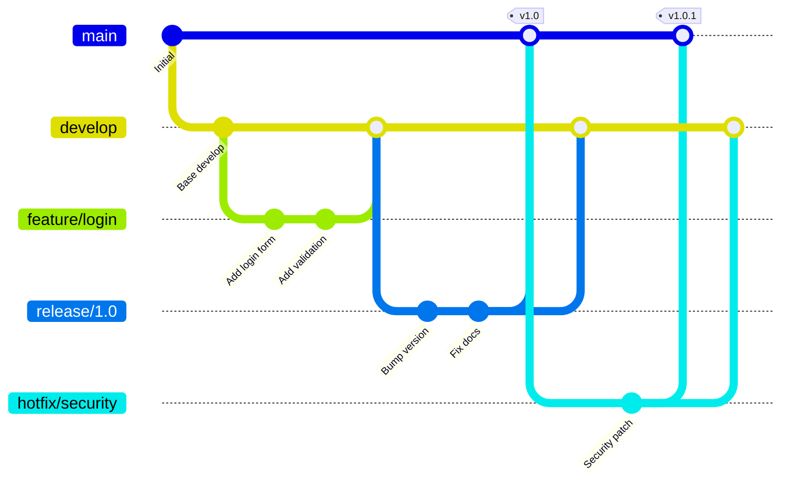
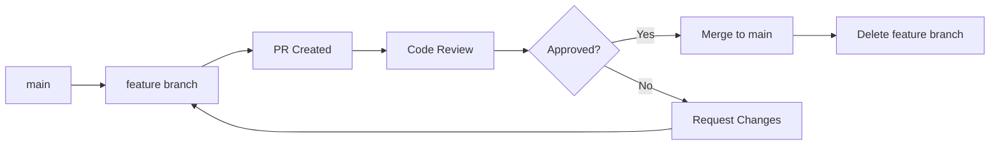

# Лабораторна робота 2 Реалізація стратегій гілкування та code review процесу

## Мета

Опанувати професійні практики роботи з Git у командній розробці, навчитися застосовувати різні стратегії гілкування відповідно до потреб проєкту, освоїти процес code review через pull requests, отримати практичний досвід вирішення конфліктів злиття та організації ефективної співпраці розробників у спільному репозиторії.

## Завдання

### Рівень 1 (обов'язковий мінімум)

Реалізувати базовий workflow з використанням Feature Branch стратегії та створити pull requests для перегляду коду.

Необхідно виконати наступне:

- Створити репозиторій для командного проєкту з базовою структурою.
- Реалізувати Feature Branch workflow для розробки трьох незалежних функцій.
- Створити окремі гілки для кожної функції з описовими назвами.
- Виконати коміти в кожній гілці, дотримуючись принципів атомарності та якісних commit messages.
- Створити pull requests для кожної feature гілки на GitHub.
- Виконати базовий code review, залишивши коментарі до змін.
- Об'єднати pull requests з основною гілкою після схвалення.
- Навмисно створити конфлікт злиття та вирішити його коректно.

### Рівень 2 (додаткова функціональність)

Впровадити Git Flow стратегію з підтримкою різних типів гілок та release процесом.

Додатково до рівня 1:

- Організувати репозиторій за Git Flow моделлю з гілками main, develop, feature, release, hotfix.
- Створити декілька feature гілок від develop гілки для нового функціоналу.
- Реалізувати процес створення release гілки з підготовкою до випуску версії.
- Виконати hotfix для критичної помилки в production коді.
- Налаштувати правила захисту гілок (branch protection rules) на GitHub.
- Використати squash merge для об'єднання feature гілок.
- Створити GitHub Actions workflow для автоматичної перевірки pull requests.

### Рівень 3 (творче розширення)

Реалізувати trunk-based development або GitHub Flow з автоматизацією та розширеними практиками code review.

Додатково до рівня 2:

- Впровадити trunk-based development з короткоживучими feature гілками.
- Налаштувати обов'язкові code review requirements для pull requests.
- Створити шаблони для pull requests та issues.
- Використати GitHub Labels та Projects для організації роботи.
- Налаштувати автоматичне тестування та linting у pull requests.
- Реалізувати semantic versioning з автоматичною генерацією changelog.
- Створити CODEOWNERS файл для автоматичного призначення reviewers.

## Критерії оцінювання

### Середній рівень (оцінка "задовільно")

Здобувач освіти розуміє базові концепції роботи з гілками та створення pull requests. Успішно створює feature гілки з описовими назвами, виконує коміти з базовими повідомленнями. Може створити pull request на GitHub та додати базовий опис змін. Виконує просте злиття гілок без конфліктів через інтерфейс GitHub. При виникненні конфлікту вирішує його за інструкцією, але не завжди розуміє причини виникнення. Залишає формальні коментарі при code review без глибокого аналізу коду. Звіт містить скріншоти виконаних операцій, але пояснення процесів поверхневі. Не демонструє розуміння різниці між стратегіями гілкування.

### Достатній рівень (оцінка "добре")

Здобувач освіти впевнено застосовує Feature Branch workflow та розуміє принципи організації командної роботи з Git. Створює логічно структуровані гілки з осмисленими назвами, дотримується naming conventions. Виконує якісні pull requests з детальним описом змін, контекстом та чек-листом перевірки. Проводить конструктивний code review, вказує на потенційні проблеми, пропонує покращення. Ефективно вирішує конфлікти злиття, розуміє причини їх виникнення. Реалізує Git Flow стратегію з коректним використанням різних типів гілок. Налаштовує базові branch protection rules. Звіт добре структурований, містить аналіз переваг та недоліків різних стратегій гілкування, обґрунтування вибору підходу для конкретних сценаріїв.

### Високий рівень (оцінка "відмінно")

Здобувач освіти демонструє професійне володіння різними стратегіями гілкування та глибоке розуміння командної розробки з Git. Впевнено реалізує Git Flow, GitHub Flow та trunk-based development, може обґрунтувати вибір конкретної стратегії для різних типів проєктів. Створює детальні pull requests з comprehensive описом, context, screenshots, testing notes. Проводить thorough code review з фокусом на code quality, maintainability, performance, security. Ефективно використовує GitHub features для організації роботи: labels, projects, milestones, code owners. Налаштовує automation workflows для перевірки pull requests, автоматичного тестування, linting. Демонструє розуміння advanced Git concepts, таких як різниця між merge strategies, коли використовувати rebase vs merge. Створює професійний звіт з аналізом trade-offs різних підходів, рекомендаціями для реальних проєктів, діаграмами workflow processes.

## Порядок оформлення та здачі лабораторної роботи

Виконання лабораторної роботи відбувається через GitHub Classroom з фінальним підтвердженням здачі в системі Moodle.

[**GitHub Classroom assignment лабораторної роботи**](https://classroom.github.com/a/8dq_uqMJ)

Перейдіть за наданим посиланням. При першому використанні GitHub Classroom система може запитати дозвіл на доступ до вашого GitHub акаунту. Підтвердіть авторизацію для продовження роботи.

GitHub Classroom автоматично створить персональний репозиторій для вашої лабораторної роботи. Назва репозиторію зазвичай має формат lab-номер-ваш-github-username. Цей репозиторій містить початковий шаблон з необхідною структурою директорій.

Весь програмний код, конфігураційні файли та інші артефакти лабораторної роботи розміщуються виключно у папці `src`. Структура директорії `src` залежить від специфіки конкретної лабораторної роботи.

Звіт про виконання лабораторної роботи оформлюється у файлі `README.md`, розташованому в кореневій директорії репозиторію. Використовуйте markdown форматування для покращення читабельності звіту. Code blocks з підсвіткою синтаксису для команд та коду, списки для переліку виконаних завдань, таблиці для структурованої інформації де доцільно.

Скріншоти зберігайте у папці `screenshots` в кореневій директорії репозиторію та вставляйте у `README.md` через відносні посилання.

Після завершення всіх завдань та оформлення звіту необхідно виконати фінальний коміт, який зафіксує остаточний стан вашої роботи. Після відправлення фінального коміту gерейдіть до курсу на платформі Moodle та знайдіть завдання лабораторної роботи. Відкрийте завдання для здачі. У текстовому полі для відповіді напишіть слово **виконано**.

## Політика щодо дедлайнів

При порушенні встановленого терміну здачі лабораторної роботи максимальна можлива оцінка становить "добре", незалежно від якості виконаної роботи. Винятки можливі лише за поважних причин, підтверджених документально.

## Теоретичні відомості

### Стратегії гілкування

Стратегії гілкування визначають правила створення, найменування та об'єднання гілок у проєкті, забезпечуючи організовану та передбачувану структуру розробки. Вибір стратегії залежить від розміру команди, частоти випусків, складності проєкту та вимог до стабільності.

Кожна стратегія гілкування має свої переваги та недоліки, і важливо розуміти контекст, в якому кожна з них найбільш ефективна. Неправильний вибір стратегії може призвести до ускладнення процесу розробки, збільшення кількості конфліктів та зниження продуктивності команди.

### Feature Branch Workflow

Feature Branch Workflow є однією з найпростіших та найпопулярніших стратегій гілкування. Основна ідея полягає в тому, що вся розробка нового функціоналу відбувається у виділених гілках, а не безпосередньо в основній гілці. Це дозволяє розробникам працювати над features ізольовано, не впливаючи на стабільність основного коду.

У цій моделі основна гілка, зазвичай названа main або master, завжди містить production-ready код. Коли розробник починає роботу над новою функцією, він створює нову гілку від main з описовою назвою, наприклад feature/user-authentication або feature/payment-integration. Після завершення розробки створюється pull request для перегляду коду та об'єднання з основною гілкою.

Перевагами цього підходу є простота розуміння та впровадження, чітка ізоляція різних features, можливість паралельної розробки декількох функцій. Недоліками можуть бути потенційні складнощі при довгоживучих гілках, які відстають від main, та необхідність ретельного управління конфліктами при об'єднанні.

### Git Flow

Git Flow є більш складною стратегією, розробленою Вінсентом Дріссеном для проєктів з регулярними релізами. Ця модель визначає суворі правила для різних типів гілок та їх взаємодії, створюючи чітку структуру процесу розробки та випуску версій.

У Git Flow існує дві основні постійні гілки. Гілка main містить код, який знаходиться у production, кожен коміт в цій гілці відповідає новому релізу. Гілка develop служить інтеграційною гілкою для features та містить код, що готується до наступного релізу.

Додатково використовуються тимчасові гілки різних типів. Feature гілки створюються від develop для розробки нового функціоналу та мерджаться назад у develop після завершення. Release гілки створюються від develop для підготовки нового релізу, включаючи фінальні виправлення та оновлення версії, після чого мерджаться як у main, так і у develop. Hotfix гілки створюються від main для термінових виправлень критичних помилок у production та мерджаться назад у main та develop.



Git Flow добре підходить для проєктів з запланованими релізами, де потрібна підтримка декількох версій одночасно. Однак ця стратегія може бути надмірно складною для проєктів з continuous deployment або невеликих команд.

### GitHub Flow

GitHub Flow є спрощеною альтернативою Git Flow, розробленою для проєктів з continuous deployment. Основна філософія полягає в тому, що гілка main завжди має бути deployable, а вся розробка відбувається через короткоживучі feature гілки з pull requests.

Робочий процес GitHub Flow включає створення описової гілки від main, виконання комітів з детальними повідомленнями про зміни, відкриття pull request якомога раніше для отримання feedback, обговорення та перегляд коду в pull request, деплой з feature гілки для тестування у production-подібному середовищі, та мердж у main після схвалення.

Ця стратегія особливо ефективна для SaaS продуктів та вебдодатків з частими деплоями, де немає необхідності підтримувати декілька версій одночасно. Простота GitHub Flow робить його привабливим для невеликих команд та opensource проєктів.

### Trunk-Based Development

Trunk-based development представляє підхід, де всі розробники комітять безпосередньо в основну гілку або використовують дуже короткоживучі feature гілки, що існують не довше доби. Ця стратегія вимагає високої дисципліни команди та розвинутих практик continuous integration.

Основна ідея полягає в підтримці єдиного джерела правди, яким є trunk гілка, мінімізації довгоживучих гілок для уникнення integration hell, та частих інтеграціях змін для раннього виявлення проблем. Розробники використовують feature flags для приховування незавершеного функціоналу у production.

Trunk-based development вимагає надійної автоматизації тестування, швидкого feedback від CI системи та культури малих, часто інтегрованих змін. При правильному впровадженні ця стратегія значно зменшує складність управління гілками та прискорює delivery cycle.

### Pull Requests та Code Review

Pull request є механізмом для пропонування змін до кодової бази та ініціювання обговорення перед їх інтеграцією. Процес code review через pull requests є критичним для підтримки якості коду, обміну знаннями в команді та виявлення потенційних проблем на ранніх етапах.

Якісний pull request містить чіткий заголовок, що описує суть змін, детальний опис з контекстом та обґрунтуванням, посилання на відповідні issues або задачі, screenshots або демонстрації для UI змін, checklist виконаних перевірок, та notes для reviewers про специфічні аспекти, що потребують уваги.

Code review процес включає перегляд логіки коду на предмет коректності та ефективності, перевірку дотримання coding standards та best practices, оцінку читабельності та maintainability коду, виявлення потенційних security вразливостей, перевірку adequacy тестового покриття, та валідацію документації.

### Вирішення конфліктів злиття

Конфлікти злиття виникають, коли одні й ті самі рядки коду були змінені в різних гілках, і Git не може автоматично визначити, яка версія правильна. Розуміння природи конфліктів та ефективні стратегії їх вирішення є важливими навичками командної розробки.

Git позначає конфлікти спеціальними маркерами у файлах. Секція між HEAD та дорівнює показує зміни з поточної гілки, секція після дорівнює та до кінцевого маркера показує зміни з гілки, що зливається. Розробник повинен вручну вирішити конфлікт, обравши потрібну версію або об'єднавши обидві зміни.

Стратегії мінімізації конфліктів включають часту синхронізацію з основною гілкою, роботу над незалежними частинами коду, короткоживучі feature гілки, та комунікацію в команді про зони активної розробки. Використання інструментів для автоматичного форматування коду також зменшує кількість superficial конфліктів.

### Naming Conventions для гілок

Консистентні naming conventions для гілок покращують читабельність історії проєкту та полегшують навігацію в репозиторії. Типова схема включає prefix, що вказує на тип гілки, та descriptive name, що пояснює призначення.

Поширені префікси включають feature для нового функціоналу, bugfix для виправлення помилок, hotfix для термінових виправлень у production, release для підготовки релізу, docs для оновлення документації, refactor для рефакторингу без зміни функціональності, test для експериментів. Приклади назв: feature/user-authentication, bugfix/login-validation, hotfix/security-patch-cve-2024.

### Branch Protection Rules

Branch protection rules на GitHub дозволяють встановити правила для захисту важливих гілок від випадкових або неперевірених змін. Ці правила можуть включати вимогу успішного проходження status checks перед мерджем, обов'язковий code review від певної кількості осіб, заборону force push до гілки, вимогу актуальності гілки з базовою гілкою перед мерджем.

Правильно налаштовані protection rules забезпечують, що всі зміни в критичних гілках проходять через встановлений процес перегляду та валідації, підтримуючи високу якість коду та стабільність проєкту.

## Хід роботи

### Початок роботи з GitHub Classroom

Приймаєте assignment у GitHub Classroom за посиланням від викладача. Автоматично створюється ваш персональний репозиторій з базовим шаблоном проєкту. Клонуйте репозиторій на локальний комп'ютер використовуючи SSH URL.

Перевірте початкову структуру проєкту. Репозиторій містить директорію src з базовим вебдодатком, файл README.md для звіту, файл .gitignore з типовими виключеннями. Переконайтеся, що у вас налаштований Git та GitHub як описано у попередній лабораторній роботі.

### Реалізація Feature Branch Workflow

Створіть нову гілку для першої функції командою git checkout -b feature/user-profile. У цій гілці додайте файл user-profile.html з формою профілю користувача та відповідні стилі. Виконайте декілька комітів, кожен з яких додає логічно завершену частину функціоналу.

Приклад структури комітів у feature гілці:

```bash
git commit -m "Add user profile HTML structure"
git commit -m "Add profile form styling"
git commit -m "Add client-side validation for profile form"
```

Створіть другу гілку feature/navigation-menu від основної гілки main. Додайте навігаційне меню до проєкту з посиланнями на різні секції. Виконайте коміти з детальними повідомленнями про кожну зміну.

Створіть третю гілку feature/dark-theme для реалізації темної теми інтерфейсу. Додайте CSS змінні для кольорів, створіть стилі для темної теми, додайте перемикач теми у HTML. Кожна зміна має бути окремим комітом.

### Створення Pull Requests

Відправте вашу першу feature гілку на GitHub командою git push -u origin feature/user-profile. Перейдіть на GitHub та створіть pull request для цієї гілки. У описі pull request включіть детальну інформацію про зміни.

Структура якісного pull request:

```markdown
## Опис змін
Додано сторінку профілю користувача з формою редагування персональних даних.

## Контекст
Реалізація user story #123 для можливості користувачам управляти своїм профілем.

## Зміни
- Створено user-profile.html з формою профілю
- Додано стилі для responsive дизайну форми
- Реалізована client-side валідація полів

## Скріншоти
[Додайте скріншот форми профілю]

## Тестування
- [x] Перевірено валідацію всіх полів
- [x] Тестовано на різних розмірах екрану
- [x] Код відповідає style guide проєкту

## Нотатки для reviewer
Особливу увагу приділіть валідації email поля та обробці помилок.
```

Створіть pull requests для решти ваших feature гілок, кожен з детальним описом. Призначте себе як assignee та додайте відповідні labels, такі як enhancement, documentation або bugfix.

### Проведення Code Review

Перегляньте код у створених pull requests. GitHub надає зручний інтерфейс для inline коментарів та загальних оглядів. Залишайте конструктивні коментарі, вказуючи на можливі покращення, потенційні проблеми або запитуючи пояснення.

Приклади якісних коментарів до коду:

```
Suggestion: Розгляньте можливість винесення цієї валідаційної логіки
у окрему функцію для покращення читабельності та можливості повторного використання.

Question: Чи обробляється випадок, коли email вже існує у базі даних?

Nitpick: Назва змінної userProfileData могла б бути profileData,
оскільки контекст вже зрозумілий з назви функції.

Positive: Відмінне використання CSS custom properties для theming!
Це значно спростить майбутню підтримку.
```

Відповідайте на коментарі, роблячи необхідні виправлення або пояснюючи рішення. Виконуйте додаткові коміти у feature гілці для врахування feedback з review. GitHub автоматично оновить pull request з новими комітами.

### Об'єднання Pull Requests

Після схвалення code review об'єднайте pull request з основною гілкою. GitHub пропонує три стратегії merge: Create a merge commit зберігає всю історію feature гілки, Squash and merge об'єднує всі коміти feature гілки в один, Rebase and merge переносить коміти на top базової гілки.

Для першого pull request використайте standard merge commit. Для другого спробуйте squash merge, об'єднавши всі коміти feature гілки в один з детальним описом. Для третього використайте rebase and merge.



Після успішного мерджу видаліть feature гілки як локально git branch -d назва-гілки, так і на GitHub через інтерфейс pull request. Синхронізуйте вашу локальну main гілку командами git checkout main та git pull.

### Створення та вирішення конфлікту

Навмисно створіть ситуацію конфлікту для практики вирішення. Створіть дві нові гілки від main: feature/update-header та feature/improve-header. У кожній гілці модифікуйте одні й ті самі рядки у файлі header.html по-різному.

У гілці feature/update-header змініть заголовок на "Мій DevOps Проєкт", додайте підзаголовок, виконайте коміт. У гілці feature/improve-header змініть той самий заголовок на "Навчальний Git Проєкт", додайте інший підзаголовок, виконайте коміт.

Об'єднайте першу гілку з main без проблем. При спробі об'єднати другу гілку виникне конфлікт. Git позначить конфліктні секції у файлі:

```html
<<<<<<< HEAD
<h1>Мій DevOps Проєкт</h1>
<h2>Вивчаємо практики автоматизації</h2>
=======
<h1>Навчальний Git Проєкт</h1>
<h2>Освоюємо Git стратегії</h2>
>>>>>>> feature/improve-header
```

Вирішіть конфлікт, обравши найкращий варіант або комбінуючи обидва. Видаліть маркери конфлікту, залишивши остаточну версію коду. Додайте вирішений файл до staging area та завершіть merge командою git commit.

### Реалізація Git Flow (рівень 2)

Створіть структуру Git Flow у вашому репозиторії. Спочатку створіть гілку develop від main командою git checkout -b develop. Відправте develop на GitHub командою git push -u origin develop.

Створіть feature гілку від develop для нової функції git checkout -b feature/settings-page develop. Реалізуйте сторінку налаштувань з можливістю зміни теми, мови, notifications preferences. Виконайте коміти з детальними повідомленнями про кожну додану опцію.

Після завершення створіть pull request з feature/settings-page у develop гілку, а не в main. Після review та схвалення виконайте merge у develop. Створіть ще одну feature гілку для додаткового функціоналу та повторіть процес.

Коли develop містить достатньо нового функціоналу для релізу, створіть release гілку git checkout -b release/1.0.0 develop. У release гілці виконайте фінальні приготування: оновіть версію у package.json або version.txt, оновіть CHANGELOG.md з описом змін, виправте minor bugs якщо знайдені.

Створіть pull requests для мерджу release гілки як у main, так і назад у develop. Після мерджу у main створіть git tag для версії git tag -a v1.0.0 -m "Release version 1.0.0" та відправте теги git push --tags.

### Hotfix процес

Симулюйте критичну помилку у production, яка потребує термінового виправлення. Створіть hotfix гілку від main git checkout -b hotfix/security-fix main. Виправте проблему, оновіть patch версію до 1.0.1, виконайте коміт.

Створіть pull requests для мерджу hotfix як у main, так і у develop, щоб виправлення було присутнє в обох гілках. Після успішного мерджу створіть новий тег v1.0.1.

### Налаштування Branch Protection

Перейдіть у Settings репозиторію на GitHub, виберіть Branches та додайте branch protection rule для main гілки. Активуйте опції Require pull request reviews before merging з мінімум одним схваленням, Require status checks to pass before merging якщо налаштовані GitHub Actions, Require branches to be up to date before merging.

Додайте окреме правило для develop гілки з аналогічними вимогами. Спробуйте виконати direct push у захищену гілку та переконайтеся, що це заблоковано.

### GitHub Actions для PR перевірки (рівень 2)

Створіть файл .github/workflows/pr-check.yml з базовим workflow для перевірки pull requests. Workflow може включати lint перевірку коду, запуск тестів, перевірку форматування.

Приклад простого workflow:

```yaml
name: PR Checks
on:
 pull_request:
   branches: [main, develop]

jobs:
 lint:
   runs-on: ubuntu-latest
   steps:
     - uses: actions/checkout@v3
     - name: Run HTML validation
       run: |
         echo "Validating HTML files..."
         # Додайте команди для валідації
```

Створіть pull request з цим workflow файлом та переконайтеся, що він виконується автоматично при створенні наступних PR.

### Розширені практики (рівень 3)

Створіть файл .github/PULL_REQUEST_TEMPLATE.md з шаблоном для pull requests. Шаблон має включати секції для опису змін, контексту, тестування, screenshots. Всі наступні PR автоматично використовуватимуть цей шаблон.

Створіть файл CODEOWNERS у кореневій директорії для автоматичного призначення reviewers:

```
# Code owners for automatic review assignment
*.html @your-username
*.css @your-username
*.js @your-username
/docs/ @your-username
```

Налаштуйте GitHub Labels для категоризації issues та pull requests: bug, enhancement, documentation, breaking-change, needs-review. Використовуйте ці labels при створенні PR.

### Trunk-Based Development експеримент

Для демонстрації trunk-based development створіть окрему гілку trunk-demo. Практикуйте часті малі коміти безпосередньо у цю гілку. Використовуйте feature flags для приховування незавершеного функціоналу.

Приклад використання feature flag у JavaScript:

```javascript
const FEATURES = {
 newDesign: false,
 betaPayment: false
};

if (FEATURES.newDesign) {
 // Новий дизайн
} else {
 // Старий дизайн
}
```

### Оформлення звіту

Заповніть README.md з детальним звітом про виконану роботу. Включіть розділи про кожну реалізовану стратегію гілкування з діаграмами workflow, скріншоти створених pull requests з коментарями code review, приклади вирішених конфліктів із поясненням процесу.

Додайте порівняльний аналіз різних стратегій гілкування, їх переваг та недоліків. Обґрунтуйте, в яких ситуаціях доцільно використовувати кожну стратегію. Включіть рекомендації для реальних проєктів на основі вашого досвіду.

Створіть діаграму вашого Git workflow використовуючи Mermaid. Додайте висновки про отримані навички командної роботи з Git. Виконайте фінальний коміт та push звіту на GitHub.

### Правила коміту повідомлень

Дотримуйтесь conventional commits формату для всіх commit messages у проєкті. Використовуйте префікси feat для нових функцій, fix для виправлень помилок, docs для документації, style для форматування, refactor для рефакторингу, test для тестів, chore для технічних змін.

Приклади якісних commit messages:

```
feat: add user profile page with edit functionality
fix: correct email validation in registration form
docs: update README with Git Flow workflow description
refactor: extract validation logic to separate module
```

Перший рядок має бути коротким описом у наказовому способі, після порожнього рядка може йти детальний опис контексту та мотивації зміни.

## Контрольні запитання

1. Порівняйте Feature Branch Workflow та Git Flow стратегії. У яких типах проєктів кожна з них буде найбільш ефективною?
2. Поясніть різницю між merge commit, squash merge та rebase merge. Які переваги та недоліки кожного підходу?
3. Що таке trunk-based development і чому ця стратегія вимагає високого рівня автоматизації тестування? Які організаційні виклики може створити цей підхід?
4. Опишіть процес створення та review pull request. Які елементи має містити якісний pull request для полегшення code review?
5. Як branch protection rules на GitHub допомагають підтримувати якість коду? Які правила ви б рекомендували для production гілки?
6. Поясніть різницю між hotfix та bugfix гілками у контексті Git Flow. Чому hotfix створюється від main, а не від develop?
7. Які стратегії можна використати для мінімізації конфліктів злиття в командній розробці? Як розмір та частота комітів впливає на ймовірність конфліктів?
