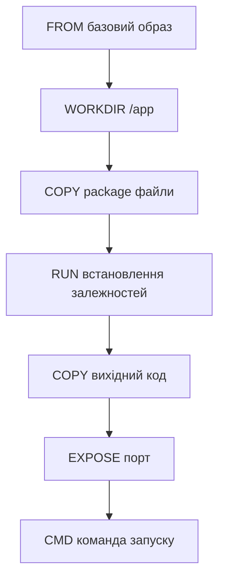

# Лабораторна робота 03 Створення та оптимізація Docker образів

## Мета

Навчитися створювати ефективні Docker образи для вебзастосунків, освоїти техніки оптимізації розміру образів через багатоетапні збірки, опанувати базові практики безпеки контейнерів, отримати навички роботи з Docker Compose для локальної розробки.

## Завдання

### Рівень 1 (обов'язковий мінімум)

Створити базовий Docker образ для простого вебзастосунку.

Необхідно виконати наступне:

- Створити простий вебзастосунок на обраній мові (Python Flask, Node.js Express або Go).
- Написати Dockerfile з використанням офіційного базового образу.
- Створити .dockerignore файл для виключення непотрібних файлів.
- Зібрати Docker образ та запустити контейнер.
- Перевірити працездатність застосунку через curl або браузер.
- Зафіксувати початковий розмір образу.

### Рівень 2 (додаткова функціональність)

Оптимізувати Docker образ та додати інструменти для локальної розробки.

Додатково до рівня 1:

- Переписати Dockerfile з використанням multi-stage build.
- Використати alpine базовий образ для зменшення розміру.
- Додати HEALTHCHECK до Dockerfile.
- Створити docker-compose.yml для запуску застосунку.
- Порівняти розміри базового та оптимізованого образів.
- Задокументувати покращення в звіті.

### Рівень 3 (творче розширення)

Впровадити практики безпеки та автоматизацію збірки образу.

Додатково до рівня 2:

- Впровадити запуск від non-root користувача в контейнері.
- Проскануйти образ на вразливості за допомогою Trivy.
- Додати підтримку змінних середовища для конфігурації.
- Створити GitHub Actions workflow для автоматичної збірки образу.

## Критерії оцінювання

### Середній рівень (оцінка "задовільно")

Здобувач освіти демонструє базове розуміння контейнеризації. Успішно створює простий вебзастосунок з мінімальною функціональністю та пише базовий Dockerfile. Розуміє призначення основних інструкцій Docker (FROM, COPY, RUN, CMD). Створює .dockerignore файл, але може не включити всі необхідні патерни. Збирає та запускає Docker образ, перевіряє його працездатність. Допускає помилки в оптимізації образу, не застосовує багатоетапні збірки. Звіт містить скріншоти основних команд, але без детального аналізу розміру образу та способів оптимізації.

### Достатній рівень (оцінка "добре")

Здобувач освіти впевнено працює з Docker та розуміє принципи контейнеризації застосунків. Створює функціональний вебзастосунок з декількома endpoints, правильно структурує проєкт. Пише ефективний Dockerfile, використовує багатоетапні збірки для зменшення розміру образу. Правильно застосовує alpine базові образи, розуміє компроміси між розміром та функціональністю. Додає HEALTHCHECK для моніторингу стану контейнера. Створює docker-compose.yml з правильною конфігурацією портів та змінних середовища. Документує покращення розміру образу з конкретними цифрами. Звіт добре структурований, містить аналіз результатів оптимізації, але може мати незначні недоліки в реалізації security практик.

### Високий рівень (оцінка "відмінно")

Здобувач освіти демонструє глибоке розуміння Docker та best practices контейнеризації. Створює добре структурований застосунок з proper error handling та health endpoints. Пише оптимальний multi-stage Dockerfile з ефективним використанням кешування шарів. Впроваджує запуск від non-root користувача для підвищення безпеки. Використовує Trivy для сканування вразливостей та аналізує результати. Налаштовує GitHub Actions для автоматичної збірки образу при push до репозиторію. Створює професійно оформлений docker-compose.yml з volumes та networks. Звіт містить детальний аналіз оптимізації розміру образу на кожному етапі, пояснення прийнятих архітектурних рішень, аналіз результатів security scan з висновками. Документація повна, добре структурована.

## Порядок оформлення та здачі лабораторної роботи

Виконання лабораторної роботи відбувається через GitHub Classroom з фінальним підтвердженням здачі в системі Moodle.

[**GitHub Classroom assignment лабораторної роботи**](https://classroom.github.com/a/wsCb7GBB)

Перейдіть за наданим посиланням. При першому використанні GitHub Classroom система може запитати дозвіл на доступ до вашого GitHub акаунту. Підтвердіть авторизацію для продовження роботи.

GitHub Classroom автоматично створить персональний репозиторій для вашої лабораторної роботи. Назва репозиторію зазвичай має формат lab-номер-ваш-github-username. Цей репозиторій містить початковий шаблон з необхідною структурою директорій.

Весь програмний код, конфігураційні файли та інші артефакти лабораторної роботи розміщуються виключно у папці `src`. У цій лабораторній роботі в `src` має бути вихідний код вебзастосунку та файли залежностей.

Звіт про виконання лабораторної роботи оформлюється у файлі `README.md`, розташованому в кореневій директорії репозиторію. Використовуйте markdown форматування для покращення читабельності звіту. Code blocks з підсвіткою синтаксису для команд та коду, списки для переліку виконаних завдань, таблиці для порівняння розмірів образів.

Dockerfile файли (Dockerfile, Dockerfile.optimized, Dockerfile.secure) та docker-compose.yml розміщуються в кореневій директорії репозиторію.

Скріншоти зберігайте у папці `screenshots` в кореневій директорії репозиторію та вставляйте у `README.md` через відносні посилання.

Після завершення всіх завдань та оформлення звіту необхідно виконати фінальний коміт, який зафіксує остаточний стан вашої роботи. Після відправлення фінального коміту перейдіть до курсу на платформі Moodle та знайдіть завдання лабораторної роботи. Відкрийте завдання для здачі. У текстовому полі для відповіді напишіть слово **виконано**.

## Політика щодо дедлайнів

При порушенні встановленого терміну здачі лабораторної роботи максимальна можлива оцінка становить "добре", незалежно від якості виконаної роботи. Винятки можливі лише за поважних причин, підтверджених документально.

## Теоретичні відомості

### Docker образи та контейнери

Docker образ є незмінним шаблоном, який містить все необхідне для запуску застосунку: код програми, runtime середовище, системні бібліотеки, інструменти та налаштування. Образи будуються з послідовності шарів, де кожна інструкція в Dockerfile створює новий read-only шар. Розуміння архітектури шарів є критично важливим для оптимізації розміру образів та швидкості збірки.

Контейнер є запущеним екземпляром образу. Коли ви запускаєте контейнер, Docker створює тонкий writable шар поверх read-only шарів образу. Всі зміни файлової системи під час роботи контейнера відбуваються саме в цьому шарі. Після видалення контейнера цей шар теж видаляється, тому дані в контейнерах є ефемерними за замовчуванням.

### Dockerfile та його інструкції

Dockerfile містить набір інструкцій для автоматизованої збірки образу. Основні інструкції включають FROM для визначення базового образу, WORKDIR для встановлення робочої директорії, COPY та ADD для копіювання файлів з host системи в образ, RUN для виконання команд під час збірки образу, ENV для встановлення змінних середовища, EXPOSE для документування портів, CMD та ENTRYPOINT для визначення команди запуску контейнера.

Порядок інструкцій в Dockerfile суттєво впливає на ефективність кешування. Docker кешує кожен шар і повторно використовує його якщо інструкція та контекст не змінились. Тому залежності слід встановлювати до копіювання коду застосунку, оскільки залежності змінюються рідше ніж код. Це прискорює повторні збірки образу.



### Багатоетапні збірки

Multi-stage builds дозволяють використовувати різні базові образи на різних етапах збірки. Типовий сценарій включає build стадію з повним набором інструментів для компіляції та production стадію з мінімальним runtime середовищем. Це дозволяє виключити з фінального образу компілятори, build tools, тестові залежності та інші файли, необхідні лише для збірки застосунку, але непотрібні для його виконання.

Синтаксис багатоетапної збірки використовує іменовані стадії через AS keyword та COPY --from для копіювання артефактів між стадіями. Фінальний образ містить тільки те, що скопійовано в останню стадію, що значно зменшує його розмір.

```dockerfile
# Build стадія
FROM node:18 AS builder
WORKDIR /app
COPY package*.json ./
RUN npm ci --only=production

# Production стадія
FROM node:18-alpine
WORKDIR /app
COPY --from=builder /app/node_modules ./node_modules
COPY . .
CMD ["node", "server.js"]
```

### Базові образи та оптимізація розміру

Вибір базового образу критично впливає на розмір та безпеку фінального образу. Офіційні образи з Docker Hub проходять перевірку та регулярно оновлюються. Основні варіанти включають повні дистрибутиви на базі Debian або Ubuntu розміром 100-200 MB, slim версії з мінімальним набором пакетів близько 50 MB, alpine образи на базі Alpine Linux розміром 5-10 MB.

Alpine образи привабливі своїм мінімальним розміром, але використовують musl libc замість glibc, що може призвести до проблем сумісності з деякими застосунками. Для production середовищ часто використовують alpine для мінімізації attack surface та зменшення часу deployment.

Техніки оптимізації розміру включають використання .dockerignore для виключення непотрібних файлів, об'єднання команд RUN для зменшення кількості шарів, видалення тимчасових файлів та кешів в тій же команді де вони створюються, використання багатоетапних збірок, вибір мінімальних базових образів.

### Health checks для моніторингу

Docker підтримує health checks для моніторингу стану контейнера. HEALTHCHECK інструкція визначає команду для періодичної перевірки здоров'я застосунку. Docker виконує цю команду з заданим інтервалом та позначає контейнер як healthy або unhealthy залежно від exit code команди.

```dockerfile
HEALTHCHECK --interval=30s --timeout=3s --start-period=5s --retries=3 \
    CMD curl -f http://localhost:3000/health || exit 1
```

Параметри HEALTHCHECK включають interval для частоти перевірок, timeout для максимального часу виконання перевірки, start-period для періоду прогріву застосунку, retries для кількості невдалих спроб перед маркуванням unhealthy. Health checks використовуються orchestrator системами як Docker Swarm або Kubernetes для автоматичного перезапуску нездорових контейнерів.

### Docker Compose для локальної розробки

Docker Compose дозволяє описувати та запускати багатоконтейнерні застосунки через YAML конфігурацію. Для простих застосунків compose файл визначає сервіси з їх образами або build контекстом, порти для проброски між host та container, змінні середовища для конфігурації, volumes для персистентності даних, networks для мережевої ізоляції.

```yaml
version: '3.8'
services:
  web:
    build: .
    ports:
      - "3000:3000"
    environment:
      - NODE_ENV=development
    restart: unless-stopped
```

Compose спрощує локальну розробку оскільки всі налаштування знаходяться в одному файлі та весь stack запускається однією командою docker compose up. Команда docker compose down зупиняє всі сервіси та видаляє контейнери.

### Безпека Docker образів

Безпека контейнерів починається з безпечних образів. Критичні практики включають використання офіційних або перевірених базових образів, регулярне оновлення базових образів для отримання security patches, запуск процесів від non-root користувача, сканування образів на вразливості, мінімізацію встановлених пакетів.

Запуск від root користувача в контейнері створює ризик якщо процес буде скомпрометований. Створення окремого користувача з мінімальними привілеями обмежує потенційні наслідки атаки.

```dockerfile
RUN addgroup -g 1001 appgroup && \
    adduser -D -u 1001 -G appgroup appuser
USER appuser
```

Security scanners як Trivy виявляють відомі вразливості в залежностях та системних пакетах образу. Регулярне сканування образів має бути частиною CI/CD pipeline для виявлення проблем до production deployment.

## Хід роботи

### Клонування репозиторію

Прийміть GitHub Classroom assignment та склонуйте створений репозиторій.

```bash
git clone git@github.com:organization/lab-03-username.git
cd lab-03-username
```


### Створення вебзастосунку

Створіть директорію src та додайте туди вихідний код застосунку. Оберіть одну з мов програмування.

Для Python Flask створіть src/app.py:

```python
from flask import Flask, jsonify

app = Flask(__name__)

@app.route('/')
def home():
    return jsonify({"message": "Hello from Docker!", "version": "1.0.0"})

@app.route('/health')
def health():
    return jsonify({"status": "healthy"}), 200

if __name__ == '__main__':
    app.run(host='0.0.0.0', port=5000)
```

Створіть src/requirements.txt:

```
Flask==3.0.0
```

Для Node.js Express створіть src/server.js:

```javascript
const express = require('express');
const app = express();
const PORT = process.env.PORT || 3000;

app.get('/', (req, res) => {
    res.json({ message: 'Hello from Docker!', version: '1.0.0' });
});

app.get('/health', (req, res) => {
    res.json({ status: 'healthy' });
});

app.listen(PORT, '0.0.0.0', () => {
    console.log(`Server running on port ${PORT}`);
});
```

Створіть src/package.json:

```json
{
  "name": "docker-lab-app",
  "version": "1.0.0",
  "main": "server.js",
  "scripts": {
    "start": "node server.js"
  },
  "dependencies": {
    "express": "^4.18.2"
  }
}
```

### Створення базового Dockerfile

Створіть Dockerfile в кореневій директорії для Python:

```dockerfile
FROM python:3.11

WORKDIR /app

COPY src/requirements.txt .
RUN pip install --no-cache-dir -r requirements.txt

COPY src/ .

EXPOSE 5000

CMD ["python", "app.py"]
```

Або для Node.js:

```dockerfile
FROM node:18

WORKDIR /app

COPY src/package*.json ./
RUN npm install

COPY src/ .

EXPOSE 3000

CMD ["npm", "start"]
```

### Створення .dockerignore

Створіть .dockerignore в кореневій директорії:

```
.git
.gitignore
README.md
screenshots/
node_modules
__pycache__
*.pyc
.env
```

### Збірка та тестування базового образу

Зберіть образ та зафіксуйте його розмір:

```bash
docker build -t my-web-app:v1 .
docker images my-web-app:v1
```

Запустіть контейнер:

```bash
# Для Python
docker run -d -p 5000:5000 --name web-app my-web-app:v1

# Для Node.js
docker run -d -p 3000:3000 --name web-app my-web-app:v1
```

Перевірте працездатність:

```bash
curl http://localhost:5000  # або 3000 для Node.js
curl http://localhost:5000/health
```

Зупиніть контейнер:

```bash
docker stop web-app
docker rm web-app
```

### Оптимізація через multi-stage build

Створіть Dockerfile.optimized для Python:

```dockerfile
FROM python:3.11-slim AS builder

WORKDIR /app

COPY src/requirements.txt .
RUN pip install --user --no-cache-dir -r requirements.txt

FROM python:3.11-alpine

WORKDIR /app

COPY --from=builder /root/.local /root/.local
ENV PATH=/root/.local/bin:$PATH

COPY src/ .

EXPOSE 5000

HEALTHCHECK --interval=30s --timeout=3s --retries=3 \
    CMD wget --no-verbose --tries=1 --spider http://localhost:5000/health || exit 1

CMD ["python", "app.py"]
```

Або для Node.js:

```dockerfile
FROM node:18 AS builder

WORKDIR /app

COPY src/package*.json ./
RUN npm ci --only=production

FROM node:18-alpine

WORKDIR /app

COPY --from=builder /app/node_modules ./node_modules
COPY src/ .

EXPOSE 3000

HEALTHCHECK --interval=30s --timeout=3s --retries=3 \
    CMD wget --no-verbose --tries=1 --spider http://localhost:3000/health || exit 1

CMD ["node", "server.js"]
```

Зберіть оптимізований образ та порівняйте розміри:

```bash
docker build -f Dockerfile.optimized -t my-web-app:v2 .
docker images | grep my-web-app
```

### Створення Docker Compose файлу

Створіть docker-compose.yml:

```yaml
version: '3.8'

services:
  web:
    build:
      context: .
      dockerfile: Dockerfile.optimized
    ports:
      - "3000:3000"
    environment:
      - NODE_ENV=production
    restart: unless-stopped
```

Запустіть через Compose:

```bash
docker compose up -d
docker compose ps
docker compose logs web
docker compose down
```

### Впровадження non-root користувача

Створіть Dockerfile.secure для Python:

```dockerfile
FROM python:3.11-alpine

RUN addgroup -g 1001 appgroup && \
    adduser -D -u 1001 -G appgroup appuser

WORKDIR /app

COPY --chown=appuser:appgroup src/requirements.txt .
RUN pip install --no-cache-dir -r requirements.txt

COPY --chown=appuser:appgroup src/ .

USER appuser

EXPOSE 5000

HEALTHCHECK --interval=30s --timeout=3s --retries=3 \
    CMD wget --no-verbose --tries=1 --spider http://localhost:5000/health || exit 1

CMD ["python", "app.py"]
```

Або для Node.js:

```dockerfile
FROM node:18-alpine

RUN addgroup -g 1001 appgroup && \
    adduser -D -u 1001 -G appgroup appuser

WORKDIR /app

COPY --chown=appuser:appgroup src/package*.json ./
RUN npm ci --only=production

COPY --chown=appuser:appgroup src/ .

USER appuser

EXPOSE 3000

HEALTHCHECK --interval=30s --timeout=3s --retries=3 \
    CMD wget --no-verbose --tries=1 --spider http://localhost:3000/health || exit 1

CMD ["node", "server.js"]
```

Перевірте що контейнер працює від non-root:

```bash
docker build -f Dockerfile.secure -t my-web-app:v3 .
docker run --rm my-web-app:v3 id
```

### Security сканування з Trivy

Встановіть Trivy та проскануйте образ:

```bash
# macOS
brew install aquasecurity/trivy/trivy

# Linux
wget -qO - https://aquasecurity.github.io/trivy-repo/deb/public.key | sudo apt-key add -
echo "deb https://aquasecurity.github.io/trivy-repo/deb $(lsb_release -sc) main" | sudo tee -a /etc/apt/sources.list.d/trivy.list
sudo apt-get update
sudo apt-get install trivy

# Сканування
trivy image my-web-app:v3
```

### Автоматизація через GitHub Actions

Створіть .github/workflows/docker-build.yml:

```yaml
name: Docker Build

on:
  push:
    branches: [ main ]

jobs:
  build:
    runs-on: ubuntu-latest

    steps:
    - uses: actions/checkout@v4

    - name: Build Docker image
      run: docker build -f Dockerfile.secure -t my-web-app:latest .

    - name: Test image
      run: |
        docker run -d -p 3000:3000 --name test-app my-web-app:latest
        sleep 5
        curl -f http://localhost:3000/health
        docker stop test-app
```

### Оформлення звіту

Заповніть README.md за шаблоном нижче, додайте скріншоти, зробіть фінальний коміт:

```bash
git add .
git commit -m "Complete lab 3"
git push origin main
```

## Шаблон звіту

```markdown
# Лабораторна робота 3: Створення та оптимізація Docker образів

**Виконав:** ПІБ, група

**Дата:** дата виконання

## Мета роботи

[Скопіюйте мету з методички]

## Хід виконання

### Рівень 1: Базовий Docker образ

**Обраний стек:** [Python Flask / Node.js Express]

**Базовий Dockerfile:**

```dockerfile
[Ваш Dockerfile]
```

**Результати збірки:**


Розмір базового образу: XXX MB

**Тестування застосунку:**


### Рівень 2: Оптимізація образу

**Оптимізований Dockerfile:**

```dockerfile
[Ваш Dockerfile.optimized]
```

**Порівняння розмірів:**

| Образ | Розмір | Зменшення |
|-------|--------|-----------|
| v1 базовий | XXX MB | - |
| v2 оптимізований | YYY MB | ZZ% |


**Docker Compose конфігурація:**

```yaml
[Ваш docker-compose.yml]
```


### Рівень 3: Безпека та автоматизація

**Безпечний Dockerfile:**

```dockerfile
[Ваш Dockerfile.secure]
```

**Перевірка non-root:**


**Результати Trivy scan:**


Знайдено вразливостей: [кількість по рівням]

**GitHub Actions workflow:**

```yaml
[Ваш workflow файл]
```


## Висновки

[Опишіть що ви навчилися, які навички отримали, які труднощі виникли]
```

## Контрольні запитання

1. Що таке Docker шар і як шари впливають на розмір образу? Чому видалення файлів в новому шарі не зменшує розмір попередніх шарів?
2. Які переваги надає використання multi-stage builds? Наведіть приклад сценарію де це особливо корисно.
3. Порівняйте базові образи debian, alpine та distroless. У яких випадках доцільно використовувати кожен з них?
4. Чому важливо запускати процеси в контейнерах від non-root користувача? Які ризики несе запуск від root?
5. Як працює кешування шарів в Docker і як правильно організувати інструкції Dockerfile для ефективного використання кешу?
6. Що таке HEALTHCHECK в Docker і як він допомагає в production середовищах?
7. Які файли та директорії слід додавати в .dockerignore і чому?
