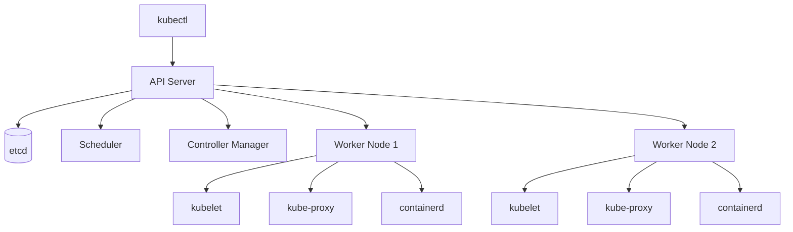
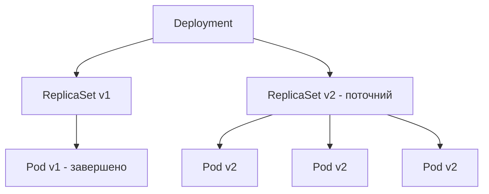
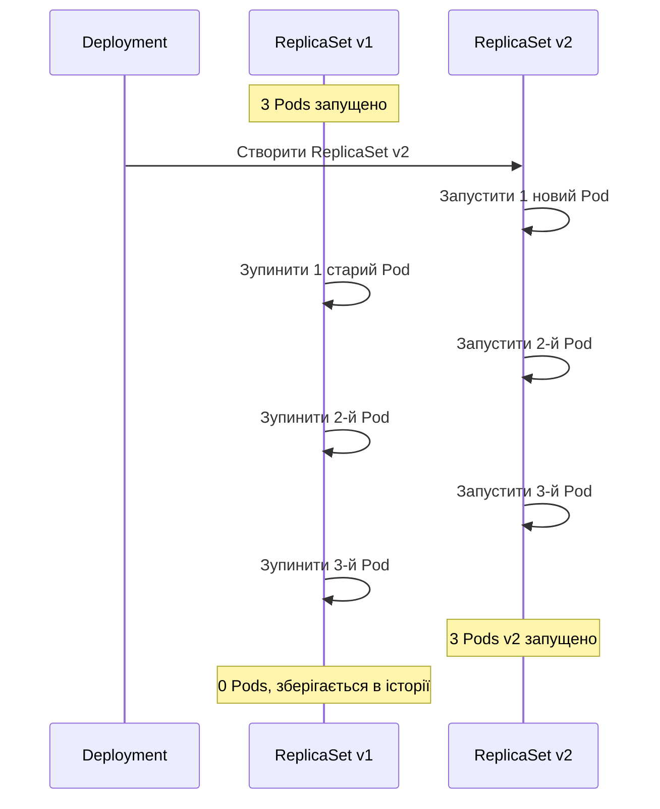

# Лабораторна робота 04 Розгортання застосунку в Kubernetes кластері

## Мета

Навчитися розгортати контейнеризовані застосунки в локальному Kubernetes кластері, опанувати базові ресурси Kubernetes (Deployment, Service, ConfigMap), набути практичних навичок роботи з kubectl, освоїти механізми поступових оновлень та відкатів застосунку.

## Завдання

### Рівень 1 (обов'язковий мінімум)

Розгорнути вебзастосунок у локальному Kubernetes кластері з базовою конфігурацією.

Необхідно виконати наступне:

- Встановити Minikube або Kind та запустити локальний кластер.
- Створити маніфест Deployment для вебзастосунку (мінімум 2 репліки).
- Створити маніфест ConfigMap з конфігураційними параметрами застосунку.
- Підключити ConfigMap до Deployment через змінні середовища.
- Створити маніфест Service типу NodePort або LoadBalancer для доступу до застосунку.
- Перевірити доступність застосунку через виділену адресу.
- Зафіксувати стан кластера командами kubectl get та kubectl describe.

### Рівень 2 (додаткова функціональність)

Виконати поступове оновлення застосунку та відпрацювати механізм відкату.

Додатково до рівня 1:

- Оновити образ застосунку до нової версії через kubectl set image або зміну маніфесту.
- Спостерігати за ходом rolling update командою kubectl rollout status.
- Переглянути історію розгортань командою kubectl rollout history.
- Виконати відкат до попередньої версії командою kubectl rollout undo.
- Перевірити стан Pods під час та після кожного оновлення.
- Задокументувати процес з скріншотами у звіті.

### Рівень 3 (творче розширення)

Розширити конфігурацію кластера та дослідити поведінку при відмовах.

Додатково до рівня 2:

- Налаштувати readinessProbe та livenessProbe для Pods.
- Встановити resource requests та limits для контейнера.
- Емулювати відмову Pod та спостерігати за автоматичним відновленням.
- Описати в звіті поведінку планувальника та механізм самовідновлення.

## Критерії оцінювання

### Середній рівень (оцінка "задовільно")

Здобувач освіти демонструє базове розуміння Kubernetes. Успішно встановлює Minikube або Kind та запускає локальний кластер. Створює Deployment з одним або двома Pod-ами, розуміє призначення основних полів маніфесту. Створює ConfigMap та пов'язує його з Deployment через змінні середовища, хоча можуть бути неточності в синтаксисі YAML. Створює Service та перевіряє доступність застосунку. Може не повною мірою розуміти різницю між типами Service або мати труднощі з налагодженням мережевого доступу. Звіт містить скріншоти основних команд, але без глибокого аналізу стану кластера.

### Достатній рівень (оцінка "добре")

Здобувач освіти впевнено працює з Kubernetes та розуміє принципи оркестрації. Правильно створює Deployment з декількома репліками, коректно описує стратегію оновлення. Свідомо використовує ConfigMap для відокремлення конфігурації від коду застосунку. Виконує rolling update, спостерігає за ходом розгортання та розуміє що відбувається з Pods. Успішно виконує rollback та перевіряє відновлення попередньої версії. Звіт добре структурований, містить аналіз виводу команд, але може мати незначні прогалини у поясненні механізмів відновлення або налаштуваннях проб.

### Високий рівень (оцінка "відмінно")

Здобувач освіти демонструє глибоке розуміння Kubernetes та його внутрішніх механізмів. Коректно налаштовує readinessProbe та livenessProbe, пояснює чому вони важливі для надійного rolling update. Встановлює ресурсні обмеження та пояснює їх вплив на планування Pods. Проводить експеримент з примусовим видаленням Pod та детально описує поведінку ReplicaSet при відновленні. Звіт містить повний аналіз кожного етапу роботи, пояснення прийнятих конфігураційних рішень, висновки щодо надійності та підходів до zero-downtime deployment. Документація повна, команди та їх вивід задокументовані системно.

## Порядок оформлення та здачі лабораторної роботи

Виконання лабораторної роботи відбувається через GitHub Classroom з фінальним підтвердженням здачі в системі Moodle.

[**GitHub Classroom assignment лабораторної роботи**](https://classroom.github.com/a/itS7JkFD)

Перейдіть за наданим посиланням. При першому використанні GitHub Classroom система може запитати дозвіл на доступ до вашого GitHub акаунту. Підтвердіть авторизацію для продовження роботи.

GitHub Classroom автоматично створить персональний репозиторій для вашої лабораторної роботи. Назва репозиторію зазвичай має формат lab-номер-ваш-github-username. Цей репозиторій містить початковий шаблон з необхідною структурою директорій.

Весь програмний код та конфігураційні файли Kubernetes розміщуються у папці `src`. У цій лабораторній роботі в `src` має бути вихідний код вебзастосунку або посилання на Docker образ, а також всі YAML маніфести Kubernetes.

Рекомендована структура папки `src`:

```
src/
├── app/               # вихідний код застосунку (якщо є)
├── k8s/               # Kubernetes маніфести
│   ├── configmap.yaml
│   ├── deployment.yaml
│   └── service.yaml
```

Звіт про виконання лабораторної роботи оформлюється у файлі `README.md`, розташованому в кореневій директорії репозиторію. Використовуйте markdown форматування: code blocks з підсвіткою синтаксису для команд та YAML маніфестів, скріншоти для відображення стану кластера, таблиці для порівняння версій при rolling update.

Скріншоти зберігайте у папці `screenshots` в кореневій директорії репозиторію та вставляйте у `README.md` через відносні посилання.

Після завершення всіх завдань та оформлення звіту необхідно виконати фінальний коміт, який зафіксує остаточний стан вашої роботи. Після відправлення фінального коміту перейдіть до курсу на платформі Moodle та знайдіть завдання лабораторної роботи. Відкрийте завдання для здачі. У текстовому полі для відповіді напишіть слово **виконано**.

## Політика щодо дедлайнів

При порушенні встановленого терміну здачі лабораторної роботи максимальна можлива оцінка становить "добре", незалежно від якості виконаної роботи. Винятки можливі лише за поважних причин, підтверджених документально.

## Теоретичні відомості

### Архітектура Kubernetes

Kubernetes є системою оркестрації контейнерів, яка автоматизує розгортання, масштабування та управління контейнеризованими застосунками. Кластер складається з площини управління (control plane) та робочих вузлів (worker nodes).

Площина управління включає API Server як центральну точку взаємодії з кластером, etcd як розподілене сховище стану кластера, Scheduler що відповідає за призначення Pods на вузли, Controller Manager що підтримує бажаний стан кластера.

Робочі вузли містять kubelet як агента що виконує інструкції від control plane, kube-proxy що забезпечує мережеву маршрутизацію, container runtime (наприклад containerd) для запуску контейнерів.



### Pod як базова одиниця

Pod є найменшою одиницею розгортання в Kubernetes. Він містить один або декілька тісно пов'язаних контейнерів, які поділяють мережевий простір імен та томи. Контейнери всередині одного Pod комунікують через localhost та мають однакову IP-адресу.

Pods є ефемерними за природою — вони не відновлюються самостійно після видалення. Для забезпечення надійності та автоматичного відновлення Pods використовуються контролери вищого рівня, зокрема Deployment.

### Deployment та ReplicaSet

Deployment є декларативним способом керування безліччю однакових Pods. Коли ви створюєте Deployment, Kubernetes автоматично створює ReplicaSet, який підтримує вказану кількість запущених Pods. Якщо Pod завершується або видаляється, ReplicaSet автоматично створює новий для досягнення бажаної кількості реплік.



Deployment описує бажаний стан у декларативному форматі YAML. Kubernetes порівнює поточний стан кластера з описаним та виконує необхідні дії для усунення розбіжностей. Це є основою декларативного підходу до управління інфраструктурою.

```yaml
apiVersion: apps/v1
kind: Deployment
metadata:
  name: my-app
  labels:
    app: my-app
spec:
  replicas: 3
  selector:
    matchLabels:
      app: my-app
  template:
    metadata:
      labels:
        app: my-app
    spec:
      containers:
      - name: my-app
        image: nginx:1.25
        ports:
        - containerPort: 80
```

Поле `selector.matchLabels` визначає які Pods належать цьому Deployment. Поле `template` описує шаблон Pod, з якого буде створено кожну репліку. Мітки (labels) є ключовим механізмом зв'язування об'єктів Kubernetes між собою.

### Service для мережевого доступу

Service забезпечує стабільний мережевий endpoint для групи Pods. Оскільки Pods можуть з'являтися та зникати, а їхні IP-адреси змінюються, Service надає незмінну точку доступу та виконує балансування навантаження між Pods.

Основні типи Service:

- ClusterIP — доступний тільки всередині кластера, є типом за замовчуванням.
- NodePort — відкриває статичний порт на кожному вузлі кластера, доступний ззовні через IP вузла.
- LoadBalancer — запитує зовнішній балансувальник навантаження у хмарного провайдера.

```yaml
apiVersion: v1
kind: Service
metadata:
  name: my-app-service
spec:
  type: NodePort
  selector:
    app: my-app
  ports:
  - port: 80
    targetPort: 80
    nodePort: 30080
```

Поле `selector` визначає до яких Pods Service направлятиме трафік — за аналогією з selector у Deployment. Поле `targetPort` вказує на який порт контейнера направляти трафік, а `port` — внутрішній порт Service в межах кластера.

### ConfigMap для конфігурації

ConfigMap зберігає конфігураційні дані у форматі ключ-значення. Він дозволяє відокремити конфігурацію від коду застосунку та образу контейнера, що відповідає принципам дванадцятифакторного застосунку (The Twelve-Factor App). Змінюючи ConfigMap, можна змінити поведінку застосунку без перезбірки образу.

```yaml
apiVersion: v1
kind: ConfigMap
metadata:
  name: my-app-config
data:
  APP_ENV: "production"
  LOG_LEVEL: "info"
  APP_VERSION: "1.0.0"
```

ConfigMap підключається до Pod двома основними способами — як змінні середовища або як файли у файловій системі контейнера. Для більшості простих конфігурацій використовують змінні середовища.

```yaml
spec:
  containers:
  - name: my-app
    image: my-app:1.0
    envFrom:
    - configMapRef:
        name: my-app-config
```

### Rolling update та механізм відкату

Поступове оновлення (rolling update) є стратегією розгортання за замовчуванням в Kubernetes. Під час оновлення Kubernetes поступово замінює старі Pods новими, не зупиняючи роботу застосунку. Це забезпечує нульовий час простою (zero downtime deployment).

Поведінку rolling update контролюють параметри у стратегії Deployment:

```yaml
spec:
  strategy:
    type: RollingUpdate
    rollingUpdate:
      maxUnavailable: 1
      maxSurge: 1
```

`maxUnavailable` визначає максимальну кількість Pods, які можуть бути недоступні під час оновлення. `maxSurge` визначає максимальну кількість додаткових Pods, які можуть бути створені понад бажану кількість реплік.



Kubernetes зберігає попередні ReplicaSets, що дозволяє виконати відкат командою `kubectl rollout undo`. За замовчуванням зберігається 10 ревізій, що контролюється параметром `revisionHistoryLimit`.

### Локальні кластери: Minikube та Kind

Minikube запускає повноцінний Kubernetes кластер в одному процесі або віртуальній машині на вашому комп'ютері. Він підтримує більшість функцій Kubernetes та надає вбудовані інструменти для роботи з реєстром образів та Ingress.

Kind (Kubernetes IN Docker) запускає вузли кластера як Docker контейнери. Він легший за Minikube, швидко запускається та зупиняється, тому часто використовується в CI/CD pipeline для тестування.

Для цієї лабораторної роботи рекомендується Minikube через простішу інтеграцію з локальними Docker образами командою `minikube image load`.

## Хід роботи

### Клонування репозиторію

Прийміть GitHub Classroom assignment та склонуйте створений репозиторій.

```bash
git clone git@github.com:organization/lab-04-username.git
cd lab-04-username
```

### Встановлення Minikube

Встановіть Minikube та kubectl відповідно до вашої операційної системи.

Для Linux:

```bash
# Завантаження kubectl
curl -LO "https://dl.k8s.io/release/$(curl -L -s https://dl.k8s.io/release/stable.txt)/bin/linux/amd64/kubectl"
chmod +x kubectl
sudo mv kubectl /usr/local/bin/

# Завантаження Minikube
curl -LO https://storage.googleapis.com/minikube/releases/latest/minikube-linux-amd64
sudo install minikube-linux-amd64 /usr/local/bin/minikube
```

Для macOS:

```bash
brew install minikube kubectl
```

Для Windows використовуйте офіційний інсталятор з документації Minikube або Chocolatey:

```powershell
choco install minikube kubernetes-cli
```

Запустіть кластер та перевірте його стан:

```bash
minikube start

kubectl cluster-info
kubectl get nodes
```

Вивід команди `kubectl get nodes` повинен показати один вузол зі статусом `Ready`.

### Підготовка застосунку

Для цієї лабораторної роботи використаємо публічний образ, щоб зосередитись на Kubernetes. Ви можете використати власний образ з попередньої лабораторної роботи або готовий образ з Docker Hub.

Варіант з власним образом з попередньої лабораторної роботи:

```bash
# Завантаження образу в Minikube
minikube image load my-web-app:v1
minikube image load my-web-app:v2
```

Варіант з готовим публічним образом (для тих, хто не виконав попередню лабораторну):

```bash
# Використовуватимемо образ httpd з різними тегами для демонстрації оновлень
# httpd:2.4.58 як v1 та httpd:2.4.59 як v2
```

Надалі в прикладах використовується `httpd` як демонстраційний застосунок. Якщо ви використовуєте власний образ — замініть назву образу та порти відповідно.

### Створення ConfigMap

Створіть файл `src/k8s/configmap.yaml`:

```yaml
apiVersion: v1
kind: ConfigMap
metadata:
  name: webapp-config
  labels:
    app: webapp
data:
  APP_ENV: "production"
  APP_VERSION: "1.0.0"
  LOG_LEVEL: "info"
```

Застосуйте маніфест до кластера:

```bash
kubectl apply -f src/k8s/configmap.yaml
```

Перевірте створений ConfigMap:

```bash
kubectl get configmap webapp-config
kubectl describe configmap webapp-config
```

### Створення Deployment

Створіть файл `src/k8s/deployment.yaml`:

```yaml
apiVersion: apps/v1
kind: Deployment
metadata:
  name: webapp
  labels:
    app: webapp
spec:
  replicas: 2
  selector:
    matchLabels:
      app: webapp
  strategy:
    type: RollingUpdate
    rollingUpdate:
      maxUnavailable: 1
      maxSurge: 1
  template:
    metadata:
      labels:
        app: webapp
    spec:
      containers:
      - name: webapp
        image: httpd:2.4.58
        ports:
        - containerPort: 80
        envFrom:
        - configMapRef:
            name: webapp-config
```

Застосуйте маніфест та спостерігайте за створенням Pods:

```bash
kubectl apply -f src/k8s/deployment.yaml
kubectl rollout status deployment/webapp
```

Перевірте стан ресурсів:

```bash
kubectl get deployments
kubectl get replicasets
kubectl get pods
kubectl get pods --show-labels
```

Отримайте детальну інформацію про один з Pods (замініть `<pod-name>` на реальну назву з виводу попередньої команди):

```bash
kubectl describe pod <pod-name>
```

Перевірте що змінні середовища з ConfigMap доступні всередині контейнера:

```bash
kubectl exec <pod-name> -- env | grep APP
```

### Створення Service

Створіть файл `src/k8s/service.yaml`:

```yaml
apiVersion: v1
kind: Service
metadata:
  name: webapp-service
  labels:
    app: webapp
spec:
  type: NodePort
  selector:
    app: webapp
  ports:
  - port: 80
    targetPort: 80
    nodePort: 30080
```

Застосуйте маніфест:

```bash
kubectl apply -f src/k8s/service.yaml
kubectl get services
```

Отримайте URL для доступу до застосунку через Minikube:

```bash
minikube service webapp-service --url
```

Відкрийте отриману адресу у браузері або перевірте через curl:

```bash
curl $(minikube service webapp-service --url)
```

Застосунок має відповідати. Зробіть скріншот відповіді.

Ви також можете використати команду `minikube service webapp-service` що автоматично відкриє URL у браузері.

### Поступове оновлення

Оновіть версію образу в маніфесті. Відкрийте `src/k8s/deployment.yaml` та змініть рядок образу:

```yaml
        image: httpd:2.4.59
```

Також оновіть ConfigMap — змініть версію застосунку:

```yaml
  APP_VERSION: "2.0.0"
```

Застосуйте оновлені маніфести та спостерігайте за ходом rolling update в окремому терміналі:

```bash
# Термінал 1 - спостереження за Pods
kubectl get pods -w

# Термінал 2 - застосування оновлення
kubectl apply -f src/k8s/configmap.yaml
kubectl apply -f src/k8s/deployment.yaml
```

Після застосування у першому терміналі ви побачите як старі Pods переходять у стан `Terminating` а нові — у `ContainerCreating` та `Running`. Зробіть скріншот цього процесу.

Перевірте статус розгортання:

```bash
kubectl rollout status deployment/webapp
kubectl get replicasets
```

Зверніть увагу що тепер є два ReplicaSets — старий з 0 репліками та новий з 2 репліками. Kubernetes зберігає старий ReplicaSet для можливості відкату.

Переглянте історію розгортань:

```bash
kubectl rollout history deployment/webapp
```

Перевірте що застосунок продовжує працювати після оновлення:

```bash
curl $(minikube service webapp-service --url)
```

### Відкат до попередньої версії

Виконайте відкат до попередньої версії:

```bash
kubectl rollout undo deployment/webapp
```

Спостерігайте за відкатом:

```bash
kubectl rollout status deployment/webapp
kubectl get pods
kubectl get replicasets
```

Після відкату старий ReplicaSet знову матиме 2 репліки, а новий — 0. Перевірте версію образу в поточних Pods:

```bash
kubectl describe deployment webapp | grep Image
```

Для відкату до конкретної ревізії використовують:

```bash
kubectl rollout undo deployment/webapp --to-revision=1
```

### Налаштування проб (рівень 3)

Додайте readinessProbe та livenessProbe до контейнера у `src/k8s/deployment.yaml`. Readiness probe перевіряє чи готовий Pod приймати трафік, liveness probe — чи є контейнер живим та потребує ли перезапуску.

```yaml
        livenessProbe:
          httpGet:
            path: /
            port: 80
          initialDelaySeconds: 10
          periodSeconds: 10
          failureThreshold: 3
        readinessProbe:
          httpGet:
            path: /
            port: 80
          initialDelaySeconds: 5
          periodSeconds: 5
          failureThreshold: 3
        resources:
          requests:
            cpu: "50m"
            memory: "64Mi"
          limits:
            cpu: "200m"
            memory: "128Mi"
```

Застосуйте оновлену конфігурацію:

```bash
kubectl apply -f src/k8s/deployment.yaml
kubectl rollout status deployment/webapp
```

Перевірте стан проб у описі Pod:

```bash
kubectl describe pod <pod-name>
```

Емулюйте відмову Pod та спостерігайте за відновленням:

```bash
# Отримайте назву одного з Pods
kubectl get pods

# Видаліть Pod
kubectl delete pod <pod-name>

# Спостерігайте за автоматичним створенням нового Pod
kubectl get pods -w
```

Зверніть увагу як ReplicaSet негайно реагує на зменшення кількості Pods та відновлює бажану кількість реплік. Задокументуйте цей процес у звіті.

### Оформлення звіту

Заповніть README.md за шаблоном нижче, додайте скріншоти, зробіть фінальний коміт:

```bash
git add .
git commit -m "Complete lab 4"
git push origin main
```

## Шаблон звіту

```markdown
    # Лабораторна робота 4: Розгортання застосунку в Kubernetes кластері

    **Виконав:** ПІБ, група

    ## Хід виконання

    ### Рівень 1: Базове розгортання

    **Встановлений інструмент:** [Minikube / Kind]

    **Стан кластера після запуску:**

    

    **ConfigMap:**

    ```yaml
    [Ваш configmap.yaml]
    ```

    **Deployment:**

    ```yaml
    [Ваш deployment.yaml]
    ```

    **Service:**

    ```yaml
    [Ваш service.yaml]
    ```

    **Стан ресурсів після розгортання:**

    

    **Доступ до застосунку:**

    

    **Змінні середовища з ConfigMap:**

    

    ### Рівень 2: Rolling update та відкат

    **Зміни у маніфестах для оновлення:**

    - образ: httpd:2.4.58 → httpd:2.4.59
    - APP_VERSION: 1.0.0 → 2.0.0

    **Процес rolling update:**

    

    **ReplicaSets після оновлення:**

    

    **Історія розгортань:**

    

    **Процес відкату:**

    

    **Версія після відкату:**

    

    ### Рівень 3: Проби та ресурсні обмеження

    **Оновлений Deployment з пробами:**

    ```yaml
    [Ваш deployment.yaml з пробами та ресурсами]
    ```

    **Стан проб у Pod:**

    

    **Відновлення після видалення Pod:**

    

    **Висновок щодо поведінки ReplicaSet:**

    [Опишіть що відбулося після видалення Pod, як швидко відновилася потрібна кількість реплік]

    ## Висновки

    [Опишіть що ви навчилися, які навички отримали, які труднощі виникли та як ви їх вирішили]
```

## Контрольні запитання

1. Чим відрізняється Pod від контейнера Docker? Чому Kubernetes оперує Pods, а не окремими контейнерами?
2. Яку роль виконує ReplicaSet у Kubernetes? Чому не рекомендують створювати ReplicaSet безпосередньо, не через Deployment?
3. Поясніть призначення полів `selector` у Deployment та Service. Що відбудеться якщо мітки (labels) у шаблоні Pod не відповідають selector?
4. Яка різниця між типами Service ClusterIP, NodePort та LoadBalancer? В яких ситуаціях доцільно використовувати кожен з них?
5. Навіщо відокремлювати конфігурацію застосунку у ConfigMap замість того щоб записувати значення безпосередньо у Deployment?
6. Що таке rolling update і чому він є кращим за одночасну заміну всіх Pods? Які параметри контролюють його поведінку?
7. Як Kubernetes забезпечує самовідновлення застосунку після відмови Pod? Який компонент відповідає за цю функцію?
