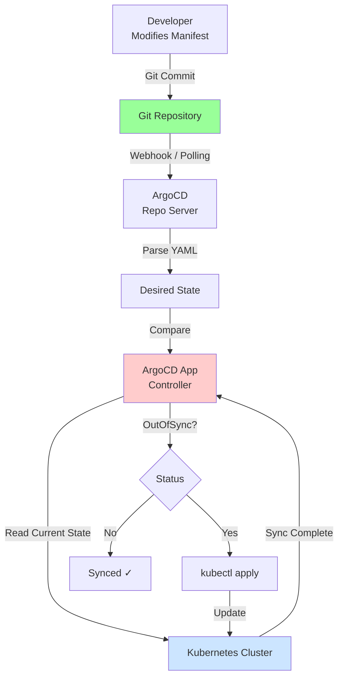
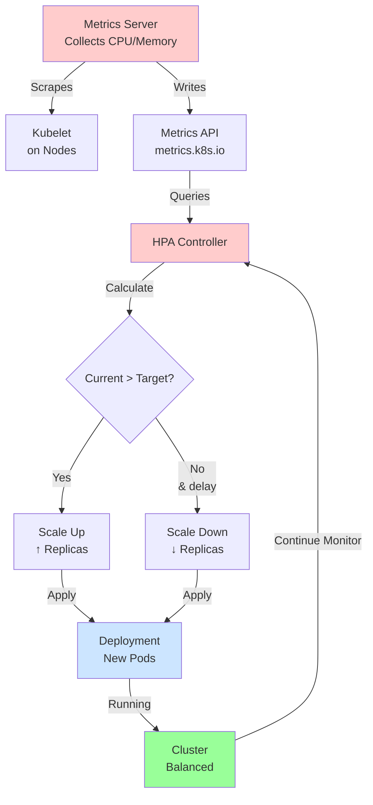

# Лабораторна робота 10 Впровадження GitOps та автомасштабування застосунку

## Мета

Засвоїти принципи GitOps для декларативного управління Kubernetes вибухом, навчитися встановлювати та конфігурувати ArgoCD для синхронізації кластера з Git репозиторієм, та реалізувати автоматичне масштабування подів на основі метрик CPU за допомогою Horizontal Pod Autoscaler.

## Завдання

### Рівень 1 (обов'язковий мінімум)

Реалізовано базову GitOps архітектуру з ArgoCD.
Необхідно виконати наступне:

- Встановити ArgoCD в Minikube Kubernetes кластері.
- Отримати доступ до ArgoCD UI через port-forward.
- Підготувати маніфести Deployment та Service у Git репозиторії.
- Створити ArgoCD Application у YAML форматі.
- Синхронізувати Application вручну через UI або CLI.
- Перевірити, що pod-и розгорнулись та застосунок працює.

### Рівень 2 (додаткова функціональність)

Посилена GitOps з автоматичною синхронізацією та автомасштабуванням.
Додатково до рівня 1:

- Налаштувати автоматичну синхронізацію ArgoCD: при push до Git автоматично синхронізується в кластер.
- Встановити Metrics Server для сбору метрик CPU/memory у кластері.
- Створити Horizontal Pod Autoscaler (HPA) з targetCPUUtilizationPercentage 50%.
- Перевірити, що HPA правильно читає метрики та готовий до автомасштабування.

### Рівень 3 (творче розширення)

Повна демонстрація GitOps та автомасштабування під навантаженням.
Додатково до рівня 2:

- Виконати навантажувальний тест (k6, hey, або простий bash-loop) для тригерування HPA.
- Спостерігати за автоматичним масштабуванням подів у реальному часі.
- Задокументувати поведінку HPA з графіками/скрімшотами метрик.
- Дослідити як Git commit до маніфеста тригерить ArgoCD синхронізацію.

## Критерії оцінювання

### Середній рівень (оцінка "задовільно")

Студент успішно встановив ArgoCD та створив першу Application. Маніфести в Git репозиторії структуровані та коректні. ArgoCD показує статус Application та синхронізує вручну. Звіт описує основні компоненти GitOps та кроки встановлення, але може мати неповноту у документуванні та тестуванні. Робота демонструє базове розуміння GitOps принципів та Kubernetes розгортання.

### Достатній рівень (оцінка "добре")

Крім рівня 1, реалізовано автоматичну синхронізацію ArgoCD та встановлено Metrics Server. HPA налаштований та працює. Звіт містить чіткий опис процесу встановлення ArgoCD, налаштування Application, результати автоматичної синхронізації та стан HPA. Маніфести чистої та виконуються без помилок. Скрімшоти показують ArgoCD UI та HPA метрики. Студент демонструє розуміння взаємодії компонентів GitOps та автомасштабування.

### Високий рівень (оцінка "відмінно")

Повна реалізація всіх трьох рівнів: ArgoCD з автоматичною синхронізацією функціональний, Metrics Server зібраний, HPA активний та протестований під навантаженням. Звіт глибокий, містить результати навантажувального тесту, спостереження за масштабуванням у реальному часі, аналіз метрик та скрімшоти (kubectl top, HPA events, ArgoCD sync). Демонструється розуміння GitOps вибору (pull-based CD), переваги порівняно з традиційними підходами, та practical знання настройки production-ready ArgoCD та HPA. Код та маніфести відповідають best practices.

## Порядок оформлення та здачі лабораторної роботи

Виконання лабораторної роботи відбувається через GitHub Classroom з фінальним підтвердженням здачі в системі Moodle.

[**GitHub Classroom assignment лабораторної роботи**](https://classroom.github.com/a/PLACEHOLDER_LAB_10)

Репозиторій містить структуру:

```
src/
├── k8s/
│   ├── deployment.yaml
│   ├── service.yaml
│   ├── hpa.yaml
│   └── configmap.yaml (опціонально)
├── argocd/
│   ├── application.yaml
│   └── argocd-config.yaml (опціонально)
├── tests/
│   └── load-test.sh       (навантажувальний тест)
└── README.md
```

Після завершення всіх завдань та оформлення звіту необхідно виконати фінальний коміт, який зафіксує остаточний стан вашої роботи. Після відправлення фінального коміту перейдіть до курсу на платформі Moodle та знайдіть завдання лабораторної роботи. Відкрийте завдання для здачі. У текстовому полі для відповіді напишіть слово **виконано**.

## Політика щодо дедлайнів

При порушенні встановленого терміну здачи лабораторної роботи максимальна можлива оцінка становить "добре", незалежно від якості виконаної роботи. Винятки можливі лише за поважних причин, підтверджених документально.

## Теоретичні відомості

### GitOps принципи та переваги

GitOps — це методологія управління інфраструктурою та застосунками, де Git репозиторій є єдиним джерелом правди (Single Source of Truth). Замість ручного застосування маніфестів або запуску deployments вручну, система автоматично синхронізує бажаний стан з Git з фактичним станом у Kubernetes кластері.

Основні принципи GitOps:

**Декларативне описання.** Весь стан системи описаний у Git: Kubernetes YAML, Helm charts, конфіги. Розроблювачі та DevOps вказують що повинно бути, а не як це зробити.

**Git як єдине джерело правди.** Будь-які зміни проходять через Git pull request, review та merge. Історія всіх змін зберігається в Git.

**Автоматична синхронізація.** GitOps контролер (ArgoCD, Flux) безперервно порівнює Git стан з кластером та застосовує відмінності. Якщо хтось вручну видалить pod у кластері, контролер його відновить за маніфестом.

**Безпека.** Стан кластера завжди відповідає код у Git, легко відкатати зміни через Git revert, всі зміни залишають аудит trail.

Переваги:

- Відновлюваність: знищити кластер і розгорнути заново з Git дуже просто.
- Контроль версій: вся історія змін в Git, легко diff-ити та review-ити.
- Collaboration: команда взаємодіє через Git, не через ручні kubectl команди.
- Consistency: гарантія що кластер завжди відповідає Git.
- Compliance: аудит всіх змін, хто, коли, чому.

### ArgoCD архітектура та компоненти

ArgoCD — це Kubernetes контролер для GitOps. Він встановлюється як набір pod-ів у кластері та постійно синхронізує Git з кластером.

Архітектура ArgoCD:

```
┌──────────────────┐
│  Git Repository  │  ← Source of truth
└────────┬─────────┘
         │
    ┌────▼─────┐
    │  Repo    │  ← Клонує репо, отримує маніфести
    │ Server   │
    └────┬─────┘
         │
    ┌────▼────────────┐
    │ Application     │  ← Порівнює Git vs Cluster
    │ Controller      │
    └────┬────────────┘
         │
    ┌────▼──────────┐
    │  Kubernetes   │
    │  Cluster      │
    └───────────────┘
```

Компоненти ArgoCD:

**API Server**: REST API для UI та CLI. Управління Applications, Projects, сесіями.

**Repository Server**: клонує Git репозиторій, рендерить Helm charts, Kustomize, генерує Kubernetes маніфести.

**Application Controller**: основний контроллер, який синхронізує. Порівнює стан Git з кластером, застосовує зміни, трактує statuses.

**Dex**: OpenID Connect сервер для аутентифікації. За замовчуванням локальні користувачі (admin).

**Redis**: кеш для performance.

Робочий процес:

1. Розробник push маніфести до Git.
2. ArgoCD Repo Server клонує репо та парсить маніфести.
3. Application Controller порівнює Git зі станом кластера.
4. Якщо статус "OutOfSync", контролер застосовує kubectl apply.
5. Система переходить у Synced.

### Порівняння push-based та pull-based CD (GitOps)

**Push-based CD** (традиційна):

```
Developer → Git → CI/CD (Jenkins) → Kubectl apply → Kubernetes
```

CI/CD має credentials до кластера, може push маніфести. Проблеми: credentials exposed в CI системі, зовнішня система тягне мережев за кластер (security), якщо CI/CD недоступна, нема синхронізації.

**Pull-based CD (GitOps)**:

```
Developer → Git
                ↑
                │ (спостереження)
Kubernetes ← ArgoCD (в кластері)
```

ArgoCD живе всередині кластера, контролюються RBAC у K8s. Зовнішня система Git не потребує доступу до кластера (більша безпека). Контролер в кластері завжди синхронізує, навіть якщо зовнішня CI/CD впала. Pull-based більше декларативний: Git описує бажаний стан, система автоматично це досягає.

Переваги pull-based:

- Безпека: кластер не виставляє API публічно, контролюється RBAC.
- Scalability: один ArgoCD може синхронізувати мільйони подів.
- Resilience: ArgoCD всередині, не залежить від зовнішньої CI.
- Audit trail: Git логи показують хто що змінив.

### Horizontal Pod Autoscaler (HPA): концепція та метрики

HPA — це Kubernetes механізм автоматичного масштабування кількості подів у Deployment/StatefulSet на основі метрик. Замість ручного збільшення replicas при навантаженні, HPA це робить автоматично.

Як працює HPA:

1. Metrics Server збирає метрики (CPU, memory) від kubelet на кожному ноді.
2. HPA контролер періодично запитує API сервер про метрики подів.
3. HPA порівнює поточне використання з target.
4. Якщо поточне > target, HPA збільшує кількість replicas.
5. Якщо поточне < target, HPA зменшує replicas (з затримкою, щоб уникнути flapping).

Приклад HPA:

```yaml
apiVersion: autoscaling/v2
kind: HorizontalPodAutoscaler
metadata:
  name: app-hpa
spec:
  scaleTargetRef:
    apiVersion: apps/v1
    kind: Deployment
    name: app-deployment
  minReplicas: 2
  maxReplicas: 10
  metrics:
  - type: Resource
    resource:
      name: cpu
      target:
        type: Utilization
        averageUtilization: 50
```

Цей HPA масштабує `app-deployment`:

- Мінімум 2 replicas, максимум 10.
- Якщо середнє CPU всіх подів > 50%, збільшує replicas.
- Якщо < 50%, зменшує replicas.

Метрики можуть бути:

- **Resource**: CPU, memory.
- **Custom**: бізнес-метрики через custom metrics API.
- **External**: метрики зовні кластера.

HPA розраховує нову кількість replicas:

```
desiredReplicas = ceil[currentReplicas * (currentMetricValue / targetMetricValue)]
```

Якщо 4 replicas, CPU 75%, target 50%:

```
desiredReplicas = ceil[4 * (75 / 50)] = ceil[6] = 6 replicas
```

### Metrics Server та моніторинг метрик

Metrics Server — це компонент Kubernetes, який збирає та агрегує метрики ресурсів (CPU, memory) від всіх подів та нодів. HPA залежить від Metrics Server.

Архітектура:

```
kubelet (на кожному ноді) → Metrics Server → API Server (metrics.k8s.io)
                                    ↑
                                    │
                          kubectl top nodes
                          HPA контролер
                          Custom controllers
```

Kubelet кожну секунду збирає метрики konteynerів (через cgroup), Metrics Server їх агрегує та зберігає в пам'яті (до 15 хвилин). Запит до API: `kubectl top nodes`, `kubectl top pods`.

Встановлення Metrics Server в Minikube:

```bash
minikube addons enable metrics-server
kubectl get deployment metrics-server -n kube-system
```

Перевірка метрик:

```bash
kubectl top nodes
kubectl top pods
```

Якщо лишає пусто, Metrics Server може бути ще не готовий, почекайте 1-2 хвилини.

### Навантажувальне тестування та спостереження за HPA

Для тестування HPA потребуємо тригернути високе CPU використання, щоб побачити автомасштабування. Можна використовувати:

- **k6**: профілактичний載 tool, скрипти на JavaScript.
- **hey**: простий HTTP load тестер.
- **Bash-loop**: простий `while true; do curl http://service; done`.

Приклад bash-load-test:

```bash
#!/bin/bash
SERVICE_URL="http://app-service:3000"
WORKERS=10

for ((i=1; i<=WORKERS; i++)); do
  (
    while true; do
      curl -s -m 5 "$SERVICE_URL" > /dev/null
    done
  ) &
done

echo "Load test started with $WORKERS workers"
wait
```

Запустити з pod-u:

```bash
kubectl run -it --rm load-tester --image=alpine/curl -- sh
# В pod:
while true; do curl http://app-service:3000; done
```

Спостереження за HPA:

```bash
# У окремому терміналі, watch HPA
kubectl get hpa -w

# Показує поточні replicas, target CPU, current CPU
NAME      REFERENCE                     TARGETS          MINPODS   MAXPODS   REPLICAS   AGE
app-hpa   Deployment/app-deployment     45%/50%          2         10        2          1m
app-hpa   Deployment/app-deployment     72%/50%          2         10        4          2m    # ← збільшилось!
app-hpa   Deployment/app-deployment     68%/50%          2         10        6          3m
```

Паралельно:

```bash
# Watch подів
kubectl get pods -w

# Watch метрик
kubectl top pods
```

Коли навантаження припиняється, CPU падає, HPA поступово зменшує replicas (зі затримкою scale-down, за замовчуванням 5 хвилин).

Mermaid схема GitOps workflow:



Mermaid схема HPA scaling:



## Хід роботи

### Клонування репозиторію

```bash
git clone <GitHub Classroom URL>
cd <repository-name>
```

### Крок 1. Підготовка Kubernetes маніфестів у Git

Переконайтесь, що у репозиторії є структура:

```
src/k8s/deployment.yaml
src/k8s/service.yaml
src/k8s/hpa.yaml
```

Приклад `src/k8s/deployment.yaml`:

```yaml
apiVersion: apps/v1
kind: Deployment
metadata:
  name: app-deployment
  namespace: default
spec:
  replicas: 2
  selector:
    matchLabels:
      app: myapp
  template:
    metadata:
      labels:
        app: myapp
    spec:
      containers:
      - name: app
        image: myapp:latest
        resources:
          requests:
            cpu: 100m
            memory: 128Mi
          limits:
            cpu: 500m
            memory: 512Mi
        ports:
        - containerPort: 3000
```

Приклад `src/k8s/service.yaml`:

```yaml
apiVersion: v1
kind: Service
metadata:
  name: app-service
  namespace: default
spec:
  selector:
    app: myapp
  ports:
  - protocol: TCP
    port: 80
    targetPort: 3000
  type: LoadBalancer
```

Розгляньте на цей момент:

```bash
kubectl apply -f src/k8s/deployment.yaml
kubectl apply -f src/k8s/service.yaml
kubectl get pods
kubectl get svc
```

### Крок 2. Встановлення ArgoCD у Minikube

Створіть namespace для ArgoCD:

```bash
kubectl create namespace argocd
```

Встановіть ArgoCD з офіційного маніфесту:

```bash
kubectl apply -n argocd -f https://raw.githubusercontent.com/argoproj/argo-cd/stable/manifests/install.yaml
```

Перевірте що pod-и запустились:

```bash
kubectl get pods -n argocd
kubectl wait --for=condition=ready pod -l app.kubernetes.io/name=argocd-application-controller -n argocd --timeout=300s
```

### Крок 3. Доступ до ArgoCD UI через port-forward

ArgoCD API сервер запущений у кластері. Зробіть port-forward:

```bash
kubectl port-forward svc/argocd-server -n argocd 8080:443
```

У браузері перейдіть на `https://localhost:8080`. Браузер попередить про невалідний сертифікат (self-signed) — приймете винятки.

Вхід за замовчуванням:

- **Username**: admin
- **Password**: 

Отримайте пароль:

```bash
kubectl -n argocd get secret argocd-initial-admin-secret -o jsonpath="{.data.password}" | base64 -d; echo
```

Скопіюйте пароль та війдіть в UI.

### Крок 4. Створення ArgoCD Application у YAML форматі

Створіть файл `src/argocd/application.yaml`:

```yaml
apiVersion: argoproj.io/v1alpha1
kind: Application
metadata:
  name: app-application
  namespace: argocd
spec:
  project: default
  
  source:
    repoURL: https://github.com/<your-username>/<your-repo>.git
    targetRevision: HEAD
    path: src/k8s
  
  destination:
    server: https://kubernetes.default.svc
    namespace: default
  
  syncPolicy:
    automated:
      prune: false        # Рівень 1: false, Рівень 2: true
      selfHeal: false     # Рівень 1: false, Рівень 2: true
    syncOptions:
    - CreateNamespace=true
```

Параметри:

- `repoURL`: URL вашого GitHub репозиторію.
- `targetRevision`: Git гілка (HEAD = default).
- `path`: папка з маніфестами (src/k8s).
- `destination`: кластер та namespace де розгортати.
- `syncPolicy.automated.prune`: автоматично видаляти ресурси якщо їх видалено з Git.
- `syncPolicy.automated.selfHeal`: автоматично синхронізувати якщо кластер відійшов від Git.

Застосуйте Application:

```bash
kubectl apply -f src/argocd/application.yaml
```

### Крок 5. Синхронізація Application у UI

Перейдіть в ArgoCD UI, натисніть "New Application" або переглядайте вже створену `app-application`. 

Статус буде "OutOfSync" (Git відрізняється від кластера). Натисніть "Sync" для синхронізації вручну.

ArgoCD застосує маніфести з Git до кластера. Перевірте:

```bash
kubectl get pods -n default
kubectl get svc -n default
```

ArgoCD UI повинен показати "Synced ✓".

### Крок 6 (Рівень 2). Встановлення Metrics Server

Включите addon у Minikube:

```bash
minikube addons enable metrics-server
```

Перевірте встановлення:

```bash
kubectl get deployment metrics-server -n kube-system
kubectl get pods -n kube-system | grep metrics-server
```

Чекайте 30-60 секунд, поки Metrics Server буде готовий. Потім:

```bash
kubectl top nodes
kubectl top pods
```

Якщо показує `<unknown>`, почекайте ще.

### Крок 7 (Рівень 2). Налаштування HPA

Створіть `src/k8s/hpa.yaml`:

```yaml
apiVersion: autoscaling/v2
kind: HorizontalPodAutoscaler
metadata:
  name: app-hpa
  namespace: default
spec:
  scaleTargetRef:
    apiVersion: apps/v1
    kind: Deployment
    name: app-deployment
  minReplicas: 2
  maxReplicas: 10
  metrics:
  - type: Resource
    resource:
      name: cpu
      target:
        type: Utilization
        averageUtilization: 50
```

Розгорніть HPA:

```bash
kubectl apply -f src/k8s/hpa.yaml
kubectl get hpa
```

Результат:

```
NAME      REFERENCE                     TARGETS          MINPODS   MAXPODS   REPLICAS   AGE
app-hpa   Deployment/app-deployment     <unknown>/50%    2         10        2          10s
```

`<unknown>` означає що Metrics Server ще не збирав метрики. Почекайте 1-2 хвилини.

```bash
kubectl top pods  # Перевірте метрики
```

### Крок 8 (Рівень 2). Налаштування автоматичної синхронізації ArgoCD

Модифікуйте `src/argocd/application.yaml`:

```yaml
  syncPolicy:
    automated:
      prune: true
      selfHeal: true
    syncOptions:
    - CreateNamespace=true
```

Поштовхніть до Git:

```bash
git add src/argocd/application.yaml
git commit -m "Enable ArgoCD auto-sync"
git push
```

ArgoCD Repo Server буде опитувати Git (за замовчуванням кожні 3 хвилини). Або приберіть затримку через ArgoCD API:

```bash
kubectl port-forward svc/argocd-server -n argocd 8080:443 &
# В іншому терміналі:
argocd app sync app-application --server localhost:8080 --insecure
```

Тепер при push до Git, ArgoCD автоматично синхронізує кластер.

### Крок 9 (Рівень 3). Навантажувальне тестування

Створіть скрипт `tests/load-test.sh`:

```bash
#!/bin/bash

SERVICE_IP=$(kubectl get svc app-service -o jsonpath='{.status.loadBalancer.ingress[0].ip}')

if [ -z "$SERVICE_IP" ]; then
  SERVICE_IP="localhost"
  # Якщо LoadBalancer не припинить IP, використовуйте port-forward
  kubectl port-forward svc/app-service 8000:80 &
  sleep 2
  SERVICE_IP="localhost:8000"
fi

echo "Testing service at $SERVICE_IP"

WORKERS=5
for ((i=1; i<=WORKERS; i++)); do
  (
    while true; do
      curl -s -m 5 "http://$SERVICE_IP" > /dev/null 2>&1
      sleep 0.1
    done
  ) &
  echo "Worker $i started"
done

echo "Load test running. Press Ctrl+C to stop."
wait
```

Зробіть скрипт виконуваним:

```bash
chmod +x tests/load-test.sh
```

Запустіть скрипт у фоні:

```bash
./tests/load-test.sh &
```

### Крок 10 (Рівень 3). Спостереження за HPA

У окремому терміналі, спостерігайте за HPA:

```bash
kubectl get hpa -w
```

При навантаженні ви побачите:

```
NAME      REFERENCE                     TARGETS          MINPODS   MAXPODS   REPLICAS   AGE
app-hpa   Deployment/app-deployment     45%/50%          2         10        2          5m
app-hpa   Deployment/app-deployment     75%/50%          2         10        4          6m    ← scaling up
app-hpa   Deployment/app-deployment     68%/50%          2         10        6          7m
app-hpa   Deployment/app-deployment     52%/50%          2         10        8          8m
app-hpa   Deployment/app-deployment     48%/50%          2         10        8          9m
```

Паралельно спостерігайте подів:

```bash
kubectl get pods -w
```

Ви побачите нові pod-и запускатись:

```
NAME                              READY   STATUS    RESTARTS   AGE
app-deployment-xyz-abc            1/1     Running   0          5s
app-deployment-xyz-def            1/1     Running   0          5s
app-deployment-xyz-ghi            1/1     Running   0          10s
...
```

Спостерігайте метрики:

```bash
watch 'kubectl top pods'
```

Коли навантаження зупиниться (убийте load-test скрипт), HPA поступово зменшуватиме replicas:

```
app-hpa   Deployment/app-deployment     25%/50%          2         10        8          15m
app-hpa   Deployment/app-deployment     22%/50%          2         10        6          20m   ← scaling down (з затримкою)
app-hpa   Deployment/app-deployment     20%/50%          2         10        4          25m
app-hpa   Deployment/app-deployment     18%/50%          2         10        2          30m   ← вернулось до мінімуму
```

### Крок 11 (Рівень 3). Дослідження Git-тригерної синхронізації

Модифікуйте `src/k8s/deployment.yaml`, наприклад збільшите replicas:

```yaml
spec:
  replicas: 3  # було 2
```

Поштовхніть до Git:

```bash
git add src/k8s/deployment.yaml
git commit -m "Increase replicas to 3"
git push
```

Спостерігайте ArgoCD UI — він отримає webhook про push (або опитує через 3 хвилини) та синхронізує. Кластер автоматично збільшить replicas:

```bash
kubectl get pods -w
```

Це демонструє GitOps: Git є єдиним джерелом правди, кластер автоматично дотримується Git стану.

### Крок 12. Оформлення звіту

В репозиторії створіть файл `REPORT.md` за шаблоном нижче. Перевірте що:

- ArgoCD встановлено та UI доступен.
- Application синхронізується вручну та автоматично.
- HPA показує метрики та масштабується під навантаженням.
- Git зміни тригерять ArgoCD синхронізацію.
- Скрімшоти та логи документовані.

## Шаблон звіту

```markdown
# Лабораторна робота 10: Впровадження GitOps та автомасштабування застосунку

**Виконав:** ПІБ, група

## Хід виконання

### Рівень 1

1. Встановив ArgoCD у Minikube:
   - Namespace argocd створено.
   - Всі pod-и ArgoCD запущені.
   - (скрімшот `kubectl get pods -n argocd`)

2. Доступ до ArgoCD UI:
   - Port-forward налаштовано на localhost:8080.
   - Вхід з admin credentials.
   - (скрімшот ArgoCD UI)

3. Підготовка маніфестів у Git:
   - Deployment, Service маніфести у src/k8s/.
   - (скрімшот структури папок)

4. Створення ArgoCD Application:
   - application.yaml створена з посиланням на Git репозиторій.
   - Application синхронізована вручну.
   - Статус "Synced ✓".
   - (скрімшот ArgoCD UI Application)

### Рівень 2

5. Встановлення Metrics Server:
   - Metrics Server addon включено.
   - Pod-и показують метрики в `kubectl top pods`.
   - (скрімшот `kubectl top nodes` та `kubectl top pods`)

6. Налаштування HPA:
   - HPA створена з targetCPUUtilizationPercentage: 50%.
   - HPA статус "Ready", показує метрики.
   - (скрімшот `kubectl get hpa`)

7. Автоматична синхронізація ArgoCD:
   - syncPolicy.automated.prune = true, selfHeal = true.
   - Git push тригерить синхронізацію.
   - (скрімшот ArgoCD UI, показує автоматичну синхронізацію)

### Рівень 3

8. Навантажувальне тестування:
   - Load test скрипт запущено з 5 workers.
   - (скрімшот терміналу з curlループ)

9. Спостереження за HPA масштабуванням:
   - HPA збільшує replicas при CPU > 50%.
   - (скрімшот `kubectl get hpa -w` з збільшенням replicas)
   - (скрімшот `kubectl get pods -w` з новими pod-ами)

10. HPA метрики та графіки:
    - `kubectl top pods` показує CPU використання.
    - (скрімшот метрик під навантаженням та після)

11. Git-тригована синхронізація:
    - Модифікував Deployment у Git, збільшив replicas.
    - ArgoCD автоматично синхронізував.
    - (скрімшот Git commit та ArgoCD sync)

## Висновки

Лабораторна робота продемонструвала GitOps як сучасний підхід до управління Kubernetes. ArgoCD дозволяє зберігати весь стан у Git та автоматично синхронізувати кластер. HPA забезпечує автоматичне масштабування під навантаженням.

Ключові засвоєні навички:
- Встановлення та конфігурація ArgoCD.
- Створення ArgoCD Applications у YAML форматі.
- Автоматична синхронізація Git ↔ Kubernetes.
- Встановлення Metrics Server для моніторингу метрик.
- Налаштування та тестування HPA.
- Спостереження за автомасштабуванням у реальному часі.
- Розуміння переваг pull-based CD та GitOps архітектури.
```

## Контрольні запитання

1. Що таке GitOps та як він відрізняється від традиційних підходів до CI/CD?

2. Поясніть архітектуру ArgoCD: які компоненти входять до складу та які їх функції?

3. Чому pull-based CD (GitOps) вважається безпечнішою, ніж push-based CD для управління Kubernetes?

4. Як налаштувати автоматичну синхронізацію ArgoCD так, щоб Git commit тригерив розгортання у кластер?

5. Для чого потрібен Metrics Server у Kubernetes кластері, та як він збирає метрики?

6. Поясніть як HPA розраховує потрібну кількість replicas на основі metrik та target значення.

7. Опишіть процес навантажувального тестування та спостереження за автомасштабуванням подів: що ви очікуєте побачити у `kubectl get hpa -w` при збільшенні та зменшенні навантаження?
```

---

Обидва файли готові до використання як методички для студентів 3 курсу. Вони дотримуються точної структури з lab-04.md, мають академічний стиль, реальні команди для виконання, та чітку таксономію завдань (3 рівні складності).