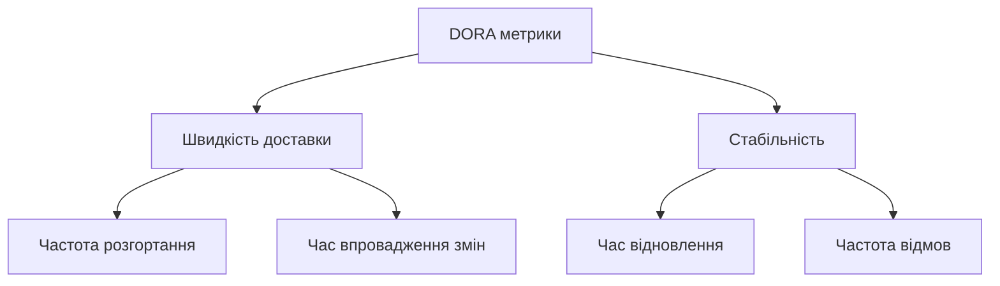

# Лекція 1 Принципи та метрики DevOps

## Вступ

Сучасна розробка програмного забезпечення характеризується швидкими змінами вимог, необхідністю частих випусків нових версій продуктів та зростаючими очікуваннями користувачів щодо якості та надійності систем. Традиційні підходи до організації процесів розробки та експлуатації часто виявляються недостатньо ефективними для задоволення цих потреб. DevOps виник як відповідь на ці виклики, пропонуючи новий підхід до організації співпраці між командами розробки та операційного управління.

Метою цієї лекції є формування глибокого розуміння філософії DevOps, вивчення еволюції методологій розробки програмного забезпечення та освоєння ключових метрик, які дозволяють оцінювати ефективність впровадження DevOps практик в організації.

## Еволюція розробки програмного забезпечення

### Каскадна модель розробки

Каскадна модель, також відома як модель водоспаду, була однією з перших формалізованих методологій розробки програмного забезпечення. Цей підхід передбачає послідовне виконання чітко визначених фаз проєкту, де перехід до наступної фази можливий лише після повного завершення попередньої. Типова каскадна модель включає такі етапи: збір та аналіз вимог, проєктування системи, реалізація, тестування, розгортання та підтримка.

Основною перевагою каскадної моделі є чітка структурованість процесу та зрозумілість етапів для всіх учасників проєкту. Детальна документація, яка створюється на кожному етапі, дозволяє новим членам команди швидко орієнтуватися в проєкті. Передбачуваність термінів та бюджету робить цю модель привабливою для проєктів з чітко визначеними вимогами.

Проте каскадна модель має суттєві недоліки, які стають особливо помітними в умовах сучасної розробки. Висока вартість внесення змін на пізніх етапах проєкту означає, що будь-які зміни вимог, виявлені під час тестування або після розгортання, потребують значних ресурсів для їх реалізації. Тривалий час до отримання зворотного зв'язку від користувачів призводить до ризику створення продукту, який не відповідає реальним потребам ринку. Відсутність гнучкості ускладнює адаптацію до змінюваних умов бізнесу та технологічного середовища.

### Гнучкі методології розробки

Agile методології виникли як альтернатива каскадній моделі, пропонуючи ітеративний та інкрементальний підхід до розробки програмного забезпечення. Agile Manifesto, опублікований у 2001 році, визначив чотири ключові цінності: люди та взаємодія важливіші за процеси та інструменти, працююче програмне забезпечення важливіше за вичерпну документацію, співпраця з замовником важливіша за узгодження контракту, реагування на зміни важливіше за дотримання плану.

Scrum, один з найпопулярніших Agile фреймворків, організовує роботу у вигляді часових проміжків фіксованої тривалості, які називаються спринтами. Типова тривалість спринту становить від одного до чотирьох тижнів. Кожен спринт починається з планування, де команда визначає обсяг роботи, який може бути виконаний протягом спринту. Щоденні короткі зустрічі дозволяють команді синхронізувати свою роботу та виявляти перешкоди. Наприкінці спринту проводиться огляд, де команда демонструє виконану роботу зацікавленим сторонам, та ретроспектива, під час якої обговорюються способи покращення процесу роботи.

Канбан пропонує інший підхід до організації роботи, зосереджуючись на візуалізації робочого процесу та обмеженні кількості завдань, які виконуються одночасно. Канбан дошка показує всі етапи, через які проходить завдання, від початкової ідеї до завершення. Встановлення обмежень на кількість завдань в кожному стані допомагає виявляти вузькі місця в процесі та підтримувати стабільний потік роботи.

### Розрив між розробкою та експлуатацією

Незважаючи на переваги, які принесли Agile методології, організації часто стикалися з проблемами під час передачі програмного забезпечення від команди розробки до команди експлуатації. Цей розрив проявлявся у різних цілях та пріоритетах команд. Розробники прагнули до швидких змін та впровадження нових функцій, тоді як операційна команда зосереджувалася на стабільності та надійності систем. Різні інструменти та процеси, які використовували команди, ускладнювали передачу відповідальності та призводили до непорозумінь.

Типовий процес розгортання в організаціях з традиційним підходом виглядав наступним чином. Розробники створювали нову версію програмного забезпечення та передавали її разом з документацією операційній команді. Операційна команда розгортала програмне забезпечення в продуктивному середовищі, часто виявляючи проблеми, які не були помічені в середовищі розробки. Виникнення інцидентів після розгортання призводило до взаємних звинувачень між командами та тривалого процесу діагностики проблем.

Цей підхід характеризувався рядом проблем. Рідкісні релізи, які могли відбуватися раз на кілька місяців, означали накопичення великої кількості змін, що збільшувало ризик виникнення проблем. Ручні процеси розгортання були схильні до помилок та вимагали значних затрат часу. Відсутність автоматизації та стандартизації середовищ призводила до ситуації, коли програмне забезпечення працювало в середовищі розробки, але відмовляло в продуктивному середовищі.

## Філософія DevOps

### Визначення та історія виникнення

DevOps виник як рух, спрямований на подолання розриву між розробкою та експлуатацією програмного забезпечення. Термін DevOps був вперше використаний в 2009 році на конференції Velocity, де Джон Алспо та Пол Хаммонд представили доповідь про співпрацю між розробкою та експлуатацією в компанії Flickr. Їхня презентація продемонструвала, як тісна співпраця між командами дозволяє досягти десятків розгортань на день при збереженні високої надійності системи.

Важливим поштовхом для розвитку DevOps стала публікація книг, які систематизували накопичений досвід. Книга "Continuous Delivery" Джеза Хамбла та Девіда Фарлі, опублікована в 2010 році, детально описала практики автоматизації процесів доставки програмного забезпечення. Проєкт Phoenix Джина Кіма, опублікований в 2013 році, представив DevOps концепції у формі бізнес-роману, що зробило їх доступними для широкої аудиторії. DevOps Handbook, випущений в 2016 році тими ж авторами, став комплексним посібником з впровадження DevOps практик в організаціях.

DevOps можна визначити як набір практик, інструментів та культурну філософію, які автоматизують та інтегрують процеси між командами розробки програмного забезпечення та IT операцій. Ця інтеграція дозволяє організаціям швидше створювати, тестувати та випускати програмне забезпечення з більшою надійністю та якістю.

### Основні принципи DevOps

Культура співпраці є фундаментальним принципом DevOps. Замість розділення на окремі команди розробки та експлуатації, DevOps заохочує створення міжфункціональних команд, які несуть спільну відповідальність за весь життєвий цикл програмного забезпечення. Члени таких команд володіють різноманітними навичками, включаючи розробку, тестування, розгортання та моніторинг. Спільна відповідальність за результати означає, що команда разом святкує успіхи та разом вирішує проблеми.

Автоматизація є ключовим інструментом для досягнення цілей DevOps. Автоматизація повторюваних завдань дозволяє зменшити кількість помилок, які виникають через людський фактор, та звільнити час спеціалістів для більш творчих завдань. Автоматизовані тести перевіряють якість коду на кожному етапі розробки. Автоматизоване розгортання забезпечує швидке та надійне доставлення змін в продуктивне середовище. Інфраструктура як код дозволяє керувати конфігурацією серверів та мережевого обладнання за допомогою програмного коду.

Безперервне вдосконалення передбачає постійний пошук способів покращення процесів та практик. Регулярні ретроспективи допомагають команді аналізувати свою роботу та виявляти можливості для оптимізації. Експериментування з новими інструментами та підходами дозволяє знаходити кращі рішення для конкретних завдань. Вимірювання результатів за допомогою метрик забезпечує об'єктивну основу для прийняття рішень про зміни.

Швидкий зворотний зв'язок є критично важливим для ефективної роботи. Автоматизовані тести надають розробникам миттєву інформацію про те, чи не порушили їхні зміни існуючу функціональність. Моніторинг продуктивних систем дозволяє швидко виявляти проблеми та реагувати на них. Збір відгуків від користувачів допомагає зрозуміти, наскільки нові функції відповідають їхнім потребам.

### Три шляхи DevOps

Джин Кім у своїх працях описав концепцію трьох шляхів DevOps, які представляють фундаментальні принципи цього підходу. Перший шлях, потік, зосереджується на оптимізації руху роботи від розробки до експлуатації та до клієнта. Це передбачає створення швидкого та плавного потоку роботи, виявлення та усунення вузьких місць, зменшення розміру партій роботи та скорочення інтервалів між ітераціями.

Другий шлях, зворотний зв'язок, підкреслює важливість створення коротких циклів зворотного зв'язку на всіх рівнях. Швидке виявлення проблем дозволяє усувати їх до того, як вони вплинуть на користувачів. Розуміння та реагування на потреби користувачів забезпечує створення цінного продукту. Постійне навчання на основі отриманого досвіду сприяє вдосконаленню процесів та практик.

Третій шлях, безперервне навчання та експериментування, заохочує створення культури, яка підтримує постійне навчання та ризик. Виділення часу для експериментів та інновацій дозволяє виявляти нові можливості для покращення. Створення безпечного середовища для помилок означає, що невдачі розглядаються як можливості для навчання. Обмін знаннями в команді та організації забезпечує поширення кращих практик.

## DevOps як культура та набір практик

### Культурні аспекти DevOps

Впровадження DevOps вимагає значних культурних змін в організації. Довіра та прозорість є основою ефективної співпраці між командами. Відкрите спілкування про проблеми та виклики дозволяє швидко знаходити рішення. Прозорість процесів та метрик забезпечує загальне розуміння стану проєкту.

Психологічна безпека в команді означає, що люди почуваються комфортно, висловлюючи свої думки та визнаючи помилки. Коли члени команди не бояться покарання за помилки, вони більш схильні експериментувати та пропонувати нові ідеї. Це сприяє інноваціям та швидкому вирішенню проблем.

Спільна відповідальність за результати змінює традиційний підхід, коли розробники відповідають лише за код, а операційна команда лише за стабільність системи. В DevOps команді всі несуть відповідальність за весь ланцюжок створення цінності. Це означає, що розробники турбуються про те, як їхній код працюватиме в продуктивному середовищі, а фахівці з експлуатації розуміють бізнес-вимоги до системи.

### Ключові практики DevOps

Безперервна інтеграція передбачає регулярне об'єднання змін від різних розробників в спільному репозиторії. Кожна зміна автоматично перевіряється за допомогою збірки та виконання автоматизованих тестів. Це дозволяє швидко виявляти конфлікти між змінами різних розробників та проблеми з якістю коду.

Безперервна доставка розширює безперервну інтеграцію, забезпечуючи автоматизацію всього процесу від коміту до розгортання в продуктивному середовищі. Ключовою ідеєю є те, що кожна зміна, яка пройшла всі перевірки, може бути розгорнута в продуктивному середовищі в будь-який момент. Остаточне рішення про розгортання приймається людиною, але сам процес розгортання повністю автоматизований.

Безперервне розгортання йде далі, автоматично розгортаючи кожну зміну, яка пройшла всі перевірки, в продуктивному середовищі без ручного втручання. Це вимагає високого рівня впевненості в автоматизованих тестах та процесах моніторингу.

Інфраструктура як код означає управління та підготовку інфраструктури через машиночитані файли визначень, а не фізичне налаштування обладнання або інтерактивні інструменти конфігурації. Це забезпечує версіонування інфраструктури, відтворюваність середовищ та можливість швидкого відновлення після збоїв.

Моніторинг та спостережуваність дозволяють розуміти поведінку системи в продуктивному середовищі. Збір та аналіз метрик надає кількісну інформацію про продуктивність системи. Централізоване журналювання допомагає діагностувати проблеми. Розподілений трейсинг показує шлях запитів через різні компоненти системи.

## Метрики ефективності DevOps

### DORA метрики

DevOps Research and Assessment, організація заснована Ніколь Форсгрен, Джезом Хамблом та Джином Кімом, провела багаторічне дослідження практик DevOps та їх впливу на ефективність організацій. Результати цього дослідження були опубліковані в книзі "Accelerate" та щорічних звітах State of DevOps. DORA ідентифікувала чотири ключові метрики, які найкраще характеризують ефективність процесів доставки програмного забезпечення.

Частота розгортання вимірює, як часто організація успішно випускає зміни в продуктивне середовище. Ця метрика показує здатність організації швидко доставляти цінність користувачам. Елітні виконавці можуть розгортати зміни декілька разів на день, тоді як низькоефективні організації роблять це раз на кілька місяців.

Час впровадження змін визначається як час від початку роботи над завданням до моменту, коли воно працює в продуктивному середовищі. Для елітних організацій цей час становить менше однієї години, що дозволяє швидко реагувати на потреби бізнесу та користувачів. Організації з низькою ефективністю можуть потребувати від одного до шести місяців для впровадження змін.

Час відновлення після збою вимірює, скільки часу потрібно для відновлення роботи сервісу після інциденту. Швидке відновлення критично важливе для мінімізації впливу на користувачів. Елітні команди можуть відновити роботу за менш ніж годину, тоді як низькоефективні організації потребують від одного тижня до одного місяця.

Частота відмов при зміні показує відсоток розгортань, які призводять до погіршення роботи сервісу в продуктивному середовищі. Ця метрика відображає якість процесів тестування та розгортання. Елітні виконавці мають частоту відмов від нуля до п'ятнадцяти відсотків, тоді як низькоефективні організації стикаються з відмовами в сорока шести до шістдесяти відсотках випадків.

### Додаткові метрики DevOps

Окрім DORA метрик, організації можуть відстежувати інші показники для оцінки ефективності DevOps практик. Покриття коду тестами показує відсоток коду, який перевіряється автоматизованими тестами. Високе покриття не гарантує відсутність помилок, але зменшує ймовірність пропуску критичних проблем.

Час збірки та тестування впливає на швидкість отримання зворотного зв'язку розробниками. Довгі збірки знижують продуктивність та заохочують рідкісні коміти, що ускладнює виявлення причин проблем. Оптимізація часу збірки є важливою частиною покращення процесу розробки.

Кількість інцидентів та їх серйозність відображають стабільність системи. Аналіз трендів цієї метрики допомагає виявляти системні проблеми та оцінювати ефективність заходів з підвищення надійності.

Задоволеність клієнтів можна вимірювати через різноманітні показники, такі як Net Promoter Score, відгуки користувачів або метрики використання продукту. Зв'язок між DevOps практиками та задоволеністю клієнтів демонструє бізнес-цінність впровадження DevOps.

### Вимірювання та покращення метрик

Встановлення базового рівня є першим кроком у програмі покращення. Організації потрібно виміряти поточні значення ключових метрик, щоб розуміти відправну точку. Це вимірювання має бути об'єктивним та ґрунтуватися на даних з реальних систем, а не на суб'єктивних оцінках.

Визначення цілей має базуватися на дослідженнях DORA та враховувати специфіку організації. Нереалістичні цілі можуть демотивувати команду, тоді як занадто скромні не стимулюють значних покращень. Цілі мають бути амбітними, але досяжними.

Ідентифікація вузьких місць допомагає зрозуміти, які частини процесу найбільше обмежують ефективність. Часто найбільший ефект дає усунення одного критичного вузького місця, а не розпорошення зусиль на багато дрібних покращень.

Впровадження змін має відбуватися ітеративно. Значні зміни процесів можуть бути дестабілізуючими, тому краще робити послідовні невеликі покращення. Кожна зміна має бути виміряна та оцінена перед впровадженням наступної.

Регулярний перегляд метрик допомагає відстежувати прогрес та коригувати стратегію покращення. Рекомендується проводити такий перегляд щомісяця або щокварталу. Важливо не лише відстежувати покращення, а й розуміти причини змін метрик.

## Висновки

DevOps представляє собою фундаментальну зміну в підході до розробки та експлуатації програмного забезпечення. Ця філософія поєднує культурні зміни, автоматизацію процесів та вимірювання результатів для досягнення вищої ефективності доставки програмного забезпечення. Еволюція від каскадної моделі через Agile до DevOps демонструє постійне прагнення індустрії до скорочення часу доставки цінності користувачам при збереженні якості та надійності.

Основні принципи DevOps, включаючи культуру співпраці, автоматизацію, безперервне вдосконалення та швидкий зворотний зв'язок, створюють основу для трансформації організації. Три шляхи DevOps надають концептуальну рамку для впровадження змін, а DORA метрики дозволяють об'єктивно оцінювати прогрес.

Успішне впровадження DevOps вимагає не лише технічних змін, а й глибокої культурної трансформації. Організації, які досягли високих результатів у DORA метриках, демонструють не лише технічну досконалість, а й сильну культуру довіри, співпраці та постійного навчання. Розуміння цих принципів та метрик є фундаментом для подальшого вивчення конкретних практик та інструментів DevOps.
