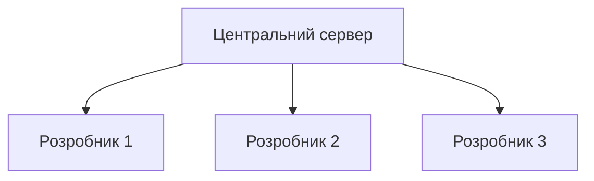
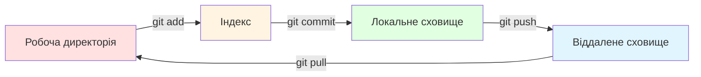

# Лекція 2 Робота з розподіленою системою контролю версій Git

## Вступ

Система контролю версій є критично важливим інструментом у сучасній розробці програмного забезпечення. Вона дозволяє командам розробників ефективно співпрацювати, відстежувати зміни в коді, повертатися до попередніх версій та експериментувати з новими функціями без ризику втрати працюючого коду. Git, створений Лінусом Торвальдсом у 2005 році для розробки ядра Linux, став найпопулярнішою системою контролю версій завдяки своїй розподіленій архітектурі, продуктивності та гнучкості.

Розуміння принципів роботи Git є фундаментальною навичкою для будь-якого фахівця з розробки програмного забезпечення. Ця лекція розглядає архітектуру Git, основні команди та робочі процеси, а також практики ефективної роботи з віддаленими сховищами.

## Еволюція систем контролю версій

### Локальні системи контролю версій

Перші системи контролю версій були локальними, зберігаючи всі версії файлів на одному комп'ютері. Найпростіший підхід полягав у копіюванні файлів у директорії з позначками часу. Хоча цей метод простий у розумінні, він надзвичайно схильний до помилок. Легко забути, в якій директорії ви працюєте, або випадково скопіювати не ті файли.

Система RCS, розроблена в 1980-х роках, стала одним з перших формалізованих інструментів контролю версій. Вона зберігала набори патчів між версіями файлів у спеціальному форматі на диску. Застосовуючи ці патчі, RCS могла відновити будь-яку версію файлу. Проте така система не дозволяла кільком розробникам ефективно співпрацювати над одним проєктом.

### Централізовані системи контролю версій

Централізовані системи контролю версій, такі як CVS та Subversion, вирішили проблему співпраці, вводячи концепцію центрального сервера. Всі версії файлів зберігалися на єдиному сервері, а розробники отримували лише поточну робочу версію файлів. Цей підхід мав очевидні переваги: адміністратори могли контролювати, хто має доступ до чого, простіше керувати централізованою системою, ніж локальними базами даних на кожному клієнті.



Однак централізовані системи мали серйозні недоліки. Єдина точка відмови означала, що якщо сервер вийде з ладу, ніхто не зможе зберегти версійовані зміни до проєктів, над якими працюють. Якщо жорсткий диск центрального сховища пошкодиться без резервних копій, втрачається вся історія проєкту, окрім окремих знімків, які випадково збереглися на локальних машинах.

Необхідність постійного підключення до сервера обмежувала можливості роботи в автономному режимі. Розробники не могли робити коміти або переглядати історію без доступу до мережі. Продуктивність операцій залежала від швидкості мережі, оскільки кожна операція вимагала взаємодії з сервером.

### Розподілені системи контролю версій

Розподілені системи контролю версій, такі як Git, Mercurial та Bazaar, пропонують інший підхід. Клієнти не просто отримують останню версію файлів, вони повністю дзеркалять сховище, включаючи всю його історію. Таким чином, якщо будь-який сервер припинить працювати, будь-яке клієнтське сховище може бути скопійоване назад на сервер для відновлення.

Кожне клонування є повноцінною резервною копією всіх даних. Розробники можуть працювати повністю автономно, роблячи коміти, переглядаючи історію та створюючи гілки без підключення до мережі. Операції виконуються локально, що робить їх надзвичайно швидкими. Розробники можуть експериментувати з різними підходами в локальних гілках, не впливаючи на інших членів команди.

## Архітектура Git

### Фундаментальні концепції

Git відрізняється від більшості інших систем контролю версій підходом до зберігання даних. Багато інших систем зберігають інформацію як список змін файлів. Вони мають базовий набір файлів та набір дельт, які застосовуються до цих файлів з плином часу. Git замість цього розглядає дані як серію знімків.

Кожного разу, коли ви робите коміт, Git по суті робить знімок того, як виглядають всі файли в цей момент, та зберігає посилання на цей знімок. Для ефективності, якщо файли не змінилися, Git не зберігає файл знову, а лише посилання на попередній ідентичний файл. Цей підхід робить Git більше схожим на міні файлову систему з потужними інструментами, побудованими поверх неї.

Майже всі операції в Git є локальними. Це означає, що вам не потрібна інформація з мережі для більшості операцій. Вся історія проєкту знаходиться прямо на вашому локальному диску, тому більшість операцій здаються майже миттєвими. Щоб переглянути історію проєкту, Git не потребує звертатися до сервера, він просто читає її безпосередньо з вашої локальної бази даних.

Все в Git проходить контрольну суму перед збереженням, і потім на цю контрольну суму посилаються. Це означає, що неможливо змінити вміст будь-якого файлу або директорії без відома Git. Git використовує SHA-1 хеш для контрольних сум. Це сорок символьний рядок, що складається з шістнадцяткових символів та обчислюється на основі вмісту файлу або структури директорії в Git.

### Три стани файлів

Git має три основні стани, в яких можуть знаходитися ваші файли: змінений, індексований та зафіксований. Змінений означає, що ви змінили файл, але ще не зафіксували його в базі даних. Індексований означає, що ви позначили змінений файл у його поточній версії для включення в наступний коміт. Зафіксований означає, що дані безпечно збережені в вашій локальній базі даних.



Це призводить до трьох основних секцій проєкту Git: робоча директорія, область індексування та директорія Git. Робоча директорія є одним знімком однієї версії проєкту. Ці файли витягуються зі стисненої бази даних у директорії Git та розміщуються на диску для використання або модифікації.

Область індексування, також відома як staging area, є простим файлом, що міститься у вашій директорії Git, який зберігає інформацію про те, що потрапить у наступний коміт. Директорія Git є місцем, де Git зберігає метадані та базу даних об'єктів для вашого проєкту. Це найважливіша частина Git, і саме вона копіюється, коли ви клонуєте сховище.

### Внутрішня структура об'єктів

Git використовує чотири типи об'єктів для зберігання даних: blob, tree, commit та tag. Blob об'єкти зберігають вміст файлів. Кожна версія кожного файлу представлена окремим blob об'єктом. Git не зберігає імена файлів в blob об'єктах, лише їхній вміст.

Tree об'єкти відповідають директоріям у файловій системі. Вони містять посилання на blob об'єкти та інші tree об'єкти, разом з іменами файлів та дозволами. Tree об'єкт описує структуру директорій проєкту в конкретний момент часу.

Commit об'єкти представляють окремі коміти. Кожен commit об'єкт вказує на tree об'єкт, який представляє стан проєкту в момент коміту, а також містить метадані: автора, коментар та посилання на батьківські коміти. Більшість комітів мають одного батька, але коміти злиття можуть мати декількох батьків.

Tag об'єкти використовуються для створення постійних позначок на певних комітах, зазвичай для позначення релізів. Анотований тег містить ім'я того, хто створив тег, дату створення та повідомлення.

## Базові команди Git

### Налаштування Git

Перед початком роботи з Git необхідно виконати базове налаштування. Git постачається з інструментом git config, який дозволяє встановлювати конфігураційні змінні, що контролюють всі аспекти роботи Git. Найперше, що слід зробити після встановлення Git, це встановити ім'я користувача та електронну адресу.

```bash
git config --global user.name "Ім'я Прізвище"
git config --global user.email "email@example.com"
```

Ці налаштування важливі, оскільки кожен коміт в Git використовує цю інформацію, і вона незмінно включається в коміти, які ви створюєте. Опція global означає, що ці налаштування будуть використовуватися для всіх проєктів на вашій системі. Якщо потрібно перевизначити їх для конкретного проєкту, можна запустити команду без опції global в директорії того проєкту.

Корисно також налаштувати редактор за замовчуванням, який буде використовуватися, коли Git потребує введення повідомлення. Якщо не налаштувати редактор, Git використовує системний редактор за замовчуванням.

```bash
git config --global core.editor "nano"
```

Перевірити налаштування можна за допомогою команди git config list, яка виведе всі налаштування, які Git може знайти на даний момент.

### Створення та клонування сховищ

Існує два основні способи отримати Git сховище. Перший спосіб перетворює існуючу директорію проєкту в Git сховище. Щоб почати відстежувати існуючий проєкт у Git, потрібно перейти в директорію цього проєкту та виконати команду git init. Ця команда створює нову піддиректорію з назвою git, яка містить всі необхідні файли сховища.

```bash
cd /шлях/до/проєкту
git init
```

На цьому етапі нічого в проєкті ще не відстежується. Щоб почати відстежувати існуючі файли, потрібно додати їх до індексу та зробити початковий коміт.

```bash
git add .
git commit -m "Початковий коміт"
```

Другий спосіб отримати Git сховище полягає в клонуванні існуючого сховища. Git отримує повну копію майже всіх даних, які має сервер. Кожна версія кожного файлу в історії проєкту витягується за замовчуванням, коли ви виконуєте git clone.

```bash
git clone https://github.com/username/repository.git
```

Ця команда створює директорію з назвою repository, ініціалізує всередині неї директорію git, витягує всі дані для цього сховища та отримує робочу копію останньої версії. Якщо потрібно клонувати сховище в директорію з іншою назвою, можна вказати її як додатковий аргумент.

```bash
git clone https://github.com/username/repository.git my-project
```

### Робота з файлами

Кожен файл у робочій директорії може знаходитися в одному з двох станів: відстежуваний або невідстежуваний. Відстежувані файли це файли, які були в останньому знімку, а також будь-які нові файли, додані до індексу. Вони можуть бути незміненими, зміненими або індексованими. Невідстежувані файли це все інше, будь-які файли у робочій директорії, які не були в останньому знімку та не знаходяться в області індексування.

Щоб визначити стан файлів, використовується команда git status. Ця команда показує, на якій гілці ви знаходитесь, чи є неіндексовані зміни, які файли індексовані та готові до коміту, та які файли не відстежуються Git.

```bash
git status
```

Для більш компактного виводу можна використовувати опцію short, яка показує статус у скороченому форматі.

```bash
git status -s
```

Щоб почати відстежувати новий файл або проіндексувати змінений файл, використовується команда git add. Ця команда багатофункціональна: вона використовується для початку відстежування нових файлів, для індексування файлів та для інших цілей, таких як позначення конфліктних файлів як вирішених.

```bash
git add filename.txt
git add *.js
git add .
```

Останній варіант додає всі файли з поточної директорії та всіх піддиректорій. Це зручно, але потрібно бути обережним, щоб не додати випадково непотрібні файли.

Для відстеження змін між робочою директорією та областю індексування використовується команда git diff. Щоб побачити, що було проіндексовано і потрапить у наступний коміт, використовується git diff staged або git diff cached.

```bash
git diff
git diff --staged
```

### Створення комітів

Коли область індексування налаштована так, як потрібно, можна зафіксувати зміни. Найпростіший спосіб створити коміт це використати команду git commit, яка запустить редактор для введення повідомлення коміту.

```bash
git commit
```

Для простих комітів зручніше використовувати опцію m, яка дозволяє ввести повідомлення безпосередньо в командному рядку.

```bash
git commit -m "Опис внесених змін"
```

Опція a дозволяє пропустити область індексування, автоматично індексуючи всі відстежувані файли перед комітом.

```bash
git commit -a -m "Опис змін"
```

Щоб змінити останній коміт, використовується опція amend. Це корисно, якщо потрібно додати забутий файл або виправити повідомлення коміту.

```bash
git add forgotten-file.txt
git commit --amend -m "Виправлене повідомлення"
```

### Видалення та переміщення файлів

Щоб видалити файл з Git, потрібно видалити його з відстежуваних файлів та зробити коміт. Команда git rm виконує це та видаляє файл з робочої директорії.

```bash
git rm filename.txt
git commit -m "Видалено filename.txt"
```

Якщо файл вже був змінений або проіндексований, потрібно використовувати опцію f для примусового видалення.

```bash
git rm -f modified-file.txt
```

Щоб зберегти файл у робочій директорії, але видалити його з області індексування, використовується опція cached.

```bash
git rm --cached large-file.bin
```

Для перейменування або переміщення файлів використовується команда git mv.

```bash
git mv old-name.txt new-name.txt
```

Це еквівалентно виконанню трьох команд: перейменування файлу в файловій системі, git rm для старого імені та git add для нового імені.

## Перегляд історії

### Команда git log

Команда git log показує історію комітів сховища. За замовчуванням вона виводить коміти в зворотному хронологічному порядку, показуючи хеш коміту, автора, дату та повідомлення.

```bash
git log
```

Існує багато опцій для налаштування виводу. Опція p або patch показує різницю, введену в кожному коміті. Опція stat показує статистику змінених файлів для кожного коміту.

```bash
git log -p -2
git log --stat
```

Опція pretty дозволяє змінити формат виводу. Значення oneline виводить кожен коміт на одному рядку, що корисно для огляду великої кількості комітів.

```bash
git log --pretty=oneline
git log --pretty=format:"%h - %an, %ar : %s"
```

Опція graph додає ASCII графік, що показує структуру гілок та злиттів.

```bash
git log --pretty=format:"%h %s" --graph
```

### Фільтрування виводу

Git log надає потужні можливості фільтрування комітів. Опція n обмежує кількість виведених комітів. Опції since та until фільтрують коміти за датою.

```bash
git log -5
git log --since=2.weeks
git log --since="2024-01-01" --until="2024-12-31"
```

Опція author дозволяє фільтрувати за автором, а опція grep шукає в повідомленнях комітів.

```bash
git log --author="Ім'я"
git log --grep="виправлення"
```

Опція S, відома як pickaxe, показує коміти, які змінили кількість входжень рядка в коді.

```bash
git log -S "function_name"
```

Для фільтрування за змінами конкретних файлів можна вказати шлях після двох тире.

```bash
git log -- path/to/file.js
```

## Робота з віддаленими сховищами

### Додавання віддалених сховищ

Віддалені сховища це версії проєкту, які знаходяться в інтернеті або в мережі. Щоб переглянути налаштовані віддалені сховища, використовується команда git remote.

```bash
git remote
git remote -v
```

Опція v показує URL, які Git зберігає для скороченої назви віддаленого сховища. Щоб додати нове віддалене сховище, використовується команда git remote add.

```bash
git remote add origin https://github.com/username/repository.git
```

Тепер можна використовувати рядок origin замість повного URL в командах.

### Отримання та відправлення змін

Щоб отримати дані з віддаленого сховища, використовується команда git fetch. Ця команда завантажує всі дані з віддаленого проєкту, які ви ще не маєте.

```bash
git fetch origin
```

Важливо розуміти, що fetch лише завантажує дані у ваше локальне сховище, але не зливає їх автоматично з вашою роботою та не модифікує те, над чим ви працюєте. Для автоматичного отримання та злиття віддаленої гілки з поточною гілкою використовується git pull.

```bash
git pull origin main
```

Щоб відправити зміни у віддалене сховище, використовується команда git push. Вона працює лише якщо ви клонували з сервера, на якому маєте права запису, і якщо ніхто не відправляв зміни в проміжку часу.

```bash
git push origin main
```

Якщо хтось інший відправив зміни до вас, ваша відправка буде відхилена. Спочатку потрібно завантажити їхню роботу та інтегрувати її у свою, перш ніж отримаєте дозвіл відправити.

### Інспекція віддаленого сховища

Щоб побачити більше інформації про конкретне віддалене сховище, використовується команда git remote show.

```bash
git remote show origin
```

Ця команда показує URL віддаленого сховища, інформацію про відстеження гілок та які гілки будуть відправлені або отримані при виконанні git push або git pull.

Для перейменування віддаленого посилання використовується git remote rename, а для видалення git remote remove.

```bash
git remote rename old-name new-name
git remote remove origin
```

## Кращі практики роботи з Git

### Частота та розмір комітів

Коміти мають бути логічно завершеними одиницями роботи. Кожен коміт повинен представляти одну зміну або набір пов'язаних змін. Уникайте створення комітів, які змішують непов'язані зміни. Якщо ви працювали над декількома функціями одночасно, створіть окремий коміт для кожної.

Рекомендується робити коміти часто, але не занадто часто. Кожен коміт має мати сенс як окрема одиниця. Якщо зміна занадто велика, розбийте її на декілька комітів. Якщо окремі зміни занадто дрібні, об'єднайте їх в один коміт.

### Якість повідомлень комітів

Добре написане повідомлення коміту допомагає іншим розробникам зрозуміти, що було зроблено та чому. Перший рядок повідомлення має бути коротким резюме змін, не довше ніж п'ятдесят символів. Якщо потрібно додати більше деталей, залиште порожній рядок після резюме та напишіть детальніший опис.

Використовуйте наказовий спосіб у резюме: додати функцію, а не додано функцію або додає функцію. Пояснюйте що та чому, а не як. Код показує як, а коментарі та повідомлення комітів мають пояснювати контекст та причини.

### Використання gitignore

Файл gitignore визначає, які файли та директорії Git повинен ігнорувати. Це особливо корисно для виключення файлів, згенерованих системою збірки, тимчасових файлів, файлів з чутливою інформацією та залежностей, які можна легко відновити.

```
# Залежності
node_modules/
vendor/

# Файли збірки
dist/
build/
*.o
*.exe

# Файли середовища
.env
.env.local

# Логи
*.log
logs/

# Системні файли
.DS_Store
Thumbs.db
```

Шаблони gitignore можна знайти для різних мов програмування та фреймворків на GitHub у репозиторії gitignore.

## Висновки

Git є потужною розподіленою системою контролю версій, яка стала індустріальним стандартом для керування вихідним кодом. Розуміння архітектури Git, включаючи концепції трьох станів файлів та внутрішньої структури об'єктів, дозволяє ефективно використовувати цей інструмент.

Базові операції Git, такі як створення комітів, перегляд історії та робота з віддаленими сховищами, формують фундамент для щоденної роботи розробника. Дотримання кращих практик щодо частоти комітів, якості повідомлень та використання gitignore підвищує ефективність співпраці в команді.

Володіння Git є необхідною навичкою для сучасного розробника та основою для впровадження DevOps практик, таких як безперервна інтеграція та безперервна доставка. У наступній лекції ми розглянемо стратегії гілкування та процес перегляду коду, які дозволяють командам ефективно організовувати роботу над складними проєктами.
