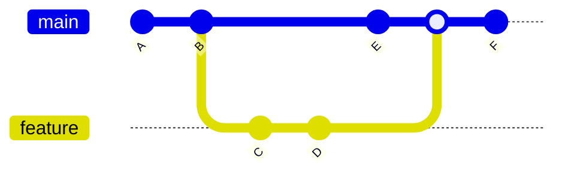
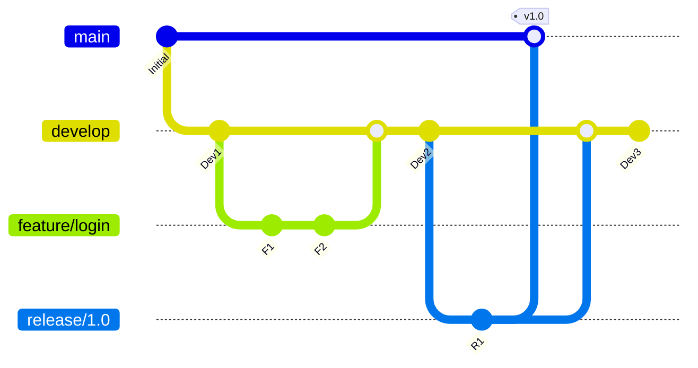
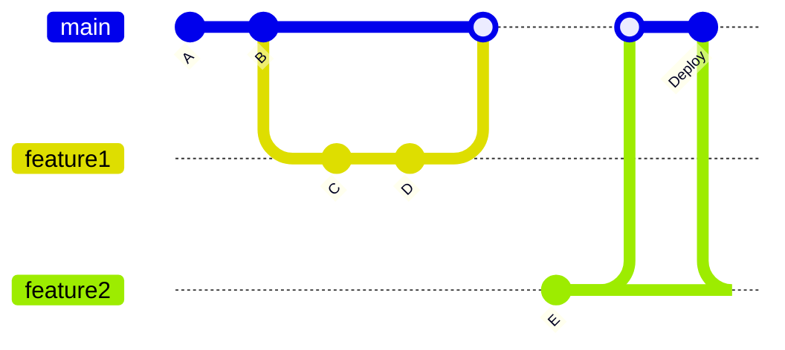

# Лекція 3 Стратегії гілкування та процес перегляду коду

## Вступ

Ефективна організація роботи з гілками є критично важливою для успішної командної розробки програмного забезпечення. Стратегії гілкування визначають, як команда використовує гілки для організації роботи над новими функціями, виправлення помилок та підготовки релізів. Правильно обрана стратегія гілкування допомагає мінімізувати конфлікти, спрощує інтеграцію змін та забезпечує стабільність основної гілки.

Процес перегляду коду є невід'ємною частиною сучасної розробки, що забезпечує якість коду, поширення знань у команді та раннє виявлення потенційних проблем. Поєднання ефективної стратегії гілкування з систематичним переглядом коду створює основу для якісної та продуктивної співпраці.

Ця лекція розглядає найпопулярніші стратегії гілкування, аналізує їхні переваги та недоліки, а також досліджує кращі практики проведення перегляду коду та використання стандартів для повідомлень комітів.

## Робота з гілками в Git

### Основи гілок

Гілка в Git представляє незалежну лінію розробки. Гілки дозволяють відходити від основної лінії розробки та продовжувати роботу, не впливаючи на цю основну лінію. Git зберігає гілку як легкий рухомий вказівник на коміт. Гілка в Git насправді є простим файлом, що містить сорок символів SHA-1 контрольної суми коміту, на який вона вказує.

Коли ви створюєте новий коміт, вказівник поточної гілки автоматично рухається вперед до нового коміту. Git зберігає спеціальний вказівник під назвою HEAD, який вказує на локальну гілку, на якій ви зараз знаходитесь. Це дозволяє Git знати, куди додавати нові коміти та яку робочу директорію показувати.



Створення нової гілки виконується командою git branch, а перехід на неї командою git checkout або більш новою git switch.

```bash
git branch feature-authentication
git checkout feature-authentication
```

Або комбінованою командою, яка створює гілку та одразу переходить на неї:

```bash
git checkout -b feature-authentication
git switch -c feature-authentication
```

### Злиття гілок

Коли робота над функцією завершена, потрібно інтегрувати зміни назад в основну гілку. Git пропонує декілька стратегій злиття. Fast-forward злиття відбувається, коли поточна гілка є прямим предком гілки, яку зливають. В цьому випадку Git просто переміщує вказівник гілки вперед.

```bash
git checkout main
git merge feature-authentication
```

Якщо основна гілка розвивалася паралельно з гілкою функції, Git виконує трьохстороннє злиття, створюючи новий коміт злиття, який має двох батьків. Git автоматично визначає найкращу спільну базу для злиття та створює новий коміт злиття.

Іноді виникають конфлікти злиття, коли обидві гілки змінили одну і ту ж частину того ж файлу. Git не може автоматично вирішити такі конфлікти та потребує втручання людини. Git додає стандартні маркери конфліктів до файлів, які мають конфлікти.

```
<<<<<<< HEAD
const apiUrl = 'https://api.example.com';
=======
const apiUrl = 'https://api-staging.example.com';
>>>>>>> feature-authentication
```

Розробник має вручну вирішити конфлікт, обравши одну з версій або об'єднавши їх, після чого проіндексувати файл та завершити злиття.

```bash
git add conflicted-file.js
git commit -m "Вирішено конфлікт злиття"
```

### Перебазування гілок

Альтернативою злиттю є перебазування. Команда git rebase бере всі зміни, які були зафіксовані на одній гілці, та відтворює їх на іншій. Перебазування створює лінійнішу історію, ніж злиття.

```bash
git checkout feature-authentication
git rebase main
```

Ця команда знаходить спільного предка поточної гілки та гілки main, отримує різницю кожного коміту поточної гілки, зберігає ці різниці у тимчасові файли, скидає поточну гілку до того ж коміту, що й гілка, на яку перебазовуються, та застосовує кожну зміну по черзі.

Перебазування робить історію чистішою, але важливо пам'ятати золоте правило: ніколи не перебазовуйте коміти, які існують поза вашим локальним сховищем та на які можуть посилатися інші люди. Перебазування переписує історію, що може створити проблеми для інших розробників.

## Стратегії гілкування

### Git Flow

Git Flow є однією з найстаріших та найдетальніших стратегій гілкування. Вона була представлена Вінсентом Дріссеном у 2010 році та стала популярною для проєктів з регулярними релізами. Git Flow визначає строгу модель гілкування, побудовану навколо релізу проєкту.

Модель використовує дві основні довгоживучі гілки: main та develop. Гілка main зберігає офіційну історію релізів, де кожен коміт представляє новий реліз у продуктивному середовищі. Гілка develop служить інтеграційною гілкою для функцій і завжди відображає стан з останніми доставленими змінами розробки для наступного релізу.



Гілки функцій створюються від develop та зливаються назад в develop після завершення роботи. Кожна нова функція має мати власну гілку, яка може існувати у віддаленому сховищі для співпраці або залишатися локальною.

```bash
git checkout -b feature/user-authentication develop
# робота над функцією
git checkout develop
git merge --no-ff feature/user-authentication
git branch -d feature/user-authentication
```

Гілки релізів створюються від develop, коли накопичено достатньо функцій для релізу. На цій гілці виконуються фінальні приготування: виправлення дрібних помилок, підготовка метаданих релізу. Коли гілка релізу готова, вона зливається в main з тегом версії та назад в develop.

```bash
git checkout -b release/1.2 develop
# підготовка релізу
git checkout main
git merge --no-ff release/1.2
git tag -a v1.2 -m "Version 1.2"
git checkout develop
git merge --no-ff release/1.2
git branch -d release/1.2
```

Гілки hotfix використовуються для швидкого виправлення критичних помилок у продуктивному середовищі. Вони створюються від main та зливаються як в main, так і в develop.

Переваги Git Flow включають чітку структуру та процес, добре підходить для проєктів з запланованими релізами, окремі гілки для різних типів роботи. Недоліки включають складність для простих проєктів, багато довгоживучих гілок може призводити до конфліктів, не оптимальний для безперервного розгортання.

### GitHub Flow

GitHub Flow є набагато простішою стратегією, розробленою командою GitHub для підтримки їхнього власного процесу розробки. Ця стратегія базується на одній основній гілці та короткоживучих гілках функцій.

Модель передбачає, що гілка main завжди знаходиться у стані, придатному для розгортання. Всі нові функції та виправлення розробляються в окремих гілках, створених від main. Назви гілок мають бути описовими, щоб інші могли зрозуміти, над чим ведеться робота.

```bash
git checkout -b add-payment-gateway main
# робота над функцією
git push origin add-payment-gateway
```

Коли робота завершена, створюється pull request для обговорення та перегляду змін. Після схвалення змін вони зливаються в main та одразу розгортаються в продуктивне середовище.



GitHub Flow особливо добре підходить для веброзробки та проєктів з безперервним розгортанням. Переваги включають простоту розуміння та використання, швидкий цикл зворотного зв'язку, добре підходить для безперервного розгортання. Недоліки включають відсутність явної підтримки різних версій продукту, може бути недостатньо для складних релізних циклів.

### Trunk-Based Development

Trunk-Based Development є стратегією, де розробники співпрацюють на основі єдиної гілки, яка називається trunk або main. Ця стратегія зосереджується на інтеграції невеликих, часто змін безпосередньо в основну гілку.

Розробники роблять невеликі, інкрементальні зміни та часто комітять їх в основну гілку. Якщо використовуються короткоживучі гілки функцій, вони мають життєвий цикл не більше кількох днів. Частіше розробники комітять безпосередньо в trunk після проходження автоматизованих тестів.

```bash
# робота безпосередньо в main
git checkout main
git pull origin main
# внесення змін
git add .
git commit -m "Додано валідацію email"
git push origin main
```

Для великих функцій використовуються feature flags, які дозволяють приховати незавершену функціональність від користувачів, продовжуючи інтегрувати код в основну гілку.

```javascript
if (featureFlags.isEnabled('new-checkout-flow')) {
   // новий код
} else {
   // старий код
}
```

Переваги Trunk-Based Development включають мінімізацію конфліктів злиття, швидкий зворотний зв'язок, простота CI/CD процесів, заохочує невеликі, часті зміни. Недоліки включають потребу в надійному автоматизованому тестуванні, вимагає дисципліни від команди, може бути складно для початківців.

### Вибір стратегії

Вибір стратегії гілкування залежить від багатьох факторів. Розмір команди впливає на складність координації. Великі команди можуть потребувати більш структурованого підходу, тоді як малі команди можуть використовувати простіші стратегії.

Частота релізів визначає, наскільки складний процес підготовки релізу. Проєкти з безперервним розгортанням краще підходять для простих стратегій як GitHub Flow. Проєкти з запланованими релізами можуть скористатися більш структурованим підходом Git Flow.

Рівень зрілості DevOps практик в організації також впливає на вибір. Команди з добре налаштованими CI/CD процесами та автоматизованим тестуванням можуть успішно використовувати Trunk-Based Development. Команди на початку впровадження DevOps можуть почати з більш консервативних підходів.

## Процес перегляду коду

### Цінність перегляду коду

Перегляд коду є практикою систематичного вивчення вихідного коду іншими розробниками перед його інтеграцією в основну кодову базу. Ця практика приносить численні переваги для якості коду та розвитку команди.

Покращення якості коду досягається через виявлення помилок на ранніх етапах, коли їх виправлення коштує значно дешевше. Додаткові очі часто помічають проблеми, які пропустив автор коду. Рецензенти можуть запропонувати покращення архітектури, продуктивності або читабельності коду.

Поширення знань відбувається природно під час перегляду коду. Члени команди дізнаються про різні частини кодової бази, навіть якщо не працюють над ними безпосередньо. Молодші розробники навчаються від більш досвідчених через їхні коментарі та пропозиції.

Підтримка стандартів команди забезпечується через перегляд. Рецензенти стежать за дотриманням угод про стиль коду, архітектурних принципів та кращих практик. Це створює більш однорідну кодову базу, яку легше підтримувати.

### Pull Requests та Merge Requests

Pull request або merge request є механізмом для пропонування змін та їх перегляду перед злиттям. Створення pull request починається з відправки гілки функції у віддалене сховище.

```bash
git push origin feature/add-search
```

Після цього на платформі GitHub, GitLab або іншій створюється pull request, який включає опис змін, посилання на пов'язані issue або завдання, знімки екрану для візуальних змін. Хороший опис pull request допомагає рецензентам швидше зрозуміти контекст та мету змін.

Шаблони pull request допомагають стандартизувати інформацію, яка надається з кожним запитом. Типовий шаблон може включати такі секції:

```markdown
## Опис
[Короткий опис того, що робить цей PR]

## Тип зміни
- [ ] Виправлення помилки
- [ ] Нова функція
- [ ] Критична зміна
- [ ] Оновлення документації

## Як протестовано
[Опишіть тести, які ви провели]

## Чеклист
- [ ] Мій код відповідає стандартам проєкту
- [ ] Я провів самоперегляд власного коду
- [ ] Я прокоментував складні частини коду
- [ ] Я оновив документацію
- [ ] Мої зміни не створюють нових попереджень
- [ ] Я додав тести для моїх змін
```

### Процес перегляду

Ефективний перегляд коду вимагає структурованого підходу. Рецензент має розуміти контекст перед початком перегляду. Прочитайте опис pull request та пов'язані issue. Зрозумійте, яку проблему вирішують зміни.

Перевірте загальний дизайн перед деталями. Чи є рішення архітектурно правильним? Чи відповідають зміни встановленим патернам? Чи не створюють зміни технічний борг?

Перегляд коду має включати перевірку функціональності, якості коду, тестів, документації. Чи робить код те, що має робити? Чи є код читабельним та зрозумілим? Чи достатньо тестів для покриття нової функціональності? Чи оновлена відповідна документація?

Коментарі мають бути конструктивними та специфічними. Замість "це погано" краще написати "розгляньте використання Map замість Object для кращої продуктивності при частих операціях додавання та видалення". Пояснюйте причини ваших пропозицій, особливо якщо вони не очевидні.

Класифікуйте коментарі за важливістю. Деякі платформи дозволяють позначати коментарі як блокуючі, що потребують обов'язкового вирішення, або як пропозиції, які автор може розглянути на власний розсуд.

```
Блокуючий: Ця функція не перевіряє null, що може призвести до збою.

Пропозиція: Розгляньте використання async/await замість callbacks для кращої читабельності.

Питання: Чому ви обрали цей підхід замість існуючого методу в utils?
```

### Кращі практики перегляду коду

Розмір pull request значно впливає на ефективність перегляду. Великі pull request важко переглядати ретельно, що призводить до пропуску помилок. Рекомендується обмежувати зміни до двохсот чи трьохсот рядків коду. Якщо функція більша, розбийте її на декілька логічних частин.

Час відгуку на pull request має бути розумним. Швидкий зворотний зв'язок підтримує продуктивність автора та зменшує ймовірність конфліктів з іншими змінами. Рекомендується переглядати pull request протягом одного робочого дня після створення.

Автоматизація допомагає зосередитися на важливих аспектах. Автоматизовані перевірки можуть виявляти проблеми зі стилем коду, запускати тести, перевіряти покриття коду. Це звільняє рецензентів від необхідності перевіряти механічні аспекти.

Культура відкритості та поваги критично важлива. Перегляд коду не має бути критикою розробника, а процесом покращення коду. Фокусуйтеся на коді, а не на особистості. Визнавайте хороші рішення та діліться позитивним зворотним зв'язком.

## Conventional Commits

### Структура Conventional Commits

Conventional Commits є специфікацією для структурування повідомлень комітів. Вона надає простий набір правил для створення явної історії комітів, що полегшує написання автоматизованих інструментів.

Повідомлення коміту має таку структуру:

```
<тип>[необов'язкова область]: <опис>

[необов'язкове тіло]

[необов'язковий футер]
```

Тип визначає призначення коміту. Стандартні типи включають:

```
feat: нова функція для користувача
fix: виправлення помилки для користувача
docs: зміни в документації
style: форматування, відсутні крапки з комою тощо; без зміни коду
refactor: рефакторинг коду без зміни функціональності
perf: зміни коду, що покращують продуктивність
test: додавання відсутніх тестів або виправлення існуючих
build: зміни в системі збірки або зовнішніх залежностях
ci: зміни в конфігураційних файлах CI
chore: інші зміни, які не модифікують файли src або тестів
revert: скасування попереднього коміту
```

Область визначає частину кодової бази, якої стосується коміт. Наприклад: parser, authentication, api.

```
feat(authentication): додати підтримку OAuth2
fix(parser): виправити обробку спеціальних символів
docs(api): оновити документацію endpoints
```

Опис є коротким резюме змін. Використовуйте наказовий спосіб теперішнього часу: змінити, а не змінено або зміни. Не починайте з великої літери. Не додавайте крапку в кінці.

### Переваги Conventional Commits

Автоматична генерація changelog стає можливою завдяки структурованим повідомленням. Інструменти можуть автоматично створювати список змін для релізу, групуючи коміти за типами.

```
## [1.2.0] - 2024-03-15

### Features
- feat(auth): додати двофакторну автентифікацію
- feat(api): додати endpoint для експорту даних

### Bug Fixes
- fix(parser): виправити обробку UTF-8 символів
- fix(ui): виправити вирівнювання кнопок на мобільних пристроях

### Documentation
- docs(readme): оновити інструкції з встановлення
```

Автоматичне визначення версій можливе на основі типів комітів. Коміти типу feat збільшують minor версію, fix збільшує patch версію, а BREAKING CHANGE в футері збільшує major версію відповідно до Semantic Versioning.

Легше навігувати історією проєкту, коли повідомлення комітів мають передбачувану структуру. Розробники можуть швидко знайти релевантні зміни, фільтруючи за типом або областю.

### Інструменти для Conventional Commits

Commitizen є інструментом командного рядка, який допомагає писати повідомлення комітів згідно зі специфікацією. Він інтерактивно запитує про тип, область та опис коміту.

```bash
npm install -g commitizen
commitizen init cz-conventional-changelog --save-dev --save-exact

# Використання
git add .
git cz
```

Standard Version автоматизує управління версіями та генерацію changelog на основі Conventional Commits.

```bash
npm install --save-dev standard-version

# Використання
npm run release
```

Commitlint перевіряє, чи відповідають повідомлення комітів правилам Conventional Commits. Його можна інтегрувати з Git hooks для автоматичної перевірки.

```bash
npm install --save-dev @commitlint/cli @commitlint/config-conventional

# Конфігурація в commitlint.config.js
module.exports = {
 extends: ['@commitlint/config-conventional']
};
```

## Практичні поради

### Комунікація в команді

Ефективна комунікація під час перегляду коду вимагає балансу між детальністю та ефективністю. Використовуйте синхронну комунікацію для складних обговорень. Якщо exchange коментарів стає довгим, краще провести коротку зустріч для вирішення питань.

Документуйте рішення, прийняті під час перегляду. Якщо виникла дискусія про підхід до вирішення проблеми, додайте коментар з поясненням обраного рішення. Це допоможе майбутнім розробникам зрозуміти контекст.

### Робота з legacy кодом

При роботі з існуючою кодовою базою, яка не відповідає сучасним стандартам, важливо знайти баланс між покращенням та практичністю. Правило бойових скаутів каже: залиште код трохи кращим, ніж ви його знайшли. Це не означає повністю переписати модуль, але можна покращити невелику частину.

Створюйте окремі коміти для рефакторингу та функціональних змін. Це полегшує перегляд та розуміння історії. Рецензент може окремо оцінити рефакторинг та нову функціональність.

### Безперервне навчання

Перегляд коду є відмінною можливістю для навчання. Молодші розробники навчаються від коментарів більш досвідчених колег. Досвідчені розробники можуть дізнатися про нові підходи від молодших колег, які приносять свіжий погляд.

Проводьте періодичні ретроспективи процесу перегляду коду. Обговоріть, що працює добре, а що можна покращити. Це допомагає команді постійно вдосконалювати свої практики.

## Висновки

Стратегії гілкування та процес перегляду коду є критично важливими компонентами ефективної командної розробки. Вибір правильної стратегії гілкування залежить від характеристик проєкту, розміру команди та зрілості DevOps практик. Git Flow надає детальну структуру для проєктів з запланованими релізами. GitHub Flow пропонує простоту для безперервного розгортання. Trunk-Based Development максимізує швидкість інтеграції при наявності надійної автоматизації.

Систематичний перегляд коду покращує якість кодової бази, поширює знання в команді та підтримує стандарти. Ефективний перегляд вимагає конструктивних коментарів, розумного розміру pull request та культури відкритості. Conventional Commits надає структуру для повідомлень комітів, що полегшує автоматизацію та навігацію історією проєкту.

Поєднання цих практик створює міцний фундамент для співпраці в команді та впровадження DevOps культури. Вони забезпечують баланс між швидкістю розробки та якістю коду, дозволяючи командам ефективно доставляти цінність користувачам при збереженні високих стандартів технічної досконалості.
