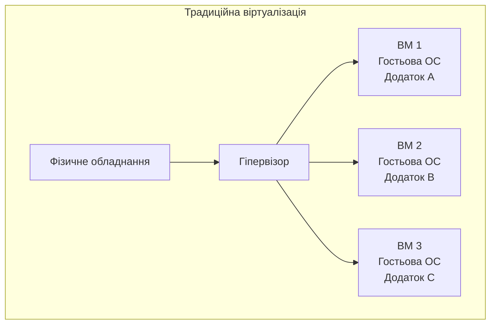
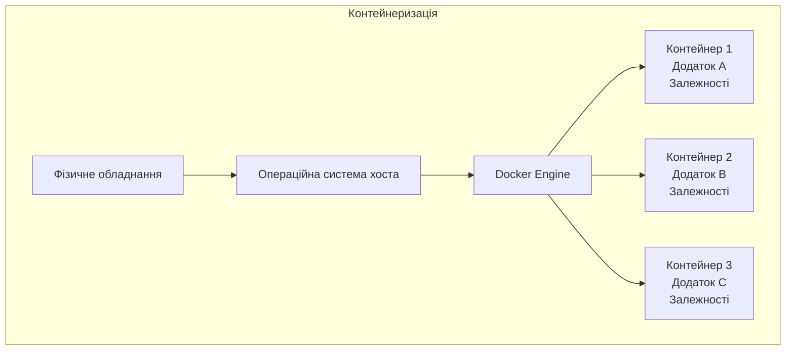
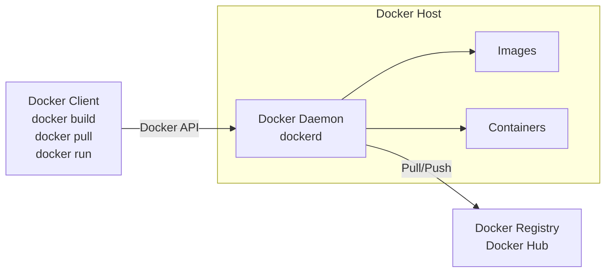
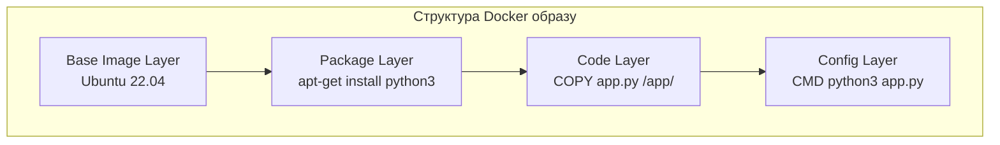
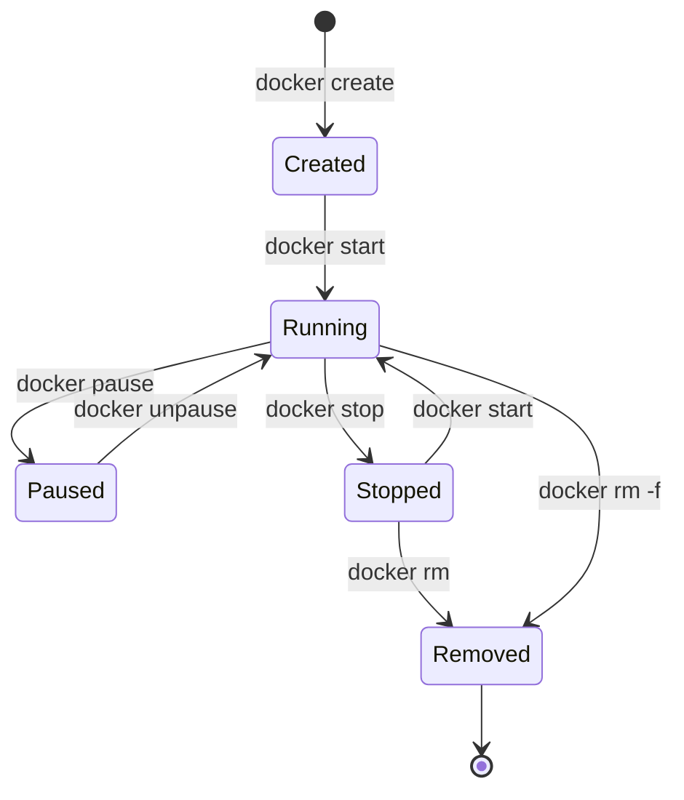
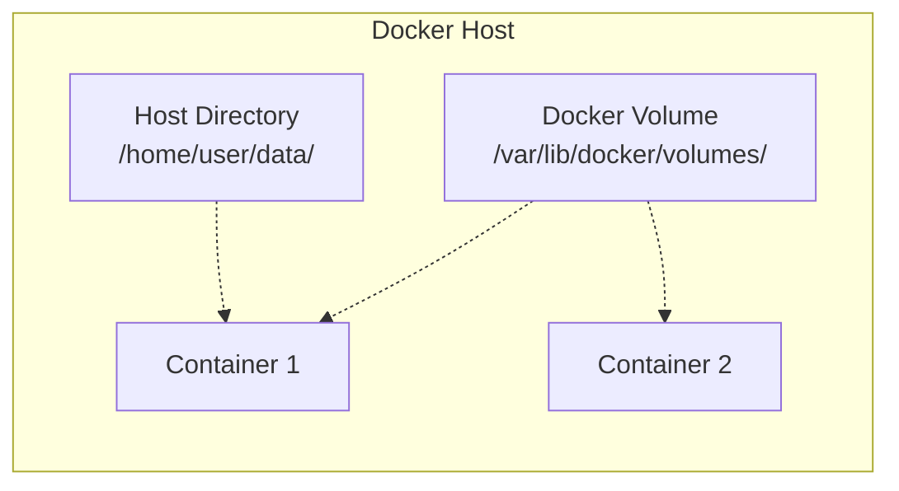
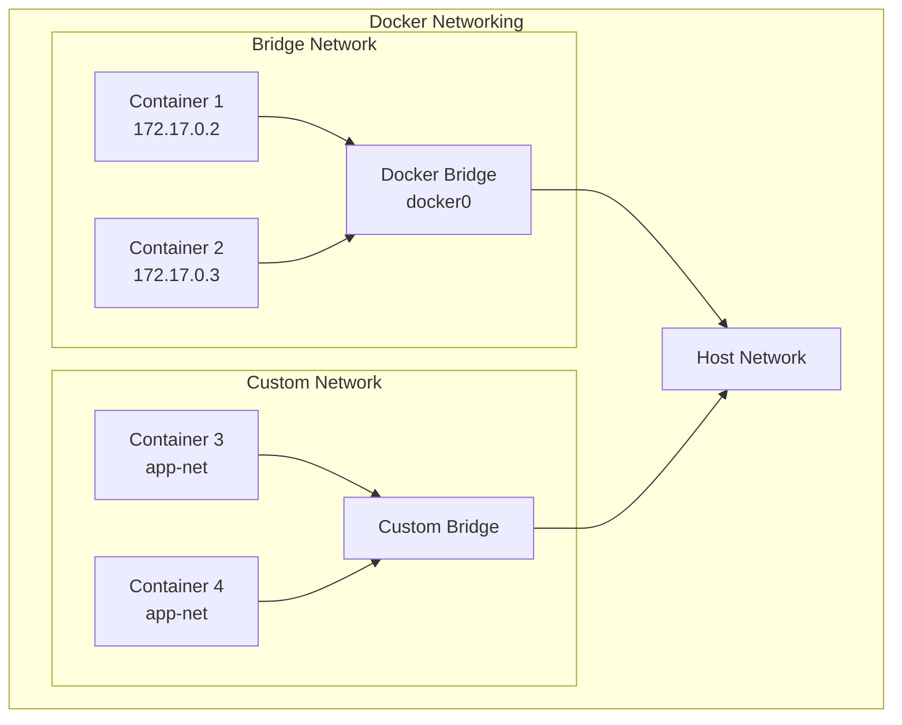

# Лекція 4. Технологія контейнеризації Docker

## Вступ

Контейнеризація стала одним із фундаментальних підходів у сучасній розробці та експлуатації програмного забезпечення. Docker revolutionized the way developers package, distribute, and run applications, створивши стандартизований спосіб упакування застосунків разом із усіма їхніми залежностями. У цій лекції ми розглянемо основи технології контейнеризації, архітектуру Docker та його ключові компоненти.

## Віртуалізація vs контейнеризація

### Традиційна віртуалізація

Традиційна віртуалізація базується на створенні повноцінних віртуальних машин, кожна з яких має власну операційну систему. Гіпервізор забезпечує апаратну віртуалізацію, що дозволяє запускати декілька ізольованих операційних систем на одному фізичному сервері.

Основні характеристики традиційної віртуалізації включають повну ізоляцію на рівні апаратного забезпечення, окрему операційну систему для кожної віртуальної машини та високе споживання ресурсів через дублювання операційних систем. Час запуску віртуальних машин зазвичай вимірюється хвилинами, оскільки потрібно завантажити повну операційну систему.



### Контейнеризація

Контейнеризація представляє легковісний підхід до віртуалізації на рівні операційної системи. Контейнери діляться ядром операційної системи хоста, але мають ізольовані простори користувача. Це робить їх набагато ефективнішими за традиційні віртуальні машини.

Ключові переваги контейнеризації включають мінімальне використання ресурсів через відсутність дублювання операційних систем, швидкий запуск контейнерів за лічені секунди та високу щільність розміщення на одному хості. Портативність контейнерів дозволяє запускати той самий образ у різних середовищах без модифікацій.



### Порівняння підходів

Розглянемо детальне порівняння віртуалізації та контейнеризації. За часом запуску віртуальні машини потребують хвилин, тоді як контейнери запускаються за секунди. Використання ресурсів значно відрізняється: віртуальні машини споживають гігабайти пам'яті через повні операційні системи, контейнери використовують мегабайти завдяки спільному ядру.

Портативність також демонструє суттєву різницю. Віртуальні машини обмежені типом гіпервізора та можуть мати проблеми сумісності, тоді як контейнери працюють однаково в будь-якому середовищі з Docker. Щільність розміщення дозволяє запустити десятки контейнерів на тому ж обладнанні, де працювало би лише кілька віртуальних машин.

Ізоляція в обох підходах має свої особливості. Віртуальні машини надають повну ізоляцію на рівні апаратного забезпечення, що є критичним для деяких сценаріїв безпеки. Контейнери забезпечують ізоляцію на рівні процесів через Linux namespaces та cgroups, що є достатнім для більшості застосунків.

## Docker: архітектура та компоненти

### Загальна архітектура Docker

Docker використовує клієнт-серверну архітектуру. Docker клієнт спілкується з Docker демоном, який виконує основну роботу зі збірки, запуску та розповсюдження контейнерів. Клієнт та демон можуть працювати на одній системі або клієнт може підключатися до віддаленого демона.



### Docker Daemon

Docker Daemon (dockerd) є серверним процесом, що керує Docker об'єктами: образами, контейнерами, мережами та томами. Демон прослуховує запити Docker API та обробляє їх. Він також може спілкуватися з іншими демонами для управління Docker сервісами в розподіленому середовищі.

Демон відповідає за низькорівневі операції контейнеризації, включаючи взаємодію з containerd для управління життєвим циклом контейнерів, роботу з runc для створення та запуску контейнерів згідно OCI специфікації та управління мережевим стеком контейнерів.

### Docker Client

Docker Client (docker) є основним способом взаємодії користувачів із Docker. Коли ви виконуєте команди на зразок docker run, клієнт відправляє ці команди до dockerd через Docker API. Клієнт може спілкуватися з більш ніж одним демоном одночасно.

Типові команди клієнта включають docker build для збірки образів з Dockerfile, docker pull для завантаження образів з реєстру, docker run для створення та запуску контейнерів та docker push для публікації образів у реєстр.

### Docker Registry

Docker Registry зберігає Docker образи. Docker Hub є публічним реєстром, який використовується за замовчуванням. Організації можуть налаштувати приватні реєстри для зберігання власних образів із дотриманням політик безпеки та контролю доступу.

Реєстри організовані в репозиторії, кожен з яких містить різні версії образу, позначені тегами. Наприклад, nginx:latest вказує на останню версію офіційного образу nginx, тоді як nginx:1.25-alpine вказує на конкретну версію з Alpine Linux базою.

### Ключові компоненти екосистеми Docker

Containerd є високорівневим runtime для контейнерів, що керує повним життєвим циклом контейнера на хості: передачею та зберіганням образів, виконанням та наглядом за контейнерами, низькорівневим управлінням storage та мережами. Docker делегує більшість операцій containerd.

RunC являє собою легковісний універсальний runtime для контейнерів, що відповідає OCI (Open Container Initiative) специфікації. Він створює та запускає контейнери згідно зі специфікацією, забезпечуючи взаємодію з Linux namespaces, cgroups та можливостями безпеки.

## Образи, контейнери, томи, мережі

### Docker образи

Docker образ є шаблоном тільки для читання, що містить інструкції для створення контейнера. Образи складаються з шарів файлової системи, кожен з яких представляє інструкцію в Dockerfile. Шари є незмінними та можуть використовуватися спільно між різними образами.

Структура образу базується на принципі layered file system. Коли ви будуєте образ, Docker створює новий шар для кожної інструкції Dockerfile. Ці шари зберігаються окремо та використовуються повторно, що економить дисковий простір та прискорює збірку.



Ідентифікація образів здійснюється через IMAGE ID (унікальний хеш) та теги (зрозумілі людині назви версій). Тег latest часто використовується для позначення найновішої версії, але краще явно вказувати конкретні версії для відтворюваності збірок.

### Docker контейнери

Docker контейнер є запущеним екземпляром образу. Коли ви запускаєте контейнер, Docker створює writable layer поверх незмінних шарів образу. Усі зміни, зроблені в контейнері під час виконання, зберігаються в цьому writable layer.

Життєвий цикл контейнера включає кілька станів. Created означає, що контейнер створений, але ще не запущений. Running вказує, що контейнер активно виконується. Paused означає тимчасову зупинку без звільнення ресурсів. Stopped відповідає зупиненому контейнеру, який можна перезапустити. Removed означає повне видалення контейнера.



Основні команди для роботи з контейнерами включають docker run для створення та запуску нового контейнера, docker ps для перегляду запущених контейнерів, docker stop для коректного зупинення контейнера та docker rm для видалення зупиненого контейнера.

Приклад запуску контейнера з nginx:

```bash
# Запуск контейнера в фоновому режимі з маппінгом порту
docker run -d -p 8080:80 --name my-nginx nginx:latest

# Перегляд логів контейнера
docker logs my-nginx

# Виконання команди всередині контейнера
docker exec -it my-nginx bash

# Зупинка контейнера
docker stop my-nginx
```

### Docker томи

Томи є механізмом збереження даних, згенерованих та використовуваних Docker контейнерами. На відміну від writable layer контейнера, томи існують незалежно від життєвого циклу контейнера та можуть використовуватися спільно кількома контейнерами.

Типи монтування включають volumes (керовані Docker томи), bind mounts (прямий маппінг директорій хоста) та tmpfs mounts (тимчасове сховище в пам'яті). Volumes є рекомендованим способом збереження даних, оскільки вони повністю керуються Docker та ізольовані від файлової системи хоста.



Переваги використання volumes включають незалежність від структури файлової системи хоста, можливість резервного копіювання та міграції даних між контейнерами, підтримку драйверів для зберігання даних у хмарах та кращу продуктивність порівняно з bind mounts на Windows та macOS.

Приклад роботи з томами:

```bash
# Створення іменованого тому
docker volume create postgres-data

# Запуск контейнера з підключеним томом
docker run -d \
  --name postgres \
  -e POSTGRES_PASSWORD=secret \
  -v postgres-data:/var/lib/postgresql/data \
  postgres:15

# Перегляд інформації про том
docker volume inspect postgres-data

# Резервне копіювання тому
docker run --rm \
  -v postgres-data:/data \
  -v $(pwd):/backup \
  ubuntu tar czf /backup/postgres-backup.tar.gz /data
```

### Docker мережі

Docker мережі дозволяють контейнерам спілкуватися один з одним та з зовнішнім світом. Docker надає різні network drivers для різних use cases, кожен з яких має свої характеристики та призначення.

Bridge network є типовою мережею для контейнерів. Коли ви запускаєте контейнер без явного вказування мережі, він підключається до default bridge network. Контейнери в одній bridge мережі можуть спілкуватися між собою через IP адреси або DNS імена.

Host network видаляє мережеву ізоляцію між контейнером та Docker хостом, даючи контейнеру прямий доступ до мережевого стеку хоста. Це може покращити продуктивність, але зменшує ізоляцію.

None network повністю відключає мережу для контейнера, що корисно для контейнерів, яким не потрібен мережевий доступ або які використовують спеціальні мережеві налаштування.

Overlay network дозволяє контейнерам на різних Docker хостах спілкуватися між собою, що критично важливо для Docker Swarm та розподілених застосунків.



Приклад створення та використання власної мережі:

```bash
# Створення власної bridge мережі
docker network create --driver bridge app-network

# Запуск контейнерів у власній мережі
docker run -d --name backend --network app-network node-api:latest
docker run -d --name frontend --network app-network react-app:latest

# Контейнери можуть звертатися один до одного за іменами
# Наприклад, frontend може підключитися до http://backend:3000

# Перегляд інформації про мережу
docker network inspect app-network

# Підключення існуючого контейнера до мережі
docker network connect app-network existing-container
```

### DNS та service discovery

Docker має вбудований DNS сервер для користувацьких мереж. Коли ви створюєте контейнер у користувацькій bridge мережі, Docker автоматично реєструє його ім'я в DNS, дозволяючи іншим контейнерам знаходити його за іменем.

Це значно спрощує конфігурацію застосунків, оскільки вам не потрібно жорстко кодувати IP адреси. Замість цього можна використовувати імена контейнерів як hostname у конфігураціях.

### Мережева безпека та ізоляція

Docker забезпечує мережеву ізоляцію між різними мережами. Контейнери в різних мережах не можуть спілкуватися між собою без явного підключення до спільної мережі. Це дозволяє створювати сегментовані середовища для різних частин застосунку.

Приклад сегментації мережі:

```bash
# Створення frontend та backend мереж
docker network create frontend-net
docker network create backend-net

# Вебсервер у frontend мережі
docker run -d --name web --network frontend-net nginx

# База даних у backend мережі
docker run -d --name db --network backend-net postgres

# API сервер підключений до обох мереж
docker run -d --name api api-server:latest
docker network connect frontend-net api
docker network connect backend-net api

# Тепер web може звертатися до api, api може звертатися до db,
# але web не може напряму звертатися до db
```

## Практичні аспекти використання Docker

### Логування та моніторинг

Docker збирає stdout та stderr з контейнерів як логи. За замовчуванням використовується json-file logging driver, але Docker підтримує різні драйвери для інтеграції з централізованими системами логування.

```bash
# Перегляд логів контейнера
docker logs container-name

# Перегляд логів у реальному часі
docker logs -f container-name

# Перегляд останніх N рядків
docker logs --tail 100 container-name

# Налаштування обмеження розміру логів
docker run -d \
  --log-opt max-size=10m \
  --log-opt max-file=3 \
  nginx
```

### Обмеження ресурсів

Docker дозволяє обмежувати ресурси, доступні контейнерам, що критично важливо для стабільності системи та запобігання monopolization ресурсів одним контейнером.

```bash
# Обмеження пам'яті та CPU
docker run -d \
  --name resource-limited \
  --memory="512m" \
  --cpus="1.5" \
  intensive-app:latest

# Обмеження disk I/O
docker run -d \
  --device-read-bps /dev/sda:1mb \
  --device-write-bps /dev/sda:1mb \
  io-intensive-app:latest
```

### Health checks

Docker підтримує механізм health checks для моніторингу стану контейнерів. Health check періодично виконує команду всередині контейнера для перевірки його працездатності.

```bash
# Запуск контейнера з health check
docker run -d \
  --name web \
  --health-cmd="curl -f http://localhost/ || exit 1" \
  --health-interval=30s \
  --health-timeout=10s \
  --health-retries=3 \
  nginx
```

## Висновки

Docker революціонізував підхід до розгортання застосунків, надаючи стандартизований, портативний та ефективний спосіб упакування та запуску програмного забезпечення. Розуміння архітектури Docker та його ключових компонентів - образів, контейнерів, томів та мереж - є фундаментальним для ефективного використання контейнеризації в сучасній розробці.

Основні переваги Docker включають портативність застосунків між середовищами, ефективне використання ресурсів порівняно з традиційною віртуалізацією, швидкий запуск та масштабування застосунків, ізоляцію та безпеку на рівні процесів та стандартизацію процесів розгортання. Ці характеристики роблять Docker незамінним інструментом у DevOps практиках та сучасній розробці програмного забезпечення.
