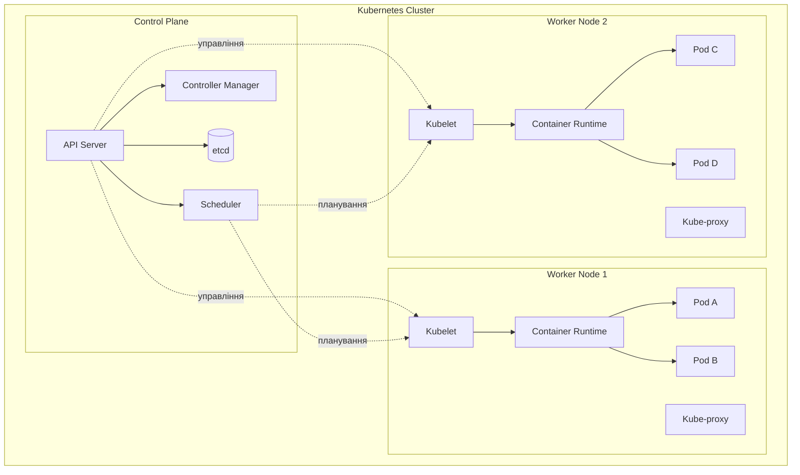

# Лекція 6: Оркестрація контейнерів за допомогою Kubernetes

## Вступ

Kubernetes (часто скорочено як K8s) є провідною платформою оркестрації контейнерів у сучасному світі розробки програмного забезпечення. Створений Google та переданий у 2014 році спільноті Cloud Native Computing Foundation (CNCF), Kubernetes автоматизує розгортання, масштабування та управління контейнеризованими застосунками. У цій лекції ми детально розглянемо архітектуру Kubernetes, його основні компоненти та принципи роботи, що дозволить вам розуміти, як ефективно використовувати цю потужну платформу для управління контейнерними робочими навантаженнями.

## Kubernetes: основні концепції та компоненти

### Що таке Kubernetes та навіщо він потрібен

Kubernetes вирішує фундаментальні виклики, які виникають при роботі з контейнерами у продакшн середовищі. Якщо Docker дозволяє запускати ізольовані контейнери на одному хості, то Kubernetes надає інструменти для управління сотнями та тисячами контейнерів, розподілених по багатьох серверах.

Основні завдання, які вирішує Kubernetes, включають автоматичне розгортання контейнерів на доступних серверах з урахуванням їхніх ресурсних потреб, автоматичне перезапускання контейнерів у разі збоїв та переміщення їх на здорові вузли при відмові серверів, горизонтальне масштабування застосунків залежно від навантаження, балансування навантаження між екземплярами застосунку, безперебійні оновлення застосунків без простою, управління конфігурацією та секретами, а також організацію мережевої взаємодії між контейнерами.

### Декларативна модель управління

Ключова філософія Kubernetes полягає у декларативному підході до управління інфраструктурою. Замість того, щоб виконувати імперативні команди (створи контейнер, запусти сервіс, збільш кількість реплік), ви описуєте бажаний стан системи у конфігураційних файлах YAML або JSON, а Kubernetes самостійно приводить фактичний стан до бажаного.

Наприклад, ви можете описати, що хочете мати три екземпляри вебзастосунку, і Kubernetes забезпечить, що постійно працюють саме три екземпляри. Якщо один із них припинить роботу, Kubernetes автоматично запустить новий екземпляр для підтримання бажаної кількості.

### Кластер Kubernetes

Кластер Kubernetes складається з набору машин (фізичних або віртуальних), які називаються вузлами (nodes). Кластер має два типи вузлів: вузли площини управління (control plane nodes), які керують кластером, та робочі вузли (worker nodes), на яких фактично виконуються застосунки.

Мінімальний кластер може складатися всього з одного вузла, який виконує обидві ролі, але у продакшн середовищі зазвичай використовують кілька вузлів площини управління для забезпечення високої доступності та багато робочих вузлів для розподілу навантаження.



## Площина управління та робочі вузли

### Компоненти площини управління

Площина управління (control plane) є мозком кластера Kubernetes. Вона приймає рішення про те, де запускати застосунки, відстежує стан кластера та реагує на зміни. Площина управління складається з кількох ключових компонентів.

**API Server (kube-apiserver)** є центральним компонентом Kubernetes, через який відбувається вся взаємодія з кластером. API Server обробляє RESTful запити, валідує їх, оновлює відповідні обєкти в etcd та координує роботу інших компонентів. Коли ви виконуєте команду kubectl, вона взаємодіє саме з API Server. API Server також забезпечує автентифікацію та авторизацію користувачів і сервісів.

**etcd** є розподіленим сховищем ключ-значення, яке зберігає всі дані кластера, включаючи конфігурацію, стан всіх обєктів Kubernetes та метадані. Це єдине джерело правди про стан кластера. etcd забезпечує високу доступність через консенсусний протокол Raft та підтримує транзакційну модель роботи з даними. Втрата даних etcd означає втрату всього стану кластера, тому регулярне резервне копіювання etcd є критично важливим.

**Scheduler (kube-scheduler)** відповідає за призначення новостворених подів (pods) на конкретні вузли кластера. Scheduler враховує багато факторів при прийнятті рішення: ресурсні вимоги подів (CPU, память), обмеження та переваги розміщення, поточне навантаження на вузли, політики афінності та антиафінності, taints та tolerations. Scheduler не запускає поди самостійно, а лише приймає рішення про те, на якому вузлі їх варто розмістити.

**Controller Manager (kube-controller-manager)** запускає набір контролерів, кожен з яких відповідає за підтримання бажаного стану певного типу ресурсів. Наприклад, Replication Controller забезпечує, що завжди запущена задана кількість реплік подів. Node Controller відстежує стан вузлів та реагує на їх відмову. Endpoints Controller наповнює обєкти Endpoints, які звязують Services з Pods. Job Controller створює поди для виконання одноразових завдань. Кожен контролер працює в циклі, порівнюючи поточний стан з бажаним та виконуючи необхідні дії для їх узгодження.

**Cloud Controller Manager** інтегрує Kubernetes з API хмарних провайдерів (AWS, Google Cloud, Azure). Він управляє ресурсами, специфічними для хмарного середовища, такими як балансувальники навантаження, постійні томи та мережеві маршрути.

### Компоненти робочих вузлів

Робочі вузли (worker nodes) виконують фактичне запускання контейнерів та забезпечують їх роботу. Кожен робочий вузол містить кілька ключових компонентів.

**Kubelet** є основним агентом, який працює на кожному вузлі. Kubelet отримує специфікації подів (PodSpecs) від API Server та забезпечує, що описані в них контейнери запущені та працюють коректно. Kubelet взаємодіє з container runtime для управління життєвим циклом контейнерів, відстежує здоровя контейнерів через health checks, збирає метрики про використання ресурсів та повідомляє про стан подів назад до API Server.

**Container Runtime** є програмним забезпеченням, відповідальним за фактичне запускання контейнерів. Kubernetes підтримує різні container runtimes через Container Runtime Interface (CRI), включаючи containerd (найпопулярніший варіант після виключення dockershim), CRI-O (легковісна альтернатива, оптимізована для Kubernetes), Docker Engine (через cri-dockerd adapter). Container runtime завантажує образи контейнерів, створює та запускає контейнери, управляє їх життєвим циклом та забезпечує ізоляцію.

**Kube-proxy** управляє мережевими правилами на вузлах, які дозволяють мережеву комунікацію з подами як всередині кластера, так і ззовні. Kube-proxy реалізує концепцію Services, забезпечуючи балансування навантаження між подами одного сервісу. Він може працювати в різних режимах: iptables mode (використовує iptables rules для маршрутизації трафіку), IPVS mode (використовує IP Virtual Server для більш ефективного балансування), userspace mode (застаріший режим, рідко використовується).

## Pods та основні типи робочих навантажень

### Концепція Pod

Pod є найменшою та найпростішою одиницею в Kubernetes, яку можна створювати та управляти нею. Pod представляє один або кілька тісно повязаних контейнерів, які діляться ресурсами та повинні працювати разом на одному вузлі.

Контейнери в одному поді діляться спільним мережевим простором імен (можуть звертатися один до одного через localhost), спільними томами (volumes) для обміну даними, одним IP-адресою та діапазоном портів, спільним IPC namespace для міжпроцесної комунікації.

Типовий випадок використання поду включає один основний контейнер застосунку, але можуть бути додаткові допоміжні контейнери (sidecar containers), які розширюють або доповнюють функціональність основного контейнера. Наприклад, контейнер застосунку та контейнер для збору логів, основний вебсервер та контейнер для синхронізації конфігурації, застосунок та контейнер проксі для шифрування трафіку.

Приклад простого опису поду у YAML:

```yaml
apiVersion: v1
kind: Pod
metadata:
  name: nginx-pod
  labels:
    app: nginx
spec:
  containers:
  - name: nginx
    image: nginx:1.25
    ports:
    - containerPort: 80
    resources:
      requests:
        memory: "64Mi"
        cpu: "250m"
      limits:
        memory: "128Mi"
        cpu: "500m"
```

У цьому прикладі ми описуємо под з одним контейнером nginx. Секція metadata містить імя поду та мітки (labels), які використовуються для організації та відбору обєктів. Секція spec описує бажаний стан поду, включаючи образ контейнера, порти та ресурсні вимоги.

### Життєвий цикл Pod

Под проходить через кілька фаз у своєму життєвому циклі. Фаза Pending означає, що под був прийнятий кластером, але один або більше контейнерів ще не готові до запуску, можливо через завантаження образів. Running вказує, що под прив'язаний до вузла, всі контейнери створені, і принаймні один контейнер працює або перезапускається. Succeeded означає, що всі контейнери в поді успішно завершили роботу та не будуть перезапущені. Failed вказує, що всі контейнери завершилися, причому принаймні один завершився з помилкою. Unknown означає, що стан поду не може бути визначений, зазвичай через проблеми звязку з вузлом.

Kubernetes використовує health checks для відстеження стану контейнерів у подах. Liveness probe перевіряє, чи працює контейнер, та перезапускає його у разі невдачі. Readiness probe визначає, чи готовий контейнер приймати трафік, та виключає його з балансування навантаження, якщо він не готовий. Startup probe використовується для контейнерів, які потребують тривалого часу для ініціалізації, відкладаючи liveness та readiness перевірки.

### Обмеження та переваги використання Pod безпосередньо

Хоча можна створювати поди безпосередньо, це рідко робиться у продакшн середовищі. Поди є ефемерними обєктами, які не самовідновлюються після видалення або відмови вузла. Якщо под створений безпосередньо видаляється або вузол, на якому він працює, відмовляє, Kubernetes не створить новий під автоматично.

Замість створення подів безпосередньо, зазвичай використовують контролери вищого рівня, які управляють подами та забезпечують додаткову функціональність, таку як автоматичне відновлення після збоїв, масштабування кількості реплік та керовані оновлення.

## Основи мережі Kubernetes

### Модель мережі Kubernetes

Kubernetes має специфічну модель мережі, яка відрізняється від традиційних підходів до контейнерної мережі. Ця модель базується на кількох фундаментальних принципах, які забезпечують просту та передбачувану мережеву комунікацію.

Перший принцип полягає в тому, що всі поди можуть комунікувати з усіма іншими подами без NAT (Network Address Translation). Це означає, що кожен под отримує власну IP-адресу, яка є доступною з будь-якого іншого поду в кластері, незалежно від того, на якому вузлі вони працюють. Це значно спрощує мережеву архітектуру та усуває необхідність у складному відображенні портів.

Другий принцип стверджує, що всі вузли можуть комунікувати з усіма подами без NAT, і навпаки. Це означає, що системні компоненти на вузлах (такі як kubelet або системні демони) можуть звязуватися з подами безпосередньо.

Третій принцип полягає в тому, що IP-адреса, яку под бачить для себе, є такою самою IP-адресою, яку бачать інші при комунікації з ним. Немає прихованого NAT або проксіювання.

### Реалізація мережевої моделі через CNI

Kubernetes не реалізує мережеву функціональність самостійно, а покладається на плагіни Container Network Interface (CNI). CNI є специфікацією та набором бібліотек для конфігурації мережевих інтерфейсів у Linux контейнерах. Різні CNI плагіни надають різні можливості та характеристики продуктивності.

Популярні CNI плагіни включають Calico, який забезпечує мережеву політику та безпеку через BGP маршрутизацію або VXLAN overlay, підтримує NetworkPolicies для контролю трафіку між подами та має високу продуктивність. Flannel є простим overlay network рішенням, легким у налаштуванні, добре підходить для простих кластерів. Weave Net створює mesh мережу між вузлами, автоматично виявляє та конфігурує маршрути, підтримує шифрування мережевого трафіку. Cilium використовує eBPF для високопродуктивної мережі та безпеки, надає розширені можливості спостереження за мережею, підтримує layer 7 filtering.

### IP-адресація в Kubernetes

У Kubernetes існує кілька типів IP-адрес з різними призначеннями та життєвими циклами.

**Pod IP** є унікальною IP-адресою, призначеною кожному поду. Ця адреса діє протягом життя поду, але при перезапуску поду або створенні нового йому буде призначена нова IP-адреса. Pod IPs приходять з pod network CIDR діапазону, який налаштовується під час створення кластера. Оскільки pod IPs є ефемерними, безпосередня комунікація через pod IP не рекомендується для сталих звязків між компонентами застосунку.

**Service IP (Cluster IP)** є стабільною віртуальною IP-адресою, яка представляє набір подів. На відміну від pod IP, service IP залишається незмінною протягом життя Service обєкта. Service IP не призначається жодному конкретному мережевому інтерфейсу, а існує лише у правилах iptables або IPVS на вузлах. Коли трафік надсилається на Service IP, kube-proxy забезпечує його балансування між підлеглими подами.

**Node IP** є IP-адресою самого вузла кластера. Це може бути приватна IP у випадку приватної мережі або публічна IP для зовнішньої доступності. Node IPs використовуються для комунікації між вузлами та для доступу до кластера ззовні.

### DNS у Kubernetes

Kubernetes включає внутрішній DNS сервіс, який автоматично створює DNS записи для Services та Pods. Це дозволяє подам звертатися до сервісів за іменами замість IP-адрес, що значно спрощує конфігурацію.

Коли створюється Service, Kubernetes DNS автоматично створює DNS запис у форматі `service-name.namespace.svc.cluster.local`. Наприклад, якщо у namespace default існує сервіс nginx, до нього можна звернутися за іменем nginx або nginx.default.svc.cluster.local з будь-якого поду в кластері.

Для подів також можна створювати DNS записи, хоча це менш поширена практика. DNS записи подів мають формат `pod-ip-address.namespace.pod.cluster.local`, де крапки у IP-адресі замінюються на дефіси.

CoreDNS є стандартним DNS сервером у сучасних версіях Kubernetes. Він працює як Deployment в namespace kube-system та автоматично масштабується залежно від розміру кластера. Поди автоматично налаштовуються на використання CoreDNS через конфігурацію /etc/resolv.conf всередині контейнерів.

### Мережева політика (Network Policy)

За замовчуванням у Kubernetes всі поди можуть вільно комунікувати між собою. Network Policies дозволяють обмежити цю комунікацію, визначаючи правила, які контролюють, які поди можуть звязуватися один з одним та з іншими мережевими endpoints.

Network Policy працює на рівні IP-адрес та портів (Layer 3 та Layer 4 в OSI моделі). Політики визначаються через мітки (labels) на подах та namespace, що дозволяє створювати гнучкі та динамічні правила. Важливо розуміти, що Network Policies є whitelist механізмом: коли політика застосовується до поду, весь трафік, який не дозволений явно, блокується.

Приклад Network Policy, яка дозволяє трафік до подів з міткою app: database тільки від подів з міткою app: backend:

```yaml
apiVersion: networking.k8s.io/v1
kind: NetworkPolicy
metadata:
  name: database-policy
  namespace: production
spec:
  podSelector:
    matchLabels:
      app: database
  policyTypes:
  - Ingress
  ingress:
  - from:
    - podSelector:
        matchLabels:
          app: backend
    ports:
    - protocol: TCP
      port: 5432
```

Ця політика застосовується до подів з міткою app: database у namespace production та дозволяє вхідний TCP трафік на порт 5432 тільки від подів з міткою app: backend у тому самому namespace.

## Висновки

Kubernetes є складною, але надзвичайно потужною платформою для оркестрації контейнерів. Розуміння його архітектури, основних компонентів та принципів роботи є фундаментом для ефективного використання Kubernetes у реальних проєктах.

Площина управління Kubernetes координує всі операції в кластері через взаємодію API Server, Scheduler, Controller Manager та etcd. Робочі вузли виконують фактичну роботу через Kubelet, Container Runtime та Kube-proxy. Поди, як основні одиниці розгортання, обєднують один або кілька контейнерів, які діляться ресурсами та працюють разом.

Мережева модель Kubernetes, базована на принципі, що кожен под має власну IP-адресу та може комунікувати з іншими подами без NAT, створює просте та передбачуване мережеве середовище. CNI плагіни реалізують цю модель, а вбудований DNS сервіс дозволяє подам звязуватися через іменовані сервіси.

У наступній лекції ми детально розглянемо, як управляти застосунками в Kubernetes через Deployments, Services, ConfigMaps та інші обєкти вищого рівня, які забезпечують надійне та масштабоване розгортання застосунків.
