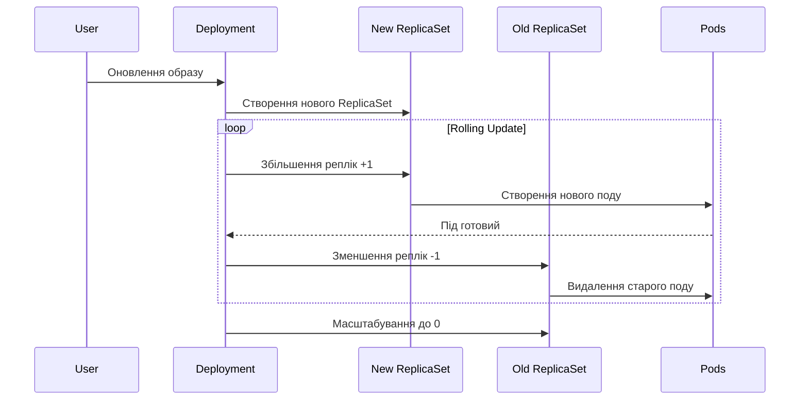
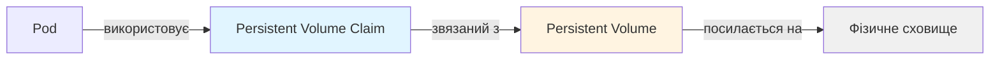

# Лекція 7: Управління застосунками в Kubernetes

## Вступ

У попередній лекції ми розглянули архітектуру Kubernetes та основні концепції, включаючи поди як найменші одиниці розгортання. Однак безпосереднє управління подами є незручним та ненадійним підходом для продакшн застосунків. Kubernetes надає набір обєктів вищого рівня, які автоматизують управління подами, забезпечують їх масштабування, оновлення та доступність. У цій лекції ми детально вивчимо ключові обєкти для управління застосунками: Deployments, ReplicaSets, StatefulSets для управління робочими навантаженнями, Services та Ingress для організації мережевого доступу, ConfigMaps та Secrets для управління конфігурацією, а також Persistent Volumes для роботи з постійними даними.

## Deployments, ReplicaSets, StatefulSets

### ReplicaSet: забезпечення бажаної кількості реплік

ReplicaSet є контролером, який забезпечує, що завжди працює задана кількість ідентичних реплік подів. Якщо кількість працюючих подів менша за бажану, ReplicaSet створює нові поди. Якщо подів більше, ніж потрібно, зайві поди видаляються. Якщо под припиняє роботу через помилку або відмову вузла, ReplicaSet автоматично створює новий под для заміни.

ReplicaSet використовує селектори міток (label selectors) для ідентифікації подів, якими він управляє. Це дозволяє ReplicaSet підтримувати бажану кількість подів навіть якщо вони були створені іншими способами.

Приклад базового ReplicaSet:

```yaml
apiVersion: apps/v1
kind: ReplicaSet
metadata:
  name: frontend
  labels:
    app: frontend
spec:
  replicas: 3
  selector:
    matchLabels:
      app: frontend
  template:
    metadata:
      labels:
        app: frontend
    spec:
      containers:
      - name: nginx
        image: nginx:1.25
        ports:
        - containerPort: 80
```

У цьому прикладі ReplicaSet забезпечує, що завжди працюють три поди з міткою app: frontend. Секція template описує шаблон поду, який буде використовуватись для створення нових екземплярів. Важливо, щоб мітки в template.metadata.labels співпадали з selector.matchLabels, інакше ReplicaSet не зможе відстежувати створені ним поди.

Хоча ReplicaSet є корисним обєктом, його рідко створюють безпосередньо. Замість цього використовують Deployment, який управляє ReplicaSets та надає додаткову функціональність для оновлень.

### Deployment: декларативні оновлення застосунків

Deployment є обєктом вищого рівня, який управляє ReplicaSets та надає декларативні оновлення для подів. Deployment автоматично створює та управляє ReplicaSet, але додає критично важливу функціональність для оновлення застосунків без простою.

Основні можливості Deployment включають контрольовані rolling updates (поступові оновлення, при яких нові версії подів поступово замінюють старі), автоматичні rollbacks (можливість швидко повернутися до попередньої версії при виявленні проблем), масштабування застосунку шляхом зміни кількості реплік, паузу та відновлення процесу оновлення, а також відстеження історії версій.

Приклад Deployment:

```yaml
apiVersion: apps/v1
kind: Deployment
metadata:
  name: nginx-deployment
  labels:
    app: nginx
spec:
  replicas: 3
  selector:
    matchLabels:
      app: nginx
  template:
    metadata:
      labels:
        app: nginx
    spec:
      containers:
      - name: nginx
        image: nginx:1.25
        ports:
        - containerPort: 80
  strategy:
    type: RollingUpdate
    rollingUpdate:
      maxSurge: 1
      maxUnavailable: 1
```

Секція strategy визначає, як відбувається оновлення подів. RollingUpdate є стандартною стратегією, яка поступово замінює старі поди новими. Параметр maxSurge визначає максимальну кількість додаткових подів, які можуть бути створені під час оновлення (у цьому випадку один додатковий под, тобто може бути 4 поди замість 3). Параметр maxUnavailable визначає максимальну кількість подів, які можуть бути недоступними під час оновлення.

Коли ви оновлюєте Deployment (наприклад, змінюєте версію образу), Kubernetes створює новий ReplicaSet для нових подів та поступово масштабує його вгору, одночасно масштабуючи вниз старий ReplicaSet. Це забезпечує безперебійну роботу застосунку під час оновлення.

Процес оновлення виглядає наступним чином:



Для відкату до попередньої версії можна використати команду `kubectl rollout undo deployment/nginx-deployment`. Kubernetes автоматично збереже попередні ReplicaSets з масштабом 0, що дозволяє швидко повернутися до них.

### StatefulSet: управління stateful застосунками

Більшість застосунків, які ми розглядали до цього, є stateless, тобто не зберігають стан між перезапусками. Однак багато застосунків, особливо бази даних та системи черг, потребують збереження стану та стабільної ідентичності.

StatefulSet є спеціалізованим контролером для управління stateful застосунками. Він надає гарантії, які не може забезпечити звичайний Deployment: стабільна мережева ідентичність (кожен под отримує передбачувану назву та DNS запис), впорядковане розгортання та масштабування (поди створюються, оновлюються та видаляються у визначеному порядку), постійне зберігання даних через Persistent Volumes, які прив'язані до конкретних подів.

Поди у StatefulSet мають назви у форматі `statefulset-name-ordinal`, де ordinal є індексом від 0. Наприклад, якщо StatefulSet називається postgres і має три репліки, поди будуть називатися postgres-0, postgres-1, postgres-2. Ця передбачувана назва зберігається навіть при перезапусках подів.

Кожен под у StatefulSet також отримує стабільний DNS запис у форматі `pod-name.service-name.namespace.svc.cluster.local`. Це дозволяє іншим подам звязуватися з конкретними екземплярами stateful застосунку.

Приклад StatefulSet для бази даних PostgreSQL:

```yaml
apiVersion: apps/v1
kind: StatefulSet
metadata:
  name: postgres
spec:
  serviceName: postgres-service
  replicas: 3
  selector:
    matchLabels:
      app: postgres
  template:
    metadata:
      labels:
        app: postgres
    spec:
      containers:
      - name: postgres
        image: postgres:15
        ports:
        - containerPort: 5432
        env:
        - name: POSTGRES_PASSWORD
          valueFrom:
            secretKeyRef:
              name: postgres-secret
              key: password
        volumeMounts:
        - name: postgres-storage
          mountPath: /var/lib/postgresql/data
  volumeClaimTemplates:
  - metadata:
      name: postgres-storage
    spec:
      accessModes: ["ReadWriteOnce"]
      storageClassName: standard
      resources:
        requests:
          storage: 10Gi
```

Секція volumeClaimTemplates автоматично створює окремий Persistent Volume Claim для кожного поду. Коли под postgres-0 створюється, створюється також PVC з назвою postgres-storage-postgres-0. Якщо под перезапускається або переміщується на інший вузол, він автоматично підключається до того самого PVC, зберігаючи свої дані.

StatefulSet гарантує впорядковане створення подів: postgres-0 буде створений та повинен стати готовим перед тим, як буде створений postgres-1, і так далі. При видаленні StatefulSet поди видаляються у зворотному порядку: спочатку postgres-2, потім postgres-1, і нарешті postgres-0.

## Services та Ingress

### Концепція Service

Поди в Kubernetes є ефемерними: вони можуть бути створені та знищені у будь-який момент. Кожен новий под отримує нову IP-адресу, що робить пряму комунікацію через pod IPs ненадійною. Service вирішує цю проблему, надаючи стабільну точку доступу до набору подів.

Service є абстракцією, яка визначає логічний набір подів та політику доступу до них. Service використовує селектори міток для визначення, які поди входять до його складу. Kubernetes автоматично відстежує поди, які відповідають селектору, та оновлює список endpoints сервісу.

Існує кілька типів Services, кожен з яких підходить для різних сценаріїв використання.

**ClusterIP** є типом Service за замовчуванням. Він створює внутрішню IP-адресу, доступну тільки всередині кластера. Цей тип підходить для внутрішньої комунікації між компонентами застосунку.

```yaml
apiVersion: v1
kind: Service
metadata:
  name: backend-service
spec:
  type: ClusterIP
  selector:
    app: backend
  ports:
  - protocol: TCP
    port: 80
    targetPort: 8080
```

У цьому прикладі Service слухає на порту 80 та перенаправляє трафік на порт 8080 подів з міткою app: backend. Kubernetes призначає Service стабільну Cluster IP (наприклад, 10.96.0.10), яка не змінюється протягом життя Service.

**NodePort** розширює ClusterIP, додатково відкриваючи Service на статичному порту на кожному вузлі кластера. Це дозволяє отримати доступ до Service ззовні кластера через `node-ip:node-port`.

```yaml
apiVersion: v1
kind: Service
metadata:
  name: frontend-service
spec:
  type: NodePort
  selector:
    app: frontend
  ports:
  - protocol: TCP
    port: 80
    targetPort: 8080
    nodePort: 30080
```

Тепер до застосунку можна звернутися через будь-яку IP-адресу вузла кластера на порту 30080. NodePort Services зазвичай використовуються у тестових середовищах або коли немає доступу до хмарного балансувальника навантаження.

**LoadBalancer** створює зовнішній балансувальник навантаження у хмарному середовищі (AWS, GCP, Azure) та автоматично налаштовує його для перенаправлення трафіку на Service. Це найпростіший спосіб зробити застосунок доступним ззовні у хмарних середовищах.

```yaml
apiVersion: v1
kind: Service
metadata:
  name: web-service
spec:
  type: LoadBalancer
  selector:
    app: web
  ports:
  - protocol: TCP
    port: 80
    targetPort: 8080
```

Хмарний провайдер автоматично створить балансувальник навантаження та призначить йому публічну IP-адресу, яка буде доступна у полі `status.loadBalancer.ingress` Service обєкта.

**ExternalName** є спеціальним типом Service, який не використовує селектори та не створює endpoints. Замість цього він повертає CNAME запис на зовнішнє DNS імя.

### Ingress: керування HTTP та HTTPS трафіком

Service типу LoadBalancer створює окремий балансувальник навантаження для кожного Service, що може бути дорого та неефективно. Ingress надає більш гнучкий та економічний спосіб керування зовнішнім доступом до Services, особливо для HTTP та HTTPS трафіку.

Ingress діє як reverse proxy та балансувальник навантаження перед вашими Services. Один Ingress може маршрутизувати трафік до різних Services на основі URL шляху або доменного імені, забезпечувати SSL/TLS термінацію, надавати name-based virtual hosting та інші можливості HTTP рівня.

Для роботи Ingress потрібен Ingress Controller, який фактично реалізує правила Ingress. Популярні Ingress Controllers включають NGINX Ingress Controller, Traefik, HAProxy Ingress та cloud-specific controllers (AWS ALB Ingress Controller, GKE Ingress).

Приклад Ingress, який маршрутизує трафік до різних Services на основі URL шляху:

```yaml
apiVersion: networking.k8s.io/v1
kind: Ingress
metadata:
  name: app-ingress
  annotations:
    nginx.ingress.kubernetes.io/rewrite-target: /
spec:
  rules:
  - host: example.com
    http:
      paths:
      - path: /api
        pathType: Prefix
        backend:
          service:
            name: backend-service
            port:
              number: 80
      - path: /
        pathType: Prefix
        backend:
          service:
            name: frontend-service
            port:
              number: 80
```

У цьому прикладі запити до example.com/api будуть направлені до backend-service, а всі інші запити до example.com/ будуть направлені до frontend-service.

Для налаштування HTTPS потрібно додати секцію tls:

```yaml
spec:
  tls:
  - hosts:
    - example.com
    secretName: example-tls
  rules:
  - host: example.com
    # ... решта конфігурації
```

Secret example-tls повинен містити TLS сертифікат та приватний ключ. Ingress Controller автоматично налаштує HTTPS та виконає SSL термінацію.

## ConfigMaps та Secrets

### ConfigMap: управління конфігурацією застосунку

ConfigMap дозволяє відокремити конфігурацію від коду застосунку, роблячи застосунки більш портативними та легшими в управлінні. ConfigMap зберігає дані у форматі ключ-значення та може містити як прості значення, так і цілі конфігураційні файли.

ConfigMap можна використовувати для передачі конфігурації в контейнери через змінні середовища, аргументи командного рядка або монтуючи їх як файли всередині контейнера.

Приклад створення ConfigMap:

```yaml
apiVersion: v1
kind: ConfigMap
metadata:
  name: app-config
data:
  database_url: "postgres://db.example.com:5432/mydb"
  log_level: "info"
  max_connections: "100"
  app.properties: |
    server.port=8080
    server.host=0.0.0.0
    feature.new-ui=true
```

ConfigMap може містити як прості пари ключ-значення (database_url, log_level), так і багаторядкові значення (app.properties), які можуть представляти цілі конфігураційні файли.

Використання ConfigMap через змінні середовища:

```yaml
apiVersion: v1
kind: Pod
metadata:
  name: app-pod
spec:
  containers:
  - name: app
    image: myapp:1.0
    env:
    - name: DATABASE_URL
      valueFrom:
        configMapKeyRef:
          name: app-config
          key: database_url
    - name: LOG_LEVEL
      valueFrom:
        configMapKeyRef:
          name: app-config
          key: log_level
```

Альтернативно, можна змонтувати весь ConfigMap як том:

```yaml
apiVersion: v1
kind: Pod
metadata:
  name: app-pod
spec:
  containers:
  - name: app
    image: myapp:1.0
    volumeMounts:
    - name: config-volume
      mountPath: /etc/config
  volumes:
  - name: config-volume
    configMap:
      name: app-config
```

У цьому випадку всередині контейнера за шляхом /etc/config будуть створені файли database_url, log_level, max_connections та app.properties з відповідним вмістом.

### Secret: безпечне зберігання чутливих даних

Secret схожий на ConfigMap, але призначений для зберігання чутливої інформації, такої як паролі, OAuth токени, SSH ключі. Kubernetes кодує дані Secrets у base64 та забезпечує додаткові механізми безпеки.

Важливо розуміти, що Secrets у Kubernetes за замовчуванням не є зашифрованими у etcd. Base64 кодування не є шифруванням і легко декодується. Для справжньої безпеки рекомендується використовувати шифрування Secrets at rest у etcd або зовнішні системи управління секретами (HashiCorp Vault, AWS Secrets Manager).

Приклад створення Secret:

```yaml
apiVersion: v1
kind: Secret
metadata:
  name: db-secret
type: Opaque
data:
  username: YWRtaW4=
  password: cGFzc3dvcmQxMjM=
```

Значення повинні бути закодовані у base64. Для кодування можна використати команду `echo -n 'admin' | base64`.

Альтернативно, можна використати stringData для уникнення необхідності кодування:

```yaml
apiVersion: v1
kind: Secret
metadata:
  name: db-secret
type: Opaque
stringData:
  username: admin
  password: password123
```

Kubernetes автоматично закодує значення при створенні Secret.

Використання Secret у поді:

```yaml
apiVersion: v1
kind: Pod
metadata:
  name: app-pod
spec:
  containers:
  - name: app
    image: myapp:1.0
    env:
    - name: DB_USERNAME
      valueFrom:
        secretKeyRef:
          name: db-secret
          key: username
    - name: DB_PASSWORD
      valueFrom:
        secretKeyRef:
          name: db-secret
          key: password
```

Secrets можна також монтувати як файли, що є кращою практикою для деяких типів чутливих даних, таких як TLS сертифікати або SSH ключі.

Kubernetes надає кілька вбудованих типів Secrets для специфічних випадків використання: Opaque (загальний тип для довільних даних), kubernetes.io/service-account-token (токени service accounts), kubernetes.io/dockerconfigjson (credentials для приватних Docker registry), kubernetes.io/tls (TLS сертифікати та ключі), kubernetes.io/basic-auth (credentials для базової автентифікації).

## Постійні томи (Persistent Volumes)

### Проблема зберігання даних у контейнерах

За замовчуванням файлова система контейнера є ефемерною: коли контейнер зупиняється або перезапускається, всі зміни у файловій системі втрачаються. Для stateful застосунків, таких як бази даних, це неприйнятно.

Kubernetes надає абстракцію Volumes для підключення зовнішнього сховища до подів. Однак безпосереднє використання volumes має недоліки: розробники повинні знати деталі інфраструктури сховища, конфігурація сховища тісно повязана з конфігурацією застосунку, важко централізовано управляти сховищем.

Persistent Volumes (PV) та Persistent Volume Claims (PVC) вирішують ці проблеми, відокремлюючи конфігурацію сховища від його використання.

### Persistent Volume (PV) та Persistent Volume Claim (PVC)

Persistent Volume (PV) є ресурсом кластера, який представляє фізичне сховище. PV створюється адміністратором кластера або автоматично через Storage Classes. PV існує незалежно від подів і має власний життєвий цикл.

Persistent Volume Claim (PVC) є запитом на сховище від користувача або застосунку. PVC описує, скільки сховища потрібно та які характеристики воно повинно мати (режим доступу, розмір). Kubernetes автоматично звязує PVC з підходящим PV або динамічно створює новий PV через Storage Class.



Приклад створення PV адміністратором:

```yaml
apiVersion: v1
kind: PersistentVolume
metadata:
  name: pv-data
spec:
  capacity:
    storage: 10Gi
  accessModes:
  - ReadWriteOnce
  persistentVolumeReclaimPolicy: Retain
  storageClassName: standard
  hostPath:
    path: /mnt/data
```

Цей PV має ємність 10 GiB, підтримує режим доступу ReadWriteOnce (може бути змонтований для читання та запису тільки одним вузлом одночасно) та використовує hostPath (локальну директорію на вузлі) як бекенд сховища.

Приклад PVC, який запитує сховище:

```yaml
apiVersion: v1
kind: PersistentVolumeClaim
metadata:
  name: data-claim
spec:
  accessModes:
  - ReadWriteOnce
  resources:
    requests:
      storage: 5Gi
  storageClassName: standard
```

Kubernetes автоматично знайде PV, який задовольняє вимоги PVC (має достатньо місця, підтримує потрібний режим доступу, має відповідний storageClassName), та звяже їх разом.

Використання PVC у поді:

```yaml
apiVersion: v1
kind: Pod
metadata:
  name: app-pod
spec:
  containers:
  - name: app
    image: myapp:1.0
    volumeMounts:
    - name: data-volume
      mountPath: /data
  volumes:
  - name: data-volume
    persistentVolumeClaim:
      claimName: data-claim
```

### Режими доступу

Persistent Volumes підтримують три режими доступу, які визначають, як том може бути змонтований на вузлах.

**ReadWriteOnce (RWO)** дозволяє монтування тому для читання та запису тільки одним вузлом одночасно. Це найпоширеніший режим, підтримуваний більшістю типів сховищ. Якщо под, який використовує RWO том, переміщується на інший вузол, том автоматично демонтується з попереднього вузла та монтується на новому.

**ReadOnlyMany (ROX)** дозволяє монтування тому тільки для читання багатьма вузлами одночасно. Це корисно для розподілу статичного контенту або конфігурацій між багатьма подами.

**ReadWriteMany (RWX)** дозволяє монтування тому для читання та запису багатьма вузлами одночасно. Цей режим підтримується тільки деякими типами сховищ (NFS, CephFS, GlusterFS) і зазвичай має нижчу продуктивність.

### Storage Classes та динамічне провізіонування

Storage Class дозволяє адміністраторам описувати різні класи доступного сховища з різними характеристиками продуктивності, політиками резервного копіювання або вартістю. Розробники можуть запитувати сховище певного класу через storageClassName у PVC, не знаючи деталей реалізації.

Storage Class автоматизує створення PV через динамічне провізіонування. Коли користувач створює PVC з вказаним storageClassName, Kubernetes автоматично створює PV та підєднує його до PVC.

Приклад Storage Class для AWS EBS:

```yaml
apiVersion: storage.k8s.io/v1
kind: StorageClass
metadata:
  name: fast-ssd
provisioner: kubernetes.io/aws-ebs
parameters:
  type: gp3
  iops: "3000"
  encrypted: "true"
allowVolumeExpansion: true
volumeBindingMode: WaitForFirstConsumer
```

Цей Storage Class створює AWS EBS томи типу gp3 з 3000 IOPS та шифруванням. Параметр allowVolumeExpansion дозволяє розширювати розмір тому після створення. volumeBindingMode: WaitForFirstConsumer відкладає створення тому до моменту, коли буде створений перший под, який його використовує, що дозволяє розмістити том у тій самій зоні доступності, що і под.

### Політики повернення (Reclaim Policies)

Коли PVC видаляється, PV може бути оброблений згідно з однією з політик повернення.

**Retain** зберігає PV та його дані після видалення PVC. PV переходить у статус Released, але не може бути автоматично повторно використаний. Адміністратор повинен вручну очистити дані та видалити PV або зробити його доступним знову.

**Delete** автоматично видаляє PV та звязане фізичне сховище (наприклад, AWS EBS том) після видалення PVC. Це типова політика для динамічно створених PV.

**Recycle** (застаріла та не рекомендується) виконує базове очищення даних (rm -rf /volume/*) та робить PV доступним для нових claims.

## Висновки

У цій лекції ми розглянули ключові обєкти Kubernetes для управління застосунками у продакшн середовищі. Deployments надають декларативний спосіб управління реплікованими застосунками з підтримкою безперебійних оновлень та відкатів. StatefulSets забезпечують стабільну ідентичність та впорядковане управління для stateful застосунків, таких як бази даних.

Services створюють стабільні точки доступу до динамічних наборів подів, забезпечуючи балансування навантаження та service discovery. Ingress надає гнучке управління HTTP та HTTPS трафіком з підтримкою маршрутизації на основі URL та SSL термінації.

ConfigMaps та Secrets відокремлюють конфігурацію від коду застосунку, роблячи застосунки більш портативними. Persistent Volumes та Persistent Volume Claims забезпечують абстракцію для постійного зберігання даних з підтримкою динамічного провізіонування через Storage Classes.

Розуміння цих обєктів та їх взаємодії є фундаментом для ефективного розгортання та управління застосунками у Kubernetes. У наступних лекціях ми розглянемо, як автоматизувати процеси безперервної інтеграції та доставки застосунків у Kubernetes кластери.
