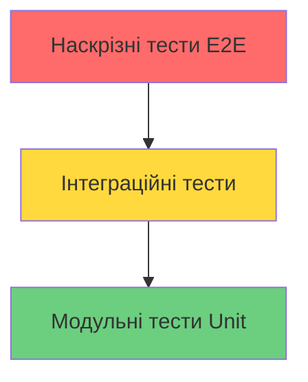

# Лекція 09 Стратегії автоматизованого тестування та контролю якості

## Вступ

Автоматизоване тестування є невід'ємною складовою сучасного процесу розробки програмного забезпечення. У контексті безперервної інтеграції якість тестів напряму визначає ефективність виявлення дефектів та впевненість команди у стабільності системи. Розуміння різних типів тестів, стратегій їх організації та інструментів автоматизації є критично важливим для створення надійних систем.

## Піраміда тестування

Концепція піраміди тестування була запропонована Майком Коном у його книзі про Scrum та з того часу стала фундаментальною моделлю для організації тестів. Піраміда візуалізує ідеальне співвідношення різних типів тестів у проєкті, де основа піраміди складається з великої кількості швидких модульних тестів, середній рівень містить менше інтеграційних тестів, а вершина представлена невеликою кількістю наскрізних тестів.

Логіка піраміди базується на балансі між швидкістю виконання, вартістю створення та підтримки, стабільністю тестів. Модульні тести виконуються дуже швидко, зазвичай тисячі тестів за секунди, легко пишуться та підтримуються, рідко ламаються через зміни в інших частинах системи. Інтеграційні тести виконуються повільніше, потребують налаштування середовища, можуть бути нестабільними через зовнішні залежності. Наскрізні тести є найповільнішими, найдорожчими у створенні та підтримці, найбільш схильними до нестабільності.



Сучасні підходи до тестування іноді модифікують класичну піраміду відповідно до специфіки проєкту. Для мікросервісних архітектур може використовуватись модель трофею тестування, де збільшується акцент на інтеграційних тестах. Для проєктів з великою кількістю UI логіки може бути виправданим більший акцент на компонентних тестах.

## Модульне тестування

Модульні тести перевіряють окремі модулі або компоненти системи в ізоляції від інших частин. Модуль може бути функцією, методом класу, невеликим класом. Ключовою характеристикою модульного тесту є його незалежність від зовнішніх систем, баз даних, мережі, файлової системи.

Основні принципи написання якісних модульних тестів формалізовані у акронімі FIRST. Тести повинні бути Fast - виконуватись дуже швидко, щоб розробники могли запускати їх постійно. Independent - кожен тест має бути незалежним від інших та виконуватись у будь-якому порядку. Repeatable - тест повинен давати однаковий результат при кожному запуску. Self-validating - тест повинен чітко показувати, пройшов він чи провалився, без необхідності ручної перевірки. Timely - тести краще писати перед або одночасно з кодом, а не після.

Структура модульного тесту зазвичай слідує патерну Arrange-Act-Assert, також відомому як Given-When-Then. На етапі Arrange налаштовується необхідний контекст та вхідні дані. На етапі Act виконується дія, що тестується. На етапі Assert перевіряється, що результат відповідає очікуваному.

Розглянемо приклад модульних тестів для класу, що обчислює знижки, використовуючи pytest для Python:

```python
import pytest
from decimal import Decimal
from discount_calculator import DiscountCalculator, CustomerType

class TestDiscountCalculator:
    @pytest.fixture
    def calculator(self):
        return DiscountCalculator()

    def test_no_discount_for_regular_customer(self, calculator):
        # Arrange
        amount = Decimal('100.00')
        customer_type = CustomerType.REGULAR

        # Act
        result = calculator.calculate_discount(amount, customer_type)

        # Assert
        assert result == Decimal('0.00')

    def test_ten_percent_discount_for_premium_customer(self, calculator):
        # Arrange
        amount = Decimal('100.00')
        customer_type = CustomerType.PREMIUM

        # Act
        result = calculator.calculate_discount(amount, customer_type)

        # Assert
        assert result == Decimal('10.00')

    def test_twenty_percent_discount_for_vip_customer(self, calculator):
        # Arrange
        amount = Decimal('100.00')
        customer_type = CustomerType.VIP

        # Act
        result = calculator.calculate_discount(amount, customer_type)

        # Assert
        assert result == Decimal('20.00')

    @pytest.mark.parametrize("amount,customer_type,expected", [
        (Decimal('50.00'), CustomerType.REGULAR, Decimal('0.00')),
        (Decimal('50.00'), CustomerType.PREMIUM, Decimal('5.00')),
        (Decimal('50.00'), CustomerType.VIP, Decimal('10.00')),
        (Decimal('200.00'), CustomerType.PREMIUM, Decimal('20.00')),
    ])
    def test_discount_calculation_various_scenarios(
        self, calculator, amount, customer_type, expected
    ):
        result = calculator.calculate_discount(amount, customer_type)
        assert result == expected

    def test_raises_error_for_negative_amount(self, calculator):
        with pytest.raises(ValueError, match="Amount cannot be negative"):
            calculator.calculate_discount(Decimal('-10.00'), CustomerType.REGULAR)
```

Цей приклад демонструє кілька важливих практик. Використання фікстур pytest дозволяє уникнути дублювання коду для створення об'єкта калькулятора. Параметризовані тести через pytest.mark.parametrize дозволяють перевірити багато сценаріїв без дублювання логіки тесту. Тестування винятків забезпечує перевірку поведінки у нестандартних ситуаціях.

Для тестування коду з зовнішніми залежностями використовується техніка мокування. Мок замінює реальний об'єкт тестовим двійником, що дозволяє контролювати його поведінку та перевіряти взаємодію з ним.

```python
from unittest.mock import Mock, patch
import requests
from weather_service import WeatherService

class TestWeatherService:
    def test_get_temperature_returns_celsius(self):
        # Arrange
        mock_response = Mock()
        mock_response.json.return_value = {
            'main': {'temp': 20.5}
        }
        mock_response.status_code = 200

        with patch('requests.get', return_value=mock_response) as mock_get:
            service = WeatherService(api_key='test-key')

            # Act
            temperature = service.get_temperature('London')

            # Assert
            assert temperature == 20.5
            mock_get.assert_called_once_with(
                'https://api.weather.com/data',
                params={'q': 'London', 'appid': 'test-key'}
            )
```

Мокування дозволяє тестувати код, що взаємодіє з мережею, не виконуючи реальних HTTP запитів. Це робить тести швидкими, стабільними та незалежними від доступності зовнішніх сервісів.

## Інтеграційне тестування

Інтеграційні тести перевіряють взаємодію між різними компонентами системи. На відміну від модульних тестів, інтеграційні тести працюють з реальними або наближеними до реальних залежностями, такими як бази даних, файлові системи, зовнішні сервіси.

Існує кілька підходів до інтеграційного тестування. Big Bang інтеграція передбачає об'єднання всіх компонентів одночасно та їх тестування як єдиної системи. Цей підхід простий у реалізації, але ускладнює локалізацію проблем. Incremental інтеграція передбачає поступове додавання та тестування компонентів. Top-down підхід починає з компонентів верхнього рівня та рухається вниз, використовуючи заглушки для ще не реалізованих компонентів. Bottom-up підхід починає з компонентів нижнього рівня та рухається вгору.

Для інтеграційних тестів часто використовуються тестові контейнери, що дозволяють створювати ізольовані середовища з реальними базами даних та іншими сервісами. Бібліотека Testcontainers забезпечує зручний API для роботи з Docker контейнерами у тестах.

Приклад інтеграційного тесту для репозиторію, що працює з PostgreSQL, використовуючи Testcontainers:

```python
import pytest
from testcontainers.postgres import PostgresContainer
from sqlalchemy import create_engine
from sqlalchemy.orm import sessionmaker
from user_repository import UserRepository, Base, User

@pytest.fixture(scope='module')
def postgres_container():
    with PostgresContainer("postgres:16") as postgres:
        yield postgres

@pytest.fixture(scope='module')
def database_engine(postgres_container):
    engine = create_engine(postgres_container.get_connection_url())
    Base.metadata.create_all(engine)
    return engine

@pytest.fixture
def db_session(database_engine):
    Session = sessionmaker(bind=database_engine)
    session = Session()
    yield session
    session.rollback()
    session.close()

@pytest.fixture
def user_repository(db_session):
    return UserRepository(db_session)

class TestUserRepository:
    def test_create_user_saves_to_database(self, user_repository, db_session):
        # Arrange
        user_data = {
            'username': 'john_doe',
            'email': 'john@example.com',
            'full_name': 'John Doe'
        }

        # Act
        user = user_repository.create_user(**user_data)
        db_session.commit()

        # Assert
        saved_user = db_session.query(User).filter_by(id=user.id).first()
        assert saved_user is not None
        assert saved_user.username == 'john_doe'
        assert saved_user.email == 'john@example.com'

    def test_find_user_by_email_returns_correct_user(
        self, user_repository, db_session
    ):
        # Arrange
        user = User(username='jane_doe', email='jane@example.com')
        db_session.add(user)
        db_session.commit()

        # Act
        found_user = user_repository.find_by_email('jane@example.com')

        # Assert
        assert found_user is not None
        assert found_user.username == 'jane_doe'

    def test_update_user_modifies_database_record(
        self, user_repository, db_session
    ):
        # Arrange
        user = User(username='bob', email='bob@example.com')
        db_session.add(user)
        db_session.commit()

        # Act
        user_repository.update_user(user.id, email='bob_new@example.com')
        db_session.commit()

        # Assert
        updated_user = db_session.query(User).filter_by(id=user.id).first()
        assert updated_user.email == 'bob_new@example.com'
```

Ці тести використовують реальну PostgreSQL базу даних, що запускається у Docker контейнері. Це забезпечує високу впевненість у правильності роботи з базою даних, включаючи SQL запити, транзакції, constraints. Використання фікстури на рівні модуля для контейнера оптимізує продуктивність, запускаючи базу даних один раз для всіх тестів у модулі.

Важливим аспектом інтеграційних тестів є забезпечення ізоляції між тестами. Кожен тест повинен починатись з чистого стану та не впливати на інші тести. Це досягається через використання транзакцій, що відкочуються після кожного тесту, або через очищення бази даних перед кожним тестом.

## Наскрізне тестування

Наскрізні тести, також відомі як E2E тести, перевіряють систему з точки зору кінцевого користувача. Вони симулюють реальні сценарії використання, проходячи через всі шари застосунку від UI до бази даних.

Для вебдодатків найпопулярнішими інструментами E2E тестування є Selenium, Cypress, Playwright. Playwright є сучасним інструментом від Microsoft, що забезпечує надійне та швидке тестування завдяки підтримці всіх основних браузерів, автоматичному очікуванню елементів, потужним можливостям дебагінгу.

Приклад E2E тесту для процесу реєстрації користувача з використанням Playwright:

```python
import pytest
from playwright.sync_api import Page, expect

@pytest.fixture(scope='function')
def page(browser):
    page = browser.new_page()
    yield page
    page.close()

class TestUserRegistration:
    def test_successful_registration_flow(self, page: Page):
        # Navigate to registration page
        page.goto('https://app.example.com/register')

        # Fill registration form
        page.fill('[data-testid="username-input"]', 'newuser123')
        page.fill('[data-testid="email-input"]', 'newuser@example.com')
        page.fill('[data-testid="password-input"]', 'SecurePassword123!')
        page.fill('[data-testid="confirm-password-input"]', 'SecurePassword123!')

        # Submit form
        page.click('[data-testid="submit-button"]')

        # Verify success message
        success_message = page.locator('[data-testid="success-message"]')
        expect(success_message).to_be_visible()
        expect(success_message).to_contain_text('Registration successful')

        # Verify redirection to dashboard
        expect(page).to_have_url('https://app.example.com/dashboard')

        # Verify user name is displayed
        user_greeting = page.locator('[data-testid="user-greeting"]')
        expect(user_greeting).to_contain_text('Welcome, newuser123')

    def test_registration_with_existing_email_shows_error(self, page: Page):
        # Navigate to registration page
        page.goto('https://app.example.com/register')

        # Fill form with existing email
        page.fill('[data-testid="username-input"]', 'anotheruser')
        page.fill('[data-testid="email-input"]', 'existing@example.com')
        page.fill('[data-testid="password-input"]', 'Password123!')
        page.fill('[data-testid="confirm-password-input"]', 'Password123!')

        # Submit form
        page.click('[data-testid="submit-button"]')

        # Verify error message
        error_message = page.locator('[data-testid="error-message"]')
        expect(error_message).to_be_visible()
        expect(error_message).to_contain_text('Email already registered')

        # Verify still on registration page
        expect(page).to_have_url('https://app.example.com/register')

    def test_password_mismatch_validation(self, page: Page):
        # Navigate to registration page
        page.goto('https://app.example.com/register')

        # Fill form with mismatched passwords
        page.fill('[data-testid="username-input"]', 'testuser')
        page.fill('[data-testid="email-input"]', 'test@example.com')
        page.fill('[data-testid="password-input"]', 'Password123!')
        page.fill('[data-testid="confirm-password-input"]', 'DifferentPassword!')

        # Try to submit
        page.click('[data-testid="submit-button"]')

        # Verify validation error
        validation_error = page.locator('[data-testid="password-mismatch-error"]')
        expect(validation_error).to_be_visible()
```

E2E тести є найбільш крихкими та повільними, тому важливо дотримуватись певних практик для їх стабільності. Використання data-testid атрибутів для селекторів робить тести менш залежними від змін у структурі DOM. Playwright автоматично чекає на появу елементів та їх інтерактивність, що зменшує необхідність у явних очікуваннях. Ізоляція тестів через створення нових облікових записів або використання різних тестових даних для кожного тесту запобігає конфліктам.

## Тестування API

Для бекенд застосунків та мікросервісів критично важливим є тестування API. API тести перевіряють endpoints на коректність відповідей, обробку помилок, валідацію вхідних даних, аутентифікацію та авторизацію.

Приклад тестування REST API з використанням pytest та бібліотеки requests:

```python
import pytest
import requests
from typing import Dict, Any

BASE_URL = 'https://api.example.com/v1'

@pytest.fixture
def auth_headers() -> Dict[str, str]:
    response = requests.post(
        f'{BASE_URL}/auth/login',
        json={'username': 'testuser', 'password': 'testpass'}
    )
    token = response.json()['access_token']
    return {'Authorization': f'Bearer {token}'}

class TestUsersAPI:
    def test_get_users_returns_list(self, auth_headers):
        response = requests.get(f'{BASE_URL}/users', headers=auth_headers)

        assert response.status_code == 200
        assert isinstance(response.json(), list)
        assert len(response.json()) > 0

    def test_create_user_with_valid_data(self, auth_headers):
        user_data = {
            'username': 'newuser',
            'email': 'newuser@example.com',
            'full_name': 'New User'
        }

        response = requests.post(
            f'{BASE_URL}/users',
            json=user_data,
            headers=auth_headers
        )

        assert response.status_code == 201
        created_user = response.json()
        assert created_user['username'] == 'newuser'
        assert created_user['email'] == 'newuser@example.com'
        assert 'id' in created_user

    def test_create_user_with_invalid_email_returns_error(self, auth_headers):
        user_data = {
            'username': 'testuser',
            'email': 'invalid-email',
            'full_name': 'Test User'
        }

        response = requests.post(
            f'{BASE_URL}/users',
            json=user_data,
            headers=auth_headers
        )

        assert response.status_code == 422
        error_response = response.json()
        assert 'email' in error_response['errors']

    def test_get_user_by_id_returns_correct_user(self, auth_headers):
        user_id = '123e4567-e89b-12d3-a456-426614174000'

        response = requests.get(
            f'{BASE_URL}/users/{user_id}',
            headers=auth_headers
        )

        assert response.status_code == 200
        user = response.json()
        assert user['id'] == user_id

    def test_update_user_modifies_data(self, auth_headers):
        user_id = '123e4567-e89b-12d3-a456-426614174000'
        update_data = {'full_name': 'Updated Name'}

        response = requests.patch(
            f'{BASE_URL}/users/{user_id}',
            json=update_data,
            headers=auth_headers
        )

        assert response.status_code == 200
        updated_user = response.json()
        assert updated_user['full_name'] == 'Updated Name'

    def test_delete_user_removes_from_system(self, auth_headers):
        user_id = '123e4567-e89b-12d3-a456-426614174000'

        response = requests.delete(
            f'{BASE_URL}/users/{user_id}',
            headers=auth_headers
        )

        assert response.status_code == 204

        # Verify user is deleted
        get_response = requests.get(
            f'{BASE_URL}/users/{user_id}',
            headers=auth_headers
        )
        assert get_response.status_code == 404

    def test_unauthorized_request_returns_401(self):
        response = requests.get(f'{BASE_URL}/users')
        assert response.status_code == 401
```

Ці тести перевіряють всі основні операції CRUD, валідацію даних, обробку помилок, аутентифікацію. Використання фікстури для отримання токена аутентифікації уникає дублювання коду у кожному тесті.

## Контрактне тестування

У мікросервісній архітектурі важливо забезпечити сумісність між сервісами. Контрактне тестування перевіряє, що провайдер API дотримується контракту, очікуваного консьюмером. Інструмент Pact дозволяє описувати очікування консьюмера та перевіряти їх на провайдері.

```python
import pytest
from pact import Consumer, Provider, Like, EachLike

# Consumer side
pact = Consumer('UserService').has_pact_with(Provider('AuthService'))

@pytest.fixture
def auth_pact():
    pact.start_service()
    yield pact
    pact.stop_service()

def test_get_user_profile(auth_pact):
    expected = {
        'id': Like('123'),
        'username': Like('john_doe'),
        'email': Like('john@example.com'),
        'roles': EachLike('user')
    }

    (pact
     .given('user john_doe exists')
     .upon_receiving('a request for user profile')
     .with_request('get', '/users/john_doe')
     .will_respond_with(200, body=expected))

    with pact:
        result = requests.get(
            f'{pact.uri}/users/john_doe'
        )
        assert result.status_code == 200
        assert result.json()['username'] == 'john_doe'
```

Контрактне тестування дозволяє виявляти несумісності між сервісами на ранніх етапах, до інтеграції у спільне середовище.

## Тестування продуктивності

Тести продуктивності перевіряють, як система поводиться під навантаженням. Вони допомагають виявити вузькі місця, витоки пам'яті, проблеми з масштабованістю.

Locust є популярним інструментом для навантажувального тестування, що дозволяє описувати сценарії користувачів на Python:

```python
from locust import HttpUser, task, between

class WebsiteUser(HttpUser):
    wait_time = between(1, 3)

    def on_start(self):
        # Login before starting tasks
        response = self.client.post('/auth/login', json={
            'username': 'testuser',
            'password': 'testpass'
        })
        self.token = response.json()['access_token']
        self.client.headers.update({
            'Authorization': f'Bearer {self.token}'
        })

    @task(3)
    def view_products(self):
        self.client.get('/products')

    @task(2)
    def view_product_details(self):
        product_id = random.randint(1, 100)
        self.client.get(f'/products/{product_id}')

    @task(1)
    def add_to_cart(self):
        self.client.post('/cart/items', json={
            'product_id': random.randint(1, 100),
            'quantity': 1
        })

    @task(1)
    def view_cart(self):
        self.client.get('/cart')
```

Запуск Locust створює симульоване навантаження з заданою кількістю віртуальних користувачів, збираючи метрики про час відповіді, throughput, частоту помилок.

## Організація тестів у CI конвеєрі

Ефективна організація тестів у CI конвеєрі вимагає балансу між швидкістю зворотного зв'язку та повнотою перевірки. Типова стратегія передбачає кілька етапів тестування.

Швидка перевірка виконується на кожен коміт і включає лінтинг, статичний аналіз, модульні тести. Ці тести повинні виконуватись за кілька хвилин і давати швидкий фідбек розробнику.

Повна перевірка виконується для pull requests і включає всі попередні тести плюс інтеграційні тести, API тести, базові E2E тести. Час виконання може становити 15-30 хвилин.

Розширена перевірка виконується для гілки main після мерджу і може включати повний набір E2E тестів, тести продуктивності, тести безпеки. Час виконання може становити годину або більше.

Нічна збірка може виконувати найбільш тривалі тести, включаючи стресс-тестування, тривалі сценарії, тести на різних платформах і конфігураціях.

```yaml
# GitHub Actions приклад організації тестів
name: Test Pipeline

on:
  push:
    branches: [main, develop]
  pull_request:
    branches: [main]

jobs:
  fast-checks:
    runs-on: ubuntu-latest
    steps:
      - uses: actions/checkout@v4
      - uses: actions/setup-python@v5
        with:
          python-version: '3.11'
      - name: Install dependencies
        run: pip install -r requirements-dev.txt
      - name: Lint
        run: flake8 src/
      - name: Type check
        run: mypy src/
      - name: Unit tests
        run: pytest tests/unit -v --cov=src

  integration-tests:
    needs: fast-checks
    runs-on: ubuntu-latest
    steps:
      - uses: actions/checkout@v4
      - uses: actions/setup-python@v5
        with:
          python-version: '3.11'
      - name: Install dependencies
        run: pip install -r requirements-dev.txt
      - name: Integration tests
        run: pytest tests/integration -v

  e2e-tests:
    needs: integration-tests
    if: github.event_name == 'pull_request'
    runs-on: ubuntu-latest
    steps:
      - uses: actions/checkout@v4
      - uses: actions/setup-python@v5
        with:
          python-version: '3.11'
      - name: Install dependencies
        run: pip install -r requirements-dev.txt
      - name: E2E tests
        run: pytest tests/e2e -v
```

## Аналіз покриття коду тестами

Метрика покриття коду показує, який відсоток коду виконується під час тестів. Хоча висока метрика не гарантує якості тестів, низька метрика чітко вказує на недостатнє тестування.

Сучасні інструменти аналізу покриття, такі як Coverage.py для Python, Istanbul для JavaScript, JaCoCo для Java, надають детальну інформацію про покриття на рівні рядків, гілок, функцій.

Інтеграція з CI дозволяє автоматично відстежувати зміни покриття з часом та встановлювати мінімальні пороги. Codecov та Coveralls є популярними сервісами для візуалізації покриття та аналізу трендів.

```yaml
# Приклад інтеграції Codecov
- name: Run tests with coverage
  run: pytest --cov=src --cov-report=xml

- name: Upload coverage to Codecov
  uses: codecov/codecov-action@v3
  with:
    files: ./coverage.xml
    fail_ci_if_error: true
    flags: unittests
```

Важливо встановлювати реалістичні цілі покриття. Прагнення до 100% покриття часто є неефективним, оскільки деякий код, такий як конфігурація або прості getters/setters, не потребує окремого тестування. Типовою ціллю є 70-80% покриття для критичного бізнес-логіки коду.

## Висновки

Автоматизоване тестування є фундаментом якості у сучасній розробці програмного забезпечення. Правильна стратегія тестування передбачає баланс різних типів тестів відповідно до піраміди тестування, де основу складають швидкі модульні тести, доповнені інтеграційними та невеликою кількістю наскрізних тестів.

Інтеграція тестів у CI конвеєр забезпечує безперервну перевірку якості коду та швидке виявлення регресій. Організація тестів на різних етапах конвеєра дозволяє оптимізувати баланс між швидкістю зворотного зв'язку та повнотою перевірки.

Систематичний моніторинг метрик якості, включаючи покриття коду, частоту провалів тестів, час виконання, допомагає команді підтримувати високі стандарти якості та постійно вдосконалювати процеси тестування.
