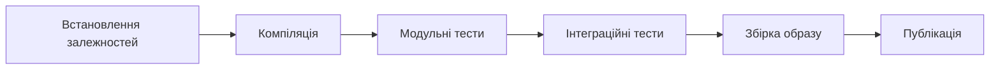
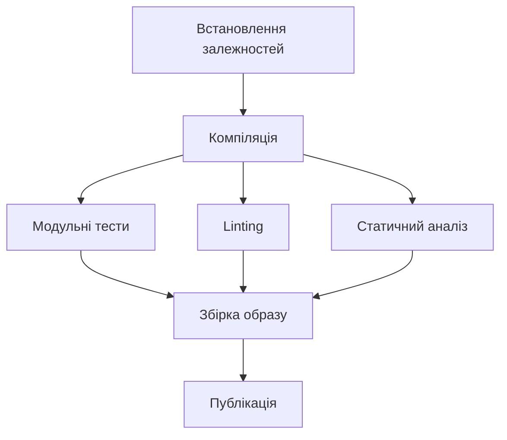
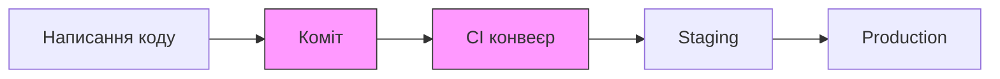

# Лекція 10 Оптимізація CI процесів та управління артефактами

## Вступ

Побудувати CI конвеєр — це лише перший крок. Щойно автоматизоване середовище починає регулярно виконуватися, на перший план виходять питання ефективності: скільки часу займає кожний запуск, чи не дублюються однакові операції, де зберігаються результати збірки та як переконатися, що до виробничого середовища не потрапить вразливий код. Саме цим питанням присвячена дана лекція.

Уявіть команду з десяти розробників, кожен з яких робить по кілька комітів на день. Якщо кожен запуск CI займає 20 хвилин, розробники чекають на зворотний зв'язок занадто довго, а черга задач накопичується швидше, ніж виконується. Оптимізований конвеєр, що виконується за 5 хвилин, — це не просто зручність, а конкурентна перевага: помилки виявляються швидше, цикл зворотного зв'язку стискається, а команда може зосередитися на розробці, а не на очікуванні.


## 1. Паралельне виконання та кешування

### 1.1. Послідовне виконання та його обмеження

Найпростіший CI конвеєр виконує етапи послідовно: спочатку встановлює залежності, потім компілює код, запускає тести, збирає образ контейнера. Загальний час дорівнює сумі часу кожного етапу. Це простий і передбачуваний підхід, але він не використовує потенціал сучасних CI-платформ, які можуть запускати кілька задач одночасно.



Якщо кожен з етапів займає по 3 хвилини, загальний час становить 18 хвилин. При цьому конвеєр використовує один потік виконання.

### 1.2. Паралельне виконання задач

Багато операцій в CI є незалежними одна від одної і можуть виконуватися одночасно. Наприклад, після компіляції коду можна паралельно запускати модульні тести, перевірки якості коду та статичний аналіз безпеки — жодна з цих операцій не залежить від результатів інших.



У цій схемі етапи C, D та E виконуються паралельно. Якщо кожен займає 3 хвилини, загальний час скорочується з 18 до 12 хвилин — на третину без будь-яких змін у самому коді.

У GitHub Actions паралельне виконання налаштовується через незалежні jobs, які не мають директиви `needs` або посилаються на спільний попередній крок:

```yaml
jobs:
  build:
    runs-on: ubuntu-latest
    steps:
      - uses: actions/checkout@v4
      - name: Компіляція
        run: npm run build

  unit-tests:
    needs: build
    runs-on: ubuntu-latest
    steps:
      - name: Модульні тести
        run: npm test

  lint:
    needs: build
    runs-on: ubuntu-latest
    steps:
      - name: Перевірка якості коду
        run: npm run lint

  security-scan:
    needs: build
    runs-on: ubuntu-latest
    steps:
      - name: Статичний аналіз безпеки
        run: npm run security-check
```

Тут `unit-tests`, `lint` та `security-scan` запускаються паралельно після завершення `build`.

### 1.3. Матрична стратегія

Особливо потужним інструментом є матрична стратегія (matrix strategy), яка дозволяє автоматично генерувати кілька паралельних задач з одного шаблону. Це корисно, коли потрібно перевірити сумісність з різними версіями мови програмування, різними операційними системами або різними конфігураціями середовища.

```yaml
jobs:
  test:
    strategy:
      matrix:
        node-version: [18, 20, 22]
        os: [ubuntu-latest, windows-latest]
    runs-on: ${{ matrix.os }}
    steps:
      - uses: actions/checkout@v4
      - uses: actions/setup-node@v4
        with:
          node-version: ${{ matrix.node-version }}
      - run: npm test
```

Ця конфігурація автоматично запустить 6 паралельних задач: кожна комбінація версії Node.js та операційної системи отримає власний виконавчий процес.

### 1.4. Кешування залежностей

Одна з найбільш витратних за часом операцій у CI — завантаження та встановлення залежностей. Для JavaScript-проєкту це може займати 2–5 хвилин, для Python — порівнянно, для Java з Gradle або Maven — іноді більше. При цьому залежності змінюються відносно рідко: здебільшого від коміту до коміту файли `package.json`, `requirements.txt` або `pom.xml` залишаються незмінними.

Кешування вирішує цю проблему: CI-платформа зберігає встановлені залежності після першого запуску і відновлює їх з кешу в наступних запусках. Ключ кешу зазвичай будується на основі хешу файлу з описом залежностей — якщо він не змінився, кеш вважається актуальним.

```yaml
steps:
  - uses: actions/checkout@v4

  - name: Відновлення кешу npm
    uses: actions/cache@v4
    with:
      path: ~/.npm
      key: ${{ runner.os }}-npm-${{ hashFiles('**/package-lock.json') }}
      restore-keys: |
        ${{ runner.os }}-npm-

  - name: Встановлення залежностей
    run: npm ci
```

У цьому прикладі ключ кешу включає операційну систему та хеш файлу `package-lock.json`. Якщо файл не змінився, крок `npm ci` відновить пакети з кешу замість завантаження з мережі. Час виконання скорочується з кількох хвилин до кількох секунд.

Для різних екосистем синтаксис схожий, але шлях до кешу відрізняється:

```yaml
# Python з pip
- uses: actions/cache@v4
  with:
    path: ~/.cache/pip
    key: ${{ runner.os }}-pip-${{ hashFiles('requirements.txt') }}

# Java з Gradle
- uses: actions/cache@v4
  with:
    path: |
      ~/.gradle/caches
      ~/.gradle/wrapper
    key: ${{ runner.os }}-gradle-${{ hashFiles('**/*.gradle*') }}
```

### 1.5. Кешування шарів Docker

Окремий вид кешування стосується збірки Docker-образів. Кожна інструкція у `Dockerfile` створює окремий шар, і якщо вміст не змінився, Docker повторно використовує кешований шар. Проблема виникає в CI: кожен запуск зазвичай стартує з чистого середовища і не має попередніх шарів.

Рішення — використання реєстру контейнерів як джерела кешу:

```yaml
- name: Збірка та публікація Docker образу
  uses: docker/build-push-action@v5
  with:
    context: .
    push: true
    tags: myapp:latest
    cache-from: type=registry,ref=myapp:buildcache
    cache-to: type=registry,ref=myapp:buildcache,mode=max
```

Параметр `cache-from` вказує, звідки брати кешовані шари, а `cache-to` — куди їх зберігати після збірки. При наступному запуску незмінені шари не перебудовуватимуться.


## 2. Оптимізація збірки

### 2.1. Стратегія "fail fast"

Оптимізований конвеєр виявляє проблеми якомога раніше. Найшвидші перевірки варто ставити першими: якщо код не проходить базове форматування або синтаксичну перевірку, немає сенсу запускати тривалі інтеграційні тести.

Порядок має значення:

1. Lint та форматування коду (секунди).
2. Компіляція або синтаксичний аналіз (секунди — хвилини).
3. Модульні тести (хвилини).
4. Інтеграційні тести (хвилини — десятки хвилин).
5. Наскрізні тести та безпека (десятки хвилин).

Якщо перший крок завершується невдачею, конвеєр негайно зупиняється і повідомляє розробника, не витрачаючи ресурси на наступні кроки.

### 2.2. Умовне виконання

Не кожен коміт потребує повного виконання конвеєра. Зміни в документації не впливають на код, зміни в конфігурації середовища не потребують запуску наскрізних тестів. Умовне виконання дозволяє пропускати нерелевантні кроки:

```yaml
jobs:
  test-backend:
    if: |
      contains(github.event.head_commit.modified, 'backend/') ||
      contains(github.event.head_commit.modified, 'package.json')
    runs-on: ubuntu-latest
    steps:
      - run: npm test

  test-frontend:
    if: contains(github.event.head_commit.modified, 'frontend/')
    runs-on: ubuntu-latest
    steps:
      - run: npm run test:frontend
```

У більш складних сценаріях використовуються path filters або спеціальні інструменти для визначення змінених файлів.

### 2.3. Оптимізація Dockerfile для збірки

Порядок інструкцій у `Dockerfile` безпосередньо впливає на ефективність кешування. Docker кешує шари послідовно і анулює кеш з першої зміненої інструкції. Тому часто змінювані інструкції мають розташовуватися якомога пізніше.

Неоптимальний Dockerfile:

```dockerfile
FROM node:20-alpine

# Копіюємо весь контекст — будь-яка зміна в коді анулює всі наступні кеші
COPY . .

# Встановлення залежностей після копіювання — завжди виконується заново
RUN npm ci

RUN npm run build
```

Оптимізований Dockerfile:

```dockerfile
FROM node:20-alpine

WORKDIR /app

# Спочатку копіюємо лише файли залежностей
COPY package.json package-lock.json ./

# Встановлення залежностей кешується окремо від коду
RUN npm ci --only=production

# Потім копіюємо код — зміни тут не анулюють кеш залежностей
COPY . .

RUN npm run build
```

У другому варіанті при зміні вихідного коду шар з `npm ci` залишається кешованим. Лише останні два кроки виконуються заново.

### 2.4. Багатоетапна збірка для зменшення розміру образу

Багатоетапна збірка (multi-stage build) дозволяє використовувати важкі інструменти збірки лише на проміжних етапах, а в фінальний образ включати лише те, що потрібно для роботи застосунку.

```dockerfile
# Перший етап: збірка
FROM node:20-alpine AS builder

WORKDIR /app
COPY package*.json ./
RUN npm ci
COPY . .
RUN npm run build

# Другий етап: виробничий образ
FROM node:20-alpine AS production

WORKDIR /app

# Копіюємо лише результат збірки з першого етапу
COPY --from=builder /app/dist ./dist
COPY --from=builder /app/node_modules ./node_modules

# Не включаємо вихідний код, інструменти розробки, тести
USER node
CMD ["node", "dist/server.js"]
```

Різниця в розмірі може бути суттєвою: образ зі всіма інструментами розробки — 500+ МБ, оптимізований виробничий образ — 50–100 МБ. Менший образ швидше завантажується і має меншу поверхню атаки.

### 2.5. Аналіз часу виконання

Перш ніж оптимізувати конвеєр, варто виміряти, де витрачається час. Більшість CI-платформ відображають час виконання кожного кроку. На основі цих даних можна визначити вузькі місця та зосередити зусилля на найповільніших операціях — замість рівномірного "поліпшення всього".


## 3. Управління артефактами

### 3.1. Що таке артефакти CI/CD

Артефакт — це будь-який файл або набір файлів, що є результатом виконання CI конвеєра. Артефакти бувають різних типів:

- скомпільовані бінарні файли або JAR/WAR архіви;
- зібрані статичні ресурси вебзастосунку (HTML, CSS, JS після мінімізації);
- Docker-образи контейнерів;
- пакети бібліотек (npm, pip, Maven);
- результати тестування та покриття коду;
- документація, що генерується автоматично.

Правильне управління артефактами вирішує кілька проблем: можливість відтворити будь-яку попередню версію розгортання, уникнення повторної збірки при просуванні між середовищами та відстеження, що саме було розгорнуто і коли.

### 3.2. Зберігання тимчасових артефактів у CI

Для передачі файлів між задачами в рамках одного запуску конвеєра використовуються тимчасові артефакти. В GitHub Actions це реалізується через actions/upload-artifact та actions/download-artifact:

```yaml
jobs:
  build:
    runs-on: ubuntu-latest
    steps:
      - uses: actions/checkout@v4

      - name: Збірка застосунку
        run: npm run build

      - name: Збереження артефакту збірки
        uses: actions/upload-artifact@v4
        with:
          name: build-output
          path: dist/
          retention-days: 7

  deploy:
    needs: build
    runs-on: ubuntu-latest
    steps:
      - name: Завантаження артефакту збірки
        uses: actions/download-artifact@v4
        with:
          name: build-output
          path: dist/

      - name: Розгортання
        run: ./scripts/deploy.sh
```

Параметр `retention-days` визначає, скільки днів артефакт зберігається. Це важливо для контролю витрат на зберігання.

### 3.3. Реєстри контейнерів

Docker-образи зберігаються у спеціалізованих реєстрах контейнерів. Найпоширеніші варіанти:

- Docker Hub — публічний реєстр, безкоштовний для відкритих проєктів.
- GitHub Container Registry (ghcr.io) — інтегрований з GitHub, зручний для GitHub Actions.
- AWS Elastic Container Registry (ECR), Google Artifact Registry, Azure Container Registry — хмарні рішення від провідних постачальників.

Стратегія тегування образів є критично важливою. Типова схема включає кілька типів тегів:

```yaml
- name: Визначення тегів для образу
  id: meta
  uses: docker/metadata-action@v5
  with:
    images: ghcr.io/${{ github.repository }}
    tags: |
      # Тег з номером коміту для точної ідентифікації
      type=sha,prefix=sha-

      # Тег з назвою гілки для зручного посилання
      type=ref,event=branch

      # Семантичне версіонування для випусків
      type=semver,pattern={{version}}
      type=semver,pattern={{major}}.{{minor}}

      # Тег latest лише для основної гілки
      type=raw,value=latest,enable={{is_default_branch}}
```

Ця конфігурація автоматично генерує правильні теги залежно від контексту: коміт, гілка або тег випуску.

### 3.4. Семантичне версіонування

Семантичне версіонування (SemVer) — це стандарт, де версія складається з трьох чисел: MAJOR.MINOR.PATCH.

- PATCH збільшується при зворотньосумісних виправленнях помилок.
- MINOR збільшується при додаванні нової зворотньосумісної функціональності.
- MAJOR збільшується при несумісних змінах API.

Для автоматичного визначення типу зміни використовується Conventional Commits — стандарт написання повідомлень комітів, що описувався в попередніх лекціях. Повідомлення виду `fix: виправлено помилку` збільшує PATCH, `feat: додано нову функцію` — MINOR, `feat!: змінено API` — MAJOR.

### 3.5. Реєстри пакетів

Окрім Docker-образів та тимчасових артефактів, існують спеціалізовані реєстри для пакетів бібліотек. GitHub Packages підтримує npm, Maven, NuGet та інші формати:

```yaml
- name: Публікація npm пакету
  run: npm publish
  env:
    NODE_AUTH_TOKEN: ${{ secrets.GITHUB_TOKEN }}
```

Для внутрішніх бібліотек, які не повинні бути публічними, корпоративні реєстри на зразок Nexus Repository або JFrog Artifactory дозволяють зберігати артефакти у приватному середовищі з управлінням доступом.

### 3.6. Незмінність артефактів

Важливий принцип управління артефактами — незмінність (immutability). Артефакт, що відповідає певній версії, не повинен змінюватися після публікації. Якщо виникла необхідність виправити проблему, потрібно створити новий артефакт з новою версією, а не замінювати існуючий.

Цей принцип гарантує відтворюваність: якщо потрібно розгорнути версію, що була в production два місяці тому, відповідний артефакт повинен бути доступний і ідентичний тому, що використовувався тоді.


## 4. Сканування безпеки в CI

### 4.1. Концепція "shift left"

Традиційно безпека перевірялася наприкінці циклу розробки — перед виходом у production. Підхід "shift left" (зсув вліво) означає перенесення перевірок безпеки якомога раніше в процес розробки: в ідеалі — в момент написання коду або принаймні при кожному коміті.



Усунення вразливості на етапі написання коду коштує значно менше, ніж після розгортання в production. Крім того, розробники отримують зворотний зв'язок, поки контекст задачі ще свіжий у пам'яті.

### 4.2. Статичний аналіз коду (SAST)

Static Application Security Testing — аналіз вихідного коду без його виконання для пошуку потенційних вразливостей. SAST-інструменти шукають небезпечні патерни: SQL-ін'єкції, XSS-вразливості, небезпечне використання криптографії, незахищені конфігурації.

Популярні SAST-інструменти за мовами:

- JavaScript/TypeScript: ESLint з плагінами безпеки, Semgrep.
- Python: Bandit, Semgrep.
- Java: SpotBugs, SonarQube.
- Загальний: Semgrep (підтримує десятки мов), CodeQL (GitHub).

Інтеграція Semgrep у GitHub Actions:

```yaml
- name: Запуск Semgrep SAST
  uses: semgrep/semgrep-action@v1
  with:
    config: >-
      p/default
      p/owasp-top-ten
      p/javascript
  env:
    SEMGREP_APP_TOKEN: ${{ secrets.SEMGREP_APP_TOKEN }}
```

CodeQL — власний інструмент GitHub, що глибоко інтегрований у платформу:

```yaml
- name: Ініціалізація CodeQL
  uses: github/codeql-action/init@v3
  with:
    languages: javascript, python

- name: Автоматична збірка для CodeQL
  uses: github/codeql-action/autobuild@v3

- name: Аналіз CodeQL
  uses: github/codeql-action/analyze@v3
```

### 4.3. Аналіз залежностей (SCA)

Software Composition Analysis — перевірка сторонніх бібліотек та залежностей на відомі вразливості. Переважна більшість сучасних застосунків використовує десятки або сотні сторонніх пакетів, кожен з яких може містити вразливості.

Вразливості каталогізуються у базах даних: CVE (Common Vulnerabilities and Exposures), NVD (National Vulnerability Database), OSV (Open Source Vulnerabilities). Інструменти SCA порівнюють встановлені версії залежностей з цими базами.

Популярні SCA-інструменти:

- Dependabot — вбудований у GitHub, автоматично створює pull requests для оновлення вразливих залежностей.
- OWASP Dependency-Check — комплексний інструмент з підтримкою багатьох екосистем.
- Trivy від Aqua Security — сканує як файли залежностей, так і Docker-образи.
- Snyk — комерційний інструмент з безкоштовним рівнем для відкритих проєктів.

Приклад використання Trivy для перевірки залежностей:

```yaml
- name: Сканування вразливостей залежностей
  uses: aquasecurity/trivy-action@master
  with:
    scan-type: fs
    scan-ref: .
    format: sarif
    output: trivy-results.sarif
    severity: CRITICAL,HIGH

- name: Завантаження результатів у GitHub Security
  uses: github/codeql-action/upload-sarif@v3
  with:
    sarif_file: trivy-results.sarif
```

Формат SARIF (Static Analysis Results Interchange Format) дозволяє відображати результати сканування безпосередньо у вкладці Security на GitHub.

### 4.4. Сканування Docker-образів

Контейнери можуть містити вразливості як у власному коді застосунку, так і в базовому образі. Сканування образів виявляє проблеми на обох рівнях.

```yaml
- name: Збірка Docker образу
  run: docker build -t myapp:${{ github.sha }} .

- name: Сканування Docker образу на вразливості
  uses: aquasecurity/trivy-action@master
  with:
    image-ref: myapp:${{ github.sha }}
    format: table
    exit-code: 1
    severity: CRITICAL
```

Параметр `exit-code: 1` означає, що при виявленні вразливостей зазначеної серйозності конвеєр завершується з помилкою і публікація образу блокується.

Для зменшення кількості вразливостей у базових образах рекомендується:

- Використовувати мінімалістичні образи: Alpine Linux, Distroless.
- Регулярно оновлювати базові образи.
- Уникати запуску контейнерів від імені root.

### 4.5. Перевірка секретів

Один з найпоширеніших видів витоку безпекових даних — випадкове збереження паролів, токенів та API-ключів у репозиторії. Інструменти виявлення секретів сканують коміти та файли в пошуку патернів, схожих на секретні дані.

GitHub Secret Scanning — вбудований інструмент, що автоматично перевіряє репозиторій на витоки відомих форматів токенів (AWS, GitHub, Google та інших).

Gitleaks — інструмент з відкритим кодом для локального та CI-сканування:

```yaml
- name: Виявлення витоку секретів
  uses: gitleaks/gitleaks-action@v2
  env:
    GITHUB_TOKEN: ${{ secrets.GITHUB_TOKEN }}
    GITLEAKS_LICENSE: ${{ secrets.GITLEAKS_LICENSE }}
```

### 4.6. Управління результатами сканування

Практична проблема сканування безпеки — велика кількість результатів, серед яких бувають хибнопозитивні спрацьовування. Блокування конвеєра на будь-якому попередженні призведе до того, що розробники почнуть ігнорувати або обходити сканування.

Збалансований підхід передбачає:

- Блокування конвеєра лише при вразливостях рівня CRITICAL або HIGH.
- Вразливості MEDIUM та LOW — фіксуються як попередження, не блокують.
- Відомі хибнопозитивні результати включаються у список виключень з обґрунтуванням.
- Результати завантажуються в систему відстеження для планового усунення.

```yaml
- name: Сканування безпеки з диференційованою реакцією
  uses: aquasecurity/trivy-action@master
  with:
    scan-type: fs
    severity: CRITICAL,HIGH
    exit-code: 1          # Блокує при CRITICAL/HIGH

- name: Попереджувальне сканування
  uses: aquasecurity/trivy-action@master
  with:
    scan-type: fs
    severity: MEDIUM,LOW
    exit-code: 0          # Лише попередження, не блокує
```


## 5. Комплексний приклад оптимізованого конвеєра

Об'єднаємо розглянуті концепції в один конвеєр, що демонструє їх спільне застосування:

```yaml
name: Оптимізований CI конвеєр

on:
  push:
    branches: [main, develop]
  pull_request:
    branches: [main]

jobs:
  # Швидкі перевірки — виконуються першими
  code-quality:
    runs-on: ubuntu-latest
    steps:
      - uses: actions/checkout@v4

      - uses: actions/setup-node@v4
        with:
          node-version: 20
          cache: npm          # Вбудоване кешування npm

      - run: npm ci

      - name: Lint
        run: npm run lint

      - name: Перевірка формату коду
        run: npm run format:check

  # Паралельне тестування
  test:
    needs: code-quality
    runs-on: ubuntu-latest
    strategy:
      matrix:
        node-version: [18, 20, 22]
    steps:
      - uses: actions/checkout@v4

      - uses: actions/setup-node@v4
        with:
          node-version: ${{ matrix.node-version }}
          cache: npm

      - run: npm ci

      - name: Тести
        run: npm test -- --coverage

      - name: Збереження звіту покриття
        uses: actions/upload-artifact@v4
        with:
          name: coverage-${{ matrix.node-version }}
          path: coverage/

  # Сканування безпеки — паралельно з тестами
  security:
    needs: code-quality
    runs-on: ubuntu-latest
    steps:
      - uses: actions/checkout@v4

      - name: Сканування вразливостей залежностей
        uses: aquasecurity/trivy-action@master
        with:
          scan-type: fs
          severity: CRITICAL,HIGH
          exit-code: 1
          format: sarif
          output: security-results.sarif

      - name: Виявлення секретів
        uses: gitleaks/gitleaks-action@v2
        env:
          GITHUB_TOKEN: ${{ secrets.GITHUB_TOKEN }}

      - uses: github/codeql-action/upload-sarif@v3
        if: always()
        with:
          sarif_file: security-results.sarif

  # Збірка Docker — лише після успішних тестів та перевірок безпеки
  build:
    needs: [test, security]
    runs-on: ubuntu-latest
    permissions:
      contents: read
      packages: write
    steps:
      - uses: actions/checkout@v4

      - uses: docker/setup-buildx-action@v3

      - uses: docker/login-action@v3
        with:
          registry: ghcr.io
          username: ${{ github.actor }}
          password: ${{ secrets.GITHUB_TOKEN }}

      - name: Визначення тегів
        id: meta
        uses: docker/metadata-action@v5
        with:
          images: ghcr.io/${{ github.repository }}
          tags: |
            type=sha
            type=ref,event=branch
            type=semver,pattern={{version}}
            type=raw,value=latest,enable={{is_default_branch}}

      - name: Збірка та публікація образу
        uses: docker/build-push-action@v5
        with:
          context: .
          push: ${{ github.event_name != 'pull_request' }}
          tags: ${{ steps.meta.outputs.tags }}
          cache-from: type=registry,ref=ghcr.io/${{ github.repository }}:buildcache
          cache-to: type=registry,ref=ghcr.io/${{ github.repository }}:buildcache,mode=max

      - name: Сканування зібраного образу
        uses: aquasecurity/trivy-action@master
        with:
          image-ref: ghcr.io/${{ github.repository }}:sha-${{ github.sha }}
          severity: CRITICAL
          exit-code: 1
```

Цей конвеєр реалізує:

- Стратегію "fail fast" — lint виконується першим.
- Паралельне виконання тестів та перевірок безпеки.
- Матричну стратегію для трьох версій Node.js.
- Кешування npm залежностей.
- Кешування Docker-шарів через реєстр.
- Автоматичне тегування образів.
- Сканування як залежностей, так і фінального образу.
- Блокування публікації при виявленні критичних вразливостей.


## Підсумок

Оптимізація CI-конвеєрів — це дисципліна, що потребує балансу між швидкістю, надійністю та безпекою. Паралельне виконання та кешування скорочують час зворотного зв'язку. Правильно організований Dockerfile та умовне виконання зменшують витрату ресурсів. Артефакти забезпечують відтворюваність та трасовність розгортань. Інтегровані інструменти безпеки виявляють вразливості до того, як вони потрапляють у production.

Ключова думка: CI-конвеєр має бути не бар'єром, що гальмує розробку, а системою раннього попередження, що допомагає команді рухатися швидко, не жертвуючи якістю та безпекою.


## Контрольні запитання

1. Яка різниця між паралельним виконанням задач та матричною стратегією? Наведіть приклад, коли доцільно використовувати кожен підхід.
2. Поясніть механізм кешування залежностей у CI. Чому для побудови ключа кешу використовується хеш файлу залежностей?
3. Як порядок інструкцій у Dockerfile впливає на ефективність кешування шарів при збірці в CI?
4. Чим відрізняються тимчасові артефакти CI від артефактів, що публікуються в реєстр? Яке призначення кожного виду?
5. Поясніть різницю між SAST та SCA. Які типи вразливостей виявляє кожний підхід?
6. Чому стратегія "блокувати конвеєр при будь-якому попередженні безпеки" може бути контрпродуктивною? Як організувати диференційовану реакцію на результати сканування?
7. Що таке принцип незмінності артефактів і чому він важливий для надійності процесу розгортання?
