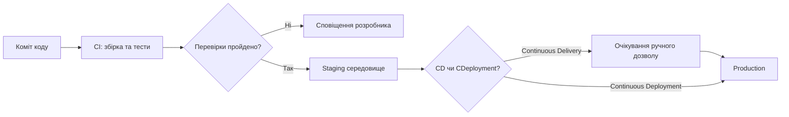
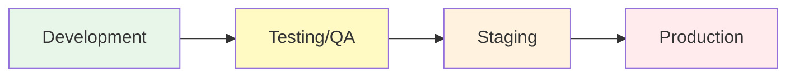
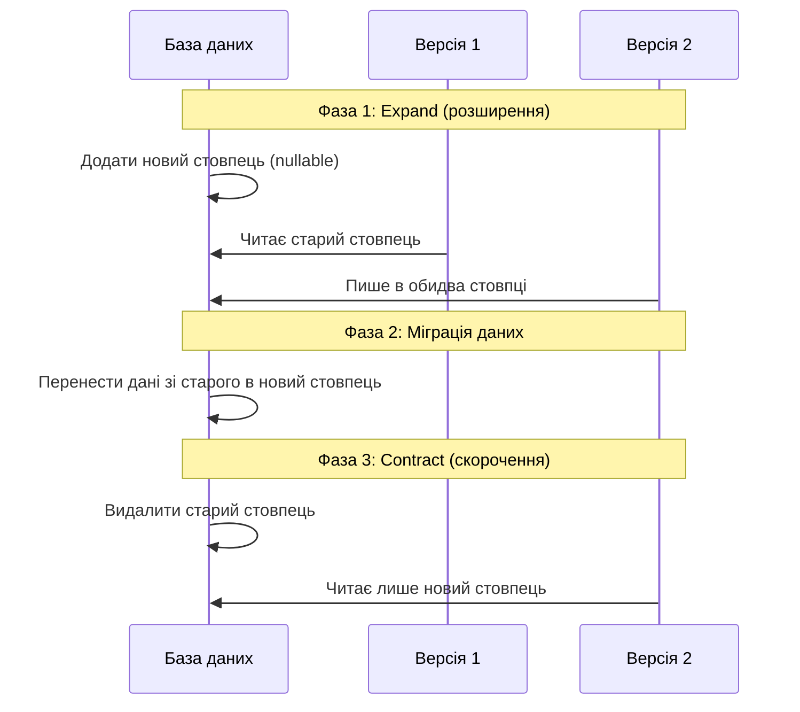
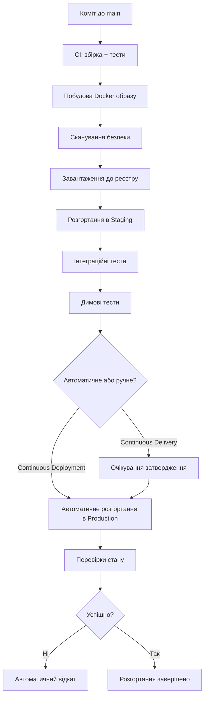

# Лекція 11 Організація процесів безперервної доставки

## 1. Безперервна доставка та безперервне розгортання: суть і відмінності

Коли команда впроваджує безперервну інтеграцію, вона вирішує лише частину задачі — автоматично будує та тестує код. Але готовий артефакт ще потрібно доставити до користувача, і саме тут виникає питання про вибір між двома підходами: безперервною доставкою (Continuous Delivery, CD) та безперервним розгортанням (Continuous Deployment).

Безперервна доставка — це практика, за якої програмне забезпечення завжди перебуває в стані, придатному для розгортання у виробниче середовище. Кожна зміна коду автоматично проходить через конвеєр збірки, тестування та підготовки до випуску. Однак фінальне рішення про розгортання у production приймає людина — зазвичай менеджер продукту або технічний керівник. Це натискання кнопки є свідомим актом, а не технічним обмеженням.

Безперервне розгортання йде на крок далі: якщо зміна успішно пройшла всі автоматизовані перевірки, вона автоматично потрапляє у виробниче середовище без будь-якого ручного втручання. Компанії на кшталт Amazon, Netflix або Etsy розгортають код десятки або навіть сотні разів на день саме завдяки цій практиці.

На практиці вибір між цими підходами залежить від контексту. Для продуктів з регуляторними вимогами, складними процесами перевірки або консервативною аудиторією підходить безперервна доставка — вона дає контроль без втрати швидкості підготовки. Стартапи та продукти з частими оновленнями виграють від безперервного розгортання, оскільки воно усуває затримки та «пляшкові шийки» у процесі випуску.

Спільна риса обох підходів — висока якість автоматизованого тестування. Якщо тести ненадійні або неповні, жоден з підходів не дасть очікуваного результату.

## 2. Огляд стратегій випуску

Стратегія випуску визначає, як нова версія програмного забезпечення потрапляє до кінцевих користувачів. Від правильного вибору стратегії залежить ризик збою, швидкість виявлення проблем і зручність відкату.

### Пряме розгортання (Recreate)

Найпростіша стратегія: стара версія повністю зупиняється, після чого запускається нова. Цей підхід неминуче спричиняє простій — час між зупинкою старої та запуском нової версії. Він доречний лише для некритичних систем або у випадках, коли нова версія принципово несумісна зі старою й паралельна робота двох версій неможлива.

### Поступове оновлення (Rolling Update)

Екземпляри старої версії замінюються новими поступово, по одному або невеликими групами. У будь-який момент частина трафіку обробляється старою версією, частина — новою. Kubernetes реалізує цю стратегію за замовчуванням через механізм `RollingUpdate` у Deployment.

### Blue-Green розгортання

Підтримуються два ідентичні виробничі середовища. В будь-який момент активне лише одне (умовно «синє»), інше («зелене») є готовим резервом. Нова версія розгортається в неактивне середовище, тестується, після чого трафік миттєво перемикається. Детально ця стратегія розглядається в наступній лекції.

### Canary releases

Нова версія спершу отримує лише невеликий відсоток реального трафіку (наприклад, 5%). Якщо метрики задовільні, відсоток поступово збільшується. Ця стратегія дозволяє перевірити нову версію на реальних користувачах з мінімальним ризиком.

### Feature flags

Функціональність розгортається у виробниче середовище у вимкненому стані та активується окремо від деплойменту — через конфігураційний прапорець. Це розриває зв'язок між технічним розгортанням коду та бізнесовим рішенням про його активацію.

## 3. Управління середовищами

Типова організація середовищ відображає шлях змін від розробки до продакшну.

Середовище розробки (Development) — це локальне або спільне середовище, де розробники безпосередньо працюють над кодом. Воно може містити тестові дані, налагоджувальні конфігурації та спрощені залежності.

Тестове середовище (Testing/QA) призначене для автоматизованого та ручного тестування. Тут запускаються інтеграційні тести, перевіряється взаємодія компонентів. Дані зазвичай синтетичні або анонімізовані.

Середовище підготовки (Staging) є максимально точною копією виробничого середовища. Саме тут проводиться фінальна перевірка перед випуском: перевірки продуктивності, UAT (user acceptance testing), перевірка конфігурацій. Добра практика — використовувати анонімізовані копії виробничих даних, щоб staging максимально відповідав реальному навантаженню.

Виробниче середовище (Production) — це те, з чим взаємодіють кінцеві користувачі. Будь-які зміни тут мають бути ретельно перевірені на попередніх рівнях.

### Паритет середовищ

Одна з найпоширеніших причин проблем при розгортанні — розходження між середовищами («у мене локально все працює»). Контейнеризація суттєво вирішує цю проблему, але не повністю. Важливо стежити за однаковістю версій залежностей, конфігурацій мережі, обсягів ресурсів і, головне, підходів до управління конфігурацією.

Конфігурації, специфічні для середовища (URL бази даних, ключі API, обмеження ресурсів), не повинні бути вбудовані в образ контейнера. Вони передаються через змінні середовища, ConfigMaps або системи управління секретами — і в цьому полягає принцип «конфігурація з середовища» з методології Twelve-Factor App.

## 4. Міграції бази даних у процесах CD

Міграції бази даних є одним із найскладніших аспектів безперервної доставки. На відміну від коду застосунку, схему бази даних не можна просто «відкотити» натисканням кнопки — дані вже могли змінитися.

### Проблема сумісності версій

Під час rolling update або blue-green розгортання одночасно можуть працювати дві версії застосунку. Це означає, що обидві версії мають бути сумісні зі схемою бази даних. Зміна, яка є «ламаючою» для старої версії, не може бути застосована одночасно з розгортанням нової.

### Патерн Expand-Contract

Цей підхід вирішує проблему сумісності через поетапні зміни.

Наприклад, якщо потрібно перейменувати стовпець `user_name` на `username`:

1. Додати новий стовпець `username` (expand).
2. Оновити код так, щоб він писав в обидва стовпці.
3. Перенести існуючі дані з `user_name` у `username`.
4. Після повного розгортання нової версії — видалити старий стовпець `user_name` (contract).

### Інструменти для міграцій

Flyway і Liquibase — найпопулярніші інструменти для управління версіями схеми бази даних. Вони зберігають пронумеровані скрипти міграцій у системі контролю версій разом з кодом застосунку, відстежують застосовані міграції та забезпечують відтворюваність стану бази даних у будь-якому середовищі.

Міграції зазвичай виконуються як окремий крок конвеєра перед розгортанням нової версії застосунку — або як init-контейнер у Kubernetes, який запускається перед основним застосунком.

## 5. Конвеєр безперервної доставки: повна картина

Конвеєр CD є природним продовженням CI-конвеєра і додає до нього етапи доставки та розгортання.

Кожен етап цього конвеєра є «воротами якості» — якщо будь-який крок завершується невдачею, конвеєр зупиняється і команда отримує сповіщення. Це гарантує, що в production потрапляє лише перевірений код.

## Підсумок

Безперервна доставка та безперервне розгортання — це два рівні автоматизації процесу випуску програмного забезпечення. Обидва підходи вимагають надійного конвеєра CI, якісних автоматизованих тестів і продуманої організації середовищ. Особливу увагу слід приділяти міграціям бази даних — вони вимагають поетапного підходу для забезпечення сумісності між версіями застосунку під час розгортання.
