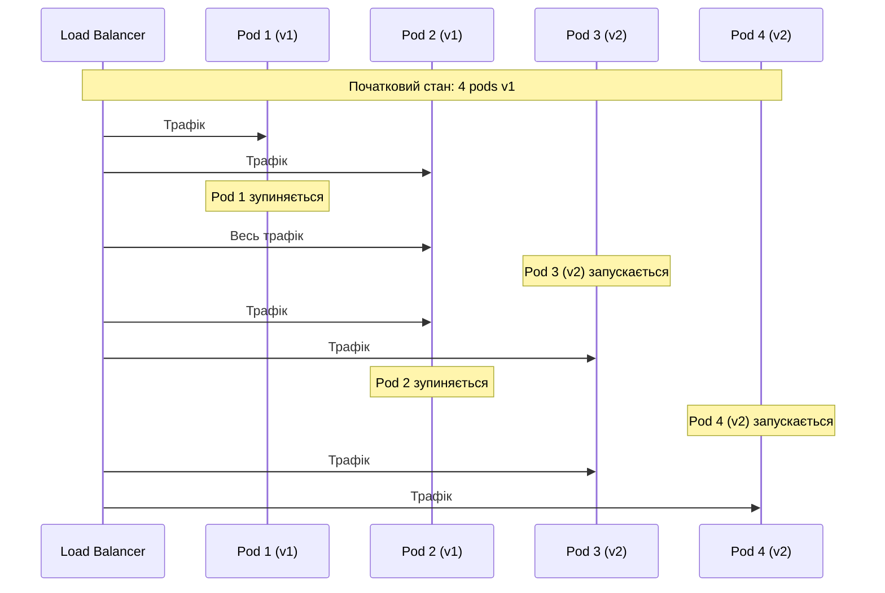
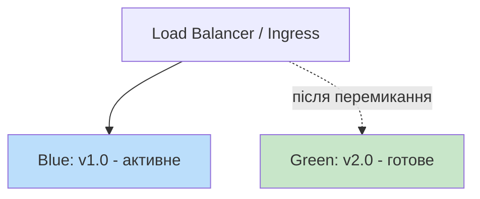
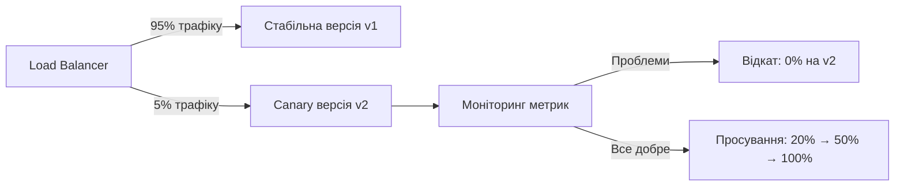
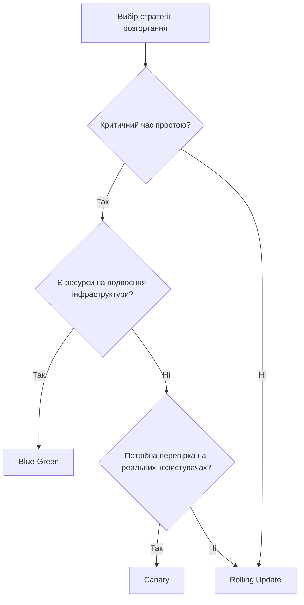

# Лекція 12 Стратегії безпечного розгортання застосунків

## 1. Поступове оновлення (Rolling Deployment)

Поступове оновлення — це найпростіша з безпечних стратегій розгортання. Суть полягає в тому, що екземпляри застосунку замінюються новою версією не одночасно, а по черзі. У будь-який момент у кластері одночасно присутні і стара, і нова версія.

### Механізм роботи в Kubernetes

Kubernetes реалізує rolling update через налаштування `strategy` у Deployment:

```yaml
apiVersion: apps/v1
kind: Deployment
metadata:
  name: my-app
spec:
  replicas: 4
  strategy:
    type: RollingUpdate
    rollingUpdate:
      maxUnavailable: 1   # максимум 1 pod може бути недоступним
      maxSurge: 1         # максимум 1 зайвий pod може бути створений
```

Параметр `maxUnavailable` визначає, скільки екземплярів може бути одночасно виведено з ладу під час оновлення. Параметр `maxSurge` — скільки додаткових екземплярів може бути створено понад бажану кількість реплік.



### Переваги та обмеження

Rolling update вимагає мінімальних ресурсів і не потребує окремої інфраструктури. Проте він має суттєве обмеження: під час оновлення в production одночасно працюють дві версії застосунку. Якщо між версіями є несумісні зміни в API або схемі бази даних, це може спричинити помилки. Тому rolling update найкраще підходить для сумісних між собою версій.


## 2. Blue-Green розгортання

Blue-Green розгортання вирішує проблему одночасної роботи двох версій, підтримуючи два повністю ідентичних виробничих середовища.

### Концепція та реалізація



Поки «синє» середовище обслуговує реальний трафік, «зелене» готується в фоновому режимі: розгортається нова версія, виконуються тести, перевіряється конфігурація. Переключення трафіку відбувається миттєво — змінюється лише маршрутизація, наприклад шляхом оновлення Kubernetes Service або зміни ваг у Ingress.

У Kubernetes blue-green реалізується через перемикання селектора Service:

```yaml
# Спочатку Service вказує на blue (v1)
apiVersion: v1
kind: Service
metadata:
  name: my-app
spec:
  selector:
    app: my-app
    version: blue   # змінити на "green" для перемикання
  ports:
    - port: 80
      targetPort: 8080
```

### Переваги

Головна перевага — миттєве перемикання та можливість швидкого відкату: достатньо змінити селектор назад на попередню версію. Обидві версії залишаються готовими до роботи. Це особливо цінно для систем, де час простою критично важливий.

### Обмеження

Подвоєння витрат на інфраструктуру — значущий мінус. Для невеликих команд або сервісів з обмеженим бюджетом це може бути неприйнятним. Крім того, blue-green не вирішує проблему несумісних змін у базі даних — якщо обидва середовища використовують спільну базу, одночасна робота обох версій все одно потребує сумісності схеми.


## 3. Canary releases

Назва «canary» походить від практики шахтарів, які брали з собою канарку як індикатор небезпечного газу. У контексті розгортань ідея та сама: невелика частина користувачів («канарки») першою отримує нову версію, і якщо вони не повідомляють про проблеми — розгортання продовжується.

### Принцип поступового розкриття



Типовий сценарій canary-розгортання:

- 5% трафіку → нова версія (спостереження 30 хвилин).
- 20% трафіку → нова версія (спостереження 1 година).
- 50% трафіку → нова версія (спостереження кілька годин).
- 100% трафіку → нова версія, стара виводиться з обігу.

### Реалізація в Kubernetes

У Kubernetes найпростіша реалізація canary — через пропорцію реплік:

```yaml
# Стабільна версія: 9 реплік
apiVersion: apps/v1
kind: Deployment
metadata:
  name: my-app-stable
spec:
  replicas: 9
  selector:
    matchLabels:
      app: my-app
      track: stable

# Canary версія: 1 репліка (≈10% трафіку)
apiVersion: apps/v1
kind: Deployment
metadata:
  name: my-app-canary
spec:
  replicas: 1
  selector:
    matchLabels:
      app: my-app
      track: canary
```

Обидва Deployment використовують спільний Service з селектором `app: my-app`, тому трафік розподіляється пропорційно кількості pods.

Більш гнучкий підхід — використання Ingress з вагами або спеціалізованих інструментів, таких як Flagger або Argo Rollouts, які автоматизують аналіз метрик і прийняття рішень про просування або відкат.

### Метрики для canary-аналізу

Ключові метрики, які варто відстежувати під час canary-розгортання:

- частота помилок HTTP (відсоток відповідей 5xx).
- затримка відповідей (95-й та 99-й перцентилі).
- успішність бізнес-транзакцій (наприклад, відсоток завершених замовлень).
- споживання ресурсів (CPU, пам'ять).


## 4. Прапорці функціональності (Feature Flags)

Feature flags — це механізм, що дозволяє розгортати код у виробниче середовище у вимкненому стані та активувати його окремо від деплойменту. Ця практика розриває тісний зв'язок між технічним розгортанням і бізнесовим рішенням про випуск функції.

### Концепція та приклад

```python
# Замість цього
if new_checkout_flow_enabled:
    return new_checkout()
else:
    return old_checkout()

# У коді з feature flags
if feature_flags.is_enabled("new_checkout_flow", user=current_user):
    return new_checkout()
else:
    return old_checkout()
```

Прапорець `new_checkout_flow` може бути вимкнений у production навіть після деплойменту. Коли команда готова — його активують через конфігурацію, а не через новий деплоймент.

### Типи feature flags

Різні сценарії використання вимагають різних типів прапорців.

Release flags використовуються для приховування незавершеної функціональності. Вони тимчасові й видаляються після повного розкриття функції. Experiment flags забезпечують A/B тестування — різні групи користувачів бачать різні версії функціональності. Ops flags дозволяють вимикати важкі операції під час пікового навантаження («circuit breaker»). Permission flags активують функції лише для певних груп: бета-тестерів, внутрішніх користувачів, платних підписників.

### Практичні переваги та ризики

Feature flags дозволяють робити trunk-based development реальністю: розробники зливають код у main часто, навіть якщо функція ще не готова до показу. Це усуває довгоживучі гілки та конфлікти злиття.

Проте прапорці мають ціну. Код з умовними переходами складніший у підтримці. «Технічний борг прапорців» накопичується, якщо старі прапорці не видаляються вчасно. Необхідна ретельна документація та дисципліна команди щодо очищення застарілих прапорців.


## 5. Порівняння стратегій



| Критерій | Rolling | Blue-Green | Canary |
|---|---|---|---|
| Час простою | Мінімальний | Відсутній | Відсутній |
| Витрати на інфраструктуру | Низькі | Подвоєні | Помірні |
| Швидкість відкату | Повільна | Миттєва | Швидка |
| Ризик для користувачів | Середній | Низький | Мінімальний |
| Складність реалізації | Низька | Середня | Висока |

На практиці стратегії часто комбінуються. Наприклад, blue-green розгортання для перемикання між основними версіями з feature flags для поступового розкриття окремих функцій.


## Підсумок

Кожна зі стратегій розгортання відповідає різним вимогам щодо ризику, ресурсів і контролю. Rolling update — найпростіший вибір для типових оновлень. Blue-green гарантує нульовий час простою та миттєвий відкат ціною подвоєних ресурсів. Canary дозволяє перевіряти зміни на реальному трафіку з мінімальним ризиком. Feature flags розривають зв'язок між деплойментом коду та бізнесовим рішенням про випуск.
