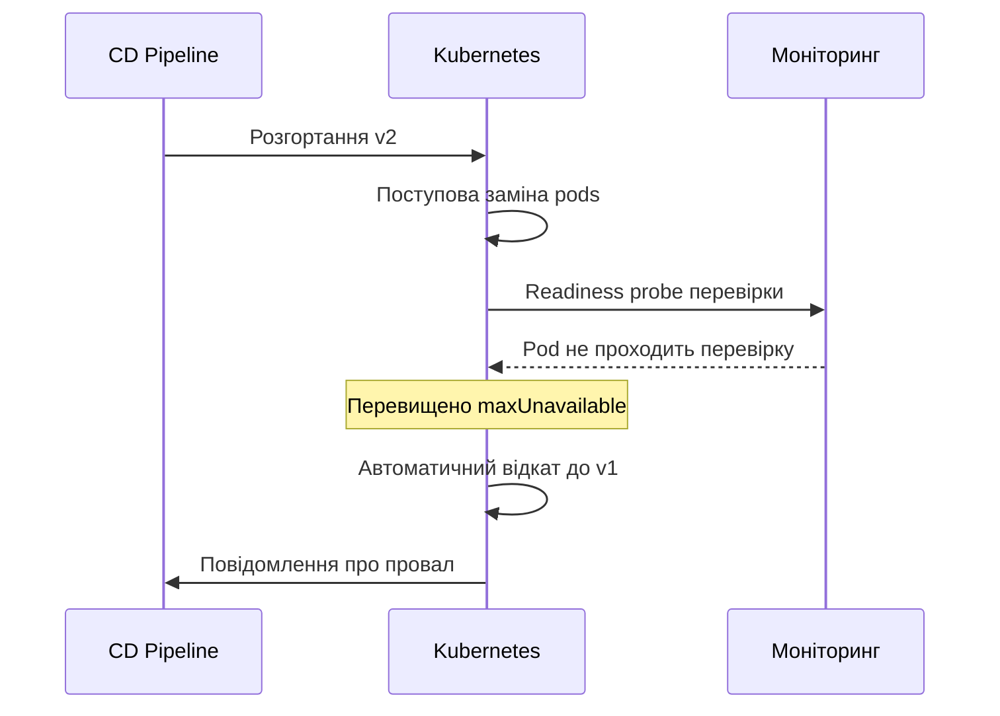
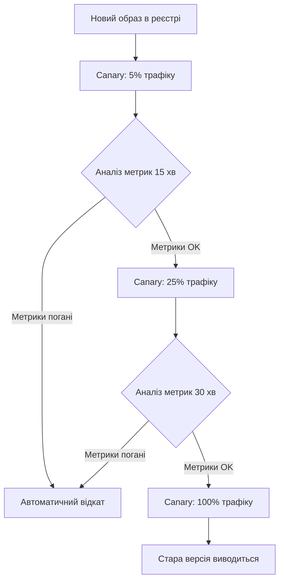
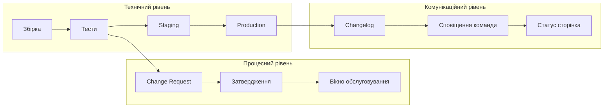
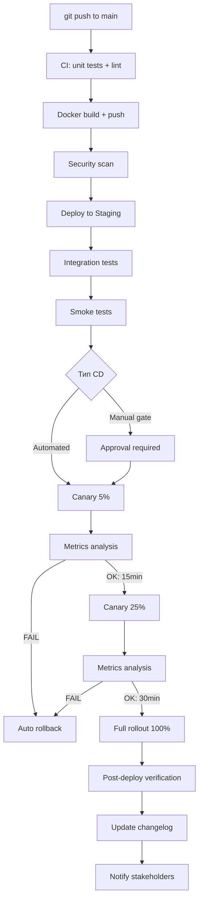

# Лекція 13 Автоматизація випусків та механізми відкатів


## 1. Автоматичні відкати

Будь-яка система розгортання, якою б надійною вона не була, повинна мати відповідь на питання: що відбувається, якщо щось пішло не так? Ручний відкат у критичний момент — це стрес, затримки та людські помилки. Автоматичний відкат усуває ці ризики.

### Принцип автоматичного відкату

Автоматичний відкат спрацьовує тоді, коли система виявляє, що нове розгортання порушує заздалегідь визначені умови здоров'я. Це може бути перевищення порогу помилок, недоступність застосунку після старту або провал димових тестів.



### Відкат у Kubernetes

Kubernetes зберігає історію попередніх Deployment і дозволяє швидко відкотитися:

```bash
# Перегляд історії розгортань
kubectl rollout history deployment/my-app

# Перегляд конкретної ревізії
kubectl rollout history deployment/my-app --revision=2

# Відкат до попередньої версії
kubectl rollout undo deployment/my-app

# Відкат до конкретної ревізії
kubectl rollout undo deployment/my-app --to-revision=2

# Перевірка статусу відкату
kubectl rollout status deployment/my-app
```

Кількість збережених ревізій контролюється параметром `revisionHistoryLimit` у специфікації Deployment. Значення за замовчуванням — 10.

### Автоматизований відкат у CI/CD конвеєрі

Автоматизований відкат зазвичай реалізується через скрипт, що перевіряє стан розгортання після деплойменту:

```bash
#!/bin/bash
DEPLOYMENT=my-app
NAMESPACE=production
TIMEOUT=300  # 5 хвилин

# Запуск розгортання
kubectl set image deployment/$DEPLOYMENT \
  app=registry.example.com/my-app:$NEW_VERSION \
  -n $NAMESPACE

# Очікування завершення з таймаутом
if ! kubectl rollout status deployment/$DEPLOYMENT \
     -n $NAMESPACE --timeout=${TIMEOUT}s; then
  echo "Розгортання невдале, виконується відкат..."
  kubectl rollout undo deployment/$DEPLOYMENT -n $NAMESPACE
  kubectl rollout status deployment/$DEPLOYMENT -n $NAMESPACE
  exit 1
fi

echo "Розгортання успішне"
```

---

## 2. Димові тести та перевірки стану

Димові тести (smoke tests) — це мінімальний набір перевірок, що підтверджують базову працездатність системи після розгортання. Назва походить від практики електронників, які вмикали нову схему і перевіряли, чи немає «диму» — ознаки критичної несправності.

### Readiness та Liveness Probes

Kubernetes має вбудований механізм перевірки стану pods через проби:

```yaml
apiVersion: apps/v1
kind: Deployment
spec:
  template:
    spec:
      containers:
      - name: my-app
        image: my-app:2.0

        # Перевіряє, чи готовий pod приймати трафік
        readinessProbe:
          httpGet:
            path: /health/ready
            port: 8080
          initialDelaySeconds: 10
          periodSeconds: 5
          failureThreshold: 3

        # Перевіряє, чи живий застосунок (перезапускає при провалі)
        livenessProbe:
          httpGet:
            path: /health/live
            port: 8080
          initialDelaySeconds: 30
          periodSeconds: 10
          failureThreshold: 3

        # Перевіряє, чи готовий контейнер до запуску (одноразова)
        startupProbe:
          httpGet:
            path: /health/startup
            port: 8080
          failureThreshold: 30
          periodSeconds: 10
```

Різниця між пробами принципова. `readinessProbe` повідомляє Kubernetes, чи готовий pod приймати трафік — якщо проба провалюється, pod виключається з ротації Service, але не перезапускається. `livenessProbe` перевіряє, чи живий застосунок — провал призводить до перезапуску контейнера. `startupProbe` дає застосунку час на ініціалізацію до початку перевірок liveness та readiness.

### Ендпоінти перевірки стану застосунку

Для правильної роботи проб застосунок має реалізувати відповідні HTTP ендпоінти. Ось приклад на Node.js:

```javascript
// Ендпоінт готовності: перевіряє з'єднання з БД та зовнішніми сервісами
app.get('/health/ready', async (req, res) => {
  try {
    await database.ping();
    await cache.ping();
    res.status(200).json({ status: 'ready' });
  } catch (error) {
    res.status(503).json({ status: 'not ready', error: error.message });
  }
});

// Ендпоінт живучості: перевіряє лише базовий стан процесу
app.get('/health/live', (req, res) => {
  res.status(200).json({ status: 'alive' });
});
```

### Зовнішні димові тести

Крім вбудованих проб Kubernetes, після розгортання варто запускати зовнішні тести, що перевіряють критичні сценарії використання:

```bash
#!/bin/bash
BASE_URL="https://staging.example.com"

# Перевірка головної сторінки
HTTP_CODE=$(curl -s -o /dev/null -w "%{http_code}" $BASE_URL/)
if [ "$HTTP_CODE" != "200" ]; then
  echo "FAIL: Головна сторінка повертає $HTTP_CODE"
  exit 1
fi

# Перевірка API
RESPONSE=$(curl -s $BASE_URL/api/status)
if ! echo "$RESPONSE" | grep -q '"status":"ok"'; then
  echo "FAIL: API статус некоректний: $RESPONSE"
  exit 1
fi

echo "Всі димові тести пройдено"
```

---

## 3. Прогресивна доставка

Прогресивна доставка (Progressive Delivery) — це еволюція CD, що поєднує автоматизоване розгортання з автоматичним аналізом метрик для прийняття рішень про просування або відкат.



### Flagger

Flagger — інструмент для Kubernetes, що автоматизує прогресивну доставку. Він спостерігає за метриками під час canary-розгортання та самостійно вирішує, чи просувати нову версію далі.

```yaml
apiVersion: flagger.app/v1beta1
kind: Canary
metadata:
  name: my-app
spec:
  targetRef:
    apiVersion: apps/v1
    kind: Deployment
    name: my-app
  progressDeadlineSeconds: 600
  service:
    port: 80
  analysis:
    interval: 1m           # інтервал аналізу метрик
    threshold: 5           # максимум невдалих перевірок перед відкатом
    maxWeight: 50          # максимальна частка canary трафіку (%)
    stepWeight: 10         # крок збільшення ваги (%)
    metrics:
    - name: request-success-rate
      min: 99              # мінімально допустимий відсоток успішних запитів
      interval: 1m
    - name: request-duration
      max: 500             # максимально допустима затримка (мс)
      interval: 1m
```

### Argo Rollouts

Argo Rollouts — альтернативний інструмент, що розширює стандартний Kubernetes Deployment складними стратегіями розгортання та інтегрується з Prometheus для аналізу.

---

## 4. Оркестрація випусків

Оркестрація випусків охоплює все, що відбувається навколо технічного розгортання: координацію між командами, управління залежностями між сервісами, комунікацію зі стейкхолдерами та документування змін.

### Release Management в CI/CD конвеєрі

Зрілий конвеєр випуску включає кілька рівнів автоматизації:



### Semantic Versioning та автоматизація версій

Семантичне версіонування (SemVer) описує версію через три числа: `MAJOR.MINOR.PATCH`. Зміна `MAJOR` означає несумісні зміни API, `MINOR` — нова зворотно сумісна функціональність, `PATCH` — виправлення помилок.

Інструменти на кшталт `semantic-release` автоматизують присвоєння версій та генерацію changelog на основі conventional commits:

```bash
# Приклади conventional commits та їх вплив на версію
feat: додати підтримку OAuth            # MINOR: 1.2.0 → 1.3.0
fix: виправити помилку валідації форми  # PATCH: 1.3.0 → 1.3.1
feat!: змінити формат API відповіді     # MAJOR: 1.3.1 → 2.0.0
```

### Управління залежностями між сервісами

У мікросервісній архітектурі зміна одного сервісу може вплинути на інші. Управління залежностями при розгортанні включає кілька підходів.

Contract testing — перевірка сумісності між сервісами до розгортання. Інструменти на кшталт Pact дозволяють описати «контракт» між споживачем та постачальником API і автоматично перевіряти його виконання.

Feature flags для координації — нова функціональність одного сервісу активується лише після того, як залежні сервіси готові до її підтримки.

Backward compatibility — нові версії API підтримують старий формат запитів протягом визначеного перехідного періоду.

### Вікна обслуговування та планування випусків

Навіть при автоматизованому розгортанні деякі зміни варто планувати на менш навантажені години. Вікно обслуговування (maintenance window) — це визначений часовий проміжок, у який дозволено проводити потенційно ризиковані зміни.

Сучасні системи оркестрації дозволяють налаштувати автоматичне блокування розгортань поза вікном обслуговування або перед важливими бізнес-подіями (наприклад, заморожування коду перед великими розпродажами).

---

## 5. Повний цикл: від коміту до виробництва

Об'єднаємо всі концепції лекцій теми в єдину картину:



Цей конвеєр забезпечує максимальну безпеку розгортання: кожна зміна проходить через автоматизовані перевірки, поступово збільшує свою «частку» в production, і лише після підтвердження метриками отримує весь трафік.

---

## Підсумок

Автоматизація випусків — це не просто скрипти для деплойменту, а цілісна система, що включає перевірки стану застосунку, механізми відкату, поступове розкриття змін та координацію між командами. Димові тести і readiness probes є «першою лінією захисту» і дозволяють системі самостійно виявити проблеми. Прогресивна доставка виводить цю ідею на новий рівень, даючи змогу автоматично приймати рішення на основі реальних метрик.
