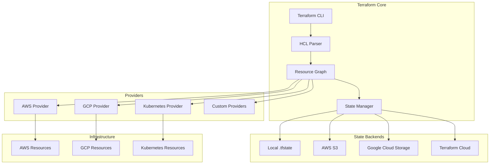
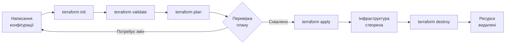
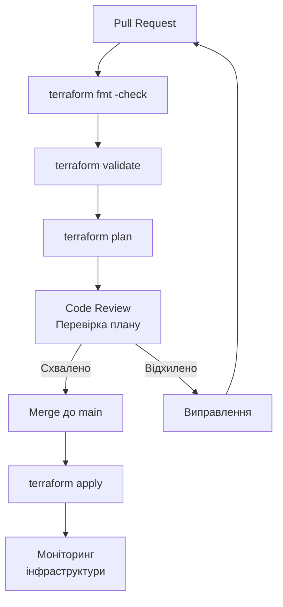
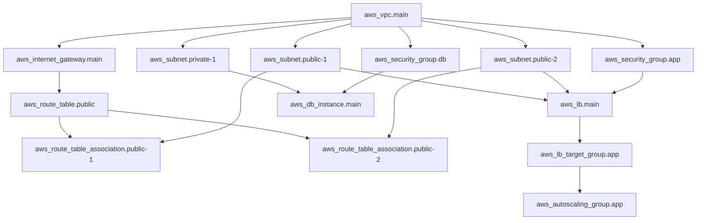

# Лекція 14 Декларативне управління інфраструктурою з Terraform: основи та модульна архітектура


## 1. Підхід Infrastructure as Code та місце Terraform у сучасній інженерії

Управління інфраструктурою довгий час залишалося ручним процесом: системні адміністратори налаштовували сервери вручну, документували кроки у текстових файлах або вікі-сторінках, а відтворити ідентичне середовище на іншому хмарному провайдері або навіть на тому самому провайдері через рік було вкрай складно. Такий підхід породжував явище, яке в DevOps-спільноті дістало назву «snowflake servers» — унікальні, не відтворювані сервери, стан яких відомий лише людині, яка їх налаштовувала.

Infrastructure as Code (IaC) — це практика управління та провізіонування інфраструктури за допомогою машинно-читаних файлів конфігурації, а не через ручні процеси або інтерактивні інструменти налаштування. Коли інфраструктура описана у вигляді коду, до неї можна застосувати всі інженерні практики, що використовуються при розробці програмного забезпечення: контроль версій, code review, автоматизоване тестування, безперервна інтеграція.

Terraform — це інструмент з відкритим вихідним кодом, розроблений компанією HashiCorp у 2014 році, який дозволяє визначати, планувати та застосовувати зміни інфраструктури у декларативному стилі. На відміну від скриптових підходів, де розробник описує покрокову послідовність дій («встанови цей пакет, потім відкрий цей порт»), декларативний підхід вимагає лише описати бажаний кінцевий стан («мені потрібна віртуальна машина з такими характеристиками та відкритим 443-м портом»), а Terraform сам визначить, які операції необхідно виконати для досягнення цього стану.

### Декларативний vs. імперативний підходи

Різниця між підходами стає особливо наочною на прикладі. Уявімо завдання: створити три ідентичні вебсервери у хмарі.

Імперативний підхід (bash-скрипт):

```bash
#!/bin/bash
for i in 1 2 3; do
  aws ec2 run-instances \
    --image-id ami-0abcdef1234567890 \
    --instance-type t3.micro \
    --tag-specifications "ResourceType=instance,Tags=[{Key=Name,Value=webserver-$i}]"
done
```

Цей скрипт виконає свою роботу при першому запуску. Але що станеться, якщо його запустити повторно? Буде створено ще три сервери — загалом шість. Скрипт не знає про вже існуючий стан інфраструктури.

Декларативний підхід (Terraform):

```hcl
resource "aws_instance" "webserver" {
  count         = 3
  ami           = "ami-0abcdef1234567890"
  instance_type = "t3.micro"

  tags = {
    Name = "webserver-${count.index + 1}"
  }
}
```

Якщо застосувати цю конфігурацію повторно, Terraform перевірить реальний стан інфраструктури, побачить, що три сервери вже існують, і не виконає жодних дій. Якщо змінити `count` з 3 на 4, Terraform створить лише один додатковий сервер. Якщо зменшити до 2 — видалить один зайвий.


## 2. Архітектура Terraform та основні компоненти

Розуміння внутрішньої архітектури Terraform допомагає передбачати поведінку інструменту в нестандартних ситуаціях і писати якіснішу конфігурацію.



### Terraform Core

Ядро Terraform відповідає за читання та парсинг конфігураційних файлів у форматі HCL (HashiCorp Configuration Language), побудову графа залежностей між ресурсами, порівняння бажаного стану з реальним (через стейт-файл та API провайдерів) і формування плану виконання.

### Провайдери

Провайдери — це плагіни, які розширюють можливості Terraform для роботи з конкретними API. Існують тисячі офіційних і спільнотних провайдерів: AWS, Google Cloud, Azure, Kubernetes, GitHub, Datadog, PagerDuty тощо. Кожен провайдер декларує набір ресурсів та джерел даних, якими він може управляти.

Провайдери завантажуються автоматично при виконанні `terraform init` на основі вказаних блоків `required_providers`:

```hcl
terraform {
  required_version = ">= 1.5.0"

  required_providers {
    aws = {
      source  = "hashicorp/aws"
      version = "~> 5.0"
    }
    kubernetes = {
      source  = "hashicorp/kubernetes"
      version = ">= 2.20"
    }
  }
}

provider "aws" {
  region = "eu-central-1"
}
```

### Файл стану (State)

Стейт-файл — один із найважливіших концептів Terraform. Це JSON-файл (зазвичай `terraform.tfstate`), у якому Terraform зберігає інформацію про всі керовані ним ресурси: їхні ідентифікатори у хмарного провайдера, поточні атрибути, метадані та залежності. Стейт-файл є «джерелом істини» для Terraform — без нього неможливо визначити, які зміни потрібно внести.

Важливо розуміти, що стейт-файл містить чутливі дані (паролі, ключі доступу, токени), тому його ніколи не слід зберігати у Git-репозиторії. Для командної роботи використовуються віддалені бекенди: AWS S3, Google Cloud Storage, HashiCorp Terraform Cloud тощо. Вони також забезпечують механізм блокування стейту, що запобігає одночасному виконанню операцій Terraform кількома членами команди.

Приклад конфігурації S3-бекенду:

```hcl
terraform {
  backend "s3" {
    bucket         = "my-terraform-state-bucket"
    key            = "prod/terraform.tfstate"
    region         = "eu-central-1"
    encrypt        = true
    dynamodb_table = "terraform-state-lock"
  }
}
```


## 3. Мова HCL та синтаксис конфігурації

HashiCorp Configuration Language (HCL) — це декларативна мова конфігурації, розроблена для зручного опису інфраструктури. Вона поєднує читабельність для людей із машинною обробкою і підтримує змінні, умовні вирази, цикли та функції.

### Основні блоки конфігурації

Конфігурація Terraform складається з кількох типів блоків:

```hcl
# Змінні (variables) — вхідні параметри модуля або конфігурації
variable "environment" {
  description = "Середовище розгортання (dev, staging, prod)"
  type        = string
  default     = "dev"

  validation {
    condition     = contains(["dev", "staging", "prod"], var.environment)
    error_message = "Середовище має бути dev, staging або prod."
  }
}

variable "instance_count" {
  description = "Кількість вебсерверів"
  type        = number
  default     = 2
}

# Локальні значення (locals) — обчислювані всередині конфігурації
locals {
  common_tags = {
    Environment = var.environment
    ManagedBy   = "Terraform"
    Project     = "WebApp"
  }

  name_prefix = "${var.environment}-webapp"
}

# Ресурс (resource) — одиниця інфраструктури
resource "aws_vpc" "main" {
  cidr_block           = "10.0.0.0/16"
  enable_dns_hostnames = true
  enable_dns_support   = true

  tags = merge(local.common_tags, {
    Name = "${local.name_prefix}-vpc"
  })
}

resource "aws_subnet" "public" {
  count             = 2
  vpc_id            = aws_vpc.main.id
  cidr_block        = "10.0.${count.index}.0/24"
  availability_zone = data.aws_availability_zones.available.names[count.index]

  tags = merge(local.common_tags, {
    Name = "${local.name_prefix}-public-${count.index + 1}"
    Type = "Public"
  })
}

# Джерело даних (data source) — читання існуючих ресурсів
data "aws_availability_zones" "available" {
  state = "available"
}

data "aws_ami" "ubuntu" {
  most_recent = true
  owners      = ["099720109477"] # Canonical

  filter {
    name   = "name"
    values = ["ubuntu/images/hvm-ssd/ubuntu-jammy-22.04-amd64-server-*"]
  }
}

# Вивід (output) — значення, що експортуються
output "vpc_id" {
  description = "Ідентифікатор створеної VPC"
  value       = aws_vpc.main.id
}

output "public_subnet_ids" {
  description = "Ідентифікатори публічних підмереж"
  value       = aws_subnet.public[*].id
}
```

### Вирази та функції

HCL підтримує широкий набір вбудованих функцій для роботи з рядками, списками, словниками та числами:

```hcl
locals {
  # Робота з рядками
  upper_env = upper(var.environment)               # "PROD"
  trimmed   = trimspace("  hello  ")               # "hello"
  formatted = format("server-%03d", 5)              # "server-005"

  # Робота зі списками
  first_az    = element(var.availability_zones, 0)
  sorted_list = sort(["c", "a", "b"])              # ["a", "b", "c"]
  flat_list   = flatten([["a", "b"], ["c"]])        # ["a", "b", "c"]

  # Умовні вирази
  instance_type = var.environment == "prod" ? "t3.large" : "t3.micro"

  # For-вирази — створення нових колекцій
  instance_names = [for i in range(3) : "server-${i + 1}"]
  tags_upper     = { for k, v in local.common_tags : k => upper(v) }
}
```


## 4. Робочий процес Terraform

Стандартний робочий процес Terraform складається з чотирьох основних команд, які утворюють цикл: `init → plan → apply → (destroy)`.



`terraform init` — ініціалізація робочого каталогу. Завантажує провайдери, ініціалізує бекенд стейту, завантажує модулі. Цю команду слід виконувати після будь-яких змін у блоках `required_providers`, `backend` або `module`.

`terraform validate` — перевірка синтаксичної та семантичної коректності конфігурації без звернення до API провайдерів. Корисно у CI-конвеєрах для раннього виявлення помилок.

`terraform plan` — генерація плану виконання. Terraform звертається до API провайдерів для визначення реального стану ресурсів, порівнює його з описаним у конфігурації та генерує детальний звіт про заплановані зміни: які ресурси будуть створені (`+`), змінені (`~`) або видалені (`-`). Це найважливіший крок для розуміння наслідків змін конфігурації.

`terraform apply` — застосування плану. За замовчуванням показує план і запитує підтвердження перед виконанням змін. У автоматизованих середовищах використовується прапорець `-auto-approve`.

`terraform destroy` — видалення всіх ресурсів, описаних у конфігурації. Аналогічно до apply, показує план видалення і запитує підтвердження.

### Типовий вивід terraform plan

```
Terraform will perform the following actions:

  # aws_instance.webserver[0] will be created
  + resource "aws_instance" "webserver" {
      + ami                          = "ami-0abcdef1234567890"
      + arn                          = (known after apply)
      + id                           = (known after apply)
      + instance_type                = "t3.micro"
      + tags                         = {
          + "Environment" = "dev"
          + "Name"        = "dev-webapp-1"
        }
    }

  # aws_security_group.web will be modified
  ~ resource "aws_security_group" "web" {
      ~ ingress = [
          + {
              + cidr_blocks = ["0.0.0.0/0"]
              + from_port   = 443
              + protocol    = "tcp"
              + to_port     = 443
            },
        ]
    }

Plan: 1 to add, 1 to change, 0 to destroy.
```


## 5. Управління залежностями між ресурсами

Terraform автоматично визначає залежності між ресурсами, аналізуючи посилання в конфігурації. Якщо ресурс B використовує атрибут ресурсу A у своїй конфігурації, Terraform гарантує, що A буде створено раніше за B.

```hcl
resource "aws_vpc" "main" {
  cidr_block = "10.0.0.0/16"
}

# Terraform автоматично бачить залежність через aws_vpc.main.id
resource "aws_subnet" "public" {
  vpc_id     = aws_vpc.main.id   # Явна залежність
  cidr_block = "10.0.1.0/24"
}

# Іноді залежність не можна виразити через атрибут
# У таких випадках використовується depends_on
resource "aws_s3_bucket_policy" "example" {
  bucket = aws_s3_bucket.example.id
  policy = data.aws_iam_policy_document.example.json

  depends_on = [aws_s3_bucket_public_access_block.example]
}
```

Terraform будує граф залежностей і виконує незалежні ресурси паралельно, що суттєво прискорює застосування конфігурацій з великою кількістю ресурсів.


## 6. Модульна архітектура Terraform

Модулі — це ключовий механізм організації коду у Terraform, який дозволяє перетворити набір пов'язаних ресурсів на логічну одиницю з чітко визначеним інтерфейсом (вхідні змінні та вихідні значення). Модулі вирішують ті самі проблеми, що й функції в програмуванні: уникнення дублювання коду, інкапсуляція деталей реалізації, створення повторно використовуваних компонентів.

### Структура модуля

Типова структура Terraform-проєкту з модулями виглядає так:

```
infrastructure/
├── main.tf              # Кореневий модуль
├── variables.tf
├── outputs.tf
├── terraform.tfvars
└── modules/
    ├── networking/
    │   ├── main.tf      # Ресурси VPC, підмереж, маршрутизації
    │   ├── variables.tf # Вхідні параметри модуля
    │   └── outputs.tf   # Значення, що експортуються
    ├── compute/
    │   ├── main.tf      # EC2-інстанси, Auto Scaling Groups
    │   ├── variables.tf
    │   └── outputs.tf
    └── database/
        ├── main.tf      # RDS-інстанси, групи підмереж
        ├── variables.tf
        └── outputs.tf
```

### Приклад: модуль networking

Файл `modules/networking/variables.tf`:

```hcl
variable "environment" {
  description = "Назва середовища"
  type        = string
}

variable "vpc_cidr" {
  description = "CIDR-блок для VPC"
  type        = string
  default     = "10.0.0.0/16"
}

variable "public_subnet_cidrs" {
  description = "CIDR-блоки для публічних підмереж"
  type        = list(string)
  default     = ["10.0.1.0/24", "10.0.2.0/24"]
}

variable "private_subnet_cidrs" {
  description = "CIDR-блоки для приватних підмереж"
  type        = list(string)
  default     = ["10.0.10.0/24", "10.0.20.0/24"]
}
```

Файл `modules/networking/main.tf`:

```hcl
data "aws_availability_zones" "available" {
  state = "available"
}

resource "aws_vpc" "this" {
  cidr_block           = var.vpc_cidr
  enable_dns_hostnames = true
  enable_dns_support   = true

  tags = {
    Name        = "${var.environment}-vpc"
    Environment = var.environment
  }
}

resource "aws_internet_gateway" "this" {
  vpc_id = aws_vpc.this.id

  tags = {
    Name        = "${var.environment}-igw"
    Environment = var.environment
  }
}

resource "aws_subnet" "public" {
  count             = length(var.public_subnet_cidrs)
  vpc_id            = aws_vpc.this.id
  cidr_block        = var.public_subnet_cidrs[count.index]
  availability_zone = data.aws_availability_zones.available.names[count.index]
  map_public_ip_on_launch = true

  tags = {
    Name        = "${var.environment}-public-${count.index + 1}"
    Environment = var.environment
    Type        = "Public"
  }
}

resource "aws_subnet" "private" {
  count             = length(var.private_subnet_cidrs)
  vpc_id            = aws_vpc.this.id
  cidr_block        = var.private_subnet_cidrs[count.index]
  availability_zone = data.aws_availability_zones.available.names[count.index]

  tags = {
    Name        = "${var.environment}-private-${count.index + 1}"
    Environment = var.environment
    Type        = "Private"
  }
}

resource "aws_route_table" "public" {
  vpc_id = aws_vpc.this.id

  route {
    cidr_block = "0.0.0.0/0"
    gateway_id = aws_internet_gateway.this.id
  }

  tags = {
    Name        = "${var.environment}-public-rt"
    Environment = var.environment
  }
}

resource "aws_route_table_association" "public" {
  count          = length(aws_subnet.public)
  subnet_id      = aws_subnet.public[count.index].id
  route_table_id = aws_route_table.public.id
}
```

Файл `modules/networking/outputs.tf`:

```hcl
output "vpc_id" {
  description = "Ідентифікатор VPC"
  value       = aws_vpc.this.id
}

output "public_subnet_ids" {
  description = "Ідентифікатори публічних підмереж"
  value       = aws_subnet.public[*].id
}

output "private_subnet_ids" {
  description = "Ідентифікатори приватних підмереж"
  value       = aws_subnet.private[*].id
}
```

### Виклик модуля з кореневого модуля

Файл `main.tf` (кореневий модуль):

```hcl
module "networking" {
  source = "./modules/networking"

  environment          = var.environment
  vpc_cidr             = "10.0.0.0/16"
  public_subnet_cidrs  = ["10.0.1.0/24", "10.0.2.0/24"]
  private_subnet_cidrs = ["10.0.10.0/24", "10.0.20.0/24"]
}

module "compute" {
  source = "./modules/compute"

  environment    = var.environment
  vpc_id         = module.networking.vpc_id         # Вихід одного модуля — вхід іншого
  subnet_ids     = module.networking.public_subnet_ids
  instance_count = var.instance_count
  instance_type  = var.instance_type
}

module "database" {
  source = "./modules/database"

  environment = var.environment
  vpc_id      = module.networking.vpc_id
  subnet_ids  = module.networking.private_subnet_ids  # БД — у приватних підмережах
}
```


## 7. Управління кількома середовищами

У реальних проєктах зазвичай існує декілька середовищ: `dev`, `staging`, `prod`. Terraform пропонує кілька підходів до управління ними.

### Підхід 1: Окремі директорії

Найпростіший і найнадійніший підхід — окрема директорія для кожного середовища, кожне зі своїм стейтом:

```
environments/
├── dev/
│   ├── main.tf          # Викликає спільні модулі
│   ├── variables.tf
│   └── terraform.tfvars  # dev-специфічні значення
├── staging/
│   ├── main.tf
│   ├── variables.tf
│   └── terraform.tfvars
└── prod/
    ├── main.tf
    ├── variables.tf
    └── terraform.tfvars
```

Файл `environments/dev/terraform.tfvars`:

```hcl
environment    = "dev"
instance_count = 1
instance_type  = "t3.micro"
min_capacity   = 1
max_capacity   = 2
```

Файл `environments/prod/terraform.tfvars`:

```hcl
environment    = "prod"
instance_count = 3
instance_type  = "t3.large"
min_capacity   = 3
max_capacity   = 10
```

### Підхід 2: Робочі простори (Workspaces)

Terraform Workspaces дозволяють мати кілька стейтів у межах одного набору конфігураційних файлів. Кожен воркспейс має власний ізольований стейт:

```bash
# Перегляд наявних воркспейсів
terraform workspace list

# Створення нового воркспейса
terraform workspace new staging

# Перемикання між воркспейсами
terraform workspace select prod
```

У конфігурації можна посилатися на поточний воркспейс через `terraform.workspace`:

```hcl
locals {
  instance_type = {
    dev     = "t3.micro"
    staging = "t3.small"
    prod    = "t3.large"
  }
}

resource "aws_instance" "app" {
  instance_type = local.instance_type[terraform.workspace]
  # ...
}
```

Підхід з окремими директоріями вважається більш явним і менш схильним до помилок, тому рекомендується для більшості проєктів. Воркспейси краще підходять для короткоживучих середовищ (наприклад, preview-середовища для pull requests).


## 8. Кращі практики та типові патерни

### Організація файлів

Конфігурацію прийнято розподіляти між кількома файлами за призначенням. Усі файли у директорії з розширенням `.tf` автоматично об'єднуються Terraform при виконанні:

```
project/
├── main.tf          # Основні ресурси та виклики модулів
├── variables.tf     # Оголошення змінних
├── outputs.tf       # Оголошення виводів
├── versions.tf      # Вимоги до версій terraform та провайдерів
├── providers.tf     # Конфігурація провайдерів
└── terraform.tfvars # Значення змінних (не комітити з секретами!)
```

### Іменування ресурсів

Узгоджені конвенції іменування суттєво полегшують читання конфігурації і роботу з ресурсами в хмарній консолі:

```hcl
# Шаблон: {environment}-{project}-{resource-type}-{identifier}
locals {
  name_prefix = "${var.environment}-${var.project_name}"
}

resource "aws_security_group" "app" {
  name = "${local.name_prefix}-app-sg"
  # ...
}

resource "aws_lb" "main" {
  name = "${local.name_prefix}-alb"
  # ...
}
```

### Запобігання випадковому видаленню критичних ресурсів

Для ресурсів, випадкове видалення яких може мати катастрофічні наслідки (наприклад, бази даних у продакшні), використовується блок `lifecycle`:

```hcl
resource "aws_db_instance" "production" {
  identifier        = "prod-database"
  engine            = "postgres"
  instance_class    = "db.t3.large"
  allocated_storage = 100

  lifecycle {
    prevent_destroy = true  # Terraform поверне помилку при спробі видалення

    # Ігнорувати зміни, що вносяться поза Terraform (наприклад, через консоль)
    ignore_changes = [
      tags["LastModified"],
      password,
    ]
  }
}
```

### Захист чутливих даних

Змінні, що містять паролі, токени та ключі, позначаються як `sensitive`:

```hcl
variable "db_password" {
  description = "Пароль до бази даних"
  type        = string
  sensitive   = true  # Значення не відображатиметься у виводах terraform plan/apply
}

output "database_password" {
  value     = var.db_password
  sensitive = true  # Вивід теж приховується
}
```

Секрети у terraform.tfvars рекомендується передавати через змінні оточення CI/CD або інструменти управління секретами (HashiCorp Vault, AWS Secrets Manager):

```bash
# Передача секретів через змінні оточення (без збереження у файлах)
export TF_VAR_db_password="my-secret-password"
terraform apply
```


## 9. Інтеграція Terraform у CI/CD конвеєр

Повноцінна автоматизація Terraform передбачає інтеграцію у CI/CD конвеєр для гарантування якості змін та забезпечення прозорості.



Приклад workflow для GitHub Actions:

```yaml
name: Terraform CI/CD

on:
  pull_request:
    paths: ["infrastructure/**"]
  push:
    branches: [main]
    paths: ["infrastructure/**"]

jobs:
  terraform-plan:
    runs-on: ubuntu-latest
    if: github.event_name == 'pull_request'
    defaults:
      run:
        working-directory: infrastructure/environments/prod

    steps:
      - uses: actions/checkout@v4

      - name: Setup Terraform
        uses: hashicorp/setup-terraform@v3
        with:
          terraform_version: "~> 1.5"

      - name: Terraform Init
        run: terraform init
        env:
          AWS_ACCESS_KEY_ID: ${{ secrets.AWS_ACCESS_KEY_ID }}
          AWS_SECRET_ACCESS_KEY: ${{ secrets.AWS_SECRET_ACCESS_KEY }}

      - name: Terraform Format Check
        run: terraform fmt -check -recursive

      - name: Terraform Validate
        run: terraform validate

      - name: Terraform Plan
        run: terraform plan -out=tfplan
        env:
          TF_VAR_db_password: ${{ secrets.DB_PASSWORD }}

      - name: Comment Plan on PR
        uses: actions/github-script@v7
        with:
          script: |
            // Додаємо результат плану як коментар до pull request

  terraform-apply:
    runs-on: ubuntu-latest
    if: github.ref == 'refs/heads/main' && github.event_name == 'push'
    environment: production  # Вимагає ручного підтвердження

    steps:
      - uses: actions/checkout@v4

      - name: Setup Terraform
        uses: hashicorp/setup-terraform@v3

      - name: Terraform Apply
        run: |
          terraform init
          terraform apply -auto-approve
        env:
          AWS_ACCESS_KEY_ID: ${{ secrets.AWS_ACCESS_KEY_ID }}
          AWS_SECRET_ACCESS_KEY: ${{ secrets.AWS_SECRET_ACCESS_KEY }}
          TF_VAR_db_password: ${{ secrets.DB_PASSWORD }}
```


## 10. Граф ресурсів і порядок виконання

Однією з найпотужніших особливостей Terraform є автоматична побудова графа залежностей і паралельне виконання незалежних операцій. Команда `terraform graph` генерує граф у форматі DOT, який можна візуалізувати за допомогою Graphviz.

Для реальної інфраструктури типовий порядок виконання може виглядати так:



Terraform виконує паралельно всі ресурси, між якими немає залежностей. Наприклад, `aws_security_group.app` та `aws_security_group.db` будуть створені одночасно після завершення створення `aws_vpc.main`.


## Висновки

Terraform суттєво змінює підхід до управління інфраструктурою, перетворюючи її на версійований, перевіряємий і відтворюваний актив. Ключові ідеї, які варто засвоїти:

Декларативність означає, що ви описуєте бажаний кінцевий стан, а не послідовність дій для його досягнення. Це уможливлює ідемпотентність — багаторазовий запуск однієї й тієї самої конфігурації завжди призводить до одного й того самого результату.

Стейт-файл є центральним елементом архітектури Terraform. Для командної роботи він повинен зберігатися у віддаленому бекенді з підтримкою блокування, а не в локальній файловій системі чи Git.

Модульна архітектура перетворює набори пов'язаних ресурсів на повторно використовувані компоненти з чітко визначеним інтерфейсом, що дозволяє будувати складні інфраструктури з простих, добре перевірених блоків.

Інтеграція у CI/CD конвеєр — ключ до безпечного застосування змін в інфраструктурі в командному середовищі. Автоматична генерація плану у pull request і ручне затвердження перед застосуванням дозволяють контролювати ризики.


## Питання для самоперевірки

1. У чому полягає принципова відмінність між декларативним та імперативним підходами до управління інфраструктурою? Наведіть конкретний приклад.
2. Яке призначення файлу стану Terraform і чому його не рекомендують зберігати у Git-репозиторії?
3. Опишіть стандартний цикл роботи з Terraform: які команди виконуються та в якому порядку?
4. Що таке провайдер у Terraform і яку роль він відіграє у взаємодії з хмарними API?
5. Поясніть різницю між `variable`, `local` та `output` блоками у конфігурації Terraform.
6. У чому переваги модульної архітектури? Які компоненти входять до інтерфейсу модуля?
7. Порівняйте підходи «окремі директорії» та «воркспейси» для управління кількома середовищами. Коли доцільно застосовувати кожен із них?
