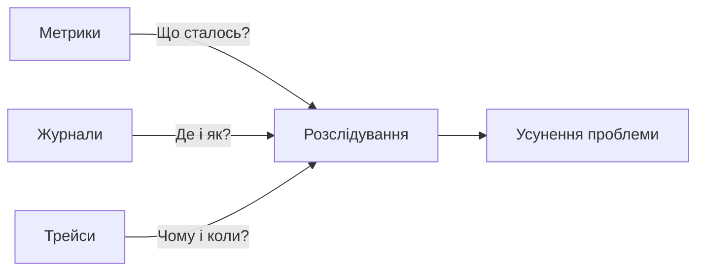
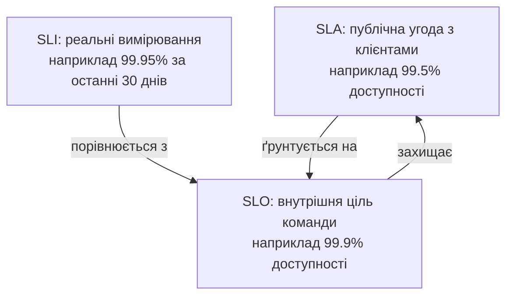

# Лекція 16 Три стовпи спостережуваності та управління інцидентами

## Вступ

Сучасні програмні системи складаються з десятків або сотень мікросервісів, що розгорнуті в контейнерах та взаємодіють через мережу. Коли така система поводиться несподівано — сповільнюється, повертає помилки або взагалі перестає відповідати — команда розробників і операційних інженерів повинна швидко зрозуміти, що сталося, де саме виникла проблема та чому. Здатність системи давати відповіді на ці запитання за допомогою зовнішніх сигналів називається спостережуваністю (англ. observability).

Термін запозичений з теорії керування системами: система вважається спостережуваною, якщо її внутрішній стан можна відновити, спостерігаючи лише за зовнішніми виходами. У контексті програмного забезпечення це означає, що добре спроєктована система сама «розповідає» про свій стан через структуровані дані, які можна збирати, зберігати та аналізувати.

Спостережуваність не є синонімом моніторингу. Моніторинг — це процес перевірки відомих заздалегідь показників: «чи доступний сервіс?», «яке завантаження процесора?». Спостережуваність йде далі: вона дозволяє ставити нові запитання до системи, не змінюючи її код. Якщо моніторинг відповідає на запитання «що не так?», то спостережуваність допомагає відповісти на «чому це не так?».


## 1. Три стовпи спостережуваності

Спільнота DevOps та SRE виробила консенсус щодо трьох фундаментальних типів даних, які формують основу спостережуваності: метрики, журнали та трейси. Ці три категорії часто називають «трьома стовпами спостережуваності», і кожен із них розкриває різний аспект поведінки системи.

### 1.1. Метрики

Метрика — це числове значення, виміряне в певний момент часу або за певний проміжок часу. Метрики є агрегованими даними: вони стискають велику кількість подій у одне число, що робить їх надзвичайно ефективними для зберігання та обробки.

Типові приклади метрик у вебсервісі: кількість HTTP-запитів за секунду, відсоток помилкових відповідей, час відповіді на 95-му процентилі, завантаження процесора, обсяг вільної пам'яті. Метрики ідеально підходять для відстеження тенденцій у часі та виявлення аномалій.

З точки зору реалізації метрики мають кілька важливих характеристик. Кардинальність — це кількість унікальних поєднань міток (labels), за якими метрика може бути розрізнена. Наприклад, метрика «кількість запитів» може мати мітки `method` (GET, POST, DELETE) та `status_code` (200, 404, 500), що дає відносно невелику кардинальність. Якщо ж додати мітку з ідентифікатором користувача, кардинальність злетить до мільйонів і може підвалити систему збору метрик.

Метрики бувають кількох типів:

- лічильник (counter) — монотонно зростаюче значення, наприклад загальна кількість оброблених запитів від моменту запуску сервісу;
- вимірювач (gauge) — значення, яке може зменшуватись і збільшуватись, наприклад поточна кількість активних з'єднань;
- гістограма (histogram) — розподіл вимірювань по кошиках (buckets), що дозволяє обчислювати процентилі;
- підсумок (summary) — схожий на гістограму, але обчислює процентилі на стороні клієнта.

### 1.2. Журнали

Журнал (log) — це текстовий або структурований запис про подію, що відбулася в системі в конкретний момент часу. На відміну від метрик, журнали зберігають повний контекст кожної події: хто зробив запит, які параметри були передані, яка помилка виникла, яке виключення було кинуте.

Журнали поділяють на неструктуровані та структуровані. Неструктурований журнал — це рядок тексту, зрозумілий людині, але складний для машинної обробки:

```
2024-01-15 10:23:45 ERROR Failed to connect to database: connection timeout after 5000ms
```

Структурований журнал — це запис у форматі JSON або подібному, де кожне поле має чітку назву та значення:

```json
{
  "timestamp": "2024-01-15T10:23:45.123Z",
  "level": "ERROR",
  "message": "Failed to connect to database",
  "error": "connection timeout",
  "timeout_ms": 5000,
  "service": "user-service",
  "trace_id": "4bf92f3577b34da6a3ce929d0e0e4736"
}
```

Структурований журнал незрівнянно зручніший для автоматичного аналізу, фільтрації та побудови запитів. Поле `trace_id` у прикладі є надзвичайно важливим: воно зв'язує цей журнальний запис із трейсом конкретного запиту та з усіма іншими журналами, що належать до тієї самої операції.

Головний недолік журналів — їхній обсяг. Активний мікросервіс може генерувати мегабайти журналів за хвилину, і зберігати всі їх без обмежень дорого. Тому важливо встановлювати розумні рівні деталізації: у продакшн-середовищі зазвичай записують лише попередження та помилки (WARNING, ERROR), залишаючи DEBUG-рівень для виявлення конкретних проблем.

### 1.3. Трейси

Трейс (distributed trace) — це запис шляху, який пройшов конкретний запит через розподілену систему. Коли користувач натискає кнопку в застосунку, його запит може пройти через API Gateway, сервіс аутентифікації, основний бізнес-сервіс, базу даних та кеш. Трейс фіксує цей повний шлях разом із часом, витраченим на кожному кроці.

Основна одиниця трейсу — це спан (span). Спан представляє одну операцію: HTTP-виклик, запит до бази даних, звернення до зовнішнього API. Кожен спан має унікальний ідентифікатор, посилання на батьківський спан, мітку початку та кінця, а також набір атрибутів із контекстом операції.

```
Запит користувача (trace_id: abc123)
├── API Gateway (span: 12ms)
│   ├── Auth Service (span: 8ms)
│   └── User Service (span: 45ms)
│       ├── PostgreSQL query (span: 12ms)
│       └── Redis cache (span: 2ms)
```

Ця деревоподібна структура дозволяє одним поглядом побачити, де витрачається час і де виникають помилки. Якщо запит загалом виконується за 200 мс, а в нормі має займати 50 мс, трейс покаже, яка саме операція «з'їла» час.

Для того щоб трейси пронизували всі сервіси, необхідно передавати контекст трейсу між сервісами через HTTP-заголовки або метадані черги повідомлень. Стандарт W3C Trace Context (`traceparent`, `tracestate`) забезпечує сумісність між різними реалізаціями трейсингу.

### 1.4. Взаємодоповнення трьох стовпів

Три стовпи не замінюють, а доповнюють один одного. Типовий сценарій розслідування інциденту виглядає так: спочатку метрики сигналізують про проблему (різке зростання помилок або затримок). Далі журнали дають контекст: яка помилка виникає, у якому сервісі, з яким повідомленням. Нарешті трейси показують повний шлях проблемного запиту і дозволяють точно встановити, де саме виникає збій.




## 2. Концепції SLI, SLO та SLA

Для того щоб спостережуваність мала практичну цінність, необхідно визначити, що саме означає «система працює нормально». Саме для цього у практиці Site Reliability Engineering (SRE) використовують три пов'язані концепції: індикатори рівня сервісу, цілі рівня сервісу та угоди про рівень сервісу.

### 2.1. Індикатор рівня сервісу (SLI)

SLI (Service Level Indicator) — це конкретно виміряний показник, що характеризує якість сервісу з точки зору користувача. SLI — це завжди число або відсоток, отриманий з реальних вимірювань.

Хороший SLI відповідає кільком критеріям: він безпосередньо відображає досвід користувача, його можна точно виміряти, і він реагує на проблеми в системі. Погані SLI — ті, що вимірюють внутрішні деталі реалізації, непомітні для користувача (наприклад, завантаження процесора само по собі не є хорошим SLI, якщо воно не впливає на час відповіді).

Типові SLI для вебсервісів:

- доступність (availability): частка успішних запитів від загальної кількості, наприклад «96.5% запитів повернули HTTP 2xx або 3xx»;
- затримка (latency): частка запитів, виконаних швидше за поріг, наприклад «87% запитів виконуються менш ніж за 200 мс»;
- пропускна здатність (throughput): кількість оброблених запитів за одиницю часу;
- коректність (correctness): частка запитів, що повернули правильний результат.

### 2.2. Ціль рівня сервісу (SLO)

SLO (Service Level Objective) — це цільове значення або діапазон для SLI за певний період. SLO відповідає на питання: «якою ми хочемо, щоб наша система була?»

Приклади SLO:

- «99.9% запитів виконуються менш ніж за 500 мс впродовж ковзного 30-денного вікна»;
- «доступність сервісу — не менше 99.5% за кожний календарний місяць»;
- «не більше 0.1% запитів повертають помилки 5xx».

SLO — це внутрішній документ команди, її зобов'язання перед самою собою. Виконання SLO є метою роботи, а порушення SLO — сигналом, що потрібне негайне втручання.

Надзвичайно важлива концепція, пов'язана з SLO, — це бюджет помилок (error budget). Якщо SLO на доступність становить 99.9%, це означає, що за місяць (приблизно 730 годин) система може бути недоступною не більше 0.1% часу, тобто близько 43 хвилин. Ці 43 хвилини і є бюджетом помилок. Поки бюджет не вичерпано, команда може впроваджувати нові функції та змінювати систему. Коли бюджет на межі виснаження, пріоритет переходить до стабілізації та надійності.

### 2.3. Угода про рівень сервісу (SLA)

SLA (Service Level Agreement) — це юридична або ділова угода між постачальником сервісу та його клієнтами, яка визначає, якого рівня обслуговування клієнт може очікувати, і що відбудеться, якщо цей рівень не буде досягнутий. SLA зазвичай містить штрафи, компенсації або кредити за порушення умов.

SLA повинна бути менш жорсткою, ніж відповідний SLO. Якщо команда зобов'язалась перед клієнтами на доступність 99.5% (SLA), її внутрішня ціль (SLO) повинна бути вищою — наприклад, 99.9%. Цей буфер дає команді можливість реагувати на проблеми до того, як вони призведуть до порушення угоди з клієнтами.




## 3. Стратегії сповіщення та чергування

Спостережуваність має цінність лише тоді, коли на аномалії реагують своєчасно. Ефективна система сповіщень дозволяє потрібним людям дізнатися про проблеми в потрібний час, не перевантажуючи їх зайвими попередженнями.

### 3.1. Принципи ефективного сповіщення

Найпоширеніша проблема в системах сповіщень — надмірне число попереджень. Коли інженери щодня отримують десятки або сотні сповіщень, більшість з яких не вимагають негайної дії, вони починають їх ігнорувати. Це явище називається «втомою від сповіщень» (alert fatigue) і є одним із головних ризиків для надійності системи.

Хороше сповіщення відповідає трьом критеріям. По-перше, воно сповіщає про симптом, помітний для користувача, а не про внутрішню причину. «Частка помилкових відповідей перевищила 1%» — це хороше сповіщення. «Завантаження диска перевищило 80%» — потенційно погане сповіщення, якщо воно не впливає на користувачів прямо зараз. По-друге, сповіщення вимагає негайної дії з боку людини: якщо отримавши його, інженер може лише подивитись і нічого не зробити, це сповіщення зайве. По-третє, сповіщення містить достатньо інформації для початку розслідування або посилання на відповідний документ (runbook).

На практиці використовують два підходи до визначення порогів сповіщень. Перший — сповіщення на основі порогу: «якщо показник перевищує X, відправити сповіщення». Другий і складніший — сповіщення на основі спалення бюджету помилок: «якщо темп витрати бюджету помилок такий, що він буде вичерпаний за N годин, відправити сповіщення». Другий підхід набагато ефективніший, оскільки дозволяє реагувати на проблеми пропорційно їхній реальній серйозності.

### 3.2. Організація чергування

Чергування (on-call) — це практика призначення конкретних людей відповідальними за реагування на інциденти в позаробочий час. Правильно організоване чергування є основою надійності сервісу.

Ключові принципи організації чергування:

- ротація чергових є обов'язковою, оскільки постійне чергування виснажує людей і знижує якість роботи;
- черговий повинен мати чіткі інструкції (runbooks) для кожного типу інциденту, щоб не витрачати час на пошук інформації під час кризи;
- час реагування (time to acknowledge) зазвичай становить 5–15 хвилин для критичних інцидентів;
- система ескалації передбачає автоматичну передачу інциденту наступному рівню, якщо черговий не відреагував у відведений час;
- компенсація за чергування має відображати реальне навантаження: якщо чергові постійно прокидаються вночі, це сигнал, що система потребує вдосконалення.


## 4. Управління інцидентами

Інцидент — це незапланована подія, що знижує якість або доступність сервісу для користувачів. Управління інцидентами (incident management) — це структурований процес реагування на такі події.

### 4.1. Класифікація інцидентів

Інциденти класифікують за серйозністю (severity) або пріоритетом. Типова класифікація:

- P0/SEV1 — критичний інцидент: сервіс повністю недоступний або значна частина користувачів не може виконати ключові функції; потребує негайного залучення всіх необхідних ресурсів;
- P1/SEV2 — серйозний інцидент: значна деградація сервісу, частина функцій не працює; потребує реагування протягом кількох хвилин;
- P2/SEV3 — помірний інцидент: незначна деградація або проблема, що торкається невеликої частини користувачів; може зачекати до початку робочого дня;
- P3/SEV4 та нижче — мінімальний вплив; вирішується в плановому порядку.

### 4.2. Процес реагування на інцидент

Ефективний процес реагування на інцидент включає кілька послідовних фаз.

Виявлення та сповіщення відбувається або автоматично (через систему сповіщень), або через повідомлення від користувачів чи моніторинг від партнерів. Час між початком інциденту та його виявленням (MTTD — Mean Time to Detect) є важливою метрикою.

Призначення відповідального (incident commander, IC) забезпечує єдине джерело координації. IC не обов'язково сам виправляє проблему, але відповідає за координацію всіх учасників і ухвалення рішень.

Зменшення впливу (mitigation) — це перші дії, що зменшують шкоду для користувачів, навіть якщо першопричина ще не усунена. Наприклад, відкат до попередньої версії або перемикання трафіку з проблемного регіону.

Усунення першопричини (resolution) — це виправлення, що запобігає повторному виникненню інциденту.

Ретроспектива (postmortem) — документ, що аналізує інцидент: хронологія подій, першопричина, що спрацювало добре, що не спрацювало, і перелік конкретних дій для запобігання повторенню.

### 4.3. Безвинна ретроспектива

Культурний аспект управління інцидентами не менш важливий, ніж технічний. Ретроспективи мають бути «безвинними» (blameless): їхня мета — розуміння і покращення системи, а не пошук винних. Коли люди бояться покарання за помилки, вони приховують проблеми або уникають ризикованих, але необхідних змін.

Хороша ретроспектива аналізує не дії конкретної людини, а системні умови, що зробили помилку можливою. «Чому система дозволила такій помилці мати такий серйозний вплив?» — правильне запитання. «Хто зробив неправильно?» — неправильне.


## Підсумок

Спостережуваність — це здатність системи відповідати на питання про свій внутрішній стан через зовнішні сигнали. Три стовпи спостережуваності — метрики, журнали та трейси — доповнюють один одного і разом дають повну картину стану системи. Метрики показують агреговану картину у часі, журнали зберігають контекст окремих подій, а трейси простежують шлях запиту через розподілену систему.

SLI, SLO та SLA формують мову для чіткого визначення «нормальної» роботи системи та договірних зобов'язань перед користувачами. Бюджет помилок — це практичний інструмент балансування між надійністю та швидкістю розробки.

Ефективне сповіщення фокусується на симптомах, помітних для користувачів, і вимагає дій. Управління інцидентами через структурований процес із безвинними ретроспективами дозволяє командам навчатися на помилках і покращувати систему, не породжуючи культури страху.
