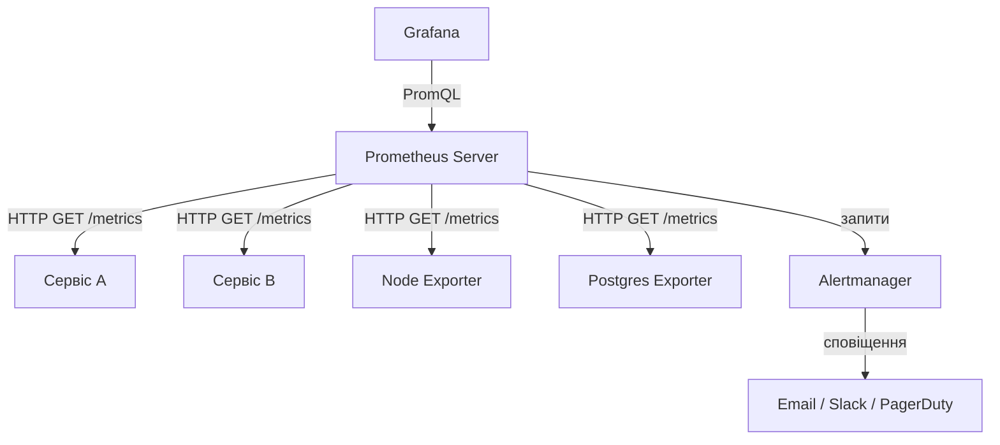

# Лекція 17 Збір метрик та візуалізація за допомогою Prometheus і Grafana

## Вступ

Prometheus і Grafana — це де-факто стандарт для збору метрик та їхньої візуалізації в хмарно-орієнтованих системах. Prometheus збирає числові дані про стан системи і зберігає їх у вигляді часових рядів. Grafana перетворює ці дані на наочні панелі (dashboards), що дозволяють одним поглядом оцінити стан усієї інфраструктури.

Ці два інструменти разом утворюють надійний фундамент для моніторингу сучасних мікросервісних архітектур. Їхня відкритість, гнучкість і потужна екосистема зробили їх базовими компонентами у більшості DevOps-стеків.

---

## 1. Prometheus: архітектура та можливості

### 1.1. Загальна архітектура

Prometheus — це система моніторингу та оповіщення з відкритим кодом, розроблена в SoundCloud у 2012 році і передана під управління Cloud Native Computing Foundation (CNCF) у 2016 році. Її ключова архітектурна особливість — модель «витягування» (pull model): Prometheus сам регулярно звертається до кожного сервісу та забирає метрики, а не отримує їх у вигляді потоку від сервісів.



Компоненти архітектури Prometheus:

- сервер Prometheus — ядро системи, що збирає, зберігає метрики та виконує запити;
- цільові сервіси (targets) — застосунки, що надають метрики через HTTP-ендпоінт `/metrics`;
- Pushgateway — компонент для короткочасних задач (batch jobs), які не можуть очікувати наступного циклу збору;
- Alertmanager — компонент для управління та маршрутизації сповіщень;
- клієнтські бібліотеки (client libraries) — бібліотеки для різних мов програмування, що спрощують інструментування застосунків.

### 1.2. Модель даних

Prometheus зберігає дані у вигляді часових рядів. Кожен часовий ряд ідентифікується унікальним поєднанням імені метрики та набору міток (labels). Мітки — це пари ключ-значення, що дозволяють розрізняти виміри в межах однієї метрики.

Наприклад, метрика `http_requests_total` може мати мітки `method`, `endpoint` та `status`, що дає можливість запитувати «кількість POST-запитів до /api/users, що повернули 200» окремо від «кількість GET-запитів до /api/orders, що повернули 404».

Синтаксис часового ряду:

```
<metric_name>{<label_name>=<label_value>, ...}
```

Наприклад:

```
http_requests_total{method="POST", endpoint="/api/users", status="200"} 4521
http_requests_total{method="GET", endpoint="/api/orders", status="404"} 12
```

Кожна точка даних у часовому ряді містить мітку часу (unix timestamp у мілісекундах) та числове значення з рухомою комою.

### 1.3. Типи метрик

Counter (лічильник) — монотонно зростаюче значення, яке може лише збільшуватись або скинутись до нуля при перезапуску. Підходить для підрахунку кількості запитів, помилок, оброблених повідомлень. При аналізі лічильники зазвичай перетворюють на швидкість зміни за допомогою функції `rate()`.

Gauge (вимірювач) — значення, яке може як зростати, так і зменшуватись. Підходить для вимірювання поточного стану: кількість активних з'єднань, обсяг вільної пам'яті, температура.

Histogram (гістограма) — розподіл вимірювань по кошиках із фіксованими межами. Автоматично генерує три часові ряди: `_bucket` (кумулятивна кількість спостережень по кошиках), `_sum` (сума всіх вимірювань), `_count` (загальна кількість вимірювань). Дозволяє обчислювати апроксимовані процентилі.

Summary (підсумок) — схожий на гістограму, але обчислює процентилі на стороні клієнта для ковзного часового вікна. Менш гнучкий, ніж гістограма, але точніший для обчислення процентилів.

### 1.4. Формат метрик

Prometheus очікує метрики у простому текстовому форматі (Exposition Format). Ендпоінт `/metrics` повертає рядки виду:

```
# HELP http_requests_total Total number of HTTP requests
# TYPE http_requests_total counter
http_requests_total{method="POST",code="200"} 1027
http_requests_total{method="GET",code="200"} 54312
http_requests_total{method="GET",code="404"} 73

# HELP request_duration_seconds HTTP request duration in seconds
# TYPE request_duration_seconds histogram
request_duration_seconds_bucket{le="0.05"} 24054
request_duration_seconds_bucket{le="0.1"} 33444
request_duration_seconds_bucket{le="0.5"} 100392
request_duration_seconds_bucket{le="+Inf"} 144320
request_duration_seconds_sum 53423.12
request_duration_seconds_count 144320
```

Рядки `# HELP` та `# TYPE` є необов'язковими, але рекомендованими для документування метрик.

---

## 2. PromQL та правила запису

### 2.1. Основи PromQL

PromQL (Prometheus Query Language) — це функціональна мова запитів для роботи з часовими рядами. Вона дозволяє відбирати, фільтрувати, агрегувати та трансформувати метрики.

Найпростіший запит — просто ім'я метрики:

```promql
http_requests_total
```

Цей запит поверне всі часові ряди з таким ім'ям незалежно від міток.

Фільтрація за мітками використовує фігурні дужки:

```promql
http_requests_total{method="GET", status="200"}
```

Підтримуються оператори порівняння: `=` (точна відповідність), `!=` (не рівне), `=~` (регулярний вираз), `!~` (не відповідає регулярному виразу):

```promql
http_requests_total{status=~"5.."}
```

### 2.2. Вектори та часові вікна

PromQL працює з двома типами виразів. Миттєвий вектор (instant vector) — набір часових рядів з одним значенням на поточний момент часу. Діапазонний вектор (range vector) — набір часових рядів із серією значень за певний проміжок часу.

Діапазонний вектор задається за допомогою квадратних дужок:

```promql
http_requests_total[5m]
```

Цей вираз поверне всі значення метрики за останні 5 хвилин. Підтримуються одиниці часу: `s` (секунди), `m` (хвилини), `h` (години), `d` (дні), `w` (тижні), `y` (роки).

### 2.3. Функції та агрегація

Функція `rate()` обчислює швидкість зміни лічильника за секунду на основі діапазонного вектора. Це одна з найбільш використовуваних функцій для аналізу лічильників:

```promql
rate(http_requests_total[5m])
```

Функція `irate()` обчислює миттєву швидкість на основі двох останніх точок у вікні — корисна для виявлення коротких сплесків.

Функція `increase()` повертає загальний приріст лічильника за вказане вікно:

```promql
increase(http_requests_total[1h])
```

Функція `histogram_quantile()` обчислює апроксимований процентиль із гістограми:

```promql
histogram_quantile(0.95, rate(request_duration_seconds_bucket[5m]))
```

Цей запит обчислює 95-й процентиль часу відповіді за останні 5 хвилин.

Агрегаційні оператори дозволяють групувати або підсумовувати значення:

```promql
sum(rate(http_requests_total[5m])) by (service)
```

Цей запит підраховує загальну кількість запитів за секунду, згрупованих за назвою сервісу. Оператори `by` та `without` визначають, за якими мітками виконується агрегація.

Приклад практичного запиту — відсоток помилкових відповідей:

```promql
sum(rate(http_requests_total{status=~"5.."}[5m]))
/
sum(rate(http_requests_total[5m]))
* 100
```

### 2.4. Правила запису та правила сповіщення

Правила запису (recording rules) дозволяють попередньо обчислювати складні вирази PromQL і зберігати результат як нову метрику. Це прискорює роботу Grafana та інших клієнтів, яким потрібні складні агрегації.

Правила визначаються у YAML-файлах:

```yaml
groups:
  - name: http_metrics
    interval: 1m
    rules:
      - record: job:http_requests:rate5m
        expr: sum(rate(http_requests_total[5m])) by (job)

      - record: job:http_errors:rate5m
        expr: sum(rate(http_requests_total{status=~"5.."}[5m])) by (job)
```

Правила сповіщення (alerting rules) визначають умови, при яких Prometheus передає сповіщення до Alertmanager:

```yaml
groups:
  - name: alerts
    rules:
      - alert: HighErrorRate
        expr: |
          sum(rate(http_requests_total{status=~"5.."}[5m]))
          /
          sum(rate(http_requests_total[5m])) > 0.01
        for: 5m
        labels:
          severity: critical
        annotations:
          summary: "Висока частка помилок в {{ $labels.job }}"
          description: "Частка помилок {{ $value | humanizePercentage }} перевищує 1%"
```

Параметр `for` вказує, скільки часу умова має бути істинною, перш ніж сповіщення буде надіслано. Це допомагає уникнути помилкових спрацювань на короткочасні коливання.

---

## 3. Grafana: візуалізація та панелі

### 3.1. Загальна характеристика

Grafana — це платформа для візуалізації та аналізу метрик, журналів та трейсів. Вона підтримує десятки джерел даних: Prometheus, InfluxDB, Elasticsearch, PostgreSQL, CloudWatch та інші. Grafana не зберігає дані сама, а є інтерфейсом для їхньої візуалізації з різних джерел.

Ключові концепції Grafana:

- джерело даних (data source) — підключення до зовнішньої системи зберігання даних;
- панель (dashboard) — набір графіків і таблиць, що відображають пов'язані метрики;
- панель (panel) — окремий графік або таблиця всередині dashboard;
- змінна (variable) — динамічний параметр, що дозволяє фільтрувати дані на dashboard.

### 3.2. Типи візуалізацій

Grafana пропонує широкий набір типів графіків для різних сценаріїв.

Графік часових рядів (Time series) є найбільш поширеним типом. Він ідеально підходить для відображення метрик у часі: кількість запитів, час відповіді, завантаження ресурсів.

Gauge відображає поточне значення на шкалі з кольоровими порогами. Корисний для показників, у яких важливий не тренд, а поточне значення: відсоток використання диска, поточна затримка.

Stat показує числове значення з можливістю відображення тренду. Зручний для ключових показників на обзорних панелях.

Таблиця (Table) дозволяє відображати табличні дані: перелік сервісів зі статусом, топ N найповільніших ендпоінтів.

Heatmap — теплова карта, корисна для відображення розподілів у часі, наприклад гістограму часів відповіді.

### 3.3. Змінні та шаблонізація

Змінні роблять dashboard інтерактивним. Наприклад, можна визначити змінну `$service`, яка автоматично заповнюється назвами всіх сервісів з Prometheus, і використовувати її у всіх запитах панелі. Тоді оператор зможе перемикатися між сервісами, не редагуючи запити вручну.

```promql
rate(http_requests_total{service="$service"}[5m])
```

Змінні можна формувати з результатів запитів:

```promql
label_values(http_requests_total, service)
```

### 3.4. Сповіщення в Grafana

Grafana також підтримує власну систему сповіщень (Grafana Alerting), що в сучасних версіях є повноцінною альтернативою Alertmanager. Правила сповіщень визначаються безпосередньо на панелях або в окремому розділі, а сповіщення можна надсилати до Slack, PagerDuty, email та інших каналів.

---

## 4. Експортери та виявлення сервісів

### 4.1. Концепція експортерів

Не всі системи підтримують формат метрик Prometheus «з коробки». Для таких систем існують експортери (exporters) — окремі процеси, що перетворюють метрики із власного формату системи у формат Prometheus.

Найбільш поширені експортери:

- Node Exporter — збирає системні метрики хост-машини: CPU, пам'ять, диск, мережа; стандартний компонент у будь-якій конфігурації Prometheus;
- cAdvisor — збирає метрики контейнерів Docker; вбудований у Kubernetes як компонент kubelet;
- kube-state-metrics — перетворює стан об'єктів Kubernetes (Pods, Deployments, Services) на метрики;
- Postgres Exporter, MySQL Exporter — метрики баз даних;
- Blackbox Exporter — зовнішнє зондування сервісів (HTTP, DNS, TCP, ICMP).

### 4.2. Виявлення сервісів

У динамічних середовищах, таких як Kubernetes, список сервісів, що потребують моніторингу, постійно змінюється. Вручну підтримувати конфігурацію Prometheus для кожного нового Pod неможливо. Саме тому Prometheus підтримує механізм автоматичного виявлення сервісів (service discovery).

У Kubernetes Prometheus може автоматично виявляти цілі через Kubernetes API:

```yaml
scrape_configs:
  - job_name: 'kubernetes-pods'
    kubernetes_sd_configs:
      - role: pod
    relabel_configs:
      - source_labels: [__meta_kubernetes_pod_annotation_prometheus_io_scrape]
        action: keep
        regex: true
      - source_labels: [__meta_kubernetes_pod_annotation_prometheus_io_path]
        action: replace
        target_label: __metrics_path__
        regex: (.+)
```

Ця конфігурація автоматично знаходить усі Pods з анотацією `prometheus.io/scrape: "true"` і починає збирати з них метрики. Коли новий Pod запускається з цією анотацією, Prometheus виявляє його без жодних змін у конфігурації.

### 4.3. Інструментування власних застосунків

Щоб застосунок надавав метрики для Prometheus, його необхідно інструментувати за допомогою клієнтської бібліотеки. Розглянемо простий приклад на Python:

```python
from prometheus_client import Counter, Histogram, start_http_server
import time

REQUEST_COUNT = Counter(
    'http_requests_total',
    'Total HTTP requests',
    ['method', 'endpoint', 'status']
)

REQUEST_LATENCY = Histogram(
    'request_duration_seconds',
    'HTTP request latency',
    ['endpoint'],
    buckets=[0.01, 0.05, 0.1, 0.5, 1.0, 5.0]
)

def process_request(method, endpoint):
    start = time.time()
    try:
        # основна логіка обробки запиту
        status = "200"
    except Exception:
        status = "500"
    finally:
        duration = time.time() - start
        REQUEST_COUNT.labels(method=method, endpoint=endpoint, status=status).inc()
        REQUEST_LATENCY.labels(endpoint=endpoint).observe(duration)

# запуск HTTP-сервера для метрик на порту 8000
start_http_server(8000)
```

Аналогічні бібліотеки існують для Go, Java, Node.js, Ruby та інших популярних мов.

### 4.4. Kube Prometheus Stack

Для розгортання повного стеку моніторингу в Kubernetes найзручніше використовувати Helm-чарт `kube-prometheus-stack` (раніше відомий як `prometheus-operator`). Він встановлює:

- Prometheus Operator для декларативного управління конфігурацією Prometheus через Kubernetes CRD;
- Prometheus із правилами для збору метрик Kubernetes;
- Alertmanager;
- Grafana з набором готових дашбордів для Kubernetes;
- Node Exporter, kube-state-metrics та інші стандартні компоненти.

Ключова концепція Prometheus Operator — це ресурси `ServiceMonitor` та `PodMonitor`. Замість редагування конфігурації Prometheus вручну, розробники додають до свого сервісу ресурс `ServiceMonitor`, і Operator автоматично оновлює конфігурацію:

```yaml
apiVersion: monitoring.coreos.com/v1
kind: ServiceMonitor
metadata:
  name: my-service-monitor
spec:
  selector:
    matchLabels:
      app: my-service
  endpoints:
    - port: metrics
      interval: 30s
      path: /metrics
```

---

## Підсумок

Prometheus реалізує модель витягування метрик, зберігає дані у вигляді іменованих часових рядів із мітками і надає потужну мову запитів PromQL. Чотири типи метрик — counter, gauge, histogram та summary — охоплюють більшість потреб у вимірюванні стану застосунків. Правила запису прискорюють роботу з часто використовуваними складними запитами, а правила сповіщення передають тривоги до Alertmanager.

Grafana перетворює числові дані Prometheus на наочні панелі з різноманітними типами візуалізацій. Змінні роблять dashboard інтерактивним і придатним для використання різними командами.

Екосистема експортерів дозволяє збирати метрики з будь-яких систем, а механізм виявлення сервісів у Kubernetes автоматично підтримує актуальний список цілей для збору метрик у динамічному середовищі.
