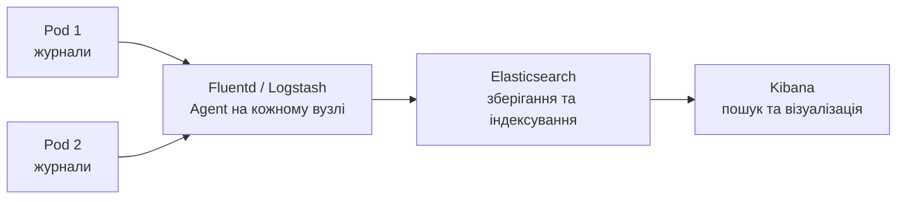
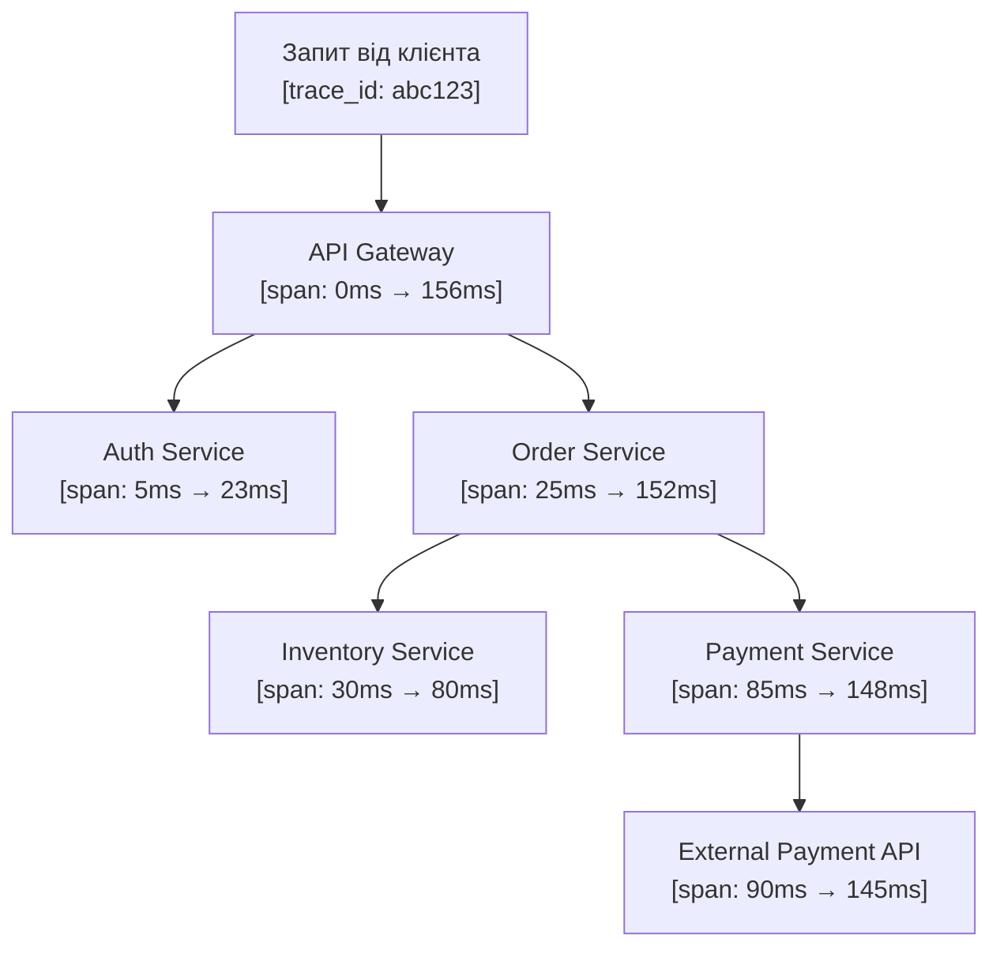
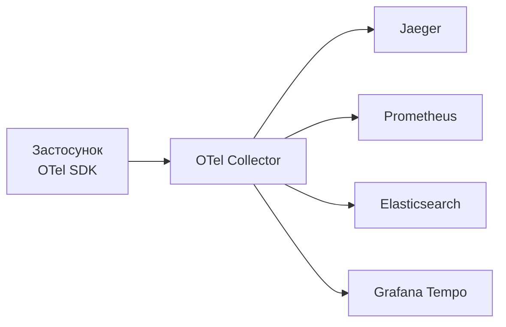

# Лекція 18 Централізоване журналювання та розподілений трейсинг

## Вступ

У монолітному застосунку всі журнали записуються в один файл або потік, і їх порівняно легко читати та аналізувати. У мікросервісній архітектурі кожен Pod у Kubernetes генерує власні журнали, і їхня кількість може сягати мільйонів рядків на годину. Відстежити проблему, коли журнали розкидані по сотнях контейнерів, що запускаються і зупиняються динамічно, практично неможливо без централізованої системи збору та аналізу.

Розподілений трейсинг вирішує споріднену, але відмінну проблему: він простежує шлях конкретного запиту через усі мікросервіси, що його обробляли, і показує, де саме витрачається час і де виникають помилки.


## 1. Централізоване журналювання: стек ELK/EFK

### 1.1. Архітектура стеку

Стек ELK (Elasticsearch + Logstash + Kibana) і його варіація EFK (Elasticsearch + Fluentd + Kibana) є найпоширенішими рішеннями для централізованого журналювання.



Компоненти стеку:

- Elasticsearch — розподілена пошукова система, що індексує журнали та забезпечує швидкий повнотекстовий пошук і агрегацію;
- Logstash або Fluentd — агент збору та трансформації журналів;
- Kibana — вебінтерфейс для пошуку, фільтрації та візуалізації журналів.

Різниця між Logstash і Fluentd: Logstash є більш зрілим і гнучким, написаний на JRuby і потребує більше ресурсів. Fluentd написаний на C та Ruby, споживає значно менше пам'яті та є «хмарно-рідним» проєктом CNCF. У середовищах Kubernetes Fluentd або його легший варіант Fluent Bit є більш поширеними через меншу ресурсомісткість.

### 1.2. Збір журналів у Kubernetes

У Kubernetes журнали контейнерів зберігаються на вузлі у директорії `/var/log/containers/`. Коли Pod зупиняється або перезапускається, ці файли видаляються, тому журнали необхідно забирати та централізовано зберігати якомога швидше.

Стандартний підхід — розгортання агента як DaemonSet: один Pod агента (Fluentd або Fluent Bit) на кожному вузлі кластера, який читає журнали всіх контейнерів на цьому вузлі та відправляє їх до Elasticsearch.

```yaml
apiVersion: apps/v1
kind: DaemonSet
metadata:
  name: fluentd
  namespace: kube-system
spec:
  selector:
    matchLabels:
      name: fluentd
  template:
    spec:
      containers:
        - name: fluentd
          image: fluent/fluentd-kubernetes-daemonset:v1-debian-elasticsearch
          volumeMounts:
            - name: varlog
              mountPath: /var/log
            - name: varlibdockercontainers
              mountPath: /var/lib/docker/containers
              readOnly: true
      volumes:
        - name: varlog
          hostPath:
            path: /var/log
        - name: varlibdockercontainers
          hostPath:
            path: /var/lib/docker/containers
```

### 1.3. Kibana та аналіз журналів

Kibana надає декілька ключових інструментів для роботи з журналами.

Discover дозволяє виконувати пошук по всіх журналах за допомогою мови запитів KQL (Kibana Query Language) або Lucene. Наприклад, знайти всі помилки конкретного сервісу за останню годину:

```
service.name:"user-service" AND level:"ERROR"
```

Або знайти всі запити, пов'язані з конкретним ідентифікатором трейсу:

```
trace.id:"4bf92f3577b34da6a3ce929d0e0e4736"
```

Visualizations дозволяє будувати графіки на основі журналів: динаміку кількості помилок у часі, розподіл журналів за рівнем серйозності, топ-10 ендпоінтів з найбільшою кількістю помилок.


## 2. Найкращі практики структурованого журналювання

### 2.1. Чому структуроване журналювання важливе

Неструктурований журнал — рядок тексту — зрозумілий людині, але погано піддається машинній обробці. Щоб знайти всі запити з часом відповіді більше 1 секунди в неструктурованих журналах, потрібен складний регулярний вираз, і будь-яка зміна формату рядка зламає цей вираз.

Структурований журнал у форматі JSON дозволяє виконувати точні запити за будь-яким полем без парсингу тексту:

```
latency_ms > 1000 AND service.name = "order-service"
```

### 2.2. Обов'язкові поля журнального запису

Хороший журнальний запис завжди містить такі поля.

`timestamp` у форматі RFC 3339 або ISO 8601 з часовим поясом UTC. Використання UTC є обов'язковим у розподілених системах, де різні сервіси можуть працювати в різних часових зонах.

`level` — рівень серйозності: DEBUG, INFO, WARNING, ERROR, CRITICAL. Рівень визначає, наскільки важлива подія, і використовується для фільтрації.

`message` — стислий опис події. Повідомлення має бути статичним або мінімально змінним: «Failed to connect to database», а не «Failed to connect to database postgres://host:5432/mydb». Змінні частини мають бути у окремих полях.

`service.name` — назва сервісу. В мікросервісній архітектурі без цього поля неможливо визначити, звідки прийшов журнал.

`trace_id` та `span_id` — ідентифікатори трейсу та спану. Ці поля дозволяють пов'язати журналий запис із конкретним запитом і побачити всі журнали в контексті одного трейсу.

`error` — структуровані дані про помилку: тип, повідомлення, стек-трейс.

Приклад добре структурованого журнального запису:

```json
{
  "timestamp": "2024-01-15T10:23:45.123Z",
  "level": "ERROR",
  "message": "Database connection failed",
  "service": {
    "name": "user-service",
    "version": "1.4.2",
    "environment": "production"
  },
  "trace_id": "4bf92f3577b34da6a3ce929d0e0e4736",
  "span_id": "00f067aa0ba902b7",
  "error": {
    "type": "ConnectionTimeoutError",
    "message": "Connection timed out after 5000ms",
    "stack_trace": "..."
  },
  "database": {
    "host": "postgres.internal",
    "port": 5432,
    "name": "users"
  }
}
```

### 2.3. Рівні журналювання та їхнє застосування

Вибір правильного рівня журналювання є балансом між деталізацією та ефективністю. Зловживання рівнем INFO перетворює журнали у шум, а недостатня деталізація ускладнює діагностику проблем.

DEBUG використовується під час розробки та налагодження. Містить детальну інформацію про внутрішній стан системи. У продакшн-середовищі зазвичай вимкнений, але може бути динамічно увімкнений для конкретного сервісу під час розслідування.

INFO фіксує значні події нормальної роботи системи: запуск і зупинка сервісу, успішна обробка замовлення, успішна автентифікація. Не слід використовувати для кожного HTTP-запиту, якщо їхня кількість велика.

WARNING сигналізує про ситуацію, яка не є помилкою, але потребує уваги: повторна спроба після тимчасового збою, використання застарілого API, наближення до порогу ресурсу.

ERROR позначає помилку, що завадила виконанню конкретної операції, але система продовжує працювати: не вдалося обробити запит, помилка при записі до кешу.

CRITICAL (або FATAL) позначає критичну помилку, після якої система не може продовжувати нормальну роботу.

### 2.4. Що не слід записувати до журналів

Журнали можуть ненавмисно містити чутливі дані. Паролі, токени, ключі API, номери кредитних карток, персональні дані користувачів ніколи не повинні потрапляти до журналів. Помилка автентифікації повинна виглядати як `"message": "Authentication failed", "user_id": "12345"`, а не `"message": "Authentication failed for user john@example.com with password: qwerty123"`.


## 3. Основи розподіленого трейсингу

### 3.1. Проблема, яку вирішує трейсинг

У мікросервісній архітектурі один запит може послідовно або паралельно проходити через десятки сервісів. Журнали та метрики кожного сервісу розповідають про цей запит зі своєї точки зору, але скласти повну картину складно. Трейсинг вирішує цю проблему, фіксуючи повний шлях запиту у вигляді дерева спанів.



Така діаграма відразу показує, що найбільше часу витрачає Payment Service та зовнішній платіжний API.

### 3.2. Ключові концепції

Трейс (trace) — повний запис про обробку одного запиту, що проходить через усі сервіси. Ідентифікується унікальним `trace_id`, зазвичай 128-бітним числом, що генерується на вході системи.

Спан (span) — запис про одну операцію в межах трейсу. Кожен спан містить:

- унікальний `span_id`;
- `parent_span_id` — ідентифікатор батьківського спану (відсутній у кореневого спану);
- `trace_id` — спільний для всього трейсу;
- назву операції;
- мітки початку та закінчення;
- статус (успішно, помилка);
- атрибути (мітки) з контекстом операції;
- події — точкові записи всередині спану.

Контекст трейсу (trace context) — дані, що передаються між сервісами для підтримки зв'язку спанів. Стандарт W3C Trace Context визначає HTTP-заголовки `traceparent` та `tracestate` для передачі цього контексту.

### 3.3. Інструментування застосунків

Додавання трейсингу до застосунку вимагає інструментування — додавання коду, що створює спани та передає контекст між сервісами. Розрізняють автоматичне та ручне інструментування.

Автоматичне інструментування за допомогою агентів або бібліотек автоматично перехоплює виклики HTTP-клієнтів, запити до бази даних, черги повідомлень тощо. Розробнику не потрібно змінювати основний код, достатньо підключити бібліотеку та налаштувати агент.

Ручне інструментування дозволяє додавати спани для бізнес-логіки, яку автоматичний агент не може відстежити:

```python
from opentelemetry import trace

tracer = trace.get_tracer(__name__)

def process_order(order_id: str):
    with tracer.start_as_current_span("process_order") as span:
        span.set_attribute("order.id", order_id)

        # перевірка інвентарю
        with tracer.start_as_current_span("check_inventory"):
            items = check_inventory(order_id)
            span.set_attribute("items.count", len(items))

        # обробка платежу
        with tracer.start_as_current_span("process_payment") as payment_span:
            result = process_payment(order_id)
            if not result.success:
                payment_span.set_status(StatusCode.ERROR, result.error)
                raise PaymentError(result.error)
```

### 3.4. Jaeger та Zipkin як системи збору трейсів

Jaeger (розроблений Uber, переданий CNCF) і Zipkin (розроблений Twitter) — це найпоширеніші системи збору, зберігання та візуалізації трейсів.

Обидві системи надають:

- вебінтерфейс для пошуку трейсів за сервісом, операцією, тривалістю, часовим діапазоном;
- візуалізацію дерева спанів із деталями кожного спану;
- порівняння трейсів;
- аналіз залежностей між сервісами.


## 4. OpenTelemetry як єдиний стандарт

### 4.1. Проблема фрагментації

Ще кілька років тому кожна система трейсингу мала власний SDK і власний протокол. Застосунок, написаний під Jaeger, не міг без змін надсилати трейси до Zipkin або іншої системи. Аналогічна ситуація з журналами та метриками: кожен інструмент мав власну клієнтську бібліотеку.

### 4.2. OpenTelemetry

OpenTelemetry (OTel) — проєкт CNCF, що об'єднав два попередні стандарти (OpenTracing і OpenCensus) і став єдиним стандартом для інструментування застосунків для збору метрик, журналів і трейсів.

Ключова ідея: застосунок інструментується один раз за допомогою OTel SDK, а куди надсилати дані — налаштовується окремо через конфігурацію колектора. Можна переключитись із Jaeger на Grafana Tempo або надсилати дані в обидва місця одночасно, не змінюючи код застосунку.



OpenTelemetry Collector — це агент або шлюз, що приймає телеметрію від застосунків, обробляє її (фільтрує, збагачує, перетворює) та надсилає до однієї або кількох систем зберігання.

### 4.3. Семантичні конвенції

OpenTelemetry визначає семантичні конвенції (Semantic Conventions) — стандартизовані імена атрибутів для типових операцій. Наприклад, HTTP-спан повинен мати атрибути `http.method`, `http.url`, `http.status_code`. Запит до бази даних — `db.system`, `db.statement`, `db.operation`.

Дотримання семантичних конвенцій дозволяє інструментам автоматично розпізнавати тип операції та надавати більш деталізовану аналітику без додаткового налаштування.


## 5. Аналіз журналів та патерни

### 5.1. Кореляція між сигналами спостережуваності

Повноцінне розслідування інцидентів вимагає переходу між трьома типами сигналів. Сучасні платформи, наприклад Grafana, дозволяють організувати цей перехід безперешкодно: натиснувши на аномалію на графіку метрик, можна перейти до журналів за відповідний часовий проміжок; з журналу — перейти до трейсу за `trace_id`.

Для того щоб така кореляція працювала, необхідно:

- в усіх журналах зберігати `trace_id` поточного запиту;
- зберігати часові позначки в єдиному форматі UTC;
- підтримувати єдину схему іменування сервісів (наприклад, `service.name`) у метриках, журналах і трейсах.

### 5.2. Типові патерни аналізу журналів

Пошук першопричини (root cause analysis): починаємо з метрики, що показала аномалію. Фільтруємо журнали за часовим вікном аномалії та сервісом. Шукаємо ERROR-повідомлення. За `trace_id` знаходимо трейс і бачимо повний шлях проблемного запиту.

Аналіз витоку з'єднань: якщо кількість активних з'єднань із базою даних постійно зростає, журнали допоможуть знайти, який код відкриває з'єднання, але не закриває. Запит «знайти всі журнали з відкриттям з'єднання без парного закриття» виявить проблемний компонент.

Виявлення повторюваних помилок: агрегація журналів за полем `error.type` покаже, які помилки виникають найчастіше. Наприклад, якщо `ConnectionTimeoutError` складає 80% всіх помилок, це вказує на проблему з конкретним зовнішнім сервісом або мережею.

### 5.3. Управління обсягом журналів

Великі системи виробляють такий обсяг журналів, що зберігати всі їх необмежено дорого. Типові стратегії управління обсягом:

- налаштування рівнів журналювання: у продакшн відображати INFO і вище, залишаючи DEBUG лише для конкретних компонентів під час діагностики;
- семплінг (sampling) журналів: для успішних запитів записувати, наприклад, 10% журналів; для помилкових — 100%;
- горизонти зберігання: журнали за останні 7 днів зберігаються в «гарячому» сховищі для швидкого пошуку; старіші — архівуються в дешевшому об'єктному сховищі;
- використання Fluent Bit замість Fluentd для агентів збору завдяки значно меншому споживанню пам'яті (близько 450 КБ проти 40 МБ для Fluentd).


## Підсумок

Централізоване журналювання вирішує проблему розпорошеності журналів у динамічних середовищах. Стек EFK (Elasticsearch + Fluentd + Kibana) є стандартним рішенням для Kubernetes: DaemonSet агентів збирає журнали з усіх вузлів і передає їх до Elasticsearch для індексування та пошуку через Kibana.

Структуроване журналювання у форматі JSON із обов'язковими полями (`timestamp`, `level`, `message`, `service.name`, `trace_id`) значно спрощує аналіз і кореляцію даних із різних джерел. Ніколи не слід записувати до журналів чутливі дані користувачів.

Розподілений трейсинг розкриває шлях запиту через усі мікросервіси за допомогою дерева спанів. OpenTelemetry стандартизував інструментування застосунків, дозволяючи незалежно обирати системи зберігання трейсів, метрик і журналів.

Найбільша цінність трьох стовпів спостережуваності — у їхній інтеграції: `trace_id` у журналах та метриках створює міст між різними типами сигналів і перетворює розслідування інцидентів із детективного пошуку по розрізнених джерелах на структурований процес.
