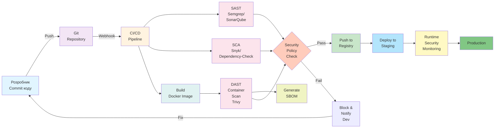

# Лекція 19 Інтеграція безпеки в DevOps процеси (DevSecOps)

## 1. Концепція Shift-Left безпеки та її значення в сучасній розробці

Традиційний підхід до розробки програмного забезпечення часто розміщував перевірки безпеки в кінці цикл розробки, безпосередньо перед передачею проєкту у продакшн. Цей підхід, відомий як "shift-right", виявляється надзвичайно неефективним з точки зору часу, коштів та якості. Коли вразливості виявляються на пізніх стадіях розробки, їх виправлення вимагає значних змін в архітектурі, переробки вже написаного коду та затримок у випуску проєкту. За дослідженнями NIST, вартість виправлення безпекової вразливості зростає в двадцять разів, якщо вона виявляється після випуску продукту в порівнянні з виявленням на етапі розробки.

Shift-left безпека — це парадигма, яка переміщує вправо перевірки безпеки на всі ранні стадії розробки: від проектування архітектури, через написання коду, до тестування та інтеграції. Це означає, що розробники та інженери якості повинні думати про безпеку з першого дня розробки, а не додавати її як afterthought перед релізом. Концепція походить з успішного застосування принципу shift-left у тестуванні якості, де перенесення тестування на ранні етапи дозволило значно скоротити цикл розробки та підвищити якість кінцевого продукту.

Shift-left безпека означає, що кожна стадія конвеєра інтеграції та розгортування (CI/CD pipeline) повинна мати вбудовані перевірки безпеки. Це не зменшує важливість перевірок на пізніх етапах, але гарантує, що очевидні вразливості будуть виявлені якомога раніше, коли виправлення найбільш простого та дешевого. Розробники отримують негайний зворотний зв'язок про проблеми безпеки в їхному коді, що дозволяє їм навчатися на помилках та формувати культуру безпеки всередину команди розробки.

Кульмінація цього підходу — це DevSecOps, яка поєднує DevOps філософію безперервних покращень та автоматизації з інтеграцією безпеки на всіх рівнях операцій. DevSecOps означає, що безпека є обов'язком кожного члена команди: розробників, інженерів якості, адміністраторів систем та операцій, а не лише спеціалізованої команди безпеки.

## 2. Інструменти SAST (Static Application Security Testing) та їх роль у раннім виявленні вразливостей

SAST або статичний аналіз коду — це набір методів та інструментів для аналізу вихідного коду, байт-коду або бінарних файлів без фактичного виконання програми. SAST аналізує структуру коду, логічні потоки, використання функцій та взаємодії компонентів для виявлення потенційних проблем безпеки. Основною перевагою SAST є його здатність виявляти вразливості дуже рано, безпосередньо на етапі написання коду розробником.

Semgrep є сучасним SAST інструментом, створеним для простоти використання та інтеграції в конвеєри CI/CD. На відміну від більш складних SAST рішень, Semgrep використує декларативну мову правил, яка дозволяє розробникам та безпеці розробляти власні правила виявлення вразливостей без глибокого розуміння внутрішніх механізмів аналізу коду. Semgrep інтегрується з популярними мовами програмування включаючи Python, JavaScript, Go, Java, C#, та ще понад двадцять мов. Інструмент надає як предвизначені правила безпеки, так і можливість створення власних правил, що особливо корисно для виявлення специфічних для проєкту антипатернів та проблем.

SonarQube — це комплексна платформа для управління якістю коду, яка поєднує SAST аналіз з аналізом покриття тестами, вимірюванням технічного боргу та аналізом дублювання коду. SonarQube надає детальні звіти про безпекові вразливості, класифіковуючи їх за серйозністю, типом вразливості та іншими параметрами. Особливістю SonarQube є його інтеграція з більшістю популярних систем контролю версій та CI/CD платформ, включаючи GitHub, GitLab, Bitbucket, Jenkins та інші. Це дозволяє автоматично запускати аналіз на кожен commit та надавати розробникам негайний зворотний зв'язок через UI платформи та PR коментарі.

Checkmarx — це商業SAST рішення, яке відомо своєю здатністю виявляти складні вразливості, включаючи проблеми з логікою безпеки, які могли б бути пропущені простішими інструментами. Checkmarx використовує символічне виконання та аналіз потоків даних для моделювання можливих шляхів виконання коду та виявлення місць, де ненадійні вхідні дані можуть дійти до небезпечних операцій. Checkmarx особливо ефективний для виявлення вразливостей у великих проєктах та організаціях з комплексною архітектурою.

Принцип роботи SAST інструментів базується на аналізі абстрактного синтаксичного дерева (AST) коду та побудові графів потоків даних. Інструмент проходить по коду, побудувавши представлення його логічної структури, а потім застосовує набір правил для виявлення небезпечних конструкцій. Наприклад, правило може шукати місця, де дані з недовіреного джерела (як користувацький вхід) передаються в небезпечні функції (як SQL запити без параметризації або команди операційної системи).

## 3. DAST інструменти та їх роль у тестуванні безпеки на рівні вебдодатків

На відміну від SAST, який аналізує вихідний код статично, DAST (Dynamic Application Security Testing) досліджує застосунок під час його виконання, відправляючи различні вхідні дані та спостерігаючи за реакцією. DAST інструменти діють як зловмисник, намагаючись експлуатувати вразливості в реальному вебдодатку. Це дозволяє виявляти вразливості, які можуть існувати тільки в контексті роботи застосунку: проблеми з аутентифікацією та авторизацією, проблеми з сесіями, проблеми з конфігурацією сервера та інші вразливості часу виконання.

OWASP ZAP (Zed Attack Proxy) є вільнодоступним інструментом від Open Worldwide Application Security Project (OWASP), призначеним для пошуку вразливостей у вебдодатках. ZAP діяти як проксі, перехоплюючи трафік між браузером та вебдодатком, дозволяючи тестувальнику посилити, змінити та повторити запити. ZAP містить активний сканер, який автоматично спробує експлуатувати виявлені вразливості, та пасивний сканер, який аналізує відповіді сервера на наявність признак проблем безпеки. ZAP легко інтегрується в CI/CD конвеєри та підтримує запуск у режимі headless для автоматизованого тестування.

Burp Suite Professional — це комерційне рішення від PortSwigger, яке вважається стандартом в індустрії для ручного та автоматизованого тестування безпеки вебдодатків. Burp Suite включає всі можливості ZAP та багато додаткових можливостей для глибокого тестування, включаючи відправку до 200 видів атак, виявлення приховані каналів, тестування WebSocket, та інші. Однак, Burp Suite є пропрієтарним та коштує достатньо дорого, тому найчастіше використовується для ручних тестів, а не для автоматизації в CI/CD.

Ключова відмінність між SAST та DAST полягає в тому, що SAST перевіряє код як такий, не запускаючи його, в той час як DAST запускає реальний застосунок та спілкується з ним як користувач або зловмисник. Це означає, що SAST може виявити вразливості на рівні коду, але не може виявити проблеми, які виникають через взаємодію компонентів у реальній системі. DAST, з іншого боку, перевіряє реальний поведінку системи, але не може прямо проаналізувати код і відповідно не може розрізнити причину вразливості. Таким чином, оптимальний підхід до безпеки включає використання обох типів інструментів — SAST на ранніх стадіях розробки та DAST перед випуском в продакшн.

## 4. Software Composition Analysis (SCA) та управління вразливостями в залежностях

Більшість сучасних проєктів залежать від великої кількості зовнішніх бібліотек та компонентів, які інтегруються в кінцевий продукт. Ці залежності часто самі містять вразливості, які тепер стають частиною вашого коду. SCA (Software Composition Analysis) — це методологія та набір інструментів для ідентифікації, каталогізації та моніторингу всіх компонентів відкритого коду, які використовуються в проєкті, та виявлення відомих вразливостей в цих компонентах.

Snyk спеціалізується на аналізі залежностей та пошуку вразливостей CVE у відкритих бібліотеках. Snyk має базу даних мільйонів відомих вразливостей з метаданими про важкість, впливи, та доступні виправлення. Snyk інтегрується з популярними менеджерами пакетів включаючи npm, pip, Maven, Gradle, та RubyGems. Одна з найбільших переваг Snyk — це його здатність автоматично пропонувати та навіть автоматично застосовувати оновлення, що виправляють вразливості. Snyk також надає функціонал для ліцензійного аудиту проєкту, допомагаючи відслідковувати використання компонентів з потенційно проблемними ліцензіями.

Dependabot від GitHub автоматично сканує залежності проєкту, виявляє застарілі та вразливі версії, та створює pull requests з пропозиціями оновлень. Dependabot є вбудованим у GitHub, що робить його надзвичайно зручним для проєктів, які вже розміщені на цій платформі. Dependabot групує оновлення в logical групи, наприклад, оновлення мінорних та патч версій окремо від оновлень мажорних версій, що дозволяє командам управляти оновленнями більш систематично.

OWASP Dependency-Check — це вільнодоступний інструмент, що сканує залежності проєкту та звіряє їх проти баз даних (CVE, NPM Advisory, Yarn Advisory та інші). Dependency-Check підтримує численні мови програмування та форматів управління залежностями, включаючи Java, .NET, Python, Ruby, та інші. На відміну від Snyk, Dependency-Check є повністю вільнодоступним та не вимагає облікового запису або інтеграції з онлайн сервісами.

SCA процес типово включає наступні кроки: сканування проєкту для ідентифікації всіх залежностей, пошук цих залежностей у базах даних вразливостей, генерування звітів з виявленими проблемами, оцінювання ризику (беручи до уваги важкість вразливості та як залежність використовується в коді), та планування оновлень. Особливу увагу слід приділяти transitive залежностям — залежностям залежностей — які часто бувають забутими та вниконувача не контролює їх версії.

## 5. Безпека контейнерів та інтеграція сканування образів в CI/CD

Контейнеризація дозволила значно спростити розгортання та масштабування застосунків, однак принесла з собою нові виклики в плані безпеки. Docker образ — це набір шарів (layers), кожен з яких містить частину операційної системи, бібліотеки та коду застосунку. Якщо будь-який з цих шарів містить вразливість, вся система буде вразливою. Сканування образів — це процес аналізу Docker образів для виявлення відомих вразливостей у базовій операційній системі, установлених пакетах та залежностях застосунку.

Trivy від Aqua Security є одним з найпопулярніших та найчастіше використовуваних інструментів для сканування Docker образів. Trivy має низький рівень false positives, швидко працює та легко інтегрується в CI/CD конвеєри. Trivy сканує не тільки образи, але й Git репозиторії, файлові системи та інші артефакти. Результати від Trivy надаються у різних форматах включаючи JSON, SARIF, SBOM (Software Bill of Materials), що дозволяє легко інтегрувати результати в системи управління вразливостями.

Grype від Anchore — це ще один високоякісний інструмент для сканування образів, який базується на технології Syft для утворення SBOM. Grype спеціалізується на виявленні вразливостей в різних типах артефактів та відомий своєю точністю та низькою кількістю false positives.

Docker Scout — це офіційний інструмент від Docker для сканування образів та управління вразливостями. Docker Scout інтегрується прямо в Docker CLI та реєстр, дозволяючи розробникам сканувати образи під час їх побудови та перевіряти вразливості перед push в реєстр.

Типово, сканування образів інтегрується у CI/CD конвеєр наступним чином: на етапі побудови образу (після команди docker build), інструмент сканування запускається для аналізу щойно побудованого образу, результати аналізуються та порівнюються з політикою безпеки організації, та якщо знайдено критичні вразливості, конвеєр зупиняється і розробнику дається можливість виправити проблем. Це гарантує, що жоден образ з відомими критичними вразливостями не буде натиснутий в реєстр.

## 6. Управління вразливостями: CVE, CVSS та процес тріажу

CVE (Common Vulnerabilities and Exposures) — це система стандартизованих ідентифікаторів для відомих публічних вразливостей безпеки. Кожна зареєстрована вразливість отримує унікальний CVE ID у форматі CVE-РРРР-ННННН, де РРРР — це рік виявлення, а ННННН — це номер в межах того року. CVE не включає інформацію про ступінь серйозності — це чисто механізм каталогізації.

CVSS (Common Vulnerability Scoring System) — це відкритий стандарт для оцінювання серйозності вразливостей на скалі від 0.0 до 10.0. CVSS враховує численні фактори при розрахуванні балу: вектор атаки (чи атака може бути здійснена з мережі чи потребує фізичного доступу), складність атаки (чи потребує атака спеціальних знань чи має вона бути простою), рівень привілеїв необхідний для атаки, потреба в взаємодії користувача, та впливи на конфіденційність, цілісність та доступність системи.

Бали CVSS типово класифікуються наступним чином: 0.0 (немає вразливості), 0.1-3.9 (низька серйозність), 4.0-6.9 (середня серйозність), 7.0-8.9 (висока серйозність), 9.0-10.0 (критична серйозність). Однак, важливо розуміти, що CVSS бал — це тільки один з факторів при визначенні ризику вразливості для конкретної організації. Організація повинна також враховувати, наскільки вразливість застосовується до її специфічного контексту: чи використовує вона уражену версію компоненту, чи компонент знаходиться в критичній системі чи мав рестриктивний доступ.

Процес тріажу вразливостей починається з виявлення вразливості один з описаних вище інструментів. Потім команда безпеки та розробки повинна виконати наступні кроки: визначити чи застосовується вразливість до конкретного проєкту та як використовується уражений компонент, оцінити ризик з урахуванням контексту, визначити шляхи міцування (оновлення компоненту на безпечну версію, замісна компонента на безпечний аналог, або isolate компонента з мережі якщо оновлення неможливе), призначити пріоритет та дедлайн на основі серйозності та контексту, та нарешті здійснити лікування.

Remediation (лікування, виправлення) — це процес усунення вразливості. Типовим шляхом являється оновлення компоненту на версію, де вразливість вже виправлена. Однак, якщо така версія не доступна, або оновлення порушує сумісність, команда повинна розглянути альтернативні варіанти: застосування patch файлів, если вони доступні, заміну на альтернативний компонент, isolate компоненту за допомогою мережевих політик або контейнеризації, або, як крайня заходи, виключення функціональності, що залежить від компоненту.

## 7. Практичний приклад: GitHub Actions workflow зі SAST, SCA та скануванням контейнерів

Розглянемо реальний приклад DevSecOps конвеєру, реалізованого за допомогою GitHub Actions. Цей конвеєр автоматично запускатиметься на кожен push в main гілку та буде містити три стадії безпеки: SAST аналіз коду, SCA аналіз залежностей та сканування Docker образів.

```yaml
name: DevSecOps Pipeline

on:
  push:
    branches: [ main ]
  pull_request:
    branches: [ main ]

jobs:
  sast-analysis:
    runs-on: ubuntu-latest
    name: SAST Code Analysis with Semgrep
    steps:
      - name: Checkout code
        uses: actions/checkout@v3

      - name: Run Semgrep SAST scan
        uses: returntocorp/semgrep-action@v1
        with:
          config: >-
            p/security-audit
            p/owasp-top-ten
          generateSarif: true

      - name: Upload SARIF results
        uses: github/codeql-action/upload-sarif@v2
        if: always()
        with:
          sarif_file: semgrep.sarif
          category: semgrep

  sca-analysis:
    runs-on: ubuntu-latest
    name: Software Composition Analysis with Snyk
    steps:
      - name: Checkout code
        uses: actions/checkout@v3

      - name: Set up Node.js
        uses: actions/setup-node@v3
        with:
          node-version: '18'

      - name: Install dependencies
        run: npm ci

      - name: Run Snyk scan
        uses: snyk/actions/node@master
        env:
          SNYK_TOKEN: ${{ secrets.SNYK_TOKEN }}
        with:
          args: --severity-threshold=high --fail-on=all

      - name: Run OWASP Dependency-Check
        uses: jeremylong/DependencyCheck_Action@main
        with:
          project: 'MyApp'
          path: '.'
          format: 'SARIF'
          args: >-
            --enableExperimental

      - name: Upload Dependency-Check results
        uses: github/codeql-action/upload-sarif@v2
        if: always()
        with:
          sarif_file: dependency-check-report.sarif

  container-scan:
    runs-on: ubuntu-latest
    name: Container Image Scanning with Trivy
    steps:
      - name: Checkout code
        uses: actions/checkout@v3

      - name: Set up Docker Buildx
        uses: docker/setup-buildx-action@v2

      - name: Build Docker image
        uses: docker/build-push-action@v4
        with:
          context: .
          push: false
          load: true
          tags: myapp:${{ github.sha }}

      - name: Run Trivy vulnerability scan
        uses: aquasecurity/trivy-action@master
        with:
          image-ref: 'myapp:${{ github.sha }}'
          format: 'sarif'
          output: 'trivy-results.sarif'
          severity: 'CRITICAL,HIGH'

      - name: Upload Trivy results
        uses: github/codeql-action/upload-sarif@v2
        if: always()
        with:
          sarif_file: trivy-results.sarif

  security-report:
    runs-on: ubuntu-latest
    name: Generate Security Report
    needs: [sast-analysis, sca-analysis, container-scan]
    if: always()
    steps:
      - name: Comment PR with security results
        if: github.event_name == 'pull_request'
        uses: actions/github-script@v6
        with:
          script: |
            const fs = require('fs');
            const sarifFiles = [
              'semgrep.sarif',
              'dependency-check-report.sarif',
              'trivy-results.sarif'
            ];

            let comment = '## 🔒 Security Analysis Results\n\n';
            comment += '- SAST Analysis: ✓ Completed\n';
            comment += '- SCA Analysis: ✓ Completed\n';
            comment += '- Container Scan: ✓ Completed\n\n';
            comment += 'Please review security findings in the "Security" tab.';

            github.rest.issues.createComment({
              issue_number: context.issue.number,
              owner: context.repo.owner,
              repo: context.repo.repo,
              body: comment
            });
```

Цей workflow демонструє три ключові аспекти DevSecOps конвеєру. SAST job використовує Semgrep для статичного аналізу коду, застосовуючи предвизначені набори правил для OWASP Top Ten та інших поширених вразливостей. SCA job встановлює залежності проєкту та сканує їх за допомогою Snyk та OWASP Dependency-Check. Container scan job будує Docker образ та сканує його за допомогою Trivy, звіряючи проти баз даних CVE.

Результати всіх трьох сканувань завантажуються в GitHub у форматі SARIF (Static Analysis Results Format), що дозволяє їм з'являтися прямо в GitHub Security tab з зручним UI для огляду. Якщо результати аналізу мають достатньо критичні знахідки, конвеєр може бути налаштований на відмову pull request і запобігання merge.

## 8. DevSecOps конвеєр: візуалізація точок контролю безпеки

Нижче представлена діаграма, яка демонструє комплексний DevSecOps конвеєр з різними точками контролю безпеки:



Ця діаграма ілюструє цикл DevSecOps, починаючи з розробника, який робить commit коду. Код потім йде через кілька паралельних перевірок безпеки: SAST для статичного аналізу, SCA для аналізу залежностей. Паралельно будується Docker образ, який потім сканується на вразливості. Всі результати перевіряються проти політики безпеки організації. Якщо всі перевірки пройдені, образ завантажується в реєстр. Якщо виявлені проблеми, конвеєр зупиняється і розробнику дається можливість виправити їх.

## 9. Практичні рекомендації та best practices

Впровадження DevSecOps вимагає не тільки вибору правильних інструментів, але й формування культури безпеки в організації. Ось кілька практичних рекомендацій:

По-перше, починайте з малого. Не намагайтеся впровадити всі інструменти та практики одночасно. Почніть з одного SAST інструменту, налаштуйте його для вашого основного мову програмування та інтегруйте в ваш CI/CD конвеєр. Дайте командам час адаптуватися до нових процесів та навчитися розуміти результати сканування.

По-друге, мініміз false positives. SAST та SCA інструменти часто генерують помилкові сигнали — вразливості, які насправді не являються проблемами в контексті вашого коду. Витрачання часу на дослідження помилкових сигналів призводить до того, що розробники починають ігнорувати результати сканування. Налаштуйте ваші інструменти з основної, коригуйте правила, проводьте рівлеп огляди результатів з вашою командою безпеки.

По-третє, забезпечьте освітлення команди. Розробники повинні розуміти типи вразливостей, які може виявити кожен інструмент, та як їх виправити. Проводьте регулярні тренінги, створюйте документацію, займайтесь кодовими reviews с фокусом на безпеку.

По-четвертое, контролюйте метрики. Відслідковуйте кількість виявлених вразливостей, час від виявлення до виправлення, кількість повторних вразливостей, та інші показники. Ці метрики допоможуть вам розуміти ефективність вашої программы безпеки та визначити області для покращення.

## Контрольні запитання

1. Поясніть концепцію shift-left безпеки та чому вона більш ефективна за традиційний shift-right підхід в управлінні вразливостями безпеки.

2. Яка основна відмінність між SAST та DAST інструментами, та в яких ситуаціях доцільно використовувати кожен з них?

3. Розгляньте Software Composition Analysis та пояснення, чому управління вразливостями в залежностях є критичним аспектом безпеки сучасного програмного забезпечення.

4. Опишіть процес інтеграції сканування контейнерів у CI/CD конвеєр та які інструменти найчастіше використовуються для цієї мети.

5. Поясніть системи CVE та CVSS оцінювання вразливостей та як вони використовуються в процесі тріажу та управління ризиками.

6. Як можна мінімізувати кількість false positives при використанні SAST та SCA інструментів, та чому це важливо для успішного впровадження DevSecOps?

7. Проектуючи DevSecOps конвеєр для вебдодатку на базі мікросервісів, які точки контролю безпеки ви б включили та в якому порядку вони повинні виконуватися?
