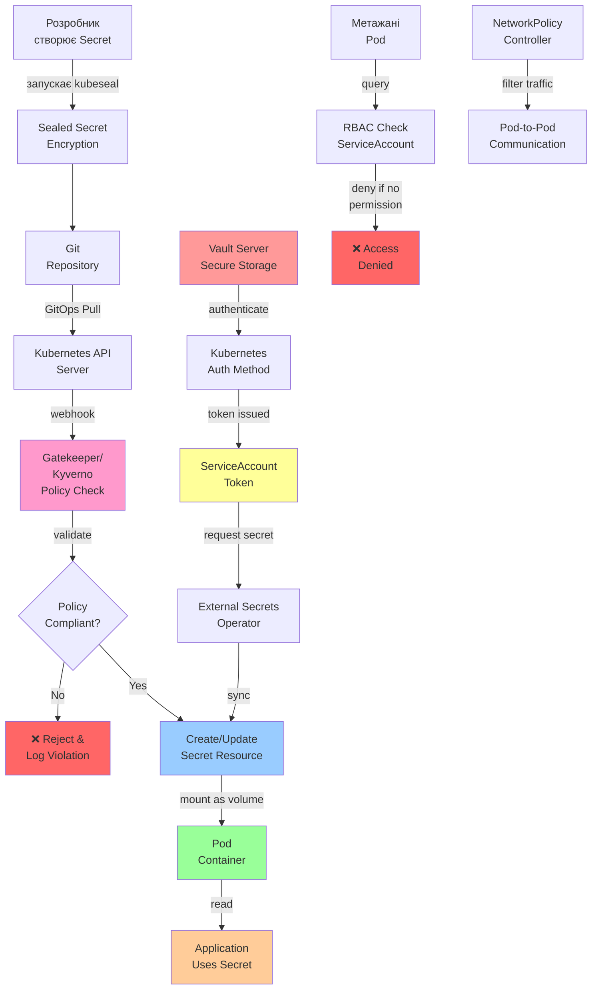

# Лекція 20 Управління секретами та політики безпеки в Kubernetes

## 1. Критичність управління секретами та основні загрози

Секрети в контексті Kubernetes означають будь-яку конфіденційну інформацію, необхідну для роботи застосунку: паролі до баз даних, API ключі, сертифікати, токени автентифікації, приватні ключі для шифрування, та інша чутлива інформація. Управління цими секретами являється одним з найбільш критичних аспектів безпеки в Kubernetes, оскільки неправильна обробка секретів може призвести до повної компрометації системи та витоку конфіденційних даних.

Найбільш поширена помилка при управлінні секретами — це зберігання їх прямо в коді або у конфігураційних файлах Git. Це надзвичайно вразливо, оскільки Git історія зберігається на кількох серверах, резервні копії можуть знаходитися в хмарі або на персональних комп'ютерах розробників, та будь-хто з доступом до репозиторію матиме доступ до секретів. Навіть якщо пізніше видалити секрети з репозиторію, вони залишатимуться в історії Git та можуть бути відновлені.

Друга поширена помилка — це використання環境變數для передачі секретів. На перший погляд, це здається безпечнішим, ніж зберігання в кодом, однак змінні середовища часто видимі в логах процесів, які можуть переглядатися іншими користувачами або контейнерами на одному хості, та часто перелічуються в output команд ps та набагато інших утиліт.

Навіть зберігання в Kubernetes Secrets, як ми побачимо далі, не гарантує повної безпеки, оскільки Kubernetes Secrets за замовчуванням кодуються тільки у base64, що не являється криптографічним шифруванням. Тому організації часто використовують спеціалізовані системи управління секретами, такі як HashiCorp Vault, AWS Secrets Manager, або Google Cloud Secret Manager, для централізованого управління та безпечного зберігання конфіденційної інформації.

## 2. HashiCorp Vault: архітектура та інтеграція з Kubernetes

HashiCorp Vault — це комплексне рішення для управління доступом до секретів та шифрування даних. На відміну від простих сховищ паролів, Vault забезпечує централізоване управління, ревізію, та динамічне генерування секретів. Архітектура Vault побудована навколо концепції "secrets as a service" — Vault обслуговує вхідні запити від застосунків та розповсюджує мінімально необхідні секрети з встановленими термінами дії та контролем доступу.

Ядро архітектури Vault складається з кількох компонентів. Storage backend — це місце, де Vault зберігає всі свої дані, включаючи секрети, конфігурацію та логи ревізії. Storage backend може бути реалізований на основі різних систем: файлова система (небезпечна для продакшну), хмарні послуги (AWS S3, Google Cloud Storage), або спеціалізовані системи як Consul або etcd. Важливо, що дані в storage backend завжди шифруються Vault за допомогою головного ключа шифрування (master key).

Authentication методи в Vault дозволяють клієнтам (людям чи застосункам) підтвердити свою ідентичність. Vault підтримує численні методи автентифікації: методи на основі пароля та API ключів, методи на основі сертифікатів, інтеграція з зовнішніми системами ідентифікації (LDAP, OIDC), та методи, специфічні для хмарних платформ (AWS IAM, Google Cloud IAM). Особливо цікавим для Kubernetes інтеграції являється Kubernetes auth method, який дозволяє Pod-ам автентифікуватися в Vault використовуючи їх ServiceAccount token.

Secrets engines — це компоненти Vault, які генерують, зберігають та управляють секретами. Існує кілька типів secrets engines: Key/Value секрети для зберігання статичних даних, динамічні секрети, які генеруються на запит (наприклад, короткоживучі облікові дані до бази даних), та транзитне шифрування для шифрування даних поза Vault.

Policies в Vault визначають, який аутентифікований користувач чи приложення може виконувати які операції з якими секретами. Policies написані на простій DSL (Domain-Specific Language) та дозволяють гранулярно контролювати доступ на рівні операцій (read, write, delete) та шляхів до секретів.

Інтеграція Vault з Kubernetes типово здійснюється через внішній оператор, такий як External Secrets Operator або через Vault Injector. Vault Injector автоматично ін'єктує секрети в Pod-и на основі анотацій (annotations), тоді як External Secrets Operator синхронізує секрети з Vault в Kubernetes Secrets. Це дозволяє застосункам отримувати доступ до секретів через стандартний Kubernetes API без необхідності знати про Vault.

## 3. Sealed Secrets та їх роль в GitOps підході

Sealed Secrets — це проєкт від Bitnami, який розв'язує специфічну проблему: як безпечно зберігати секрети в Git репозиторії при використанні GitOps підходу, де всі конфігурації зберігаються в Git та автоматично синхронізуються в кластер.

Ідея Sealed Secrets полягає в наступному: замість зберігання секретів в открытому вигляді або base64 кодуванні, розробник зашифровує секрет публічним ключем, який з'єднаний з кластером. Зашифровані дані (sealed secret) можуть безпечно зберігатися в Git, оскільки їх розшифровка потребує приватного ключа, який знаходиться тільки в кластері. Коли sealed secret потрапляє в кластер, контролер Sealed Secrets розшифровує його приватним ключем та створює звичайний Kubernetes Secret.

Процес роботи з Sealed Secrets виглядає наступним чином. На першому кроці адміністратор встановлює контролер Sealed Secrets в кластер та генерує пару ключів. Розробник отримує публічний ключ (який небезпечно зберігати та розповсюджувати). Коли розробник хоче додати нову секрету, він використовує утиліту kubeseal для шифрування секрету: kubeseal завантажує публічний ключ з кластера, шифрує дані та створює YAML манифест з sealed secret. Цей манифест потім може бути додан в Git репозиторій. Коли манифест потрапляє в кластер (через GitOps оператор чи вручну), контролер виявляє sealed secret та розшифровує його в звичайний Kubernetes Secret.

Основна відмінність між Sealed Secrets та Vault полягає в складності та функціональності. Vault — це повноцінна система управління секретами з обширною функціональністю, включаючи динамічні секрети, складне управління доступом та ревізію. Sealed Secrets — це більш просте рішення, краще підходить для меньших організацій чи проєктів, де основна потреба — це безпечно зберігати статичні секрети в Git. Vault дороже в впровадженні та вимагає більше операційної роботи, але забезпечує набагато більше функціональності та контролю.

## 4. Kubernetes Secrets: обмеження та розширена функціональність

Kubernetes має вбудовану підтримку для управління секретами через ресурс Secret. Кожна Secret у Kubernetes — це об'єкт, що містить пари ключ-значення, де значення зберігаються в base64 кодуванні. Існує кілька типів Secrets: generic (для довільних даних), docker-registry (для облікових даних до контейнерних реєстрів), tls (для сертифікатів та приватних ключів), ssh (для SSH ключів), та basic-auth (для HTTP базової автентифікації).

Однак, важливо розуміти, що base64 кодування використовується в Kubernetes Secret тільки для конвертування бінарних даних в текстовий формат, а не для криптографічного захисту. Base64 можна легко декодувати, тому Secret в Kubernetes за замовчуванням не забезпечує достатнього рівня безпеки для критичних секретів. Раніше, Kubernetes Secrets зберігалися в etcd без шифрування, однак в сучасних версіях Kubernetes можна включити encryption at rest для etcd, яка забезпечує шифрування всіх Secret об'єктів на диску.

Навіть з шифруванням, Kubernetes Secrets мають обмеження в плані контролю доступу. За замовчуванням, будь-який, хто має доступ до кластера та може виконати команду kubectl get secrets, матиме доступ до всіх Secret об'єктів. Хоча RBAC (Role-Based Access Control) може бути налаштований для обмеження доступу до специфічних Secrets, це вимагає ручної конфігурації та контролю.

External Secrets Operator (ESO) — це оператор Kubernetes, який розширює функціональність управління секретами шляхом синхронізації SecretStore (зберігалище секретів, які визначені зовні кластера) в стандартні Kubernetes Secrets. ESO підтримує numeroaus백엔드, включаючи HashiCorp Vault, AWS Secrets Manager, Azure Key Vault, Google Cloud Secret Manager, та інші. Коли SecretStore налаштований та пов'язаний з ExternalSecret, ESO автоматично завантажує секрети з зовнішнього сховища та синхронізує їх в Kubernetes Secret. Якщо секрет в зовнішньому сховище змінився, ESO автоматично оновить відповідний Kubernetes Secret.

Приклад конфігурації ESO для синхронізації секретів з Vault виглядатиме наступним чином:

```yaml
---
# SecretStore для Vault
apiVersion: external-secrets.io/v1beta1
kind: SecretStore
metadata:
  name: vault-backend
  namespace: default
spec:
  provider:
    vault:
      server: "https://vault.example.com"
      path: "secret"
      auth:
        kubernetes:
          mountPath: "kubernetes"
          role: "default"

---
# ExternalSecret, який синхронізує дані з Vault
apiVersion: external-secrets.io/v1beta1
kind: ExternalSecret
metadata:
  name: app-secrets
  namespace: default
spec:
  refreshInterval: 1h
  secretStoreRef:
    name: vault-backend
    kind: SecretStore
  target:
    name: app-secrets
    creationPolicy: Owner
  data:
    - secretKey: database-password
      remoteRef:
        key: database
        property: password
    - secretKey: api-key
      remoteRef:
        key: api
        property: key
```

Цей приклад демонструє як ESO може автоматично синхронізувати секрети з Vault. SecretStore визначає, як підключитися до Vault (адреса, шлях, метод автентифікації). ExternalSecret визначає, які дані завантажувати з Vault та як їх синхронізувати в Kubernetes Secret. Параметр refreshInterval визначає як часто ESO повинна перевіряти наявність змін у Vault.

## 5. RBAC в Kubernetes: детальний огляд та практичне застосування

Role-Based Access Control (RBAC) в Kubernetes дозволяє гранулярно контролювати, які користувачі та сервіси можуть виконувати які операції над якими ресурсами. RBAC є ключовим компонентом безпеки Kubernetes та часто використовується для реалізації принципу найменшого привілею (principle of least privilege), де кожен користувач чи сервіс отримує тільки мінімально необхідні дозволи для виконання своїх завдань.

Основні компоненти RBAC складаються з кількох об'єктів: Role (для дозволів на рівні namespace) або ClusterRole (для дозволів на рівні кластера), RoleBinding (для прив'язування Role до користувачів чи сервісних рахунків в namespace) або ClusterRoleBinding (для прив'язування ClusterRole до користувачів на рівні кластера), та ServiceAccount (облікові дані сервісу в Kubernetes).

Role визначається за допомогою YAML манифесту, в якому перелічуються дозволи (rules). Кожне правило (rule) дозволяє операції (verbs) над ресурсами (resources). Приклад Role, яка дозволяє читання та запис до ConfigMaps та Secrets в namespace:

```yaml
apiVersion: rbac.authorization.k8s.io/v1
kind: Role
metadata:
  name: app-config-manager
  namespace: production
rules:
  - apiGroups: [""]
    resources: ["configmaps"]
    verbs: ["get", "list", "watch", "create", "update", "patch"]
  - apiGroups: [""]
    resources: ["secrets"]
    verbs: ["get", "list"]
  - apiGroups: [""]
    resources: ["pods"]
    verbs: ["get", "list"]
```

Цей Role дозволяє повний доступ до ConfigMaps в namespace (можна читати, переглядати, створювати та модифікувати), тільки читання Secrets (що мінімізує ризик непередбачуваної модифікації важливих даних), та читання інформації про Pods.

ClusterRole подібна до Role, але застосовується на рівні всього кластера і може давати дозволи на cluster-scoped ресурси як Nodes, ClusterRole самі та інші. Приклад ClusterRole для системного адміністратора:

```yaml
apiVersion: rbac.authorization.k8s.io/v1
kind: ClusterRole
metadata:
  name: cluster-admin-custom
rules:
  - apiGroups: ["*"]
    resources: ["*"]
    verbs: ["*"]
  - nonResourceURLs: ["/metrics", "/logs"]
    verbs: ["get"]
```

RoleBinding з'єднує Role з користувачами чи ServiceAccounts. Приклад RoleBinding, який дозволяє ServiceAccount 'app-deployer' в namespace 'production' виконувати операції, визначені в Role 'app-config-manager':

```yaml
apiVersion: rbac.authorization.k8s.io/v1
kind: RoleBinding
metadata:
  name: app-deployer-binding
  namespace: production
roleRef:
  apiGroup: rbac.authorization.k8s.io
  kind: Role
  name: app-config-manager
subjects:
  - kind: ServiceAccount
    name: app-deployer
    namespace: production
  - kind: User
    name: developer@example.com
    apiGroup: rbac.authorization.k8s.io
```

ServiceAccount являється ідентичністю для Pod-ів та інших сервісів в Kubernetes. Коли Pod-у потрібно взаємодіяти з API сервером Kubernetes (наприклад, для читання конфігурацій або управління іншими ресурсами), він використовує ServiceAccount, який має пов'язаний токен. Цей токен зберігається в Secrets та автоматично монтується в Pod під час запуску.

Приклад ServiceAccount та його використання в Pod-і:

```yaml
---
apiVersion: v1
kind: ServiceAccount
metadata:
  name: app-deployer
  namespace: production

---
apiVersion: v1
kind: Pod
metadata:
  name: app-pod
  namespace: production
spec:
  serviceAccountName: app-deployer
  containers:
    - name: app
      image: myapp:v1
      volumeMounts:
        - name: sa-token
          mountPath: /var/run/secrets/kubernetes.io/serviceaccount
  volumes:
    - name: sa-token
      secret:
        secretName: app-deployer-token
        items:
          - key: token
            path: token
```

## 6. Мережеві політики (NetworkPolicy): ізоляція та контроль трафіку

NetworkPolicy в Kubernetes дозволяє визначати правила інгресу та егресу для мережевого трафіку, що направляється до та від Pod-ів. За замовчуванням, всі Pod-и в Kubernetes можуть взаємодіяти один з одним, що являється потенційною безпекою ризиком. Якщо одна из Pod виявиться скомпрометована, вона матиме доступ до всіх інших Pod-ів в кластері. NetworkPolicy дозволяє реалізувати мережеву ізоляцію та слідувати принципу найменшого привілею на рівні мережі.

NetworkPolicy визначається за допомогою selector'ів для визначення Pod-ів, до яких застосовується політика. Потім визначаються rules для ingress (вхідний трафік) та egress (вихідний трафік). Кожне правило вказує на тип трафіку, протокол та порт. Приклад NetworkPolicy, яка ізолює базу даних від непотрібного трафіку:

```yaml
apiVersion: networking.k8s.io/v1
kind: NetworkPolicy
metadata:
  name: database-isolation
  namespace: production
spec:
  podSelector:
    matchLabels:
      app: database
  policyTypes:
    - Ingress
    - Egress
  ingress:
    - from:
        - podSelector:
            matchLabels:
              app: backend
      ports:
        - protocol: TCP
          port: 5432
  egress:
    - to:
        - podSelector:
            matchLabels:
              app: fileserver
      ports:
        - protocol: TCP
          port: 8080
    - to:
        - namespaceSelector: {}
      ports:
        - protocol: TCP
          port: 53
        - protocol: UDP
          port: 53
```

Ця NetworkPolicy визначає, що Pod-и з мітокою app=database можуть приймати вхідний трафік тільки від Pod-ів з мітокою app=backend на порті 5432 (PostgreSQL). На рівні вихідного трафіку, база даних може обмінюватися даними с файловим сервером та робити DNS запити (порти 53), але не может звертатися до інших сервісів.

Важливо розуміти, що NetworkPolicy ефективна тільки якщо мережевий плагін вашого Kubernetes кластера це підтримує. Типові плагіни, які підтримують NetworkPolicy: Calico, Cilium, Weave, та інші. Якщо мережевий плагін не підтримує NetworkPolicy, правила не матимуть ніякого ефекту.

## 7. Compliance as Code: OPA/Gatekeeper та Kyverno для визначення та виконання політик

Compliance as Code означає кодифікацію вимог безпеки та відповідності у вигляді машиночитаних правил, які можуть бути автоматично перевіренні та виконані. В контексті Kubernetes, це означає визначення політик управління доступом та контролю безпеки в файлах конфігурацій, які можуть бути версіоновані, переглянуті та автоматично застосовані.

OPA (Open Policy Agent) та його Kubernetes інтеграція Gatekeeper дозволяють визначати складні політики управління доступом за допомогою декларативної мови Rego. Gatekeeper перехоплює запити до API сервера Kubernetes та перевіряє їх проти визначених політик перед тим, як ресурс буде створений або модифікований.

Приклад ConstraintTemplate, яка забороняє використання priviledged контейнерів:

```yaml
apiVersion: constraints.gatekeeper.sh/v1beta1
kind: ConstraintTemplate
metadata:
  name: k8srequiredlabels
spec:
  crd:
    spec:
      names:
        kind: K8sRequiredLabels
      validation:
        openAPIV3Schema:
          properties:
            labels:
              type: array
              items:
                type: string
  targets:
    - target: admission.k8s.gatekeeper.sh
      rego: |
        package k8srequiredlabels
        violation[{"msg": msg}] {
            container := input.review.object.spec.containers[_]
            not container.securityContext.privileged == false
            msg := sprintf("Container %v cannot run in privileged mode", [container.name])
        }

---
apiVersion: constraints.gatekeeper.sh/v1beta1
kind: K8sRequiredLabels
metadata:
  name: require-non-privileged
spec:
  match:
    excludedNamespaces: ["kube-system", "gatekeeper-system"]
  parameters:
    labels: ["app", "owner"]
```

Kyverno — це альтернатива OPA/Gatekeeper, яка спеціально розроблена для Kubernetes та використовує YAML для визначення політик на відміну від Rego. Kyverno політики більш читабельні для розробників, які не знайомі з DSL мовами. Приклад Kyverno PolicyCluster, яка вимагає, щоб всі образи були натиснуті з конкретного реєстра:

```yaml
apiVersion: kyverno.io/v1
kind: ClusterPolicy
metadata:
  name: require-image-registry
spec:
  validationFailureAction: audit
  rules:
    - name: check-image-registry
      match:
        resources:
          kinds:
            - Pod
      validate:
        message: "Image from untrusted registry"
        pattern:
          spec:
            containers:
              - image: "corp-registry.example.com/*"
    - name: check-image-signature
      match:
        resources:
          kinds:
            - Pod
      verify:
        imageExtensions:
          - name: cosign-signature
            imageExtension: cosign.sigstore.dev
        attestations:
          - name: check-slsa
            attestationPattern: |
              (slsa.completeness.materials == "false") ||
              (slsa.completeness.environment == "false")
```

Ця Kyverno політика визначає два правила: перша вимагає, щоб всі образи були з корпоративного реєстра, друга перевіряє підпис образу використовуючи Cosign для забезпечення його цілісності. Параметр validationFailureAction визначає, як обробляти порушення: audit означає логування без блокування, enforce означає блокування запиту.

## 8. Практичний приклад: комплексна безпекова архітектура в Kubernetes

Розглянемо реальний сценарій: розгортання вебдодатку з базою даних в Kubernetes з використанням Vault для управління секретами, NetworkPolicy для мережевої ізоляції, та RBAC для контролю доступу.

Архітектура складається з таких компонентів: Vault сервер (що працює в окремому namespace), PostgreSQL база даних, вебдодаток (backend), та фронтенд. Кожен компонент має свої SecurityContext, RBAC дозволи та мережеві політики.

Спочатку встановлюємо Vault та налаштовуємо його для роботи з Kubernetes:

```yaml
---
# Vault Deployment
apiVersion: apps/v1
kind: Deployment
metadata:
  name: vault
  namespace: vault
spec:
  replicas: 1
  selector:
    matchLabels:
      app: vault
  template:
    metadata:
      labels:
        app: vault
    spec:
      serviceAccountName: vault
      containers:
        - name: vault
          image: vault:1.15
          args:
            - server
            - -config=/vault/config/vault.hcl
          ports:
            - containerPort: 8200
              name: http
          volumeMounts:
            - name: config
              mountPath: /vault/config
            - name: data
              mountPath: /vault/data
          env:
            - name: VAULT_ADDR
              value: "http://127.0.0.1:8200"
      volumes:
        - name: config
          configMap:
            name: vault-config
        - name: data
          emptyDir: {}

---
# Vault Service
apiVersion: v1
kind: Service
metadata:
  name: vault
  namespace: vault
spec:
  ports:
    - port: 8200
      targetPort: 8200
  selector:
    app: vault

---
# Service Account для Vault
apiVersion: v1
kind: ServiceAccount
metadata:
  name: vault
  namespace: vault

---
# ClusterRoleBinding для Vault auth
apiVersion: rbac.authorization.k8s.io/v1
kind: ClusterRoleBinding
metadata:
  name: vault-auth-delegator
roleRef:
  apiGroup: rbac.authorization.k8s.io
  kind: ClusterRole
  name: system:auth-delegator
subjects:
  - kind: ServiceAccount
    name: vault
    namespace: vault
```

Потім налаштовуємо External Secrets Operator для синхронізації секретів з Vault:

```yaml
---
# SecretStore для підключення до Vault
apiVersion: external-secrets.io/v1beta1
kind: SecretStore
metadata:
  name: vault-secret-store
  namespace: production
spec:
  provider:
    vault:
      server: "http://vault.vault:8200"
      path: "secret"
      auth:
        kubernetes:
          mountPath: "kubernetes"
          role: "app-role"

---
# ExternalSecret для синхронізації credentials бази даних
apiVersion: external-secrets.io/v1beta1
kind: ExternalSecret
metadata:
  name: database-credentials
  namespace: production
spec:
  refreshInterval: 1h
  secretStoreRef:
    name: vault-secret-store
    kind: SecretStore
  target:
    name: db-secret
    creationPolicy: Owner
  data:
    - secretKey: username
      remoteRef:
        key: postgres
        property: username
    - secretKey: password
      remoteRef:
        key: postgres
        property: password

---
# ExternalSecret для API ключів
apiVersion: external-secrets.io/v1beta1
kind: ExternalSecret
metadata:
  name: app-credentials
  namespace: production
spec:
  refreshInterval: 1h
  secretStoreRef:
    name: vault-secret-store
    kind: SecretStore
  target:
    name: app-secret
    creationPolicy: Owner
  data:
    - secretKey: api-key
      remoteRef:
        key: app
        property: api-key
    - secretKey: database-url
      remoteRef:
        key: app
        property: database-url
```

Потім розгортаємо базу даних з RBAC дозволами та NetworkPolicy:

```yaml
---
# ServiceAccount для бази даних
apiVersion: v1
kind: ServiceAccount
metadata:
  name: postgres
  namespace: production

---
# Role для читання database credentials
apiVersion: rbac.authorization.k8s.io/v1
kind: Role
metadata:
  name: postgres-secret-reader
  namespace: production
rules:
  - apiGroups: [""]
    resources: ["secrets"]
    resourceNames: ["db-secret"]
    verbs: ["get"]

---
# RoleBinding
apiVersion: rbac.authorization.k8s.io/v1
kind: RoleBinding
metadata:
  name: postgres-secret-reader-binding
  namespace: production
roleRef:
  apiGroup: rbac.authorization.k8s.io
  kind: Role
  name: postgres-secret-reader
subjects:
  - kind: ServiceAccount
    name: postgres
    namespace: production

---
# NetworkPolicy для ізоляції бази даних
apiVersion: networking.k8s.io/v1
kind: NetworkPolicy
metadata:
  name: postgres-isolation
  namespace: production
spec:
  podSelector:
    matchLabels:
      app: postgres
  policyTypes:
    - Ingress
    - Egress
  ingress:
    - from:
        - podSelector:
            matchLabels:
              app: backend
      ports:
        - protocol: TCP
          port: 5432
  egress:
    - to:
        - namespaceSelector: {}
      ports:
        - protocol: TCP
          port: 53
        - protocol: UDP
          port: 53

---
# PostgreSQL StatefulSet
apiVersion: apps/v1
kind: StatefulSet
metadata:
  name: postgres
  namespace: production
spec:
  serviceName: postgres
  replicas: 1
  selector:
    matchLabels:
      app: postgres
  template:
    metadata:
      labels:
        app: postgres
    spec:
      serviceAccountName: postgres
      securityContext:
        fsGroup: 999
        runAsNonRoot: true
        runAsUser: 999
      containers:
        - name: postgres
          image: postgres:15-alpine
          ports:
            - containerPort: 5432
          env:
            - name: POSTGRES_PASSWORD
              valueFrom:
                secretKeyRef:
                  name: db-secret
                  key: password
            - name: POSTGRES_USER
              valueFrom:
                secretKeyRef:
                  name: db-secret
                  key: username
          securityContext:
            allowPrivilegeEscalation: false
            readOnlyRootFilesystem: true
            capabilities:
              drop:
                - ALL
          volumeMounts:
            - name: data
              mountPath: /var/lib/postgresql/data
            - name: tmp
              mountPath: /tmp
            - name: run
              mountPath: /run
  volumeClaimTemplates:
    - metadata:
        name: data
      spec:
        accessModes: [ "ReadWriteOnce" ]
        resources:
          requests:
            storage: 10Gi
```

Нарешті розгортаємо вебдодаток з дозволом читання секретів та NetworkPolicy для комунікації з БД:

```yaml
---
# ServiceAccount для бекенду
apiVersion: v1
kind: ServiceAccount
metadata:
  name: backend
  namespace: production

---
# Role для читання app секретів
apiVersion: rbac.authorization.k8s.io/v1
kind: Role
metadata:
  name: backend-secret-reader
  namespace: production
rules:
  - apiGroups: [""]
    resources: ["secrets"]
    resourceNames: ["app-secret", "db-secret"]
    verbs: ["get"]
  - apiGroups: [""]
    resources: ["configmaps"]
    verbs: ["get", "list"]

---
# RoleBinding
apiVersion: rbac.authorization.k8s.io/v1
kind: RoleBinding
metadata:
  name: backend-secret-reader-binding
  namespace: production
roleRef:
  apiGroup: rbac.authorization.k8s.io
  kind: Role
  name: backend-secret-reader
subjects:
  - kind: ServiceAccount
    name: backend
    namespace: production

---
# NetworkPolicy для бекенду
apiVersion: networking.k8s.io/v1
kind: NetworkPolicy
metadata:
  name: backend-network-policy
  namespace: production
spec:
  podSelector:
    matchLabels:
      app: backend
  policyTypes:
    - Ingress
    - Egress
  ingress:
    - from:
        - podSelector:
            matchLabels:
              app: frontend
      ports:
        - protocol: TCP
          port: 8080
  egress:
    - to:
        - podSelector:
            matchLabels:
              app: postgres
      ports:
        - protocol: TCP
          port: 5432
    - to:
        - namespaceSelector: {}
      ports:
        - protocol: TCP
          port: 53
        - protocol: UDP
          port: 53

---
# Deployment бекенду
apiVersion: apps/v1
kind: Deployment
metadata:
  name: backend
  namespace: production
spec:
  replicas: 3
  selector:
    matchLabels:
      app: backend
  template:
    metadata:
      labels:
        app: backend
    spec:
      serviceAccountName: backend
      securityContext:
        runAsNonRoot: true
        runAsUser: 1000
      containers:
        - name: app
          image: myapp-backend:v1
          ports:
            - containerPort: 8080
          env:
            - name: DB_HOST
              value: "postgres.production.svc.cluster.local"
            - name: DB_PORT
              value: "5432"
            - name: DB_USER
              valueFrom:
                secretKeyRef:
                  name: db-secret
                  key: username
            - name: DB_PASSWORD
              valueFrom:
                secretKeyRef:
                  name: db-secret
                  key: password
            - name: API_KEY
              valueFrom:
                secretKeyRef:
                  name: app-secret
                  key: api-key
          securityContext:
            allowPrivilegeEscalation: false
            readOnlyRootFilesystem: true
            capabilities:
              drop:
                - ALL
          volumeMounts:
            - name: tmp
              mountPath: /tmp
          livenessProbe:
            httpGet:
              path: /health
              port: 8080
            initialDelaySeconds: 30
            periodSeconds: 10
          readinessProbe:
            httpGet:
              path: /ready
              port: 8080
            initialDelaySeconds: 5
            periodSeconds: 5
      volumes:
        - name: tmp
          emptyDir: {}
```

Цей практичний приклад демонструє комплексний підхід до безпеки в Kubernetes, де секрети зберігаються в Vault, синхронізуються через External Secrets Operator, контроль доступу реалізується через RBAC та ServiceAccounts, та мережева ізоляція забезпечується через NetworkPolicy.

## 9. Архітектура управління секретами у Kubernetes

Діаграма нижче демонструє архітектуру інтеграції Vault з Kubernetes та компоненти, задіяні в управлінні секретами:



Ця діаграма демонструє повний цикл управління секретами у Kubernetes: від створення sealed secrets розробником, через валідацію Gatekeeper/Kyverno, до синхронізації з Vault через External Secrets Operator, та нарешті до використання в Pod-ах з дотриманням RBAC та NetworkPolicy.

## Контрольні запитання

1. Поясніть, чому зберігання секретів в Git репозиторії або в змінних середовища являється небезпечним, та які альтернативи існують для безпечного управління секретами.

2. Порівняйте HashiCorp Vault та Sealed Secrets, визначте їх переваги та недоліки, та поясніть сценарії, в яких кожне рішення найбільш доречне.

3. Розгляньте обмеження Kubernetes Secrets та поясніть, як External Secrets Operator розширює функціональність управління секретами через інтеграцію з зовнішніми сховищами.

4. Опишіть RBAC в Kubernetes детально, включаючи ролі ServiceAccounts, Roles, ClusterRoles та RoleBindings, та наведіть приклади гранулярного контролю доступу.

5. Поясніть концепцію мережевих політик (NetworkPolicy) в Kubernetes та як вони забезпечують ізоляцію Pod-ів та контроль трафіку на рівні мережі.

6. Розгляньте Compliance as Code та поясніть, як OPA/Gatekeeper та Kyverno забезпечують автоматичне перевірку та виконання безпекових політик.

7. Проектуючи безпеку для мікросервіс архітектури в Kubernetes, які компоненти (Vault, NetworkPolicy, RBAC, Gatekeeper) ви б використовували та як б вони взаємодіяли один з одним для забезпечення комплексної безпеки?
