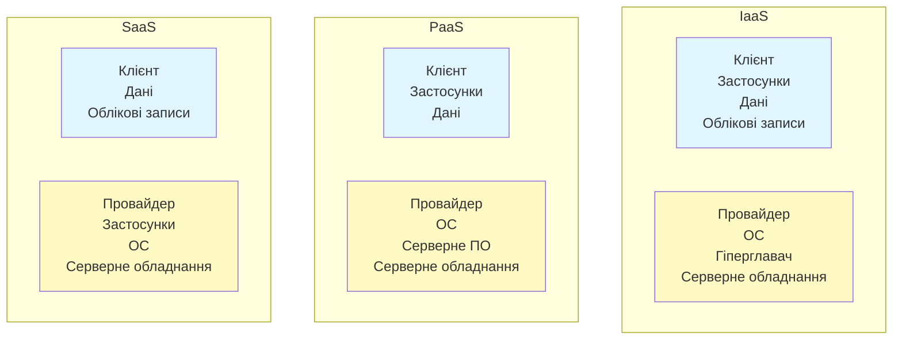
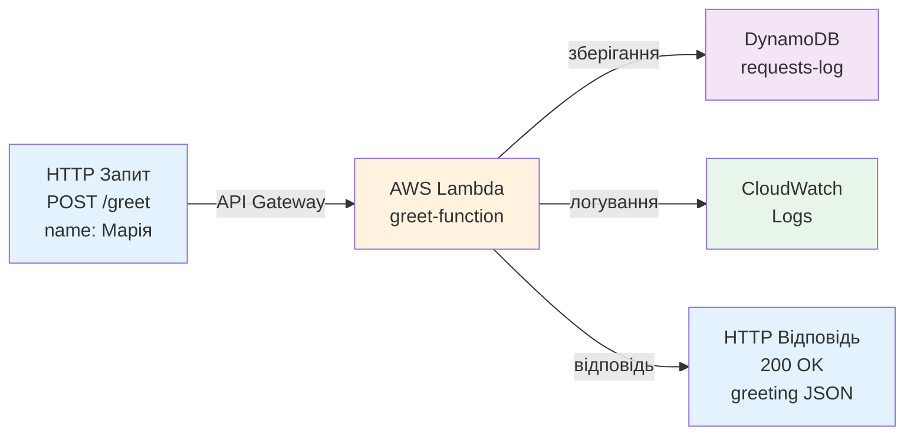
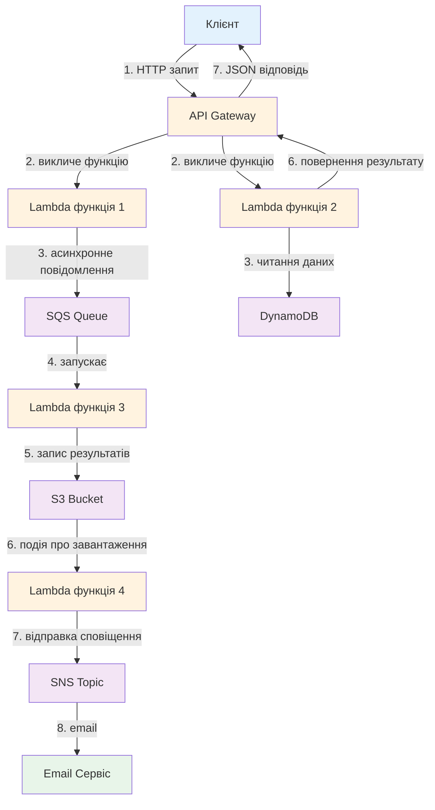

# Лекція 21 Хмарні платформи та безсерверні архітектури

## 1. Вступ до хмарних обчислень

Хмарні обчислення становлять сьогодні один з найважливіших стовпів сучасної інформаційної інфраструктури. На відміну від традиційного підходу, коли організація самостійно придбувала, встановлювала та обслуговувала серверне обладнання, хмарні платформи пропонують гнучкий доступ до обчислювальних ресурсів через мережу Інтернет на правах послуги. Це фундаментально змінило спосіб, у який розробники та операційні команди проєктують, розгортають та масштабують застосунки.

Головна перевага хмарних обчислень полягає в тому, що розробники можуть сконцентруватися на створенні бізнес-логіки своїх застосунків, делегуючи управління базовою інфраструктурою хмарному провайдеру. Це скорочує час виходу продукту на ринок, знижує капітальні видатки та дозволяє підприємствам швидко адаптуватися до змін попиту. Однак переход до хмарних обчислень вимагає глибокого розуміння різних моделей обслуговування, їх особливостей, переваг та обмежень.

## 2. Моделі хмарних обчислень

### 2.1. Три основні моделі: IaaS, PaaS, SaaS

Хмарні обчислення традиційно поділяються на три основні моделі обслуговування, які відрізняються рівнем абстракції та розподілом відповідальності між клієнтом і провайдером. Розуміння цих моделей критично важливо для вибору відповідної платформи під потреби конкретного проєкту.

**Infrastructure as a Service (IaaS)** являє собою найнижчий рівень абстракції в екосистемі хмарних обчислень. При використанні IaaS клієнт отримує доступ до віртуалізованих обчислювальних ресурсів через мережу. Провайдер управляє фізичним обладнанням, гіперглавачами, мережевою інфраструктурою та сховищем даних, тоді як клієнт несе відповідальність за операційну систему, промідлевальне забезпечення, застосунки та дані. Типовими прикладами IaaS є Amazon EC2, Microsoft Azure Virtual Machines та Google Compute Engine. Цей модель надає максимальну гнучкість і контроль, але вимагає від клієнта значних знань щодо управління інфраструктурою.

**Platform as a Service (PaaS)** розташована на середньому рівні абстракції. Провайдер керує не лише інфраструктурою, але й операційною системою, серверами додатків та інструментами розробки. Клієнт отримує готове середовище для розробки, розгортання та масштабування своїх застосунків без необхідності турбуватися про управління основною інфраструктурою. Приклади включають Heroku, Google App Engine та Microsoft Azure App Service. PaaS дозволяє розробникам зосередитися на коді застосунку, але припускає менше контролю над середовищем виконання та часто супроводжується більш високими витратами при великих обсягах.

**Software as a Service (SaaS)** — це найвищий рівень абстракції, де клієнт взаємодіє з готовим застосунком, розміщеним на серверах провайдера. Провайдер управляє всім: від інфраструктури до застосунку та його даних (за винятком користувацьких даних). Типові приклади SaaS включають Google Workspace, Microsoft Office 365, Slack та Salesforce. SaaS мінімізує витрати на управління інфраструктурою і дозволяє організаціям швидко впровадити готові рішення, але надає мінімум контролю над функціональністю та персоналізацією.

### 2.2. Модель спільної відповідальності (Shared Responsibility Model)

Один з найважливіших концептів, який необхідно усвідомити при роботі з хмарними платформами, — це модель спільної відповідальності. Вона чітко визначає, за які компоненти інфраструктури та безпеки несе відповідальність провайдер, а за які — клієнт.

На рівні IaaS клієнт несе відповідальність за більш широкий набір компонентів. Провайдер гарантує наявність та надійність фізичного обладнання, мережевої інфраструктури та віртуалізації. Однак клієнт повинен самостійно управляти операційною системою, встановленням апаратних оновлень на гостьовій системі, налаштуванням брандмауерів, управлінням користувачами та правами доступу на рівні операційної системи, шифруванням даних у застосунку та захистом облікових записів.

При переходу на PaaS обсяг відповідальності клієнта зменшується. Провайдер тепер управляє операційною системою, серверами додатків, системою управління базами даних та безпекою мережі. Клієнт зосереджується на коді застосунку, управлінні даними та захисті облікових записів користувачів.

На рівні SaaS провайдер контролює практично все, включаючи саму бізнес-логіку застосунку. Клієнт відповідає лише за управління своїми обліковими записами та даними, які він завантажує в систему.



## 3. Огляд провідних хмарних провайдерів

### 3.1. Amazon Web Services (AWS)

Amazon Web Services залишається найбільшим та найзріліішим хмарним провайдером на світовому ринку. AWS пропонує найширший набір сервісів серед усіх конкурентів, охоплюючи практично кожен аспект хмарної інфраструктури та застосунків.

Для обчислювальних ресурсів AWS пропонує Amazon EC2 (Elastic Compute Cloud), що дозволяє запускати віртуальні машини з різними конфігураціями процесорів, пам'яті та накопичувачів. EC2 підтримує різні операційні системи та дозволяє розробникам мати повний контроль над конфігурацією машини. Для зберігання даних AWS пропонує Amazon S3 (Simple Storage Service) — об'єктне сховище, яке забезпечує масивну масштабованість, надійність та доступність.

Для контейнеризованих застосунків AWS забезпечує Amazon EKS (Elastic Kubernetes Service), повністю керований сервіс Kubernetes, який усуває необхідність самостійного управління Kubernetes контрольною площиною. EKS автоматично масштабує контрольну площину, забезпечує оновлення та виправлення безпеки, інтегрується з іншими сервісами AWS та гарантує високу доступність.

Amazon Lambda являє собою безсерверну обчислювальну платформу AWS, яка дозволяє запускати код без необхідності керування серверами чи контейнерами. Lambda автоматично масштабується, сплачується лише час виконання коду та вимагає мінімальної операційної підтримки.

### 3.2. Microsoft Azure

Microsoft Azure становить основний конкурент AWS у хмарному ринку і пропонує порівняний набір сервісів з деякими унікальними перевагами для організацій, які вже використовують Microsoft екосистему.

Azure Virtual Machines забезпечує IaaS рішення, аналогічне AWS EC2, з можливістю запуску Windows та Linux віртуальних машин. Azure Active Directory з глибокою інтеграцією Microsoft продуктів дозволяє управляти доступом та ідентифікацією крім того набагато ефективніше для підприємств, які вже використовують Microsoft технології.

Azure Kubernetes Service (AKS) — це повністю керований Kubernetes сервіс, подібний до AWS EKS, що забезпечує спрощене управління контейнеризованими застосунками. Azure забезпечує вбудовану інтеграцію з Azure DevOps для CI/CD процесів.

Azure Functions являє собою безсерверне рішення Microsoft, еквівалентне AWS Lambda. Azure Functions мають особливу перевагу при інтеграції з іншими Microsoft сервісами та підтримують maggiore різноманітність мов програмування та рантаймів порівняно з конкурентами.

### 3.3. Google Cloud Platform (GCP)

Google Cloud Platform пропонує набір хмарних сервісів з особливим акцентом на машинне навчання, аналітику даних та контейнеризацію.

Google Kubernetes Engine (GKE) вважається найкращою керованою реалізацією Kubernetes серед трьох провайдерів. GKE забезпечує найглибшу інтеграцію з Kubernetes екосистемою та пропонує багато передових функцій для автоматизації та мониторингу.

Cloud Run — це сервіс Google для запуску безсерверних контейнерів, що представляє унікальну комбінацію гнучкості контейнерів та зручності безсерверної архітектури. На відміну від Lambda та Azure Functions, Cloud Run дозволяє розгортати стандартні Docker контейнери без залежностей від специфічних SDK.

Google Cloud Functions, хоча менш популярна за Lambda або Azure Functions, забезпечує базову безсерверну функціональність. Google особливо сильна у сервісах для обробки та аналізу великих обсягів даних, таких як BigQuery та Dataflow.

## 4. Безсерверні архітектури

### 4.1. Концепція та парадигма Serverless

Термін "безсерверна архітектура" часто викликає непорозуміння, оскільки сервери все ще фізично існують. Переважна більшість розробників розуміє під цим терміном архітектурний підхід, при якому розробник повністю абстрагується від управління серверами, операційною системою,容量 планування та масштабуванням інфраструктури. Замість цього, розробник пише функції, які автоматично виконуються у відповідь на певні події, а хмарний провайдер несе відповідальність за усі операційні аспекти.

Безсерверна архітектура змінює парадигму мислення розробників з традиційного монолітного чи мікросервісного дизайну на событийно-керовану архітектуру. Замість постійно запущених сервісів, що прослуховують запити, безсерверні функції існують у "сплячому" стані та активуються лише при виникненні певної події. Це дозволяє досягти значної економії витрат, оскільки клієнт платить лише за фактичний час виконання коду, а не за зарезервовану потужність.

Безсерверна архітектура особливо добре підходить для застосунків з непередбачувана і змінною навантаженням. Якщо застосунок має бути доступний 24/7, але мати, наприклад, 10 запитів на день, то безсерверна функція може грати економічно вже вигідніше за традиційний сервер, який повинен був би працювати неперервно.

### 4.2. Functions as a Service (FaaS)

Functions as a Service (FaaS) утворюють ядро безсерверної парадигми. У моделі FaaS розробник пише функцію — звичайно невелику одиницю коду, що виконує конкретну задачу. Функція активується зовнішньою подією, виконується в ізольованому контексті, повертає результат та завершує роботу.

FaaS функції характеризуються кількома ключовими особливостями. По-перше, вони є **stateless** — функція не зберігає стан між викликами, що дозволяє провайдеру свободу розподіляти виклики по різним серверам та інстансам. По-друге, функції мають обмежену тривалість виконання, тиміч AWS Lambda дозволяє максимум 15 хвилин виконання, хоча більшість функцій виконуються за секунди чи хвилини. По-третє, функції виконуються в ізольованому контексті, отримуючи лише необхідні ресурси, що забезпечує безпеку та запобігає перекросстокам ресурсів між функціями різних користувачів.

### 4.3. Тригери та виклики функцій

Безсерверні функції не викликаються явно розробником, а скоріше активуються на основі певних подій. Тип тригера залежить від архітектури застосунку та типу обробки, яку необхідно виконати.

HTTP тригери дозволяють викликати функцію через HTTP запит, зазвичай через API Gateway. Це дозволяє розбудувати RESTful API без необхідності управління вебсервером. AWS API Gateway, Azure API Management та Google Cloud Endpoints забезпечують маршрутизацію HTTP запитів до відповідних функцій.

События з об'єктних сховищ як Amazon S3 можуть тригерити функції при завантаженні, видаленні або оновленні об'єктів. Це корисно для обробки завантажених файлів, наприклад, генерування мініатюр зображень чи валідації завантажених документів.

События з черг та потокових систем як AWS SQS, AWS Kinesis чи Azure Event Hubs дозволяють функціям обробляти повідомлення з асинхронних систем обробки даних. Це забезпечує decoupling між компонентами системи.

События від планувальника часу (cron) дозволяють викликати функцію за визначеним розкладом. Це корисно для виконання періодичних завдань як архівування даних, очищення тимчасових файлів чи синхронізація зовнішніх систем.

### 4.4. Переваги та обмеження безсерверних архітектур

Безсерверні архітектури пропонують кілька значних переваг. Економіка витрат є переконливою: клієнт платить лише за фактичний час виконання коду, що може привести до радикального скорочення витрат для застосунків з змінною навантаженням. Автоматичне масштабування дозволяє функціям обробляти раптові стрибки трафіку без необхідності наперед конфігурувати потужність. Скорочення операційного навантаження означає, що розробничі команди можуть зосередитися на бізнес-логіці, делегуючи управління інфраструктурою провайдеру. Швидший час вивіду продукту: без необхідності управління серверами, часи розробки та розгортання скорочуються.

Однак безсерверні архітектури мають й значні обмеження. Холодний запуск (cold start) — час затримки при першому викликі функції або при запуску нового інстанса, коли функція має інціалізуватися і завантажити залежності, може тривати кілька секунд і бути неприйнятним для застосунків, що вимагають низької затримки. Прив'язка до провайдера (vendor lock-in) означає, що код функції часто залежить від специфічних API та сервісів конкретного провайдера, затрудняючи міграцію на іншого провайдера. Обмежена тривалість виконання робить безсерверні функції непридатними для довгих обчислювальних завдань. Складність налагодження: розподілене виконання функцій у різних контейнерах ускладнює процес налагодження та моніторингу. Стан (state management) — безсерверні функції є stateless, що вимагає зберігання будь-якого стану в зовнішніх системах як базах даних або кешах.

## 5. AWS Lambda, Azure Functions та GCP Cloud Functions

### 5.1. AWS Lambda

AWS Lambda являє собою лідерський безсерверний сервіс на ринку з найбільшою популярністю та найвищім рівнем зрілості. Lambda підтримує кілька мов програмування, включаючи Python, JavaScript (Node.js), Java, C#, Go, Ruby та користувацькі рантайми через Docker контейнери.

Функція Lambda зберігається як ZIP файл, що містить код та залежності. При виклику функції Lambda контейнер із функцією завантажується в пам'ять, змінні середовища ініціалізуються, та код виконується. Якщо функція викликається знову протягом певного часу, контейнер залишається теплим, і наступний виклик відбувається набагато швидше. Якщо час очікування на наступний виклик перевищує певний держ, контейнер видаляється, і наступний виклик спричинює холодний запуск.

Холодний запуск у Lambda може тривати від кількох сотень мілісекунд до декількох секунд залежно від розміру коду, типу рантайму та мови програмування. Python та Node.js зазвичай мають швидші холодні запуски, тоді як Java виявляється повільнішим через необхідність ініціалізації JVM. Для застосунків, що вимагають низької затримки, це може бути критичним обмеженням.

Lambda забезпечує контроль над пам'яттю, виділеною функції, від 128 МБ до 10240 МБ. Цікаво, що AWS також автоматично масштабує CPU пропорційно виділеній пам'яті, таким чином функції з більшою пам'яттю також отримують більше обчислювальної потужності.

### 5.2. Azure Functions

Azure Functions представляють інтерпретацію безсерверної парадигми Microsoft. Функції Azure підтримують багато мов, включаючи C#, Java, JavaScript, PowerShell, Python та збірні мови.

Функції Azure пропонують більшу гнучкість щодо інтеграцій з Microsoft сервісами через бібліотеку binding та extension. Binding дозволяють функціям легко підключатися до різних сервісів як Azure Queue Storage, Azure Service Bus, Azure Table Storage та Cosmos DB без необхідності писати код низького рівня для з'єднання.

Azure Functions пропонують два режими виконання: Consumption Plan та Premium Plan. Consumption Plan подібна до Lambda, з оплатою за виконання. Premium Plan гарантує постійну готовність функцій та усуває холодні запуски, але коштує дорожче.

### 5.3. GCP Cloud Functions

Google Cloud Functions представляють безсерверне рішення Google. Хоча менш популярна за Lambda, Cloud Functions забезпечує чисту та простоту API. Cloud Functions підтримує Python, Node.js, Go та Java.

Cloud Functions при використанні мови Go мають помітно швидші холодні запуски завдяки компільованій природі мови. Для Python, наслідок холодного запуску є повільнішим, але загалом порівняний з Lambda.

Чітке розділення на першу версію (Cloud Functions) та нову версію (Cloud Functions 2nd gen) надає розробникам більше опцій. Друга генерація використовує Knative, що дозволяє більш тонкого контролю та більш видиму модель біллінгу.

### 5.4. Порівняння холодних запусків та обмежень

Холодні запуски залишаються критичною проблемою безсерверних функцій. Час холодного запуску залежить від кількох факторів: розміру коду, типу рантайму та мови програмування. Python та Node.js зазвичай мають холодні запуски від 100 до 500 мс. Java, через необхідність запуску JVM, може мати холодні запуски від 1 до 5 секунд. Go з його скомпільованою природою може мати холодні запуски менше ніж 50 мс.

AWS Lambda має максимальну тривалість виконання 15 хвилин, Azure Functions мають 10 хвилин у Consumption Plan. GCP Cloud Functions також мають 9 хвилин для першої генерації та 60 хвилин для другої генерації. Ці обмеження роблять безсерверні функції непридатними для задач, що вимагають більше часу.

Обмеження на пам'ять також існують: Lambda дозволяє до 10240 МБ, Azure Functions дозволяють до 1536 МБ в Consumption Plan (3072 МБ в Premium). Cloud Functions дозволяють до 8192 МБ. Ці обмеження впливають на типи завдань, які можна виконувати в безсерверних функціях.

## 6. Безсерверні бази даних та сховища

### 6.1. Amazon DynamoDB

Amazon DynamoDB являє собою повністю керовану NoSQL базу даних, спеціально спроєктовану для безсерверних застосунків. На відміну від традиційних баз даних, DynamoDB масштабується автоматично і не вимагає управління потужністю або резервуванням.

DynamoDB зберігає дані як пари ключ-значення з підтримкою складних атрибутів. Модель даних DynamoDB складається з таблиць, які мають partition key (основний ключ) та опціонально sort key (ключ сортування). Це дозволяє організувати дані таким чином, що запити можуть бути дуже ефективними.

DynamoDB пропонує два режими біллінгу: On-Demand та Provisioned. On-Demand режим подібна до безсерверної парадигми, де клієнт платить за кожен прочитаний та написаний пакет даних. Provisioned режим вимагає наперед зарезервувати пропускну спроможність, що дешевше при передбачувана навантаженні, але дорожче при змінній навантаженню.

### 6.2. AWS Aurora Serverless

AWS Aurora Serverless являє собою версія розподіленої реляційної бази даних AWS Aurora, спеціально оптимізована для безсерверних застосунків та робіт з непередбачуваним навантаженням. На відміну від традиційної Aurora, яка вимагає управління інстансами бази даних, Serverless автоматично масштабує потужність бази даних.

Aurora Serverless використовує концепцію ACU (Aurora Capacity Units), які автоматично масштабуються на основі навантаження. Клієнт визначає мінімальний та максимальний діапазон ACU, а база даних автоматично масштабується в межах цього діапазону.

Aurora Serverless особливо корисна для застосунків, що взаємодіють з реляційними даними через безсерверні функції, забезпечуючи той же рівень автоматизації та абстракції для баз даних.

### 6.3. Google Cloud Firestore

Google Cloud Firestore являє собою повністю керовану NoSQL базу даних, оптимізовану для масштабованості та низької затримки. Firestore автоматично розподіляє дані по наявним інстансам та забезпечує глобальну реплікацію для високої доступності.

На відміну від DynamoDB, Firestore використовує модель документів, де дані організовані як колекції документів. Це дозволяє більш гнучку структуру даних та інтуїтивніше запити для багатьох розробників.

Firestore також забезпечує безсерверну інтеграцію з Cloud Functions та пропонує real-time синхронізацію даних, що корисно для вебдодатків, що потребують live оновлення.

## 7. Кращі практики хмарної безпеки

### 7.1. Identity and Access Management (IAM)

Правильне управління доступом являє собою фундамент безпеки в хмарному середовищі. IAM дозволяє централізоване управління користувачами, групами, ролями та правами доступу до хмарних ресурсів.

Принцип найменшого привілею (Principle of Least Privilege) являє собою основоположний принцип безпеки IAM. Кожен користувач, сервіс чи застосунок повинен мати лише мінімальні права, необхідні для виконання своїх функцій. Це скорочує поверхню атаки у разі компрометації облікового запису чи сервісу.

AWS IAM використовує концепцію ролей та політик. Роль — це набір дозволів, які можуть бути призначені користувачам чи сервісам. Політика — це JSON документ, що описує дозволені та заборонені дії на конкретних ресурсах. Наприклад, Lambda функція може мати роль, яка дозволяє їй читати дані з S3 та записувати результати в DynamoDB, але не має доступу до інших S3 бакетів чи інших сервісів.

Azure використовує Role-Based Access Control (RBAC), де користувачам призначаються ролі (як "Reader", "Contributor", "Owner") на різних рівнях (subscription, resource group, resource). Google Cloud використовує Custom Roles та Predefined Roles для управління доступом.

### 7.2. Шифрування даних у спокої та в русі

Шифрування даних критично важливе для захисту конфіденційної інформації від несанкціонованого доступу. Дані повинні бути захищені як у спокої (data at rest), так і під час передачі (data in transit).

Шифрування даних у спокої означає шифрування даних, що зберігаються у сховищах, базах даних та на дисках. AWS S3 дозволяє вбудоване шифрування за допомогою Server-Side Encryption (SSE-S3 або SSE-KMS). DynamoDB також підтримує шифрування даних у спокої. Клієнти можуть використовувати власні ключи управління через AWS Key Management Service (KMS) для більшого контролю.

Шифрування даних в русі означає використання SSL/TLS протоколів для шифрування даних при передачі через мережу. Усі комунікації з AWS сервісами мають проходити через HTTPS (SSL/TLS). Це запобігає перехопленню даних атакуючими на мережі.

### 7.3. Аудит та логування

Логування та моніторинг дій у хмарному середовищі дозволяють виявляти аномальні дії та потенційні порушення безпеки. AWS CloudTrail логує усі дії користувачів та сервісів, включаючи виклики API, створення ресурсів та видалення. Azure Monitor збирає метрики та логи з усіх ресурсів Azure. Google Cloud Logging забезпечує централізоване логування для всіх сервісів GCP.

Логи мають бути не лише збиралися, але й централізовано зберігатися та аналізуватися. AWS CloudWatch дозволяє визначати сигнали тривоги при виявленні певних умов. Azure Monitor та Google Cloud Monitoring забезпечують аналогічну функціональність.

Критично важливо, щоб логи самі були захищені від несанкціонованого доступу та модифікації. Логи повинні зберігатися в окремому сховищі з обмеженим доступом та обов'язково реплікуватися для забезпечення цілісності.

## 8. Практичний приклад: розгортання безсерверної функції з API Gateway

### 8.1. Сценарій та архітектура

Розглянемо практичний приклад розгортання простої безсерверної функції на AWS Lambda, яка обробляє HTTP запити через API Gateway. Функція приймає JSON об'єкт з ім'ям користувача та повертає привіт з цим ім'ям. Функція логує кожен запит у CloudWatch та зберігає дані про запити в DynamoDB.

Архітектура складається з кількох компонентів. API Gateway приймає HTTP запити та маршрутизує їх до Lambda функції. Lambda функція обробляє запит, виконує необхідну логіку та повертає відповідь. DynamoDB зберігає дані про запити. CloudWatch збирає логи вільної функції.

### 8.2. Код Lambda функції

```python
import json
import boto3
import logging
from datetime import datetime

# Інціалізація клієнтів
dynamodb = boto3.resource('dynamodb')
logger = logging.getLogger()
logger.setLevel(logging.INFO)

# Назва таблиці DynamoDB
TABLE_NAME = 'requests-log'

def lambda_handler(event, context):
    """
    Обробляє HTTP запит від API Gateway.

    Args:
        event: подія від API Gateway, що містить параметри запиту
        context: контекст виконання Lambda функції

    Returns:
        словник з статус кодом та відповіддю JSON
    """

    try:
        # Логування вхідної события
        logger.info(f"Отримано запит: {json.dumps(event)}")

        # Парсинг тіла запиту
        if 'body' in event and event['body']:
            body = json.loads(event['body'])
        else:
            return create_response(400, {"error": "Порожне тіло запиту"})

        # Отримання імені користувача з запиту
        name = body.get('name')
        if not name:
            return create_response(400, {"error": "Параметр 'name' обов'язковий"})

        # Валідація імені (непусте, не більше 100 символів)
        if len(name) > 100:
            return create_response(400, {"error": "Ім'я занадто довге"})

        # Створення відповіді
        greeting = f"Привіт, {name}! Твій запит оброблений у {datetime.now().isoformat()}"

        # Логування результату
        table = dynamodb.Table(TABLE_NAME)
        table.put_item(
            Item={
                'timestamp': datetime.now().isoformat(),
                'name': name,
                'response': greeting
            }
        )

        logger.info(f"Успішно оброблено запит для: {name}")

        # Повернення успішної відповіді
        return create_response(200, {
            "greeting": greeting,
            "processed_at": datetime.now().isoformat()
        })

    except json.JSONDecodeError:
        logger.error("Помилка при парсингу JSON")
        return create_response(400, {"error": "Невалідний JSON формат"})

    except Exception as e:
        logger.error(f"Непередбачена помилка: {str(e)}")
        return create_response(500, {"error": "Внутрішня помилка сервера"})

def create_response(status_code, body):
    """
    Створює відповідь у форматі, очікуваному API Gateway.

    Args:
        status_code: HTTP статус код
        body: тіло відповіді як словник

    Returns:
        словник з formato для API Gateway
    """

    return {
        'statusCode': status_code,
        'headers': {
            'Content-Type': 'application/json',
            'Access-Control-Allow-Origin': '*'
        },
        'body': json.dumps(body, ensure_ascii=False)
    }
```

### 8.3. Конфігурація IAM ролі

Lambda функція потребує IAM ролі з дозволами для доступу до DynamoDB та створення логів у CloudWatch. Ось конфігурація цієї ролі.

```json
{
  "Version": "2012-10-17",
  "Statement": [
    {
      "Effect": "Allow",
      "Action": [
        "dynamodb:PutItem",
        "dynamodb:GetItem",
        "dynamodb:Query"
      ],
      "Resource": "arn:aws:dynamodb:us-east-1:123456789012:table/requests-log"
    },
    {
      "Effect": "Allow",
      "Action": [
        "logs:CreateLogGroup",
        "logs:CreateLogStream",
        "logs:PutLogEvents"
      ],
      "Resource": "arn:aws:logs:us-east-1:123456789012:log-group:/aws/lambda/greet-function"
    }
  ]
}
```

Ця політика дозволяє функції записувати дані у таблицю DynamoDB та логувати повідомлення у CloudWatch. Важливо зауважити, що дозволи обмежені лише на необхідні операції та ресурси, дотримуючись принципу найменшого привілею.

### 8.4. Розгортання через AWS CLI

```bash
# Створення IAM ролі
aws iam create-role \
  --role-name lambda-greet-role \
  --assume-role-policy-document file://trust-policy.json

# Додання політики до ролі
aws iam put-role-policy \
  --role-name lambda-greet-role \
  --policy-name lambda-greet-policy \
  --policy-document file://policy.json

# Упакування функції
zip -r function.zip lambda_function.py

# Створення Lambda функції
aws lambda create-function \
  --function-name greet-function \
  --runtime python3.11 \
  --role arn:aws:iam::123456789012:role/lambda-greet-role \
  --handler lambda_function.lambda_handler \
  --zip-file fileb://function.zip

# Створення API Gateway
aws apigateway create-rest-api \
  --name greet-api \
  --description "API для приймання привітань"

# Інтеграція Lambda з API Gateway (кроки 4-8 опущені для стислості)
# Це вимагає більше команд через необхідність створення ресурсів та методів

# Розгортання API
aws apigateway create-deployment \
  --rest-api-id abc123 \
  --stage-name prod
```

### 8.5. Тестування функції

```bash
# Отримання URL API Gateway
API_URL="https://abc123.execute-api.us-east-1.amazonaws.com/prod"

# Тестування з curl
curl -X POST $API_URL/greet \
  -H "Content-Type: application/json" \
  -d '{"name": "Марія"}'

# Очікувана відповідь
{
  "greeting": "Привіт, Марія! Твій запит оброблений у 2026-03-23T15:30:45.123456",
  "processed_at": "2026-03-23T15:30:45.123456"
}

# Перевірка логів у CloudWatch
aws logs tail /aws/lambda/greet-function --follow
```



## 9. Безсерверна архітектура в дії



## Контрольні запитання

1. Виходячи з моделі спільної відповідальності, опишіть, за які компоненти несе відповідальність клієнт при використанні PaaS порівняно з IaaS. Наведіть конкретні приклади відповідальності для обох моделей.

2. Порівняйте AWS Lambda та Azure Functions з точки зору холодних запусків, обмежень на тривалість виконання та підтримуваних мов програмування. Для якого типу застосунків найбільш відповідна кожна з цих платформ?

3. Поясніть концепцію безсерверної архітектури та її відмінність від традиційного монолітного дизайну. Які типи застосунків найбільш підходять для безсерверної парадигми?

4. DynamoDB та Aurora Serverless обидві є безсерверними базами даних AWS, але мають принципово різні моделі. Опишіть ключові відмінності між цими базами даних та сценарії, у яких кожна з них найбільш ефективна.

5. Запропонуйте IAM політику для Lambda функції, що потребує читання з S3 бакету "my-input-bucket" та запису в DynamoDB таблицю "processing-results". Використовуйте принцип найменшого привілею.

6. Холодний запуск є критичним обмеженням безсерверних функцій. Опишіть причини холодного запуску та стратегії його мінімізації для Lambda функцій, написаних на Python.

7. Розроблено вебдодаток, що потребує оновлення даних у реальному часі для клієнтів. Проаналізуйте, чи є безсерверна архітектура з Lambda + DynamoDB оптимальним рішенням або чи було б краще використовувати контейнеризовану архітектуру з EKS. Обґрунтуйте вашу відповідь.
