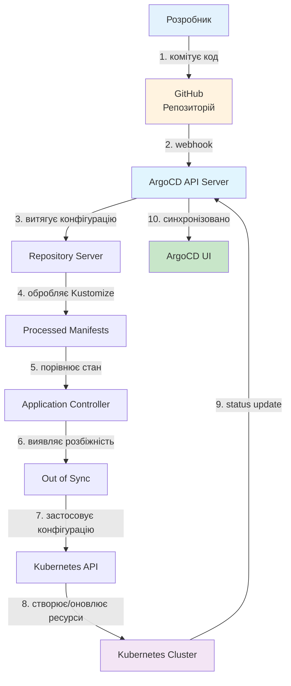

# Лекція 22 GitOps: управління інфраструктурою через Git

## 1. Вступ до GitOps

GitOps являє собою революційний підхід до управління інфраструктурою та розгортанням застосунків, який змінює парадигму операційного управління. На відміну від традиційних підходів, де операційні команди вручну запускають сценарії розгортання, інтегрують зміни через системи управління конфігурацією та часто мають кілька відмінних способів розгортання для різних середовищ, GitOps пропонує унітарний, декларативний та повністю автоматизований підхід.

Назва GitOps походить від того, що Git репозиторій стає єдиним джерелом правди (single source of truth) для всієї інфраструктури та конфігурації застосунків. Замість того, щоб оператор вручну змінював стан кластера або інфраструктури через командний рядок або API, він комітить бажаний стан у Git, і спеціалізовані инструменти автоматично синхронізують стан кластера з описаним у Git.

GitOps стала особливо популярна в екосистемі Kubernetes, де масивна складність управління контейнеризованими застосунками іноді робила трудоємким навіть простих завдання. Git як інструмент забезпечує контроль версій, аудит історії змін, можливість відмови та переходу назад, а також складну систему рецензування коду, все з чого є природні характеристики Git.

## 2. Принципи GitOps

### 2.1. Git як єдине джерело правди

Один з найважливіших принципів GitOps полягає в тому, що вся конфігурація інфраструктури та застосунків зберігається у Git репозиторії. Це означає, що актуальний стан системи завжди може бути відновлений з Git, а всі зміни мають інформаційну історію.

Цей принцип забезпечує кілька значних переваг. По-перше, забезпечує повну видимість та аудит усіх змін. Кожен комітування змін залишає детальний запис про те, хто, коли та чому змінив конфігурацію. Це особливо важливо для організацій з суворими вимогами з комплаєнсу та безпеки. По-друге, дозволяє швидко відновити систему до попереднього стану у разі проблеми просто відверндувши комітування. По-третє, забезпечує репліцільність: якщо інстанція кластера вийде з ладу, новий кластер може бути розгорнутий на основі того ж Git репозиторію.

Однак, розміщення всієї конфігурації в Git вимагає уважного підходу до управління секретами. Ключі доступу, паролі та інші конфіденційні дані не повинні зберігатися в Git у відкритому вигляді. Замість цього, такі дані мають зберігатися в захищених сховищах (як HashiCorp Vault, AWS Secrets Manager чи Kubernetes Secrets) та посилатися з конфігурації.

### 2.2. Декларативність

GitOps спирається на декларативний підхід до управління конфігурацією. Замість описання послідовності команд, які необхідно виконати для досягнення певного стану (imperative підхід), розробник описує бажаний стан системи (declarative підхід).

Наприклад, у imperative підході розробник мав би написати сценарій, що виконує сервію команд для розгортання застосунку: завантажити образ контейнера, створити pod, налаштувати мережеві правила, встановити обсяги зберігання тощо. У декларативному підході розробник просто описує, що застосунок повинен мати три реплік з певним образом контейнера, та системи управління інфраструктурою сами визначають, які команди потрібно виконати для досягнення цього стану.

Декларативність дозволяє більш складне розуміння стану системи. Оскільки GitOps система постійно перевіряє, чи фактичний стан збігається з описаним в Git, будь-які невільні зміни (наприклад, хтось вручну видалив pod) буде автоматично виправлені.

### 2.3. Автоматична синхронізація (reconciliation)

GitOps система постійно контролює розбіжність між бажаним станом (що визначено в Git) та фактичним станом інфраструктури. Якщо виявлена розбіжність, система автоматично синхронізує фактичний стан з бажаним.

Цей процес синхронізації називається reconciliation. Наприклад, якщо в Git визначено, що застосунок повинен мати три реплік, а в кластері з якої-небудь причини залишилося лише два pod, reconciliation процес автоматично створить бракуючий pod. Аналогічно, якщо хтось вручну створив додаткові pod, вони будуть видалені при синхронізації.

Reconciliation зазвичай працює на основі loop, який періодично перевіряє стан. Інтервал перевірки залежить від конфігурації GitOps системи, але зазвичай складає кілька секунд до хвилин. На додаток до періодичної перевірки, деякі GitOps системи підтримують webhook, що дозволяють негайної синхронізації при комітуванні змін до Git.

### 2.4. Чотири принципи OpenGitOps

OpenGitOps — це стандарт, розроблений спільнотою, що дефініює чотири основних принципи GitOps. Ці принципи забезпечують загальне розуміння того, що таке GitOps та як він повинен функціонувати.

Перший принцип — **Declarative**: весь бажаний стан системи описується декларативно. Конфігурація повинна бути описана таким чином, щоб будь-хто міг прочитати її та зрозуміти, що повинна робити система.

Другий принцип — **Versioned and Immutable**: весь бажаний стан версіонується та зберігається в системі управління версіями (Git), яка забезпечує що всі зміни мають інформаційну історію та можуть бути легко переглянуті чи відмінені.

Третій принцип — **Pulled Automatically**: система автоматично тягне (pull) конфігурацію з Git репозиторію та застосовує її. Це відрізняється від push-моделі, де зовнішня система штовхає конфігурацію в інфраструктуру.

Четвертий принцип — **Continuously Reconciled**: система постійно синхронізує фактичний стан з бажаним станом. Якщо виявлена розбіжність, система автоматично приводить фактичний стан до бажаного.

## 3. Push-based vs Pull-based підходи

### 3.1. Push-based розгортання

У традиційному push-based підході система управління розгортанням (наприклад, Jenkins чи GitLab CI) ініціює розгортання та штовхає конфігурацію та артефакти в цільову систему. Процес виглядає наступним чином: розробник комітує код у Git, CI/CD система автоматично будує образ контейнера та толкає його у реєстр образів, потім CI/CD система підключається до Kubernetes кластера та застосовує нову конфігурацію, що призводить до розгортання нового застосунку.

Push-based підхід має кілька переваг. По-перше, розгортання можна контролювати з однієї центральної системи (CI/CD сервер), що спрощує управління. По-друге, розгортання можна виконати майже миттєво при комітуванні без очікування синхронізації.

Однак push-based підхід також має значні недоліки. По-перше, CI/CD сервер повинен мати доступ до всіх цільових кластерів, що розширює поверхню атаки. Якщо CI/CD сервер скомпрометовано, атакуючий отримує доступ до всіх кластерів. По-друге, якщо CI/CD сервер тимчасово недоступний, розгортання не можуть бути виконані. По-третє, якщо кластер знаходиться за мережевим брандмауером або в приватній мережі, це ускладнює конфігурацію доступу для CI/CD сервера.

### 3.2. Pull-based розгортання

У pull-based підході, який є основою GitOps, кластер сам витягує конфігурацію з Git репозиторію. AgentGitOps інструмента (наприклад, ArgoCD чи Flux) запускається всередині кластера та постійно відстежує Git репозиторій на предмет змін. При виявленні змін, агент автоматично застосовує нову конфігурацію.

Pull-based підхід забезпечує кілька значних переваг. По-перше, питання безпеки розвязується, оскільки кластер визначає, що потрібно при витягуванні з Git, а не обов'язково давати зовнішній системі доступ до кластера. По-друге, агент може мати довгоживучий зв'язок з Git репозиторієм і знімає залежність від CI/CD сервера. По-третє, якщо агент тимчасово недоступний, то при його відновлені він буде синхронізовано з Git репозиторієм без необхідності переробки розгортання.

Однак pull-based підхід також має деякі недоліки. По-перше, розгортання не є миттєвим та залежить від конфігурованого інтервалу синхронізації (зазвичай кілька хвилин). По-друге, деякі системи вимагають більшої конфігурації для налаштування синхронізації.

## 4. ArgoCD: архітектура та практичне використання

### 4.1. Архітектура ArgoCD

ArgoCD — це популярний інструмент GitOps для Kubernetes, розроблений та підтримуваний Argoproj спільнотою. Архітектура ArgoCD складається з кількох ключових компонентів, кожен з яких грає важливу роль у процесі розгортання.

**API Server** забезпечує REST API для взаємодії з ArgoCD. Через цей API можна програмно керувати Application, перевіряти статус синхронізації та отримувати логи. API Server також забезпечує аутентифікацію та авторизацію для користувачів.

**Repository Server** відповідає за отримання конфігурації з Git репозиторію та її обробку. Він витягує код з Git, обробляє шаблони (если використовується Helm чи Kustomize), та готує конфігурацію для застосування. Repository Server кешує отримані конфігурації для оптимізації.

**Application Controller** є основним компонентом, що виконує логіку GitOps. Контролер постійно спостерігає за Git репозиторієм та порівнює бажаний стан (з Git) з фактичним станом кластера. При виявленні розбіжності контролер визначає, які команди потрібно виконати для синхронізації, та застосовує їх.

**Dex** забезпечує управління ідентичністю та автентифікацією. Dex підтримує OIDC (OpenID Connect) та LDAP, дозволяючи інтеграцію з корпоративними системами управління ідентичністю.

### 4.2. Application CRD

ArgoCD використовує спеціальний Kubernetes CRD (Custom Resource Definition) під назвою Application для описання застосунків, які повинні бути розгорнуті. Application CRD містить інформацію про Git репозиторій, вихідний каталог конфігурацій, цільовий кластер та синхронізацію параметри.

```yaml
apiVersion: argoproj.io/v1alpha1
kind: Application
metadata:
  name: my-app
  namespace: argocd
spec:
  # Project указує на логічну групу додатків
  project: default

  # Source описує, де знаходиться конфігурація у Git
  source:
    repoURL: https://github.com/myorg/config-repo
    targetRevision: main
    path: applications/my-app

    # Якщо використовується Helm для шаблонізації
    helm:
      releaseName: my-app
      version: 1.0.0
      values: |
        replicas: 3
        image:
          tag: v1.2.3

    # Або якщо використовується Kustomize
    # kustomize:
    #   version: v4.5.0

  # Destination описує цільовий кластер та namespace
  destination:
    server: https://kubernetes.default.svc
    namespace: default

  # Параметри синхронізації
  syncPolicy:
    # Автоматична синхронізація при виявленні змін
    automated:
      prune: true      # Видаляти ресурси, що були видалені з Git
      selfHeal: true   # Синхронізувати при виявленні розбіжностей
      allow:
        empty: false   # Заборонити видалення всіх ресурсів

    syncOptions:
      - CreateNamespace=true  # Автоматично створювати namespace

  # Здоров'я та статус застосунку
  revisionHistoryLimit: 10
```

Цей приклад демонструє типовий Application, що розгортає застосунок з Git репозиторію. Параметр `spec.syncPolicy.automated` дозволяє автоматичну синхронізацію, що означає, що ArgoCD автоматично застосовуватиме зміни, виявлені в Git репозиторії.

### 4.3. Синхронізація та моніторинг

ArgoCD забезпечує детальне слідження за процесом синхронізації та здоров'ям застосунку. Статус Application можна перевірити через Web UI, CLI чи API. Статус показує, чи застосунок синхронізований з Git (synced), чи є розбіжності (out of sync), та загальне здоров'я ресурсів.

Коли виявлено розбіжність, ArgoCD показує детальну інформацію про те, що змінилося. Розробник та оператор можуть бачити точні зміни, що були введені, та причину розбіжності. Це забезпечує прозорість та контроль над процесом розгортання.

## 5. Flux: альтернативний GitOps інструмент

### 5.1. Архітектура Flux

Flux — це конкурент ArgoCD, розроблений та підтримуваний Weaveworks. На відміну від ArgoCD, Flux побудована як набір окремих контролерів, кожен з яких відповідає за специфічну частину GitOps процесу.

**Source Controller** витягує конфігурацію з Git репозиторію, git-сервера, S3 бакету або OCI реєстру. Source Controller підтримує різні типи джерел та забезпечує кешування для оптимізації.

**Kustomize Controller** обробляє Kustomize файли та створює Kubernetes маніфести. Це забезпечує більшу гнучкість при роботі з варіаціями конфігурацій для різних середовищ.

**Helm Controller** обробляє Helm діаграми та встановлює їх у кластер. Helm Controller може автоматично оновлювати версію діаграми та відстежувати нові версії.

**Image Reflector Controller** та **Image Automation Controller** забезпечують автоматичне оновлення образів контейнерів. При опублікуванні нового образу ці контролери можуть автоматично оновити Git репозиторій з посиланням на новий образ.

### 5.2. Flux Custom Resources

Flux, як ArgoCD, також використовує Kubernetes CRD для опису синхронізації. Однак Flux розділяє цю інформацію на кілька ресурсів: GitRepository, Kustomization та HelmRelease.

```yaml
---
# GitRepository описує Git репозиторій
apiVersion: source.toolkit.fluxcd.io/v1beta1
kind: GitRepository
metadata:
  name: my-app-repo
  namespace: flux-system
spec:
  interval: 1m
  url: https://github.com/myorg/config-repo
  ref:
    branch: main
  secretRef:
    name: git-credentials  # Для приватних репозиторіїв

---
# Kustomization описує застосування конфігурації
apiVersion: kustomize.toolkit.fluxcd.io/v1beta1
kind: Kustomization
metadata:
  name: my-app
  namespace: flux-system
spec:
  sourceRef:
    kind: GitRepository
    name: my-app-repo
  path: ./applications/my-app
  interval: 5m
  prune: true
  wait: true
  timeout: 5m
  postBuild:
    substitute:
      ENVIRONMENT: production
      LOG_LEVEL: info

---
# HelmRelease описує встановлення Helm діаграми
apiVersion: helm.toolkit.fluxcd.io/v2beta1
kind: HelmRelease
metadata:
  name: my-helm-app
  namespace: flux-system
spec:
  interval: 5m
  chart:
    spec:
      chart: my-chart
      sourceRef:
        kind: HelmRepository
        name: my-repo
  values:
    replicas: 3
    image:
      tag: v1.2.3
```

Цей приклад демонструє три ключові ресурси Flux. GitRepository визначає, звідки витягувати конфігурацію, Kustomization визначає, як застосовувати Kustomize конфігурацію, а HelmRelease визначає встановлення Helm діаграми.

### 5.3. Різниці між ArgoCD та Flux

ArgoCD та Flux мають кілька ключових різниць. ArgoCD забезпечує єдиний Application ресурс для опису всього застосунку, тоді як Flux розділяє це на кілька ресурсів. ArgoCD дозволяє більш повне управління через Web UI, тоді як Flux також має Web UI, але менш розвинену. ArgoCD краще підходить для організацій, що вже використовують Kubernetes та хочуть простого вирішення, тоді як Flux краще підходить для організацій, що пошукують більш гнучкої архітектури та мають потреби в контролі образів.

## 6. Декларативні розгортання: Kustomize та Helm

### 6.1. Kustomize як інструмент шаблонізації

Kustomize дозволяє керувати Kubernetes маніфестами декларативно без необхідності темплейтизації. На відміну від Helm, який використовує Go templ языке та дозволяє дефіновані шаблони, Kustomize використовує так звану "strategic merge" методологію для об'єднання та модифікації маніфестів.

Основна ідея Kustomize полягає в тому, що розробник створює базовий набір Kubernetes маніфестів, а потім визначає "patches" (виправлення), які модифікують ці маніфести для різних середовищ (dev, staging, prod). Це дозволяє переиспользовать базові маніфести та уникнути дублювання.

```
my-app/
├── base/
│   ├── deployment.yaml
│   ├── service.yaml
│   └── kustomization.yaml
└── overlays/
    ├── dev/
    │   ├── kustomization.yaml
    │   └── replica-patch.yaml
    ├── staging/
    │   ├── kustomization.yaml
    │   └── replica-patch.yaml
    └── prod/
        ├── kustomization.yaml
        ├── replica-patch.yaml
        └── resources-patch.yaml
```

Базова конфігурація у `base/` складається з базових маніфестів:

```yaml
# base/kustomization.yaml
apiVersion: kustomize.config.k8s.io/v1beta1
kind: Kustomization

resources:
  - deployment.yaml
  - service.yaml

# base/deployment.yaml
apiVersion: apps/v1
kind: Deployment
metadata:
  name: my-app
spec:
  replicas: 1
  selector:
    matchLabels:
      app: my-app
  template:
    metadata:
      labels:
        app: my-app
    spec:
      containers:
      - name: my-app
        image: myrepo/my-app:latest
        resources:
          requests:
            memory: "64Mi"
            cpu: "100m"
          limits:
            memory: "128Mi"
            cpu: "200m"
```

Overlay для середовища production модифікує базову конфігурацію:

```yaml
# overlays/prod/kustomization.yaml
apiVersion: kustomize.config.k8s.io/v1beta1
kind: Kustomization

bases:
  - ../../base

replicas:
  - name: my-app
    count: 3

patchesStrategicMerge:
  - replica-patch.yaml
  - resources-patch.yaml

# overlays/prod/replica-patch.yaml
apiVersion: apps/v1
kind: Deployment
metadata:
  name: my-app
spec:
  replicas: 3  # Збільшеено до 3 реплік для production

# overlays/prod/resources-patch.yaml
apiVersion: apps/v1
kind: Deployment
metadata:
  name: my-app
spec:
  template:
    spec:
      containers:
      - name: my-app
        resources:
          requests:
            memory: "256Mi"
            cpu: "500m"
          limits:
            memory: "512Mi"
            cpu: "1000m"
```

Цей приклад показує, як Kustomize дозволяє переиспользовать базові маніфести та модифікувати їх для різних середовищ без дублювання коду.

### 6.2. Helm як інструмент управління пакетами

Helm є інструментом управління пакетами для Kubernetes, подібним до apt чи pip для операційних систем. Helm дозволяє упакувати Kubernetes конфігурацію як діаграму (chart), що може бути розповсюджена та встановлена у різних кластерах.

Helm діаграма складається з набору файлів:

```
my-chart/
├── Chart.yaml
├── values.yaml
├── templates/
│   ├── deployment.yaml
│   ├── service.yaml
│   └── configmap.yaml
└── charts/
    └── (залежні діаграми)
```

`Chart.yaml` описує метаінформацію про діаграму:

```yaml
apiVersion: v2
name: my-app
description: A Helm chart for my application
type: application
version: 0.1.0
appVersion: "1.0"
maintainers:
  - name: DevOps Team
    email: devops@example.com
```

`values.yaml` містить значення за замовчуванням для шаблонів:

```yaml
replicaCount: 1

image:
  repository: myrepo/my-app
  tag: "1.0.0"
  pullPolicy: IfNotPresent

service:
  type: ClusterIP
  port: 80

resources:
  requests:
    memory: "64Mi"
    cpu: "100m"
  limits:
    memory: "128Mi"
    cpu: "200m"

env:
  LOG_LEVEL: info
  ENVIRONMENT: production
```

Темплейти у `templates/` використовують Go шаблони для генерації Kubernetes маніфестів:

```yaml
# templates/deployment.yaml
apiVersion: apps/v1
kind: Deployment
metadata:
  name: {{ include "my-app.fullname" . }}
spec:
  replicas: {{ .Values.replicaCount }}
  selector:
    matchLabels:
      app: {{ include "my-app.name" . }}
  template:
    metadata:
      labels:
        app: {{ include "my-app.name" . }}
    spec:
      containers:
      - name: {{ .Chart.Name }}
        image: "{{ .Values.image.repository }}:{{ .Values.image.tag }}"
        imagePullPolicy: {{ .Values.image.pullPolicy }}
        env:
        {{- range $key, $value := .Values.env }}
        - name: {{ $key }}
          value: "{{ $value }}"
        {{- end }}
        resources:
          requests:
            memory: "{{ .Values.resources.requests.memory }}"
            cpu: "{{ .Values.resources.requests.cpu }}"
          limits:
            memory: "{{ .Values.resources.limits.memory }}"
            cpu: "{{ .Values.resources.limits.cpu }}"
```

Установлення Helm діаграми відбувається просто:

```bash
helm repo add myrepo https://charts.example.com
helm repo update
helm install my-release myrepo/my-chart --namespace default
```

Або з перевизначенням значень:

```bash
helm install my-release myrepo/my-chart \
  --set replicaCount=3 \
  --set image.tag=v2.0.0 \
  --values custom-values.yaml
```

## 7. Робочі процеси GitOps

### 7.1. App-of-Apps Pattern

При управлінні багатьма застосунками в одному кластері або розповсюджуванні однакового набору застосунків на кілька кластерів, app-of-apps pattern значно спрощує управління. У цьому патерні основна Application управляє кількома дочірніми Applications, кожна з яких розгортає окремий компонент системи.

```yaml
# Main Application (app-of-apps)
apiVersion: argoproj.io/v1alpha1
kind: Application
metadata:
  name: main-app
  namespace: argocd
spec:
  project: default
  source:
    repoURL: https://github.com/myorg/config-repo
    targetRevision: main
    path: applications

  destination:
    server: https://kubernetes.default.svc
    namespace: default

  syncPolicy:
    automated:
      prune: true
      selfHeal: true

---
# Дочірня Application для веб-сервісу
apiVersion: argoproj.io/v1alpha1
kind: Application
metadata:
  name: web-service
  namespace: argocd
spec:
  project: default
  source:
    repoURL: https://github.com/myorg/config-repo
    targetRevision: main
    path: applications/web-service

  destination:
    server: https://kubernetes.default.svc
    namespace: web-service

  syncPolicy:
    automated:
      prune: true
      selfHeal: true

---
# Дочірня Application для бази даних
apiVersion: argoproj.io/v1alpha1
kind: Application
metadata:
  name: database
  namespace: argocd
spec:
  project: default
  source:
    repoURL: https://github.com/myorg/config-repo
    targetRevision: main
    path: applications/database

  destination:
    server: https://kubernetes.default.svc
    namespace: database

  syncPolicy:
    automated:
      prune: true
      selfHeal: true
```

App-of-apps дозволяє централізоване управління всіма застосунками вказуючи єдиною точкою контролю. При комітуванні нових application конфігурацій до Git, головна Application автоматично синхронізує всі дочірні Applications.

### 7.2. Multi-cluster management

GitOps добре підходить для управління кількома Kubernetes кластерами. Замість того, щоб утримувати окремі Git репозиторії для кожного кластера, розробник може використовувати єдиний репозиторій з конфігурацією для всіх кластерів.

```
config-repo/
├── clusters/
│   ├── prod-us-east/
│   │   ├── applications.yaml
│   │   ├── network-policies/
│   │   └── rbac/
│   ├── prod-eu-west/
│   │   ├── applications.yaml
│   │   ├── network-policies/
│   │   └── rbac/
│   ├── staging/
│   │   ├── applications.yaml
│   │   └── network-policies/
│   └── dev/
│       └── applications.yaml
└── applications/
    ├── web-service/
    ├── api-service/
    └── database/
```

Кожна папка в `clusters/` відповідає окремому кластеру та містить конфігурацію для цього кластера. Папка `applications/` містить спільні конфігурації для всіх кластерів.

Application для кожного кластера може вказувати на конфігурацію, специфічну для цього кластера:

```yaml
# For prod-us-east cluster
apiVersion: argoproj.io/v1alpha1
kind: Application
metadata:
  name: prod-us-east-apps
  namespace: argocd
spec:
  project: default
  source:
    repoURL: https://github.com/myorg/config-repo
    targetRevision: main
    path: clusters/prod-us-east

  destination:
    server: https://prod-us-east-api.example.com:6443
    namespace: default

  syncPolicy:
    automated:
      prune: true
      selfHeal: true
```

### 7.3. Environment Promotion

GitOps також розв'язує проблему просування конфігурацій між різними середовищами. Замість того, щоб вручну менти конфігурацію для кожного середовища, розробник може використовувати зміни в Git для просування конфігурацій через dev, staging до production.

Типова послідовність виглядає так: розробник комітує зміни до гілки `dev`, ArgoCD автоматично розгортає їх в dev середовищі. Після тестування розробник створює pull request для об'єднання змін до гілки `staging`, ArgoCD розгортає їх в staging. Після подальшого тестування розробник створює pull request для гілки `main` (production), ArgoCD розгортає їх в production.


## 8. Безпека в GitOps

### 8.1. Підписання комітів та захист Git репозиторію

Оскільки Git репозиторій стає критично важливим для інфраструктури, його безпека є надзвичайно важливою. Першим кроком є забезпечення того, що всі комітування до Git мають бути підписані. Git дозволяє використовувати GPG (GNU Privacy Guard) для підписання комітів.

```bash
# Налаштування GPG ключа для підписання
git config --global user.signingkey YOUR_GPG_KEY_ID
git config --global commit.gpgsign true

# Підписання комітету
git commit -S -m "Додана конфігурація застосунку"

# Перевірка підписів в репозиторії
git log --show-signature

# Налаштування GitHub для вимоги підписаних комітів
# Це може бути зроблено через GitHub Web Interface під Settings > Branch protection
```

Додатково, репозиторій повинен мати захист гілок, що запобігає прямому завантаженню коду без рецензії. GitHub Branches Protection Rules дозволяють вимагати pull request перед об'єднанням змін, виконання тестів та затвердження від інших розробників.

### 8.2. Image Update Automation та Signed Images

При використанні безсервісних функцій та контейнерів, управління версіями образів стає критично важливим. Деякі GitOps системи дозволяють автоматичне оновлення git репозиторію при опублікуванні нового образу контейнера.

Flux контролер Image Automation може автоматично оновити файли конфігурації Kustomize при виявленні нової версії образу:

```yaml
apiVersion: image.toolkit.fluxcd.io/v1beta1
kind: ImageUpdateAutomation
metadata:
  name: flux-system
spec:
  interval: 1m0s
  sourceRef:
    kind: GitRepository
    name: flux-system
  git:
    checkout:
      ref:
        branch: main
    commit:
      author:
        email: flux@example.com
        name: Flux
      messageTemplate: '{{range .Updated.Images}}{{println .}}{{end}}'
    push:
      branch: main
  update:
    path: ./clusters/my-cluster
    strategy: Setters
```

Крім того, рекомендується підписувати образи контейнерів за допомогою Cosign чи аналогічних інструментів. ArgoCD та Flux можуть перевіряти підписи образів перед розгортанням, гарантуючи, що розгортаються лише довірені образи.

### 8.3. Policy Enforcement та NetworkPolicies

GitOps система може забезпечити централізоване управління політиками безпеки через Git. Це включає NetworkPolicies для контролю мережевих потоків, RBAC політики для управління доступом та Pod Security Policies для обмеження привілеїв контейнерів.

```yaml
# NetworkPolicy для обмеження мережевого трафіку
apiVersion: networking.k8s.io/v1
kind: NetworkPolicy
metadata:
  name: web-app-netpolicy
spec:
  podSelector:
    matchLabels:
      app: web-app
  policyTypes:
    - Ingress
    - Egress
  ingress:
    - from:
        - namespaceSelector:
            matchLabels:
              name: ingress-nginx
      ports:
        - protocol: TCP
          port: 8080
  egress:
    - to:
        - namespaceSelector:
            matchLabels:
              name: database
      ports:
        - protocol: TCP
          port: 5432
    - to:
        - namespaceSelector: {}
      ports:
        - protocol: TCP
          port: 53
        - protocol: UDP
          port: 53

# RBAC Role для обмеження дій користувачів
apiVersion: rbac.authorization.k8s.io/v1
kind: Role
metadata:
  name: developer-role
rules:
  - apiGroups: [""]
    resources: ["pods", "services"]
    verbs: ["get", "list", "watch"]
  - apiGroups: ["apps"]
    resources: ["deployments"]
    verbs: ["get", "list", "watch"]
  - apiGroups: [""]
    resources: ["pods/logs"]
    verbs: ["get"]
```

## 9. Практичний приклад: ArgoCD Application для розгортання застосунку

### 9.1. Структура Git репозиторію

```
my-app-config/
├── apps/
│   ├── frontend/
│   │   ├── kustomization.yaml
│   │   ├── deployment.yaml
│   │   └── service.yaml
│   ├── backend/
│   │   ├── kustomization.yaml
│   │   ├── deployment.yaml
│   │   └── service.yaml
│   └── database/
│       ├── kustomization.yaml
│       └── statefulset.yaml
└── argocd/
    ├── frontend-app.yaml
    ├── backend-app.yaml
    └── database-app.yaml
```

### 9.2. Конфігурація backend застосунку

```yaml
# apps/backend/deployment.yaml
apiVersion: apps/v1
kind: Deployment
metadata:
  name: backend
spec:
  replicas: 2
  selector:
    matchLabels:
      app: backend
  template:
    metadata:
      labels:
        app: backend
    spec:
      containers:
      - name: backend
        image: myrepo/backend:v1.0.0
        imagePullPolicy: Always
        ports:
        - containerPort: 3000
        env:
        - name: DATABASE_URL
          valueFrom:
            secretKeyRef:
              name: db-credentials
              key: url
        - name: LOG_LEVEL
          value: "info"
        resources:
          requests:
            memory: "256Mi"
            cpu: "250m"
          limits:
            memory: "512Mi"
            cpu: "500m"
        livenessProbe:
          httpGet:
            path: /health
            port: 3000
          initialDelaySeconds: 30
          periodSeconds: 10
        readinessProbe:
          httpGet:
            path: /ready
            port: 3000
          initialDelaySeconds: 10
          periodSeconds: 5

# apps/backend/service.yaml
apiVersion: v1
kind: Service
metadata:
  name: backend
spec:
  selector:
    app: backend
  ports:
  - port: 80
    targetPort: 3000
    protocol: TCP
  type: ClusterIP

# apps/backend/kustomization.yaml
apiVersion: kustomize.config.k8s.io/v1beta1
kind: Kustomization
resources:
  - deployment.yaml
  - service.yaml
```

### 9.3. ArgoCD Application для backend

```yaml
# argocd/backend-app.yaml
apiVersion: argoproj.io/v1alpha1
kind: Application
metadata:
  name: backend
  namespace: argocd
spec:
  project: default

  source:
    repoURL: https://github.com/myorg/my-app-config
    targetRevision: main
    path: apps/backend

  destination:
    server: https://kubernetes.default.svc
    namespace: default

  syncPolicy:
    automated:
      prune: true
      selfHeal: true
    syncOptions:
      - CreateNamespace=true
    retry:
      limit: 5
      backoff:
        duration: 5s
        factor: 2
        maxDuration: 1m

  # Здоров'я ресурсів
  ignoreDifferences:
    - group: apps
      kind: Deployment
      jsonPointers:
        - /spec/replicas
```

Цей приклад демонструє повне ArgoCD Application, що розгортає backend застосунок з конфігурацією для livenessProbe, readinessProbe та resource requests.

## 10. GitOps робочий процес



## Контрольні запитання

1. Охарактеризуйте чотири принципи OpenGitOps (Declarative, Versioned and Immutable, Pulled Automatically, Continuously Reconciled). Поясніть, як кожен принцип сприяє надійності та безпеці інфраструктури.

2. Порівняйте push-based та pull-based підходи до розгортання у контексті GitOps. Яка архітектура є безпечнішою та чому? Наведіть сценарії, де кожна модель має переваги.

3. ArgoCD та Flux — обидва популярні GitOps інструменти, але мають різні архітектури. Опишіть архітектурні різниці та запропонуйте критерії вибору одного з них для організації.

4. Поясніть концепцію "app-of-apps pattern" та наведіть приклад того, як цей паттерн спрощує управління багатьма застосунками в кластері або розповсюджуванні на кілька кластерів.

5. Розробіть GitOps робочий процес для організації з трьома середовищами (dev, staging, production) з використанням окремих Git гілок та ArgoCD Applications. Опишіть процес просування конфігурацій між середовищами.

6. Безпека Git репозиторію критично важлива при використанні GitOps, оскільки репозиторій стає єдиним джерелом правди для інфраструктури. Опишіть заходи безпеки, включаючи підписання комітів, захист гілок та управління доступом.

7. У вашій організації виявлено, що розробник мав намір вручну змінити ресурси в production кластері. Як GitOps з автоматичною синхронізацією запобіжить цьому та як можна налаштувати систему, щоб отримувати сповіщення про такі несанкціоновані зміни?

8. Kustomize та Helm обидва дозволяють управління Kubernetes конфігураціями, але використовують різні підходи. Порівняйте ці інструменти та опишіть сценарії, де кожен з них найбільш ефективний.
