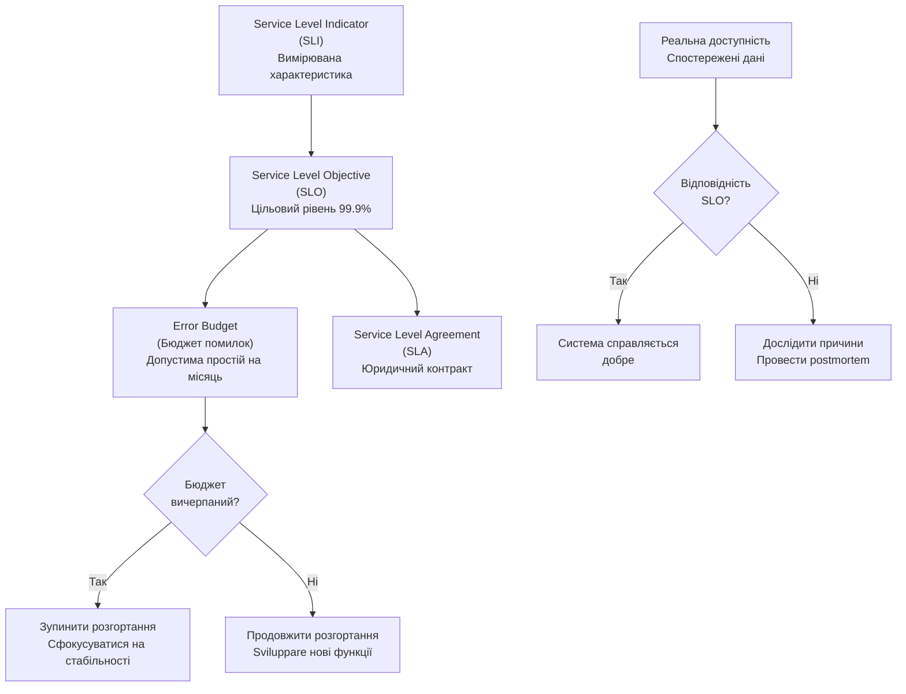

# Лекція 23 Site Reliability Engineering та тестування стійкості систем

## 1. Принципи Site Reliability Engineering

### 1.1. Походження та визначення SRE

Site Reliability Engineering (інженерія надійності сайтів) — це дисципліна, що виникла в компанії Google на початку 2000-х років як відповідь на зростаючу складність операційного управління масштабованими інформаційними системами. Концепція була розроблена командою під керівництвом Бена Трейнора і згодом деталізована у серії публікацій та книзі "The Site Reliability Workbook".

SRE представляє собою синтез інженерної практики та операційної управління, спрямований на забезпечення максимальної надійності, масштабованості та ефективності розподілених систем. На відміну від традиційного підходу операційної служби (Ops), який часто фокусується на реагуванні на інциденти, SRE приділяє значну увагу проактивному запобіганню проблемам, автоматизації та систематичному поліпшенню процесів.

Фундаментальна філософія SRE ґрунтується на переконанні, що операційні завдання повинні розглядатися як інженерні проблеми. Це означає, що замість того щоб постійно виконувати ручну роботу, команда SRE розробляє інструменти, автоматизацію та системи, які дозволяють операційним процесам працювати самостійно або з мінімальним втручанням людини.

### 1.2. Відмінність SRE від DevOps та традиційного Ops

Хоча терміни SRE та DevOps часто використовуються синонімічно, вони мають суттєві відмінності в підходах та акцентах. DevOps — це більш широка культурна та організаційна філософія, спрямована на усунення бар'єрів між розробниками та операційними командами. DevOps наголошує на спільній відповідальності, автоматизації розгортання та безперервній інтеграції та доставці (CI/CD).

SRE, з іншого боку, представляє конкретний набір практик та методологій, які спрямовані на досягнення надійності через інженерний підхід. SRE може розглядатися як практична реалізація деяких принципів DevOps, але з більш чітким фокусом на кількісне вимірювання надійності та управління компромісами між швидкістю розвитку та стабільністю системи.

Традиційний Ops підхід характеризується більш консервативним ставленням до змін, довгими циклами розгортання та реактивним реагуванням на інциденти. Операційні команди часто працюють окремо від команд розробників, що призводить до розрозніненості та затримок у вирішенні проблем. SRE замість цього пропонує модель, де операційні вимоги інтегруються в процес розробки на ранніх етапах, а команди мають спільну відповідальність за результати.

### 1.3. Концепція Toil та її вимірювання

Toil — це один з центральних концептів SRE, що означає рутинну, ручну, реакційну роботу, яка виконується для утримання системи в робочому стані. Toil має кілька характеристик: він ручний за своєю природою, змінюється залежно від обставин, не сприяє довгостроковому поліпшенню системи, часто скейлюється лінійно з зростанням системи та не створює цінності для користувачів у довгостроковій перспективі.

Типові приклади toil включають ручну обробку оповіщень про помилки, які можна було б автоматизувати, періодичне перезавантаження сервісів для вирішення витоків пам'яті, ручне масштабування інфраструктури в часи піку навантаження, обробку повторюваних запитів на змініння конфігурації та повторне введення даних у системи без інтеграції між ними.

Вимірювання toil є критично важливим для розуміння того, скільки часу команда витрачає на роботу, яка не додає цінності. Google рекомендує, щоб команди SRE витрачали не більше 50 відсотків свого часу на toil. Решта часу повинна розподілятися на розроблення нової функціональності, поліпшення надійності системи, розроблення інструментів та автоматизації та опанування новими навичками.

Для вимірювання toil команди повинні вести облік часу, витраченого на різні типи роботи, та регулярно аналізувати логи інцидентів та запитів на обслуговування. Метрики можуть включати кількість ручних втручань на день, середній час вирішення повторюваних проблем та кількість випадків, коли систему довелося рестартувати через неполадки. Систематичне відслідковування цих метрик допомагає командам ідентифікувати області, де найбільше користі від автоматизації, та виправдати інвестиції в інструменти та процеси.

## 2. SLI, SLO та SLA — детальний аналіз

### 2.1. Service Level Indicator (SLI)

Service Level Indicator — це конкретна, вимірювана характеристика якості надаваного сервісу. SLI представляє реальне спостереження за тим, як сервіс працює з точки зору користувача. Для SLI важливо вибирати метрики, які справді відображають досвід користувача, а не просто технічні показники серверу.

Наприклад, для веб-додатку часто використовують таки SLI:

- Доступність (Availability): відсоток успішних HTTP запитів за певний період часу. Успішний запит визначається як запит з HTTP кодом статусу в діапазоні 2xx або 3xx.

- Затримка (Latency): відсоток запитів, які завершені за визначений час (наприклад, 95-й персентиль часу відповіді менше 500 мілісекунд).

- Коректність (Correctness): відсоток операцій, які повертають коректні дані без помилок обробки даних.

- Пропускна здатність (Throughput): кількість запитів, які система може обробити за одиницю часу.

При виборі SLI слід дотримуватися кількох принципів. По-перше, SLI повинен вимірюватися з точки зору користувача, а не з точки зору компонента інфраструктури. По-друге, SLI повинен бути об'єктивним та вимірюваним, а не суб'єктивним твердженням. По-третє, SLI повинен відповідати бізнес-цілям та впливати на задоволення користувача. По-четвертому, кількість SLI повинна бути обмеженою — рекомендується від трьох до п'яти основних метрик для кожного сервісу.

### 2.2. Service Level Objective (SLO)

Service Level Objective — це цільовий рівень надійності, який організація зобов'язується досягти для свого сервісу. SLO встановлює бажану граничну значення для кожного SLI на певний період часу (зазвичай місяць). SLO повинен бути вище, ніж те, що сервіс може реально забезпечити, але недостатньо низький, щоб бути досягнутим без значних інвестицій.

Наприклад, SLO для веб-додатку може встановити:

- Доступність 99,9% за місяць (що означає максимально допустиму простину близько 43 секунд на місяць).

- 95-й персентиль затримки менше 500 мілісекунд на 99,9% запитів.

- 99,95% коректність обробки даних.

SLO повинні встановлюватися після обговорення з командою розробників, операційною командою та представниками бізнесу. Занадто жорсткі SLO можуть призвести до виснаження команди та надмірних витрат на інфраструктуру. Занадто м'які SLO можуть призвести до незадоволення користувачів та втрати конкурентноспроможності. Найкращий підхід — встановити SLO на рівні, який адекватно відображає потреби користувачів, переважно на основі спостережень за тим, як поведінка системи впливає на задоволення користувачів.

### 2.3. Service Level Agreement (SLA)

Service Level Agreement — це юридично обов'язуючий контракт між постачальником послуги та клієнтом, який визначає рівні послуги та компенсацію у разі невідповідності цим рівням. SLA зазвичай менше жорсткий, ніж SLO, оскільки він враховує реальні обмеження та неминучі проблеми.

Наприклад, SLA для хмарного сервісу може гласити:

- Гарантована доступність 99,99% за один місяць, із компенсацією 10 відсотків від місячної плати за кожні два години простою понад 0,01 відсотку.

- Середній час реагування на запит про підтримку не більше 4 годин для критичних проблем.

Ключова відмінність між SLO та SLA полягає в тому, що SLO є внутрішньою метрикою, спрямованою на управління розвитком та операційною роботою, тоді як SLA є зовнішньою зобов'язанням перед клієнтами. SLO повинен бути на кілька відсотків вище за SLA, щоб забезпечити буфер для невідповідностей і дозволити командам працювати з розумною швидкістю без постійного ризику порушення договору.

Зв'язок між цими трьома компонентами можна представити таким чином: SLI — це те, що ми вимірюємо; SLO — це те, до чого ми прагнемо внутрішньо; SLA — це те, що ми обіцяємо клієнтам та за що несемо відповідальність.

## 3. Error Budget та управління ризиком

### 3.1. Концепція Error Budget

Error Budget (бюджет помилок) — це концепція, яка революціонізувала думку про компроміс між надійністю та швидкістю розвитку. Бюджет помилок визначає допустиму кількість простою або невдачних запитів, яка все ще дозволяє дотримуватися встановленого SLO на певний період часу.

Якщо SLO встановлює доступність на рівні 99,9%, це означає, що максимально допустимий час простою становить 0,1% від загального часу. За один місяць (30 днів) це дорівнює приблизно 43 хвилинам 12 секундам. Цей час можна розбити на період, і як тільки цей бюджет витрачено, будь-яке подальше зниження доступності буде означати невідповідність SLO.

Бюджет помилок служить кількісною базою для прийняття рішень про розгортання нових версій. Якщо бюджет помилок все ще доступний (не вичерпаний), команда може розгортати нові версії, навіть якщо існує певний ризик. Якщо бюджет помилок близький до нуля, команда повинна більш обережно підходити до розгортань та зосередитися на стабільності замість нових функцій.

### 3.2. Обчислення бюджету помилок

Розрахунок бюджету помилок є простою операцією, але його застосування вимагає дисципліни та культури, яка сприймає бюджет помилок як реальний ресурс. Формула для обчислення добового бюджету помилок виглядає так:

```
Добовий бюджет помилок = (1 - SLO) × Кількість секунд на день
```

Якщо SLO встановлено на 99,9%, то:

```
Добовий бюджет помилок = 0,001 × 86400 = 86,4 секунди
```

Це означає, що система може бути недоступною на загальну суму 86 секунд за день, і все ще буде дотримуватися 99,9% доступності.

Практичне застосування бюджету помилок передбачає відслідковування витрачання протягом місяця та коригування швидкості розгортання залежно від залишку. Можна вести діаграму, яка показує прогресивне витрачання бюджету протягом місяця. Якщо прогноз показує, що бюджет буде вичерпаний раніше, ніж очікувалося, команда повинна розповсюдити інформацію про це та вирішити, чи варто сповільнити розгортання новостей.

### 3.3. Зв'язок між бюджетом помилок та частотою розгортання

Однією з найпомітніших переваг управління бюджетом помилок є те, що він дозволяє командам розгортати частіше, не жертвуючи надійністю. Традиційна модель операцій часто інтерпретує високу частоту розгортання як ризик для стабільності. Бюджет помилок змінює цю динаміку.

Якщо система維持 доступність на рівні SLO, то розгортання можна виконувати частіше, оскільки вони не впливають на загальну надійність. Насправді частіші розгортання часто призводять до меншої величини змін на одне розгортання, що робить їх більш безпечними та простішими для відкочування. За даними DORA (DevOps Research and Assessment), команди, які розгортаються частіше, мають нижчі показники відмов, швидше відновлюються та мають вищу загальну продуктивність.

Бюджет помилок як інструмент побудови довіри допомагає розробникам та операційним командам спільно вирішувати, коли можна піти на ризики та коли краще бути консервативними. Це знімає суб'єктивність та замість цього надає об'єктивну основу для прийняття рішень.

## 4. Постмортем культура та blameless postmortem

### 4.1. Значення постмортем аналізу

Постмортем (post-mortem analysis, також відомий як інцидент аналіз або review meeting) — це формальний процес аналізу того, що сталося під час критичного інциденту, що призвів до порушення SLO або впливу на користувачів. Мета постмортему — не знайти винного, а зрозуміти вразливість системи та процесів, які призвели до інциденту.

Культура постмортему в організації розповідає про те, наскільки зріла організація у своєму підході до надійності та безпеки. Організації, які займаються постмортемом серйозно, розуміють, що інциденти — це цінні можливості для навчання та поліпшення. Організації, які ігнорують постмортем або використовують його як механізм пошуку винної особи, зазвичай стикаються з хроніційною нестабільністю та низькою мораллю команди.

### 4.2. Blameless Postmortem — принципи та структура

Концепція "blameless postmortem" ( постмортем без пошуку винного) виникла з розуміння того, що більшість інцидентів є результатом комбінації факторів, а не помилки однієї людини. Як говориться у вислові з авіаційної безпеки: "у складних системах провал ніколи не обумовлюється однією подією або однією людиною, він завжди є результатом ланцюга подій".

Ключові принципи blameless postmortem:

- Гіпотеза про добре намірення: передбачається, що всі сторони діяли з найкращими намірами, маючи інформацію, доступну їм у той момент.

- Фокус на системі, а не на людині: замість пошуку винної особи, аналіз зосереджується на вразливостях в процесах, інструментах, архітектурі та культурі, які дозволили помилці мати серйозні наслідки.

- Невідворотність невдач: усім розуміється, що у складних системах невдачі є неминучими, і питання не в тому, чи трапиться невдача, а в тому, як система та люди подолають невдачу.

- Фокус на поліпшенні: окремо від обговорення того, що сталося, обговорення зосереджується на змінах, які можна внести, щоб запобігти подібним інцидентам у майбутньому.

Структура документа постмортему зазвичай включає:

- Резюме: коротке твердження про те, що сталося, коли та які були наслідки.

- Хронологія подій: детальна послідовність подій, які привели до інциденту, включаючи часові мітки та дії людей та систем.

- Впливу: опис того, як інцидент вплинув на користувачів, бізнес та команду. Це може включати метрики, такі як кількість постраждалих користувачів, тривалість простою та економічні втрати.

- Причини: аналіз того, що пішло не так. Часто використовується метод "Five Whys" (п'ять чому) для розкриття глибших причин, а не поверхневих симптомів.

- Запропоновані дії: список змін, які можна внести для запобігання подібним інцидентам. Дії повинні бути конкретними, виконуваними та пов'язаними з визначеними причинами.

- Відповідальність: призначення власника для кожної запропонованої дії та встановлення терміну для її завершення.

### 4.3. Процес проведення ефективного постмортему

Проведення постмортему, який справді призводить до поліпшення, вимагає підготовки та дисципліни. По-перше, постмортем не повинен проводитися одразу після інциденту, коли емоції мають силу. Кращий час — протягом одного-трьох днів після вирішення інциденту, коли учасники мають час для рефлексії та збирання вихідних даних.

При проведенні постмортему слід запросити всіх, хто був залучений до інциденту, від розробників до операційного персоналу до бізнес-представників. Це забезпечує багатовекторне розуміння проблеми. Дискусія повинна бути модерована нейтральною особою, яка переконана в тому, що всі голоси чути та що дискусія залишається конструктивною.

Важливо зареєструвати дискусію (з дозволу учасників) та взяти детальні нотатки. Після постмортему документ повинен бути спільно розроблений та розповсюджено всій команді та організації. Це створює видимість та допомагає іншим командам навчитися на досвіді, який мав місце.

Остаточно, найважливіший аспект — це слідити за виконанням запропонованих дій. Занадто часто постмортеми завершуються списком дій, які ніколи не виконуються. Потрібно встановити регулярні перевірки прогресу та переживатися, якщо дії не просуваються.

## 5. Chaos Engineering — визначення та принципи

### 5.1. Концепція та мотивація

Chaos Engineering — це дисципліна тестування розподілених систем, яка передбачає навмисне введення помилок та відмов в виробничі або передвиробничі системи, щоб спостерігати, як система реагує, та виявити приховані вразливості. Назва походить від того факту, що тестування передбачає введення "хаосу" або непередбачуваності в систему.

Концепція виникла з розуміння того, що теоретичне тестування надійності не може охопити всю складність, яка виникає в реальних розподілених системах. Навіть якщо всі компоненти окремо працюють надійно, взаємодія між ними може привести до несподіваних відмов. Chaos Engineering дозволяє командам виявляти та вирішувати проблеми в контрольованому середовищі перед тим, як вони вплинуть на користувачів.

Мотивація за Chaos Engineering зростає з розуміння того, що у великих розподілених системах відмови є не винятком, а нормою. За словами Netflix, які піонерили Chaos Engineering, "якщо щось може впасти, воно впаде, і ми краще будемо готові до цього".

### 5.2. Principles of Chaos Engineering

Принципи Chaos Engineering були офіційно задокументовані спільнотою та включають такі основні положення:

- Визначте "steady state": перш ніж вводити хаос, встановіть, як виглядає нормальна операція системи. Це включає метрики, такі як пропускна здатність, затримка та показники помилок.

- Розмістіть гіпотезу: передбачайте, що буде коли ви введете певну відмову. Наприклад: "якщо ми випадково вибиємо один pod в Kubernetes кластері, то оркестратор повинен обробити нову pod в розумний час без втрати послуги".

- Мініміз змінення: змінюйте лише одну змінну за раз. Це дозволяє ясно побачити причинно-наслідкові зв'язки та запобігти непередбачуваним взаємодіям.

- Спостерігайте вплив: під час введення помилок уважно спостерігайте за системою. Чи спрацьовують механізми їх виявлення? Чи автоматично відновлюється система? Чи виникають каскадні відмови?

- Автоматизуйте експерименти: замість ручного введення помилок, використовуйте автоматизовані інструменти. Це дозволяє регулярно запускати експерименти та покривати більше сценаріїв.

- Розподіліть результати: поділіться тим, що ви дізналися, з командою та організацією. Це допомагає поширити культуру готовності та побудувати спільне розуміння вразливостей системи.

### 5.3. GameDay — практичний симуляційний сценарій

GameDay — це практичний інструмент, що використовується разом з Chaos Engineering для проведення контрольованих симуляцій реальних інцидентів у спеціально визначений день з участю команди та zainteresovanih сторін. На GameDay учасники намагаються вирішити симульований інцидент, використовуючи тільки інструменти та процедури, які вони мають в реальності.

Під час GameDay хаос-інженери навмисно вводять відмови, тоді як учасники намагаються діагностувати та вирішити проблему. Мета полягає не в тому, щоб учасники успішно вирішили проблему (хоча це бажано), а в тому, щоб виявити прогалини у відповідях та процедурах.

Типовий GameDay може включати сценарії, такі як:

- Раптова втрата однієї зони доступності в хмаринці з перенаправленням трафіку до іншої зони.

- Поступова деградація пропускної здатності мережі, що симулює проблеми з гідравлічним каналом.

- Відмова основної бази даних з необхідністю перемикання на реплику.

- Атака, що має на меті вичерпання ресурсів (DDoS-подібна симуляція).

Цінність GameDay полягає в його здатності виявити та закріпити пошкодження в інструментах, процедурах та людських навичках до того, як вони матимуть вплив на реальні користувачі.

## 6. Інструменти Chaos Engineering

### 6.1. Chaos Mesh

Chaos Mesh — це вбудована платформа для Kubernetes, розроблена компаніями PingCAP та CNCF, яка дозволяє інженерам вводити різні типи відмов у Kubernetes кластери. Chaos Mesh надає зручний інтерфейс для визначення та запуску експериментів з хаосом.

Основні типи експериментів, які може запустити Chaos Mesh, включають:

- Pod Kill: випадково припиняти pods у специфічних namespace або з вибору label.

- Pod Failure: перевести pod у режим збоју без припинення.

- Network Partition: розділити мережу на дві частини, запобігаючи спілкуванню між ними.

- Latency Injection: додати затримку до мережевих пакетів.

- Bandwidth Limit: обмежити пропускну здатність мережі.

- CPU Stress: збільшити використання CPU для симуляції навантаження.

Chaos Mesh розпровіджується як набір Kubernetes CustomResourceDefinitions (CRD), що дозволяє це визначати експерименти як Kubernetes ресурси через YAML файли. Це інтегрує Chaos Engineering з GitOps робочими потоками.

### 6.2. Litmus Chaos

Litmus — ще одна платформа Chaos Engineering, розроблена компанією MayaData, яка пропонує порівняно більш гнучкий та розширюваний підхід. Litmus також працює з Kubernetes та надає библиотеку експериментів для різних сценаріїв.

Litmus використовує поняття "Chaos Workflows", які дозволяють визначати складні послідовності експериментів. Літпредставляє експерименти як Helm чарти, що дозволяє використовувати весь потужних Helm для управління експериментами.

### 6.3. AWS Fault Injection Simulator

Для організацій, які використовують AWS, AWS Fault Injection Simulator (FIS) надає набір інструментів для проведення контрольованих експериментів з відмовами на AWS ресурсах. FIS дозволяє вводити збої на EC2 інстансах, RDS базах даних, мережевих компонентах та інших сервісах AWS.

FIS пропонує готові шаблони для типових сценаріїв та дозволяє користувачам створювати власні експерименти.

## 7. Практичні експерименти з Chaos Mesh

### 7.1. Pod Failure експеримент

Нижче наведено приклад YAML файлу для введення Pod Failure в Chaos Mesh:

```yaml
apiVersion: chaos-mesh.org/v1alpha1
kind: PodChaos
metadata:
  name: pod-failure-demo
  namespace: default
spec:
  action: pod-failure
  mode: fixed
  value: "1"
  selector:
    namespaces:
      - default
    labelSelectors:
      app: myapp
  duration: 5m
  scheduler:
    cron: "@hourly"
```

Цей експеримент буде вводити pod-failure для одного pod з label `app: myapp` у namespace `default` кожну годину протягом 5 хвилин. Pod буде транзитно випадати, але контейнер не буде припинено — замість цього він буде в стані невдачі, що дозволяє спостерігати, як система справляється з деградацією.

### 7.2. Network Partition експеримент

Приклад YAML для введення мережевого розділення:

```yaml
apiVersion: chaos-mesh.org/v1alpha1
kind: NetworkChaos
metadata:
  name: network-partition-demo
  namespace: default
spec:
  action: partition
  mode: fixed
  value: "1"
  selector:
    namespaces:
      - default
    labelSelectors:
      app: database
  duration: 3m
  direction: both
```

Цей експеримент розділить мережу для database pod, запобігаючи як вхідному, так і вихідному мережевому трафіку. Це симулює сценарій, коли вузол втратив мережевий зв'язок.

### 7.3. CPU Stress експеримент

Приклад YAML для введення CPU стресу:

```yaml
apiVersion: chaos-mesh.org/v1alpha1
kind: StressChaos
metadata:
  name: cpu-stress-demo
  namespace: default
spec:
  action: stress
  mode: fixed
  value: "1"
  selector:
    namespaces:
      - default
    labelSelectors:
      app: worker
  stressors:
    cpu:
      workers: 2
      load: 50
  duration: 10m
```

Цей експеримент збільшує споживання CPU для одного worker pod на 50% за допомогою двох робочих потоків. Це дозволяє спостерігати, як додаток та Kubernetes автоскалер реагують на скачки процесору.

### 7.4. Latency Injection експеримент

Приклад YAML для введення затримки мережі:

```yaml
apiVersion: chaos-mesh.org/v1alpha1
kind: NetworkChaos
metadata:
  name: latency-injection-demo
  namespace: default
spec:
  action: delay
  mode: fixed
  value: "2"
  selector:
    namespaces:
      - default
    labelSelectors:
      app: api-server
  delay:
    latency: "100ms"
    jitter: "10ms"
  duration: 5m
```

Цей експеримент додає затримку 100 мс з варіацією 10 мс до 2 API server pods. Це дозволяє спостерігати, як клієнти та залежні сервіси реагують на збільшену затримку відповіді.

## 8. Тестування стійкості систем

### 8.1. Сценарії тестування

Ефективне тестування стійкості вимагає систематичного підходу до визначення та впровадження тестових сценаріїв. Сценарії повинні охоплювати як поточних відмов компонентів, так і більш жорстоких ситуацій:

- Відмова єдиного компонента: тестування того, як система справляється, коли один середньозважений компонент припиняє роботу.

- Каскадна відмова: тестування того, як система справляється з послідовною відмовою кількох компонентів.

- Деградація сервісу: тестування того, як система справляється з поступовим зниженням якості послуги.

- Перевантаження: тестування того, як система справляється зі збільшеним навантаженням.

- Відновлення: тестування того, як швидко система може відновитися після відмови.

### 8.2. Метрики стійкості

При тестуванні стійкості важливо вимірювати конкретні метрики:

- Recovery Time Objective (RTO): максимальна допустима тривалість простою. Наприклад, система повинна повернутися до нормального функціонування протягом 5 хвилин після відмови.

- Recovery Point Objective (RPO): максимально допустиме втрачений об'єм даних. Наприклад, система не повинна втратити більше 1 хвилини даних.

- Mean Time to Recovery (MTTR): середній час від виявлення збою до повного відновлення.

- Mean Time Between Failures (MTBF): середній час між послідовними незалежними збоями.

Регулярне вимірювання цих метрик та їх порівняння з цільовими значеннями допомагає командам отримати впевненість у надійності своїх систем.

## 9. Resilience Patterns (Паттерни стійкості)

### 9.1. Circuit Breaker

Circuit Breaker — це паттерн, що запобігає каскадним відмовам під час спілкування між сервісами. Ідея походить з електричних circuit breakers, які розривають електричне коло при перевищенні перевантаження.

У контексті мікросервісів, Circuit Breaker моніторить успіхи та невдачі запитів до залежного сервісу. Коли кількість невдач перевищує певний поріг, Circuit Breaker переходить у стан "Open" (відкритий), під час якого всі подальші запити негайно повертають помилку без спроби контактування зі сервісом. Це дозволяє залежному сервісу відновитися. Після певного часу, Circuit Breaker переходить у стан "Half-Open", де дозволяється кілька пробних запитів. Якщо вони успішні, Circuit Breaker повертається до стану "Closed" (закритий), і нормальна операція відновлюється.

Приклад реалізації Circuit Breaker можна знайти в бібліотеці Hystrix (хоча вона більше не активно розвивається) або у більш новій Resilience4j для Java додатків.

### 9.2. Retry

Retry паттерн автоматично повторює невдалий запит декілька разів. Однак прості retry можуть погіршити ситуацію, якщо поверхне обладнання перевантажено. Тому рекомендується використовувати експоненціальну затримку або jitter для розподілення повторних запитів.

Приклад логіки Retry з експоненціальною затримкою:

```python
import time
import random

def retry_with_backoff(func, max_retries=3, base_delay=1):
    for attempt in range(max_retries):
        try:
            return func()
        except Exception as e:
            if attempt == max_retries - 1:
                raise
            delay = base_delay * (2 ** attempt) + random.uniform(0, 1)
            time.sleep(delay)
```

### 9.3. Bulkhead

Bulkhead паттерн ізолює ресурси, щоб запобігти тому, щоб відмова одного типу запиту не вплинула на інші типи. Назва походить від водонепроникних відсіків на кораблях, які запобігають тому, щоб вода з однієї камери затопила весь корабель.

У контексті вебдодатків, Bulkhead можна реалізувати через окремі пулі потоків для різних типів операцій. Наприклад, операції читання можуть використовувати один пул потоків, тоді як операції запису використовують іншу, запобігаючи тому, щоб повільні операції запису заблокували операції читання.

### 9.4. Timeout

Timeout паттерн встановлює максимальний час, який операція може займати. Якщо операція перевищує цей час, вона обривається. Це запобігає тому, щоб невдалі операції навіки чекали.

Приклад Timeout логіки:

```python
import signal

class TimeoutError(Exception):
    pass

def timeout_handler(signum, frame):
    raise TimeoutError("Operation timed out")

def operation_with_timeout(func, timeout=5):
    signal.signal(signal.SIGALRM, timeout_handler)
    signal.alarm(timeout)
    try:
        result = func()
    finally:
        signal.alarm(0)
    return result
```

## 10. Діаграми взаємозв'язків

### 10.1. SLI/SLO/Error Budget взаємозв'язок



### 10.2. Chaos Engineering експериментальний цикл


## Контрольні запитання

1. Поясніть відмінність між SRE та DevOps, звертаючи особливу увагу на підхід до управління надійністю та автоматизацією операційних процесів.

2. Що таке toil у контексті SRE, та які методи можна використовувати для вимірювання та зменшення обсягу toil у команді?

3. Визначте SLI, SLO та SLA та поясніть, як вони пов'язані. Наведіть практичний приклад для вебдодатку.

4. Розрахуйте бюджет помилок для сервісу з SLO 99,95% на місяц і поясніть, як цей бюджет впливає на рішення про розгортання нових версій.

5. Поясніть концепцію blameless postmortem та описіть, чому такий підхід є важливим для побудови культури надійності в організації.

6. Назвіть основні принципи Chaos Engineering та описіть, як GameDay може бути використаний для перевірки готовності команди до інцидентів.

7. Поясніть чотири основні Resilience Patterns (Circuit Breaker, Retry, Bulkhead, Timeout) та навіть по одному практичному прикладу реалізації кожного для мікросервісної архітектури.
