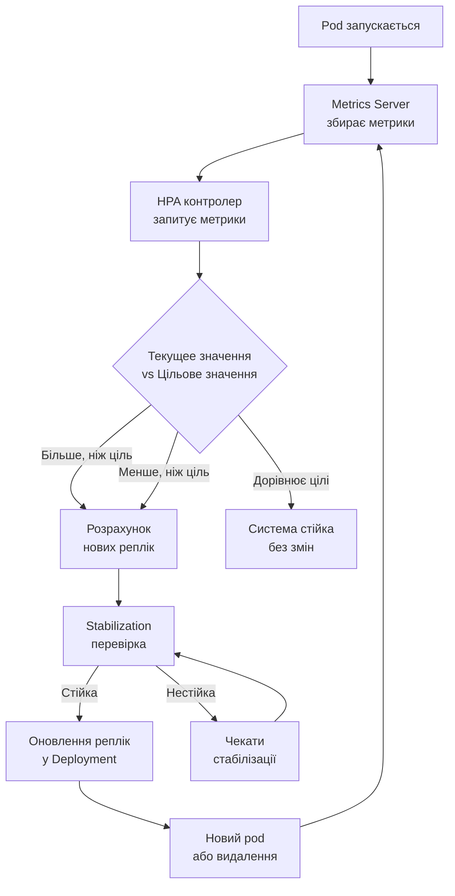
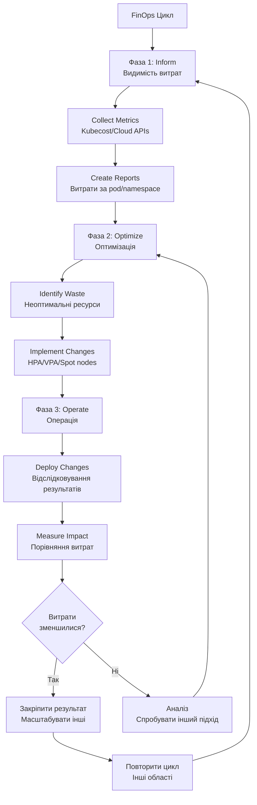

# Лекція 24 Автомасштабування та оптимізація продуктивності

## 1. Вступ до масштабування в Kubernetes

### 1.1. Засадничі концепції масштабування

Масштабування являє собою адаптацію ресурсів обчислювальної інфраструктури до змінюваних вимог навантаження. У контексті Kubernetes розрізняють два основних типи масштабування: горизонтальне та вертикальне. Горизонтальне масштабування передбачає додавання або видалення множин экземплярів додатків (pod-ів) або вузлів кластеру. Вертикальне масштабування передбачає збільшення або зменшення обчислювальних ресурсів (CPU, пам'ять) для окремих pod-ів або вузлів.

Вибір правильної стратегії масштабування є критично важливим для забезпечення як надійності, так і економічної ефективності системи. Неправильно налаштоване масштабування може призвести до перевищення витрат, виснаження ресурсів, або до недостатньої відповідності вимогам користувачів.

Масштабування у Kubernetes здійснюється через декілька взаємодіючих компонентів. Metrics Server збирає метрики з кожного pod-а та вузла. Контролери Horizontal Pod Autoscaler (HPA), Vertical Pod Autoscaler (VPA) та Cluster Autoscaler приймають рішення про масштабування на основі цих метрик та встановлених правил.

### 1.2. Прості математичні основи

При обговоренні масштабування важливо розуміти базові математичні концепції. Коли говоримо про горизонтальне масштабування, обговорюємо зв'язок між кількістю pod-ів та пропускною здатністю. Якщо один pod обробляє 100 запитів за секунду, то 10 pod-ів повинні обробляти близько 1000 запитів за секунду, за умови ідеального розподілення навантаження.

Однак на практиці існує певна експоненціальна складність, яка виникає у розподілених системах. Додавання нових pod-ів вводить додатковий оверхед комунікації та координації. Таким чином, ефективність масштабування часто менше, ніж 100%, але зазвичай залишається в діапазоні 80-95% для добре розроблених систем.

## 2. Горизонтальне масштабування — HPA

### 2.1. Архітектура та компоненти

Horizontal Pod Autoscaler (HPA) — це контролер Kubernetes, який автоматично масштабує кількість реплік Deployment, StatefulSet або ReplicaSet на основі спостережених метрик. Архітектура HPA складається з кількох компонентів.

Metrics Server — це компонент кластеру, який збирає метрики використання ресурсів з кожного pod-а та вузла. Він запускається як Deployment в namespace `kube-system` та виконує розпит до kubelet на кожному вузлі для отримання поточних показників CPU та пам'яті.

Control Loop — це основна логіка HPA, яка працює в контролері Kubernetes. Цикл контролю періодично запускається (за замовчуванням кожні 15 секунд) та виконує таку послідовність: 1) запит метрик з Metrics Server, 2) обчислення бажаної кількості реплік на основі поточних метрик та встановлених цільових значень, 3) оновлення кількості реплік у Deployment або іншому об'єкті масштабування.

Обчислення бажаної кількості реплік проводиться за формулою:

```
desiredReplicas = ceil[currentReplicas * (currentValue / targetValue)]
```

Наприклад, якщо поточні репліки дорівнюють 3, поточне використання CPU 80%, а цільове значення 50%, то бажана кількість реплік буде ceil[3 * (80 / 50)] = 5.

### 2.2. Метрики та налаштування

HPA підтримує різні типи метрик для прийняття рішень про масштабування:

Метрики ресурсів обчислювальних: це вбудовані метрики, такі як CPU та пам'ять. Вони вимірюються в міліядрах CPU та мегабайтах пам'яті. Для використання метрик ресурсів, pod повинен мати встановлені Resource Requests.

Користувацькі метрики: це метрики, визначені додатком, такі як кількість активних з'єднань, кількість повідомлень в черзі або власна метрика продуктивності додатку. Користувацькі метрики вимагають установки Custom Metrics API, зазвичай через інструмент на кшталт Prometheus та адаптер для представлення метрик у форматі, зрозумілому HPA.

Метрики об'єктів: це метрики, асоційовані з конкретним об'єктом Kubernetes, таким як Ingress або Service. Наприклад, можна масштабувати на основі кількості запитів на Ingress.

Приклад HPA ресурс, який масштабує Deployment на основі CPU:

```yaml
apiVersion: autoscaling/v2
kind: HorizontalPodAutoscaler
metadata:
  name: myapp-hpa
spec:
  scaleTargetRef:
    apiVersion: apps/v1
    kind: Deployment
    name: myapp
  minReplicas: 2
  maxReplicas: 10
  metrics:
  - type: Resource
    resource:
      name: cpu
      target:
        type: Utilization
        averageUtilization: 70
  - type: Resource
    resource:
      name: memory
      target:
        type: Utilization
        averageUtilization: 80
  behavior:
    scaleDown:
      stabilizationWindowSeconds: 300
      policies:
      - type: Percent
        value: 50
        periodSeconds: 60
    scaleUp:
      stabilizationWindowSeconds: 0
      policies:
      - type: Percent
        value: 100
        periodSeconds: 30
```

У цьому прикладі HPA буде масштабувати Deployment `myapp` так, щоб утримувати середнє використання CPU на рівні 70% та пам'яті на рівні 80%. Мінімальна кількість реплік — 2, максимальна — 10. При масштабуванні вверх, кількість реплік може подвоїтися кожні 30 секунд. При масштабуванні вниз, кількість реплік зменшується на 50% кожні 60 секунд, але лише якщо система залишалася стійкою протягом 5 хвилин.

### 2.3. Поведінка та стабілізація

Один з найважливіших аспектів HPA — це його поведінка масштабування та механізми стабілізації. Без стабілізації, HPA може потрапити у стан "thrashing", коли кількість реплік швидко коливається вгору та вниз, спричиняючи значне навантаження на систему.

Параметр `stabilizationWindowSeconds` встановлює час, протягом якого система повинна залишатися стійкою перед видаленням pod-ів. За замовчуванням для масштабування вниз це значення становить 5 хвилин, що дозволяє ресурсам охолонути після піку навантаження.

Політики (`policies`) у полі `behavior` дозволяють встановлювати максимальну швидкість масштабування. Наприклад, `type: Percent` з `value: 100` означає, що кількість реплік може подвоїтися (`100%` зростання) кожні `periodSeconds: 30` секунд.

## 3. Вертикальне масштабування — VPA

### 3.1. Vertical Pod Autoscaler — архітектура

Vertical Pod Autoscaler (VPA) — це інструмент, який автоматично регулює розмір ресурсів (CPU та пам'ять) для pod-ів на основі їхнього історичного використання та поточного навантаження. На відміну від HPA, який змінює кількість pod-ів, VPA змінює ресурси всередину pod-ів.

VPA складається з трьох основних компонентів:

Recommender — це компонент, який аналізує історичне використання ресурсів та надає рекомендації щодо ідеальних значень Resource Requests та Limits. Recommender використовує метрики з Metrics Server та власну базу даних історичних даних.

Updater — це компонент, який фактично змінює Resource Requests pod-ів на основі рекомендацій Recommender. Updater робить це шляхом видалення pod-а та його пересоздання з новими значеннями ресурсів.

Admission Webhook — це компонент, який перехоплює створення нових pod-ів та встановлює відповідні Resource Requests на основі історичних даних та рекомендацій.

### 3.2. Режими роботи VPA

VPA підтримує кілька режимів роботи, які впливають на його поведінку:

Off — режим, в якому VPA не виконує жодних дій. Це корисно для вимкнення VPA без його видалення з кластеру.

Initial — режим, в якому VPA встановлює Resource Requests лише під час створення pod-а, але не змінює ресурси вже працюючих pod-ів.

Auto — режим (за замовчуванням), в якому VPA як встановлює Resource Requests для нових pod-ів, так і періодично видаляє та пересоздає pod-и з оновленими ресурсами на основі рекомендацій.

Recreate — режим, аналогічний Auto, але з явним контролем над процесом видалення pod-ів.

Приклад VPA ресурс:

```yaml
apiVersion: autoscaling.k8s.io/v1
kind: VerticalPodAutoscaler
metadata:
  name: myapp-vpa
spec:
  targetRef:
    apiVersion: apps/v1
    kind: Deployment
    name: myapp
  updatePolicy:
    updateMode: "Auto"
  resourcePolicy:
    containerPolicies:
    - containerName: myapp
      minAllowed:
        cpu: 100m
        memory: 128Mi
      maxAllowed:
        cpu: 2
        memory: 2Gi
      controlledValues:
        - RequestsAndLimits
```

У цьому прикладі VPA буде автоматично регулювати Resource Requests та Limits для контейнера `myapp`, утримуючи їх в діапазоні від 100m CPU та 128Mi пам'яті до 2 CPU та 2Gi пам'яті.

### 3.3. Ризики та розгляди при використанні VPA

Хоча VPA є потужним інструментом, він несе деякі ризики, які необхідно розуміти. По-перше, видалення та пересоздання pod-ів для оновлення ресурсів обумовлює перерву в обслуговуванні. Якщо pod-и не є розповсюджені або не мають правильних політик розповсюдження, це може призвести до часткової або повної недоступності.

По-друге, VPA працює на основі історичних даних, що означає, що він може неправильно реагувати на раптові зміни в комерційній активності. Наприклад, якщо сервіс раптово отримує новий тип навантаження, VPA може не мати достатньо часу для адаптації.

По-третє, комбінування VPA та HPA може призвести до несподіваної поведінки. Якщо обидва інструменти працюють одночасно, рішення про масштабування можуть конфліктувати. Google рекомендує використовувати VPA та HPA разом лише з особливою обережністю, зазвичай з явною розділенням відповідальності.

## 4. Cluster Autoscaler

### 4.1. Масштабування на рівні вузлів

Cluster Autoscaler — це компонент, який автоматично додає або видаляє вузли з кластеру на основі вимог pod-ів. Коли pod не може бути розповсюджений через недостаток ресурсів на існуючих вузлах, Cluster Autoscaler автоматично запускає новий вузол від хмарного провайдера. Коли вузол залишається недовикористаним протягом певного часу, Cluster Autoscaler видаляє його.

Cluster Autoscaler тісно інтегрований з провайдерами хмари, такими як AWS, Google Cloud, Azure та інші. Кожен провайдер має свої механізми для запуску та видалення вузлів, і Cluster Autoscaler має адаптери для кожного провайдера.

### 4.2. Конфігурація та розділи масштабування

Cluster Autoscaler можна налаштувати через прапорці командного рядка, які передаються під час запуску. Важливі прапорці включають:

`--cloud-provider`: вказує провайдера хмари (aws, gce, azure, etc.).

`--nodes`: встановлює мінімальну та максимальну кількість вузлів у кластері, наприклад `--nodes=1:10` означає мінімум 1 та максимум 10 вузлів.

`--scale-down-enabled`: вмикає масштабування вниз для видалення вузлів.

`--scale-down-unneeded-time`: час, протягом якого вузол повинен залишатися недовикористаним перед видаленням (за замовчуванням 10 хвилин).

Cluster Autoscaler також підтримує розділи масштабування (autoscaling groups) у AWS або екземплярні групи в інших провайдерах, які дозволяють встановлювати різні мінімальні та максимальні кількості для різних типів вузлів.

## 5. KEDA — Event-Driven Autoscaling

### 5.1. Основна концепція та переваги

Kubernetes Event-Driven Autoscaling (KEDA) — це розширення Kubernetes, яке дозволяє масштабувати pod-и на основі подій з різних джерел, таких як черги повідомлень, монітори, логи та багато іншого. На відміну від HPA, який масштабує на основі метрик ресурсів, KEDA масштабує на основі зовнішніх подій.

Одна з найцікавіших можливостей KEDA — це масштабування від нуля (scale to zero). Якщо немає подій для обробки, KEDA може повністю видалити pod-и, а потім автоматично створити їх при появі нових подій. Це значно знижує витрати на інфраструктуру для робіт, які мають спорадичний характер.

### 5.2. ScaledObject та джерела подій

ScaledObject — це основний ресурс KEDA, який визначає, як масштабувати конкретний Deployment на основі подій. ScaledObject посилається на Deployment та вказує тип скалера, який повинен використовуватися.

KEDA підтримує десятки скалерів для різних джерел подій:

Apache Kafka: масштабування на основі кількості невідправлених повідомлень в темі.

RabbitMQ: масштабування на основі довжини черги.

AWS SQS: масштабування на основі кількості повідомлень у черзі Simple Queue Service.

Google Cloud Pub/Sub: масштабування на основі затримки в спілкуванні.

Redis: масштабування на основі довжини списку или значень ключів.

HTTP: масштабування на основі відповідей з HTTP кінцевої точки.

Prometheus: масштабування на основі довільних метрик Prometheus.

PostgreSQL: масштабування на основі результатів запиту до бази даних.

Приклад ScaledObject для масштабування на основі Kafka:

```yaml
apiVersion: keda.sh/v1alpha1
kind: ScaledObject
metadata:
  name: kafka-scaler
  namespace: default
spec:
  scaleTargetRef:
    name: kafka-consumer-deployment
  minReplicaCount: 1
  maxReplicaCount: 20
  triggers:
  - type: kafka
    metadata:
      bootstrapServers: kafka-broker:9092
      consumerGroup: my-consumer-group
      topic: my-topic
      lagThreshold: "100"
      offsetResetPolicy: latest
```

У цьому прикладі KEDA буде масштабувати `kafka-consumer-deployment` так, щоб утримувати lag (затримку) для Kafka consumer group на рівні близько 100 повідомлень. Якщо lag перевищує цільове значення, додатися нові pod-и. Якщо lag зменшується, pod-и будуть видалені.

### 5.3. Запуск робіт та масштабування від нуля

KEDA розширює концепцію масштабування для покриття не лише Deployments, але й інших типів робіт. ScaledJob — це ресурс KEDA, який керує Kubernetes Jobs, дозволяючи їм запускатися на основі подій.

Приклад ScaledJob:

```yaml
apiVersion: keda.sh/v1alpha1
kind: ScaledJob
metadata:
  name: image-processing-job
  namespace: default
spec:
  jobTargetRef:
    template:
      spec:
        containers:
        - name: image-processor
          image: myregistry/image-processor:latest
        restartPolicy: Never
    backoffLimit: 3
  minReplicaCount: 0
  maxReplicaCount: 50
  triggers:
  - type: aws-sqs
    metadata:
      queueURL: https://sqs.us-east-1.amazonaws.com/123456789012/image-queue
      queueLength: "10"
      awsRegion: us-east-1
```

У цьому прикладі KEDA буде запускати Job для обробки зображень кожного разу, коли в AWS SQS черзі накопичується близько 10 повідомлень. Коли черга буде обробленою, Job завершиться, і жодних ресурсів не буде витрачено до появи нових повідомлень.

## 6. Тестування продуктивності

### 6.1. Введення в навантажувальне тестування

Навантажувальне тестування (load testing) — це процес перевірки того, як система справляється зі значним виростаючим навантаженням. Метою навантажувального тестування є виявлення слабких місць у системі, визначення максимальної пропускної здатності та виявлення точок розвитку.

Существує кілька типів навантажувального тестування:

Load Testing: поступове збільшення навантаження до визначеного рівня та спостереження за поведінкою системи.

Stress Testing: збільшення навантаження понад очікувані показники, щоб виявити точку відмови системи.

Soak Testing: утримання постійного навантаження протягом тривалого періоду для виявлення витоків пам'яті та деградації продуктивності.

Spike Testing: раптове збільшення навантаження та спостереження за тим, як система справляється.

### 6.2. k6 — сучасне видання для навантажувального тестування

k6 — це вбудоване сучасне видання для навантажувального тестування, розроблене компанією Grafana Labs. k6 написано на Go, що дозволяє йому бути дуже ефективним та здатним генерувати значне навантаження з обмежених ресурсів.

Скрипти k6 пишуться на JavaScript (ES2015 підмножина) та дозволяють задавати складні сценарії тестування. Натомість від інших інструментів, k6 нативно видає результати у форматі, зручному для інтеграції з сучасними моніторинговими рішеннями, такими як Prometheus та InfluxDB.

Приклад k6 скрипту для тестування API:

```javascript
import http from 'k6/http';
import { check, group, sleep } from 'k6';

export let options = {
  vus: 10,
  duration: '30s',
  thresholds: {
    http_req_duration: ['p(95)<500'],
    http_req_failed: ['<0.1'],
  },
};

export default function () {
  group('User Flow', function () {
    // GET запит до hoofdpágina
    let res = http.get('https://api.example.com/');
    check(res, {
      'status is 200': (r) => r.status === 200,
      'response time < 200ms': (r) => r.timings.duration < 200,
    });

    sleep(1);

    // POST запит для створення ресурсу
    let createRes = http.post('https://api.example.com/users',
      JSON.stringify({
        name: 'Test User',
        email: 'test@example.com',
      }),
      {
        headers: { 'Content-Type': 'application/json' },
      }
    );

    check(createRes, {
      'create status is 201': (r) => r.status === 201,
      'create response time < 300ms': (r) => r.timings.duration < 300,
    });

    sleep(1);

    // GET запит для вилучення даних
    let getUserRes = http.get(`https://api.example.com/users/${createRes.json('id')}`);
    check(getUserRes, {
      'get status is 200': (r) => r.status === 200,
    });

    sleep(2);
  });
}
```

У цьому прикладі скрипт k6 симулює 10 користувачів (VUs) протягом 30 секунд. Кожен користувач виконує три API запити: GET, POST та ще один GET. Скрипт також визначає умови успіху (checks), такі як код статусу 200, та порогові значення, такі як як 95-й персентиль часу відповіді повинен бути менше 500 мс.

### 6.3. Locust та Apache JMeter

Locust — це інший популярний інструмент для навантажувального тестування, написаний на Python. Locust дозволяє визначати користувальницьких сценаріїв за допомогою класів Python та надає веб-інтерфейс для контролю тестування в реальному часі.

Apache JMeter — це давніший, але все ще широко використовуваний інструмент, розроблений Апачем. JMeter має графічний інтерфейс та підтримує широкий спектр типів запитів та протоколів.

При виборі інструменту слід врахувати:

- Простоту використання: k6 вважається найпростішим для інтеграції з CI/CD.

- Масштабованість: k6 найбільш ефективний для генерування великого навантаження.

- Гнучкість: Locust найбільш гнучкий для складних сценаріїв.

- Особливості: JMeter має найширший спектр особливостей.

## 7. Інтерпретація результатів навантажувального тестування

### 7.1. Основні метрики

При інтерпретації результатів навантажувального тестування важливо розуміти ключові метрики:

Response Time (часовий відклик): час від надсилання запиту до отримання відповіді. Зазвичай представляється як середнє значення, мінімум, максимум та персентилі (50-й, 95-й, 99-й).

Throughput (пропускна здатність): кількість запитів, що обробляються системою за одиницю часу (запити за секунду або RPS).

Error Rate (коефіцієнт помилок): відсоток запитів, які завершилися помилкою або отримали непередбачуваний кодекс статусу.

Concurrency (паралелізм): кількість одночасних активних користувачів чи запитів.

Latency (затримка): синонім для response time, але часто використовується у контексті мережевої затримки.

Приклад результатів навантажувального тестування k6:

```
          /\      |‾‾| /‾‾/   /‾‾/
     /\  /  \     |  |/  /   /  /
    /  \/    \    |     (   /   ‾‾\
   /          \   |  |\  \ |  (‾)  |
  / __________ \  |__| \_\_| \_____/ .io

  execution: local
     script: test.js
     output: -

  scenarios: (100.00%) 1 scenario, 10 max VUs, 1m0s max duration (hold for 30s + 30s ramp-down)
    default: 10 looping VUs for 30s (rookout for 30s) – execution: 0m00s / 1m00s

     data_received..................: 1.2 MB 20 kB/s
     data_sent......................: 340 kB 5.7 kB/s
     http_req_blocked...............: avg=1.23ms   min=0s       med=0s       max=52.3ms   p(90)=0s       p(95)=0s       p(99)=15.2ms
     http_req_connecting............: avg=0.23ms   min=0s       med=0s       max=10.5ms   p(90)=0s       p(95)=0s       p(99)=0s
     http_req_duration..............: avg=234.12ms min=105.23ms med=215.4ms  max=892.34ms p(90)=456.23ms p(95)=523.12ms p(99)=812.34ms
     http_req_failed................: 0.23%
     http_req_receiving.............: avg=5.12ms   min=1.23ms   med=4.5ms    max=45.2ms   p(90)=8.1ms    p(95)=12.3ms   p(99)=32.1ms
     http_req_sending...............: avg=2.34ms   min=0.5ms    med=2.1ms    max=12.3ms   p(90)=3.2ms    p(95)=4.1ms    p(99)=10.2ms
     http_req_tls_handshaking.......: avg=0ms      min=0s       med=0s       max=0s       p(90)=0s       p(95)=0s       p(99)=0s
     http_req_waiting...............: avg=226.66ms min=100.45ms med=208.2ms  max=875.12ms p(90)=445.23ms p(95)=512.34ms p(99)=802.12ms
     http_requests..................: 1200     20/s
     iteration_duration.............: avg=2.34s    min=2.1s     med=2.3s     max=3.89s    p(90)=2.6s     p(95)=2.8s     p(99)=3.4s
     iterations.....................: 120      2/iter/s
     vus............................: 10       min=10      max=10
     vus_max........................: 10       min=10      max=10
```

Інтерпретація цих результатів:

- Середній час відповіді (http_req_duration) становить 234.12 ms, що є задовільним.

- 95-й персентиль часу відповіді становить 523.12 ms, що все ще в межах прийнятного діапазону для більшості додатків.

- Коефіцієнт помилок становить 0.23%, що є дуже низьким.

- Система обробила 1200 запитів, або 20 запитів на секунду.

На основі цих результатів можна зробити висновок, що система справляється з навантаженням 10 одночасних користувачів без проблем. Для подальшого масштабування можна збільшити кількість користувачів та повторити тест.

## 8. Оптимізація витрат у Kubernetes

### 8.1. Resource Requests та Limits

Ефективне управління витратами у Kubernetes починається з правильного встановлення Resource Requests та Limits для кожного контейнера.

Resource Requests вказують, скільки ресурсів контейнер гарантовано отримає. Kubernetes використовує це значення при планіші pod-ів на вузли, гарантуючи, що вузол має достатньо ресурсів для задоволення всіх запитів pod-ів, які розповсюджуються на нього.

Resource Limits вказують максимальну кількість ресурсів, яку контейнер може використовувати. Якщо контейнер спробує використовувати більше ресурсів, ніж встановлено у Limit, він буде обмежений або припинено.

Приклад встановлення Resource Requests та Limits:

```yaml
apiVersion: v1
kind: Pod
metadata:
  name: myapp
spec:
  containers:
  - name: myapp
    image: myregistry/myapp:latest
    resources:
      requests:
        cpu: 100m
        memory: 128Mi
      limits:
        cpu: 500m
        memory: 512Mi
```

Правильне встановлення Requests та Limits є ключом до ефективного використання ресурсів. Занадто високі Requests призведуть до перевикористання ресурсів, тоді як занадто низькі Requests можуть привести до вилученням pod-ів з вузлів при нестачі ресурсів.

### 8.2. LimitRange та ResourceQuota

LimitRange — це об'єкт Kubernetes, який встановлює обмеження на ресурси для pod-ів та контейнерів у певному namespace. LimitRange дозволяє адміністраторам забезпечити, що всі pod-и в namespace дотримуються мінімальних та максимальних значень ресурсів.

Приклад LimitRange:

```yaml
apiVersion: v1
kind: LimitRange
metadata:
  name: default-limits
  namespace: default
spec:
  limits:
  - default:
      cpu: 500m
      memory: 512Mi
    defaultRequest:
      cpu: 100m
      memory: 128Mi
    max:
      cpu: 2
      memory: 2Gi
    min:
      cpu: 50m
      memory: 64Mi
    type: Container
```

ResourceQuota — це об'єкт Kubernetes, який встановлює обмеження на загальну кількість ресурсів, які можуть використовуватися в namespace. ResourceQuota дозволяє адміністраторам розповсюджувати ресурси кластеру між різними teamami та projectами.

Приклад ResourceQuota:

```yaml
apiVersion: v1
kind: ResourceQuota
metadata:
  name: team-quota
  namespace: team-a
spec:
  hard:
    requests.cpu: "10"
    requests.memory: "20Gi"
    limits.cpu: "20"
    limits.memory: "40Gi"
    pods: "100"
  scopeSelector:
    matchExpressions:
    - operator: In
      scopeName: PriorityClass
      values: ["high", "medium"]
```

### 8.3. Spot та Preemptible nodes

Spot instances у AWS та Preemptible nodes у Google Cloud — це обчислювальні ресурси, які пропонуються за значно меншої вартості порівняно зі звичайними на-деманд інстансами. Однак ці ресурси можуть бути припинені без попередження коли облачний провайдер потребує їх для інших цілей.

Kubernetes дозволяє використовувати Spot та Preemptible nodes для неважливих робіт та pod-ів, які можуть бути перезапущені без наслідків. Це значно знижує витрати на інфраструктуру.

Приклад Deployment, який використовує Spot nodes:

```yaml
apiVersion: apps/v1
kind: Deployment
metadata:
  name: spot-workload
spec:
  replicas: 3
  selector:
    matchLabels:
      app: worker
  template:
    metadata:
      labels:
        app: worker
    spec:
      affinity:
        nodeAffinity:
          requiredDuringSchedulingIgnoredDuringExecution:
            nodeSelectorTerms:
            - matchExpressions:
              - key: karpenter.sh/capacity-type
                operator: In
                values: ["spot"]
      containers:
      - name: worker
        image: myregistry/worker:latest
```

## 9. FinOps принципи та інструменти

### 9.1. FinOps цикл управління витратами

FinOps (Financial Operations) — це практика управління витратами хмарних сервісів на основі даних та спільної відповідальності. FinOps цикл складається з трьох основних фаз:

Inform (Інформація): збір даних про використання ресурсів та витрати. На цій фазі організація встановлює інструменти для відслідковування витрат та розуміває, куди йдуть гроші.

Optimize (Оптимізація): на основі даних з фази Inform, організація приймає рішення про оптимізацію витрат. Це може включати вибір більш дешевих ресурсів, видалення недовикористаних ресурсів або перехід на більш ефективні архітектури.

Operate (Операція): впровадження оптимізацій та відслідковування їхньої ефективності. На цій фазі організація переводить рішення в дію та вимірює результати.

### 9.2. Visibility — видимість витрат

Перший крок до управління витратами — це отримання повної видимості того, як витрачаються ресурси та гроші. Без видимості, організація не може приймати обґрунтовані рішення про оптимізацію.

Инструменти видимості витрат включають:

Cloud Provider Built-in Tools: AWS Cost Explorer, Google Cloud Billing, Azure Cost Management.

Kubecost: спеціалізована платформа для видимості витрат Kubernetes, яка розповідає витрати за pod, namespace, label та інші виміри.

OpenCost: відкритоджерельна вхідна точка для інтеграції витрат Kubernetes з іншими інструментами.

### 9.3. Governance — управління видатками

Governance в контексті FinOps означає встановлення політик та процесів для контролю витрат. Це включає:

Budget Alerts: встановлення сповіщень при наближенні до встановлених бюджетів.

Tagging Policies: встановлення правил для марування ресурсів, що дозволяє організації відслідковувати витрати за різними вимірами.

Approval Workflows: встановлення процесів для затвердження дорогих ресурсів перед їхнім розповсюдженням.

Chargeback Models: розповсюдження витрат між різними командами або projectами на основі їхнього фактичного використання ресурсів.

## 10. Профілювання та оптимізація додатків

### 10.1. CPU та Memory Profiling

Профілювання — це процес вимірювання того, як додаток використовує ресурси. CPU profiling допомагає виявити, які функції та методи в коді витрачають найбільше часу. Memory profiling допомагає виявити витоки пам'яті та неефективне використання пам'яті.

Для Go додатків можна використовувати вбудовану пакет `pprof`:

```go
import (
    "net/http"
    _ "net/http/pprof"
)

func main() {
    go func() {
        http.ListenAndServe("localhost:6060", nil)
    }()

    // Основна логіка додатку
}
```

Після запуску додатку можна отримати CPU profile через HTTP:

```bash
curl http://localhost:6060/debug/pprof/profile > cpu.prof
go tool pprof cpu.prof
```

### 10.2. Bottleneck Analysis

Bottleneck Analysis — це процес виявлення компонентів системи, які обмежують загальну продуктивність. Bottleneck може бути CPU, пам'ять, мережа або дисковий I/O.

Кроки для виявлення bottleneck:

1. Вимірювання використання всіх ресурсів під час роботи системи під навантаженням.

2. Визначення ресурсу, який використовується найбільш повністю (найближче до 100%).

3. Зосередження зусиль на оптимізації цього ресурсу.

Наприклад, якщо CPU ніколи не перевищує 30%, але мережа регулярно перевищує 90%, то мережа є bottleneck, і оптимізація повинна зосередитися на зменшенні мережевого трафіку.

## 11. Діаграми архітектури

### 11.1. HPA робочий процес



### 11.2. FinOps цикл оптимізації витрат



## Контрольні запитання

1. Поясніть відмінність між горизонтальним та вертикальним масштабуванням у Kubernetes та описіть, в яких сценаріях краще використовувати кожен тип.

2. Розрахуйте бажану кількість реплік для HPA, якщо поточних реплік 5, поточне використання CPU 85%, а цільовий рівень 60%. Поясніть логіку розрахунку.

3. Пояс­ніть режими роботи VPA (Off, Initial, Auto, Recreate) та описіть потенціальні ризики при одночасному використанні VPA та HPA.

4. Опишіть, як Cluster Autoscaler приймає рішення про додавання та видалення вузлів з кластеру.

5. Поясніть концепцію масштабування від нуля (scale to zero) у KEDA та наведіть практичний приклад використання для обробки повідомлень з черги.

6. Напишіть простий k6 скрипт для навантажувального тестування вебдодатку та опишіть, як інтерпретувати результати тестування.

7. Поясніть як мінімум три FinOps принципи та опишіть, як Kubecost допомагає організації управляти витратами на Kubernetes інфраструктуру.
