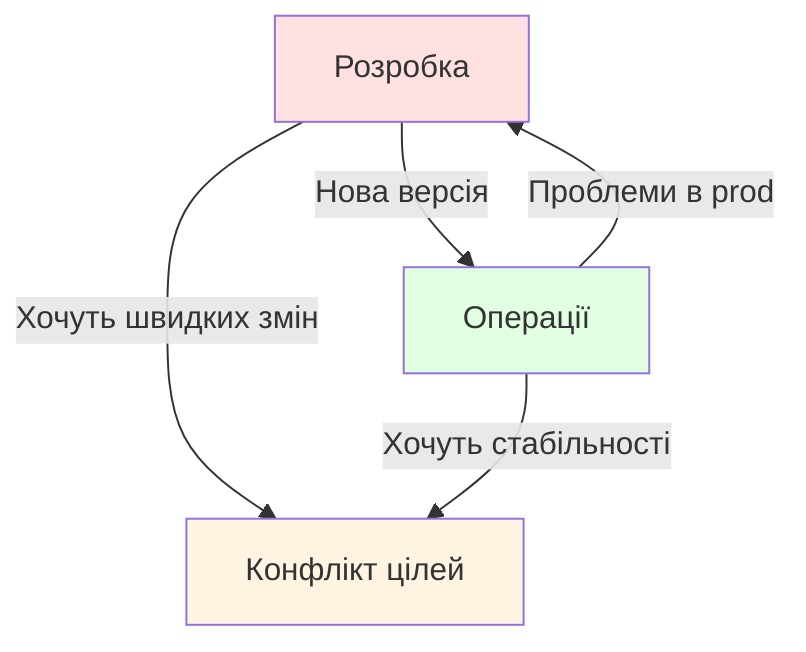
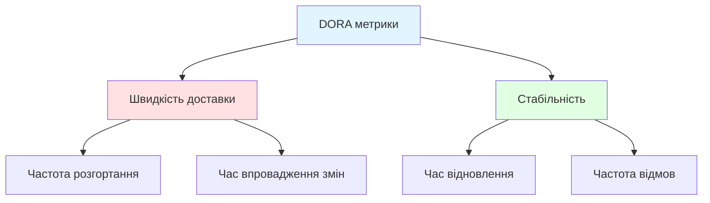

# Принципи та метрики DevOps

---

## Еволюція розробки ПЗ

**Каскадна модель** → **Agile** → **DevOps**

Каскад: передбачуваність, але негнучкість

---

## Проблема каскадної моделі ⚠️

**Основні недоліки:**

- 💰 Висока вартість змін на пізніх етапах
- ⏰ Тривалий час до отримання зворотного зв'язку
- 🔒 Відсутність гнучкості при зміні вimог
- 🐌 Релізи раз на кілька місяців (або рідше)

**Результат:** продукт може не відповідати реальним потребам ❌

---

## Agile: крок вперед 🚀

**Ключові цінності Agile Manifesto:**

- 👥 Люди та взаємодія важливіші за процеси
- 💻 Працююче ПЗ важливіше за документацію
- 🤝 Співпраця з замовником важливіша за контракт
- 🔄 Реагування на зміни важливіше за план

**Але:** залишається розрив між розробкою та експлуатацією ⚡

---

## Розрив Dev та Ops

**Типові проблеми:** різні інструменти, процеси, пріоритети

---

## Що таке DevOps?

**DevOps** — це культура, практики та інструменти для автоматизації та інтеграції процесів між розробкою та IT-операціями.

**Мета:** швидше створювати, тестувати та випускати ПЗ з більшою надійністю

---

## DevOps — це не тільки інструменти

**DevOps = Культура + Автоматизація + Вимірювання**

- **Культура:** співпраця, довіра, спільна відповідальність
- **Автоматизація:** CI/CD, Infrastructure as Code
- **Вимірювання:** метрики для постійного покращення

---

## Основні принципи DevOps

**Культура співпраці 🤝**
- Міжфункціональні команди
- Спільна відповідальність за результат
- Відкрите спілкування

**Автоматизація 🤖**
- Автоматизовані тести
- Автоматизоване розгортання
- Інфраструктура як код

---

## Принципи DevOps (продовження)

**Безперервне вдосконалення 📈**
- Регулярні ретроспективи
- Експериментування з новими підходами
- Навчання на помилках

**Швидкий зворотний зв'язок ⚡**
- Автоматизовані тести дають миттєву інформацію
- Моніторинг продуктивних систем
- Збір відгуків користувачів

---

## Три шляхи DevOps

---

## Перший шлях: Потік 🌊

**Швидкий рух роботи від розробки до клієнта**

- 🎯 Оптимізація потоку створення цінності
- 🔍 Виявлення та усунення вузьких місць
- 📦 Зменшення розміру партій роботи
- ⏱️ Скорочення інтервалів між ітераціями

**Результат:** швидка доставка цінності користувачам ✅

---

## Другий шлях: Зворотний зв'язок

**Короткі цикли зворотного зв'язку**

- Швидке виявлення проблем
- Розуміння потреб користувачів
- Постійне навчання

---

## Третій шлях: Навчання 📚

**Культура експериментів та інновацій**

- 🧪 Виділення часу для експериментів
- 🛡️ Безпечне середовище для помилок
- 💡 Обмін знаннями в команді
- 🎓 Постійне вдосконалення навичок

**Девіз:** "Помилка — це можливість для навчання" 💪

---

## DevOps на практиці

**Ключові практики:**

- **Безперервна інтеграція (CI):** регулярне об'єднання змін
- **Безперервна доставка (CD):** автоматизація до продакшну
- **Infrastructure as Code:** управління інфраструктурою через код
- **Моніторинг та спостережуваність:** розуміння поведінки системи

---

## Навіщо потрібні метрики? 📊

**Метрики дозволяють:**

- 🎯 Об'єктивно оцінити поточний стан
- 📈 Виміряти прогрес покращень
- 🏆 Порівняти себе з індустрією
- 🔍 Виявити проблемні зони
- 💰 Обґрунтувати інвестиції в DevOps

**Правило:** "Що не вимірюється — не покращується" ⚖️

---

## DORA метрики

**DevOps Research and Assessment**

Чотири ключові метрики ефективності:

1. **Частота розгортання**
2. **Час впровадження змін**
3. **Час відновлення після збою**
4. **Частота відмов при зміні**

---

## DORA метрики: структура

---

## Метрика 1: Частота розгортання

**Як часто організація випускає зміни в продакшн?**

**Рівні ефективності:**

- **Елітні:** кілька разів на день
- **Високі:** раз на день — раз на тиждень
- **Середні:** раз на тиждень — раз на місяць
- **Низькі:** рідше ніж раз на місяць

---

## Метрика 2: Час впровадження змін ⏱️

**Час від початку роботи до розгортання в продакшні**

**Рівні ефективності:**

- 🏆 **Елітні:** менше 1 години
- 🥇 **Високі:** 1 день — 1 тиждень
- 🥈 **Середні:** 1 тиждень — 1 місяць
- 🥉 **Низькі:** 1-6 місяців

**Показує:** здатність швидко реагувати на потреби бізнесу 🚀

---

## Метрика 3: Час відновлення

**Скільки часу потрібно для відновлення роботи після збою?**

**Рівні ефективності:**

- **Елітні:** менше 1 години
- **Високі:** менше 1 дня
- **Середні:** 1 день — 1 тиждень
- **Низькі:** 1 тиждень — 1 місяць

**Показує:** готовність до інцидентів та якість процесів

---

## Метрика 4: Частота відмов

**Відсоток розгортань, що призводять до погіршення сервісу**

**Рівні ефективності:**

- **Елітні:** 0-15%
- **Високі:** 16-30%
- **Середні:** 31-45%
- **Низькі:** 46-60%

**Показує:** якість процесів тестування та розгортання

---

## Порівняння рівнів ефективності

| Метрика | Елітні | Низькі |
|---------|--------|---------|
| Частота розгортання | Кілька разів/день | Рідше 1/місяць |
| Час впровадження | < 1 год | 1-6 місяців |
| Час відновлення | < 1 год | 1 тиждень-1 міс |
| Частота відмов | 0-15% | 46-60% |

---

## Додаткові метрики DevOps

**Технічні метрики:**

- Покриття коду тестами
- Час збірки та тестування
- Кількість інцидентів

**Бізнес-метрики:**

- Задоволеність клієнтів (NPS)
- Час виходу на ринок
- Використання продукту

---

## Як покращити метрики?

**Крок 1:** Встановити базовий рівень
- Виміряти поточні значення
- Зрозуміти відправну точку

**Крок 2:** Визначити цілі
- Реалістичні, але амбітні
- Базовані на дослідженнях DORA

---

## Покращення метрик (продовження)

**Крок 3:** Ідентифікувати вузькі місця
- Де найбільше затримок?
- Що обмежує швидкість?

**Крок 4:** Впроваджувати зміни ітеративно
- Невеликі послідовні покращення
- Вимірювати ефект кожної зміни

**Крок 5:** Регулярно переглядати
- Щомісячно або щокварталу
- Аналізувати тренди

---

## Типові вузькі місця 🚧

**Технічні:**
- 🐌 Повільні збірки та тести
- 👨‍💻 Ручні процеси розгортання
- ❌ Відсутність автоматизації

**Організаційні:**
- 📋 Бюрократичні процеси затвердження
- 🤷 Відсутність співпраці між командами
- 😰 Страх перед змінами

---

## Зв'язок метрик з бізнесом 💼

**DORA довела:**

Організації з високими показниками DevOps мають:

- 📊 **2х вищу продуктивність** розробки
- 🛡️ **3х нижчі показники** випадків збоїв
- ⚡ **24х швидше** відновлення після інцидентів
- 😊 **Вищу задоволеність** співробітників

---

## DevOps трансформація

**Важливо:** DevOps — це подорож, а не пункт призначення

---

## Поширені помилки ⚠️

**Чого уникати:**

- 🔧 Фокус тільки на інструментах без культурних змін
- ⏰ Очікування миттєвих результатів
- 👤 Впровадження DevOps лише в одній команді
- 🔐 Ігнорування безпеки (DevSecOps важливий!)
- 📉 Відсутність вимірювання прогресу

---

## Ключові виноски 🎯

**DevOps — це:**
- 🤝 Культура співпраці та довіри
- 🤖 Автоматизація процесів
- 📈 Безперервне вдосконалення
- ⚡ Швидкий зворотний зв'язок

**DORA метрики допомагають:**
- 📊 Виміряти прогрес
- 🏆 Порівняти себе з індустрією
- 🔍 Виявити вузькі місця
- 💰 Обґрунтувати інвестиції
