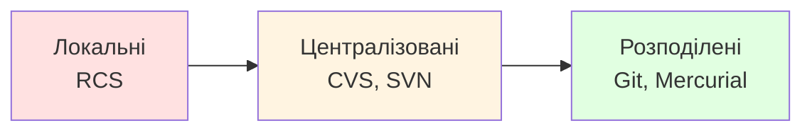
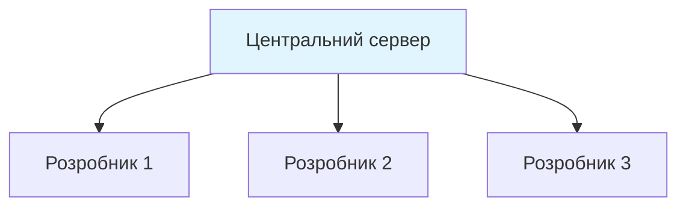
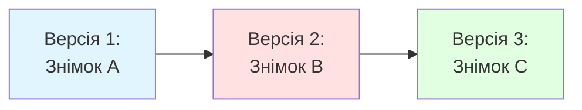
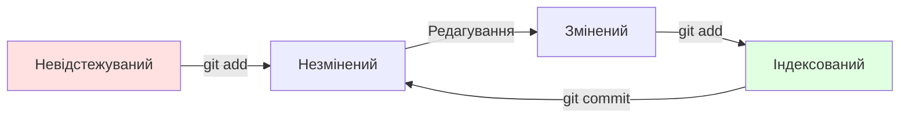
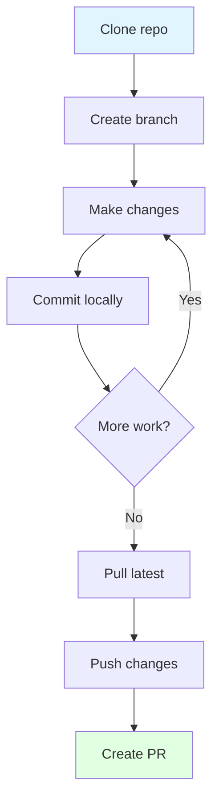

# Робота з розподіленою системою контролю версій Git

---

## Навіщо потрібен контроль версій?

**Уявіть розробку без системи контролю версій:**

- Файли з назвами `project_final_v3_really_final.js`
- Незрозуміло, хто і коли вніс зміни
- Неможливо повернутися до попередньої версії
- Складно працювати в команді
- Ризик втрати коду

**Рішення:** система контролю версій

---

## Що дає система контролю версій? 💡

**Основні переваги:**

- 📚 Історія всіх змін у коді
- ⏮️ Можливість повернутися до будь-якої версії
- 🔀 Паралельна робота над різними функціями
- 👀 Зрозуміло, хто, що і коли змінив
- 🛡️ Захист від втрати даних
- 🤝 Співпраця в команді

---

## Еволюція систем контролю версій



**Тренд:** від централізації до розподілених систем

---

## Локальні системи контролю версій 💾

**RCS (Revision Control System):**

- Зберігання версій на одному комп'ютері
- Патчі між версіями файлів
- Просто, але без співпраці

**Проблеми:**
- ❌ Неможливість командної роботи
- ⚠️ Єдина точка відмови
- 🚫 Відсутність резервування

---

## Централізовані системи

**CVS, Subversion:**



**Переваги:** простота адміністрування, контроль доступу

**Недоліки:** єдина точка відмови, потреба в постійному підключенні

---

## Розподілені системи

**Git, Mercurial:**

- Кожен клієнт має повну копію історії
- Робота в автономному режимі
- Швидкість локальних операцій
- Множинні резервні копії

**Кожне клонування = повноцінна резервна копія**

---

## Чому Git переміг? 🏆

**Ключові фактори успіху:**

- 👨‍💻 Створений Лінусом Торвальдсом для Linux
- ⚡ Надзвичайно швидкий
- 🌿 Потужні можливості гілкування
- 🌍 Розподілена архітектура
- 👥 Величезна спільнота
- 💼 Підтримка GitHub, GitLab, Bitbucket

---

## Фундаментальні концепції Git

**Git — це не список змін, а серія знімків**



Кожен коміт = повний знімок стану проєкту

---

## Переваги підходу Git

**Знімки замість дельт:**

- Швидкість операцій
- Легке відновлення будь-якої версії
- Ефективне гілкування
- Надійність даних

**Для ефективності:** незмінені файли зберігаються як посилання

---

## Майже все локально ⚡

**Операції в Git виконуються локально:**

- 📖 Перегляд історії — миттєво
- 🔍 Порівняння версій — миттєво
- ✅ Створення комітів — миттєво
- 🔌 Робота без інтернету — легко

**Винятки:** push, pull, fetch (взаємодія з віддаленим сховищем) 🌐

---

## Контрольні суми

**Кожен об'єкт в Git має SHA-1 хеш:**

```
a3f2b8c9d1e4f5a6b7c8d9e0f1a2b3c4d5e6f7a8
```

**Це означає:**

- Неможливо змінити дані непомітно
- Цілісність гарантована
- Посилання на об'єкти через хеші

---

## Три стани файлів


**Modified → Staged → Committed**

---

## Робоча директорія

**Working Directory**

- Файли, з якими ви працюєте
- Один знімок однієї версії проєкту
- Витягнуті зі стисненої бази даних Git

**Тут ви редагуєте файли**

---

## Область індексування

**Staging Area (Index)**

- Файл у директорії .git
- Зберігає інформацію про наступний коміт
- Дозволяє вибрати, що саме комітити

**Проміжний етап перед комітом**

```bash
git add file1.js file2.js  # вибіркове додавання
```

---

## Директорія Git

**.git директорія**

- Серце Git сховища
- Зберігає всі метадані та історію
- База даних об'єктів
- Конфігурація

**Це те, що копіюється при клонуванні**

---

## Початок роботи з Git

**Налаштування ідентичності:**

```bash
git config --global user.name "Ім'я Прізвище"
git config --global user.email "email@example.com"
```

**Налаштування редактора:**

```bash
git config --global core.editor "nano"
```

**Перевірка налаштувань:**

```bash
git config --list
```

---

## Створення сховища

**Спосіб 1: ініціалізація нового проєкту**

```bash
cd /шлях/до/проєкту
git init
git add .
git commit -m "Початковий коміт"
```

**Спосіб 2: клонування існуючого**

```bash
git clone https://github.com/user/repo.git
```

---

## Життєвий цикл файлів



---

## Перевірка статусу

**Команда git status:**

```bash
git status
```

**Показує:**
- На якій гілці ви знаходитесь
- Які файли змінені
- Які файли індексовані
- Які файли не відстежуються

**Коротка версія:**
```bash
git status -s
```

---

## Додавання файлів

**git add — багатофункціональна команда:**

```bash
git add filename.txt        # конкретний файл
git add *.js               # за шаблоном
git add src/               # директорія
git add .                  # все в поточній директорії
```

**Використовується для:**
- Початку відстеження нових файлів
- Індексування змінених файлів
- Позначення конфліктів як вирішених

---

## Створення комітів

**Базова команда:**

```bash
git commit -m "Опис змін"
```

**З редактором для детального опису:**

```bash
git commit
```

**Пропустити індексування:**

```bash
git commit -a -m "Опис змін"
```

**Виправити останній коміт:**

```bash
git commit --amend -m "Виправлене повідомлення"
```

---

## Перегляд історії

**Основна команда:**

```bash
git log
```

**Корисні опції:**

```bash
git log -p -2              # зміни в останніх 2 комітах
git log --stat             # статистика змін
git log --pretty=oneline   # кожен коміт в один рядок
git log --graph            # з графіком гілок
```

---

## Фільтрування історії

**За часом:**

```bash
git log --since=2.weeks
git log --since="2024-01-01"
```

**За автором:**

```bash
git log --author="Ім'я"
```

**За змістом повідомлення:**

```bash
git log --grep="виправлення"
```

**За змінами в коді:**

```bash
git log -S "function_name"
```

---

## Віддалені сховища

**Перегляд віддалених сховищ:**

```bash
git remote
git remote -v              # з URL
```

**Додавання віддаленого сховища:**

```bash
git remote add origin https://github.com/user/repo.git
```

**origin — це умовна назва, можна використовувати будь-яку**

---

## Отримання змін

**git fetch — завантажує дані, але не зливає:**

```bash
git fetch origin
```

**git pull — завантажує і зливає:**

```bash
git pull origin main
```

**pull = fetch + merge**

---

## Відправлення змін

**git push:**

```bash
git push origin main
```

**Працює якщо:**
- Ви маєте права запису
- Ніхто не відправив зміни до вас
- Якщо є конфлікт — спочатку pull, потім push

**Перша відправка гілки:**

```bash
git push -u origin feature-branch
```

---

## Типові ситуації

**Ситуація 1: забули додати файл до коміту**

```bash
git add forgotten-file.js
git commit --amend --no-edit
```

**Ситуація 2: помилково додали файл до індексу**

```bash
git reset HEAD unwanted-file.js
```

**Ситуація 3: скасувати зміни в файлі**

```bash
git checkout -- file.js     # старий спосіб
git restore file.js         # новий спосіб
```

---

## Видалення та перейменування

**Видалення файлу:**

```bash
git rm file.txt
git commit -m "Видалено file.txt"
```

**Видалити з Git, але залишити локально:**

```bash
git rm --cached large-file.bin
```

**Перейменування:**

```bash
git mv old-name.txt new-name.txt
git commit -m "Перейменовано файл"
```

---

## Файл .gitignore

**Визначає файли для ігнорування:**

```
# Залежності
node_modules/
vendor/

# Файли збірки
dist/
build/
*.exe

# Середовище
.env

# Системні
.DS_Store
```

**Шаблони для різних технологій: github.com/github/gitignore**

---

## Кращі практики: коміти

**Розмір комітів:**
- Логічно завершені одиниці роботи
- Не змішуйте непов'язані зміни
- Не занадто великі, не занадто дрібні

**Частота:**
- Комітьте часто
- Кожен коміт має мати сенс окремо
- Можна робити локальні коміти без push

---

## Кращі практики: повідомлення

**Структура повідомлення:**

```
Коротке резюме (до 50 символів)

Детальний опис, якщо потрібно.
Пояснюйте що та чому, а не як.
Використовуйте наказовий спосіб.
```

**Приклад:**

```
Додати валідацію email при реєстрації

Користувачі вводили невірні email адреси,
що призводило до проблем з відновленням паролю.
Додано regex валідацію згідно RFC 5322.
```

---

## Кращі практики: повідомлення (продовження)

**Поганий приклад:**

```
Виправлення
```

**Хороший приклад:**

```
Виправити помилку з нульовим значенням у калькуляторі
```

**Відмінний приклад:**

```
Виправити помилку ділення на нуль у калькуляторі

При спробі поділити на нуль програма аварійно завершувалась.
Додано перевірку дільника та виведення помилки користувачу.
Виправлення issue #123.
```

---

## Поширені помилки початківців ⚠️

**Що НЕ робити:**

- 🚫 Комітити все одним великим комітом
- ❓ Писати нечіткі повідомлення ("виправлення", "зміни")
- 📦 Комітити згенеровані файли (node_modules, .env)
- 🙈 Робити git add . не переглянувши зміни
- 📝 Не використовувати .gitignore
- ⏰ Рідко комітити (втрата історії)

---

## Git workflow у команді



---

## Корисні команди

**Різниця між версіями:**

```bash
git diff                   # робоча директорія vs індекс
git diff --staged          # індекс vs останній коміт
git diff HEAD              # робоча директорія vs HEAD
```

**Перегляд конкретного коміту:**

```bash
git show <commit-hash>
```

**Пошук у файлах:**

```bash
git grep "search term"
```

---

## Git aliases

**Створення скорочень для команд:**

```bash
git config --global alias.co checkout
git config --global alias.br branch
git config --global alias.ci commit
git config --global alias.st status
```

**Використання:**

```bash
git st                     # замість git status
git co main               # замість git checkout main
```

---

## Довідкова інформація

**Вбудована довідка:**

```bash
git help <command>
git <command> --help
man git-<command>
```

**Швидка довідка:**

```bash
git <command> -h
```

**Онлайн ресурси:**
- git-scm.com/doc
- GitHub Learning Lab

---

## Інструменти з графічним інтерфейсом

**Популярні GUI клієнти:**

- **GitKraken** — потужний, крос-платформний
- **SourceTree** — безкоштовний від Atlassian
- **GitHub Desktop** — простий і зручний
- **Git GUI** — вбудований у Git

**Але:** розуміння командного рядка обов'язкове!

---

## Відмінності Git від інших систем

**SVN → Git:**

- Централізований → розподілений
- Commit відразу в сервер → commit локально
- Складне гілкування → легке гілкування
- Повільні операції → швидкі операції

**Період адаптації:** 1-2 тижні активного використання

---

## Ключові виноски 🎯

**Git — це:**
- 🌍 Розподілена система контролю версій
- ⚡ Швидка та ефективна
- 🏗️ Основа сучасної розробки

**Важливо пам'ятати:**
- 📝 Три стани файлів (modified, staged, committed)
- 💾 Коміти локальні до push
- 🔄 Кожен клон — повна резервна копія
- ✨ Якість комітів = якість історії

---

## Практичні поради

**Звички хорошого розробника:**

1. Комітьте часто з чіткими повідомленнями
2. Переглядайте зміни перед git add
3. Використовуйте .gitignore
4. Регулярно синхронізуйте з віддаленим сховищем
5. Вивчайте git log для розуміння історії
