# Стратегії гілкування та процес перегляду коду

---

## Чому гілки важливі? 🌿

**Гілки дозволяють:**

- 🔀 Паралельно працювати над різними функціями
- 🧪 Ізолювати експериментальний код
- 📋 Організувати процес розробки
- 🚀 Готувати релізи без блокування розробки
- 🚑 Швидко виправляти критичні помилки

**Гілки в Git легкі та швидкі!** ⚡

---

## Що таке гілка?

**Гілка — це рухомий вказівник на коміт**

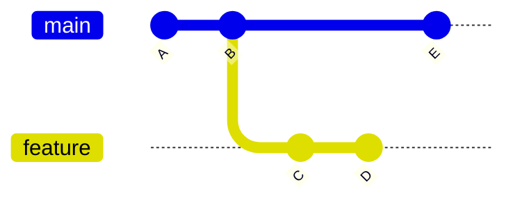

**Не копія проєкту, а лише вказівник!**

---

## Створення та перемикання гілок

**Створити гілку:**

```bash
git branch feature-login
```

**Перейти на гілку:**

```bash
git checkout feature-login
git switch feature-login        # новіша команда
```

**Створити та перейти:**

```bash
git checkout -b feature-login
git switch -c feature-login
```

---

## HEAD вказівник

**HEAD — спеціальний вказівник**

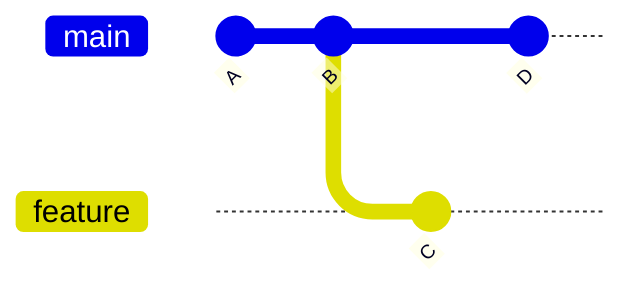

**HEAD показує де ви зараз знаходитесь**

---

## Злиття гілок

**Fast-forward merge:**

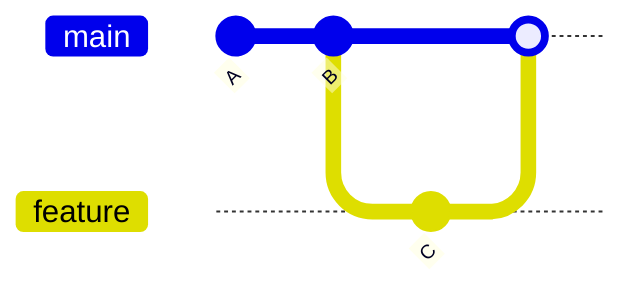

Просто переміщення вказівника вперед

---

## Трьохстороннє злиття

**Merge commit:**

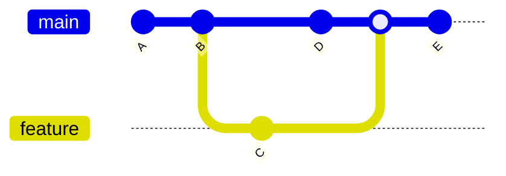

Створюється новий коміт з двома батьками

---

## Конфлікти при злитті ⚔️

**Коли виникають:**

- ⚠️ Обидві гілки змінили одну частину файлу
- ❌ Git не може автоматично вирішити

**Маркери конфлікту:**

```javascript
<<<<<<< HEAD
const apiUrl = 'https://api.prod.com';
=======
const apiUrl = 'https://api.staging.com';
>>>>>>> feature-branch
```

**Вирішення:** вибрати версію або об'єднати вручну 🛠️

---

## Перебазування (Rebase)

**Альтернатива злиттю:**

```bash
git checkout feature
git rebase main
```

**Переписує історію для лінійності**

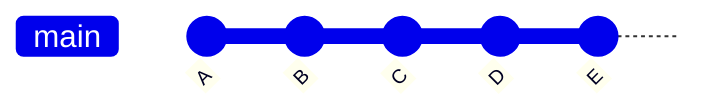

---

## Merge vs Rebase ⚖️

**Merge:**
- 📜 Зберігає повну історію
- 🛡️ Безпечний для спільних гілок
- 🕸️ Може створювати складну історію

**Rebase:**
- 📏 Лінійна чиста історія
- ⚠️ Небезпечний для публічних гілок
- 🔍 Ускладнює відстеження змін

**Золоте правило:** не перебазовуйте публічні коміти! 🚫

---

## Стратегія гілкування: що це?

**Стратегія визначає:**

- Які гілки існують в проєкті
- Коли створювати нові гілки
- Як називати гілки
- Коли та як зливати гілки
- Хто має право зливати

**Правильна стратегія = менше конфліктів + більше продуктивності**

---

## Git Flow: огляд

**Найдетальніша стратегія**

Дві основні гілки:
- **main** — продуктивний код
- **develop** — інтеграційна гілка

Допоміжні гілки:
- **feature/** — нові функції
- **release/** — підготовка релізів
- **hotfix/** — термінові виправлення

---

## Git Flow: схема

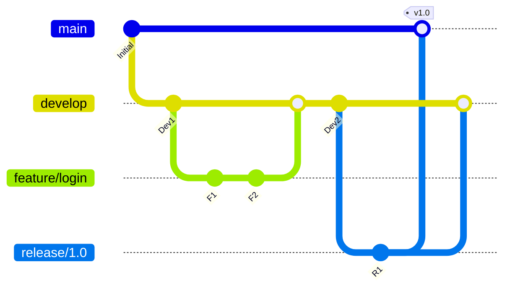

---

## Git Flow: гілки функцій

**Feature branches:**

```bash
git checkout -b feature/user-auth develop
# робота над функцією
git checkout develop
git merge --no-ff feature/user-auth
git branch -d feature/user-auth
```

**Особливості:**
- Створюються від develop
- Зливаються назад в develop
- Можуть існувати тривалий час

---

## Git Flow: гілки релізів

**Release branches:**

```bash
git checkout -b release/1.2 develop
# фінальна підготовка
git checkout main
git merge --no-ff release/1.2
git tag -a v1.2 -m "Version 1.2"
git checkout develop
git merge --no-ff release/1.2
```

**Призначення:**
- Підготовка метаданих релізу
- Дрібні виправлення помилок
- Заморожування функціональності

---

## Git Flow: hotfix гілки

**Термінові виправлення:**

```bash
git checkout -b hotfix/critical-bug main
# виправлення
git checkout main
git merge --no-ff hotfix/critical-bug
git tag -a v1.2.1 -m "Hotfix 1.2.1"
git checkout develop
git merge --no-ff hotfix/critical-bug
```

**Зливається і в main, і в develop**

---

## Git Flow: коли використовувати

**Підходить для:**
- Запланованих релізів
- Підтримки кількох версій
- Великих команд
- Складних проєктів

**Не підходить для:**
- Безперервного розгортання
- Малих команд
- Простих проєктів

---

## GitHub Flow: огляд

**Набагато простіша стратегія**

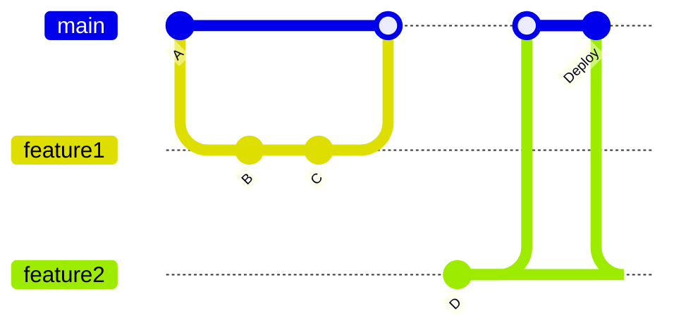

**Одна гілка main + короткоживучі гілки функцій**

---

## GitHub Flow: принципи

**6 простих правил:**

1. main завжди готова до розгортання
2. Нові функції в окремих гілках
3. Описові назви гілок
4. Регулярно push у віддалене сховище
5. Pull request для обговорення
6. Після схвалення → merge → deploy

---

## GitHub Flow: робочий процес

```bash
# Створити гілку
git checkout -b add-payment-gateway

# Робота та коміти
git add .
git commit -m "Додати інтеграцію з платіжною системою"

# Відправити у віддалене сховище
git push origin add-payment-gateway

# Створити Pull Request через веб-інтерфейс
# Після перегляду та схвалення → merge
```

---

## GitHub Flow: переваги та недоліки

**Переваги:**
- Простота розуміння
- Швидкий зворотний зв'язок
- Ідеально для CD/CD
- Завжди готова main гілка

**Недоліки:**
- Немає явної підтримки версій
- Може бути недостатньо для складних релізів
- Потребує надійної автоматизації

---

## Trunk-Based Development

**Максимальна простота:**

- Одна гілка (trunk/main)
- Коміти прямо в main (або дуже короткоживучі гілки)
- Інтеграція мінімум раз на день
- Feature flags для незавершених функцій

**Девіз:** "Інтегруй швидко та часто"

---

## Trunk-Based Development: схема

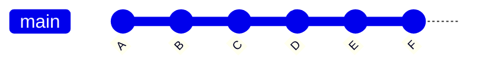

**Лінійна історія з мінімальним гілкуванням**

---

## Feature Flags

**Приховування незавершеної функціональності:**

```javascript
if (featureFlags.isEnabled('new-checkout')) {
    // нова реалізація
    return newCheckoutFlow();
} else {
    // стара реалізація
    return oldCheckoutFlow();
}
```

**Дозволяє інтегрувати код без впливу на користувачів**

---

## Trunk-Based: коли використовувати

**Підходить для:**
- Високозрілих DevOps команд
- Безперервного розгортання
- Сильної культури тестування
- Досвідчених команд

**Вимагає:**
- Надійної автоматизації
- Комплексного тестування
- Дисципліни команди
- Feature flags системи

---

## Порівняння стратегій

| Аспект | Git Flow | GitHub Flow | Trunk-Based |
|--------|----------|-------------|-------------|
| Складність | Висока | Низька | Дуже низька |
| Гілок | Багато | Мало | Мінімум |
| CD/CD | Складно | Легко | Дуже легко |
| Версіонування | Легко | Важко | Важко |
| Команда | Велика | Середня | Досвідчена |

---

## Як обрати стратегію?

**Розгляньте:**

- Розмір команди
- Частота релізів
- Складність проєкту
- Зрілість CI/CD процесів
- Потреба в підтримці версій

**Можна змінювати з розвитком команди!**

---

## Процес перегляду коду

**Code Review — це:**

- Систематична перевірка коду
- Перед інтеграцією в основну базу
- Іншими членами команди

**Мета:** покращити якість та поширити знання

---

## Цінність перегляду коду 💎

**Переваги:**

1. **Якість:** раннє виявлення помилок 🐛
2. **Знання:** команда розуміє всю кодову базу 📚
3. **Стандарти:** підтримка єдиного стилю ✨
4. **Навчання:** молодші вчаться у досвідчених 🎓
5. **Документація:** коментарі пояснюють рішення 📝

---

## Pull Request (PR)

**Механізм для пропонування змін:**

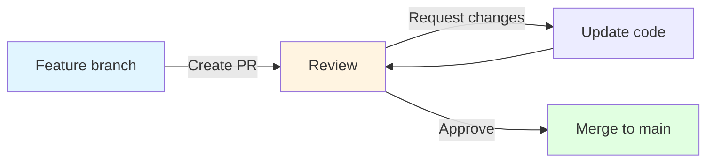

---

## Анатомія хорошого PR

**Обов'язкові елементи:**

- Чіткий заголовок
- Опис що та чому змінено
- Посилання на issue/завдання
- Скріншоти (для UI)
- Інструкції для тестування

**Розмір:** 200-300 рядків оптимально

---

## Шаблон Pull Request

```markdown
## Опис
Додано автентифікацію через OAuth2

## Тип зміни
- [ ] Виправлення помилки
- [x] Нова функція
- [ ] Критична зміна

## Як тестувати
1. Перейти на сторінку логіну
2. Натиснути "Увійти через Google"
3. Перевірити створення користувача

## Чеклист
- [x] Код відповідає стандартам
- [x] Додано тести
- [x] Оновлено документацію
```

---

## Процес перегляду: рецензент

**Кроки рецензента:**

1. **Зрозуміти контекст** — прочитати опис
2. **Перевірити дизайн** — архітектурні рішення
3. **Переглянути код** — якість реалізації
4. **Перевірити тести** — покриття та якість
5. **Залишити коментарі** — конструктивні та чіткі

---

## Типи коментарів

**Класифікація за важливістю:**

**🔴 Блокуючий:**
```
Ця функція не перевіряє null,
що призведе до збою.
```

**🟡 Пропозиція:**
```
Розгляньте використання Map
для кращої продуктивності.
```

**🔵 Питання:**
```
Чому обрано саме цей підхід?
```

---

## Якісний коментар

**Поганий:**
```
Це погано
```

**Хороший:**
```
Цей метод має складність O(n²).
Розгляньте використання HashMap
для досягнення O(n).
```

**Пояснюйте "чому", а не просто "що"**

---

## Кращі практики перегляду

**Для автора PR:**
- Робити невеликі PR
- Писати зрозумілий опис
- Відповідати на коментарі швидко
- Не сприймати критику особисто

**Для рецензента:**
- Відгукуватися протягом дня
- Бути конструктивним
- Визнавати хороші рішення
- Фокусуватися на коді, а не на людині

---

## Розмір Pull Request

**Оптимальний розмір: 200-300 рядків**

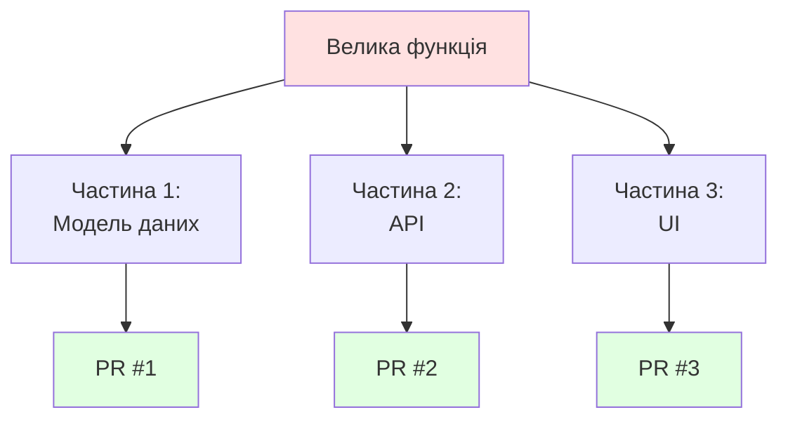

**Великі PR = низька якість перегляду**

---

## Автоматизація перегляду

**CI перевіряє автоматично:**

- Стиль коду (linting)
- Запуск тестів
- Покриття коду
- Безпека (security scanning)
- Продуктивність

**Рецензент фокусується на логіці та архітектурі**

---

## Conventional Commits

**Стандарт для повідомлень комітів**

Структура:
```
<тип>[область]: <опис>

[тіло]

[футер]
```

**Приклад:**
```
feat(auth): додати OAuth2 автентифікацію

Інтегровано Google OAuth2 для спрощення логіну.

Closes #123
```

---

## Типи комітів 🏷️

**Стандартні типи:**

- ✨ **feat:** нова функція
- 🐛 **fix:** виправлення помилки
- 📚 **docs:** документація
- 💄 **style:** форматування
- ♻️ **refactor:** рефакторинг
- ⚡ **perf:** продуктивність
- ✅ **test:** тести
- 🔧 **build:** система збірки
- 👷 **ci:** конфігурація CI
- 🔨 **chore:** інше

---

## Приклади Conventional Commits

```
feat(api): додати endpoint для експорту даних

fix(parser): виправити обробку UTF-8 символів

docs(readme): оновити інструкції встановлення

refactor(auth): спростити логіку валідації токенів

perf(query): оптимізувати SQL запит користувачів

test(api): додати тести для нового endpoint
```

---

## Переваги Conventional Commits

**Автоматизація:**

1. **Генерація changelog**
```
## [1.2.0] - 2024-03-15

### Features
- feat(auth): двофакторна автентифікація

### Bug Fixes
- fix(ui): вирівнювання на мобільних
```

2. **Semantic Versioning**
- feat → minor версія (1.1.0 → 1.2.0)
- fix → patch версія (1.1.0 → 1.1.1)
- BREAKING CHANGE → major (1.1.0 → 2.0.0)

---

## Інструменти Conventional Commits

**Commitizen:**
```bash
git add .
git cz    # інтерактивний майстер
```

**Commitlint:**
```bash
# Перевірка відповідності стандарту
npm install --save-dev @commitlint/cli
```

**Standard Version:**
```bash
# Автоматична версія та changelog
npm run release
```

---

## Культура перегляду коду

**Принципи:**

- **Повага:** фокус на коді, не на людині
- **Відкритість:** обговорення рішень
- **Навчання:** допомогти, а не критикувати
- **Швидкість:** не затримувати PR надовго

**Створює команду, що постійно вдосконалюється**

---

## Синхронна vs асинхронна комунікація

**Асинхронно (коментарі в PR):**
- Більшість обговорень
- Документується автоматично

**Синхронно (зустріч):**
- Складні архітектурні рішення
- Довгі обговорення в коментарях
- Конфлікти у підходах

**Правило:** понад 5 обмінів → зустріч

---

## Робота з legacy кодом

**Правило бойових скаутів:**

"Залиште код трохи кращим, ніж знайшли"

**Але:**
- Не переписуйте все в одному PR
- Розділяйте рефакторинг та функції
- Окремі коміти для покращень

---

## Поширені помилки ⚠️

**Чого уникати:**

- 📚 Надто великі PR (500+ рядків)
- 🔀 Змішування рефакторингу та функцій
- ❓ Нечіткі описи змін
- 🐌 Повільні відгуки на коментарі
- 😠 Особисті атаки в коментарях
- 🚫 Ігнорування автоматизованих перевірок

---

## Метрики якості перегляду

**Що відстежувати:**

- Середній час до першого відгуку
- Час до злиття PR
- Кількість ітерацій перегляду
- Відсоток PR з коментарями
- Помилки, знайдені на code review

**Допомагає покращити процес**

---

## Ретроспективи процесу

**Регулярно обговорювати:**

- Що працює добре?
- Що можна покращити?
- Які виникають проблеми?
- Чи потрібні зміни в процесі?

**Безперервне вдосконалення процесу перегляду**

---

## Інтеграція з CI/CD

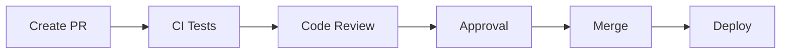

**Автоматизація + перегляд людиною = якість**

---

## Ключові виноски 🎯

**Стратегії гілкування:**
- 🌊 Git Flow — для запланованих релізів
- ⚡ GitHub Flow — для безперервного розгортання
- 🚀 Trunk-Based — для зрілих DevOps команд

**Перегляд коду:**
- ✨ Покращує якість
- 📚 Поширює знання
- 📏 Підтримує стандарти

**Conventional Commits:**
- 🏷️ Структура повідомлень
- 🤖 Автоматизація процесів

---

## Практичні поради

**Почніть з малого:**

1. Оберіть просту стратегію (GitHub Flow)
2. Запровадьте обов'язковий code review
3. Використовуйте шаблони PR
4. Автоматизуйте перевірки
5. Впровадьте Conventional Commits
6. Регулярно проводьте ретроспективи

**Розвивайтесь поступово!**

---

## Еволюція процесу


**Зрілість процесу зростає з досвідом команди**
