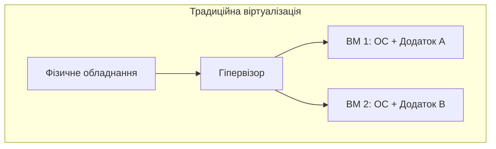
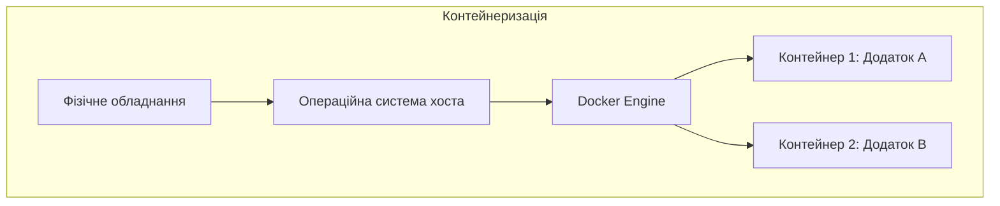
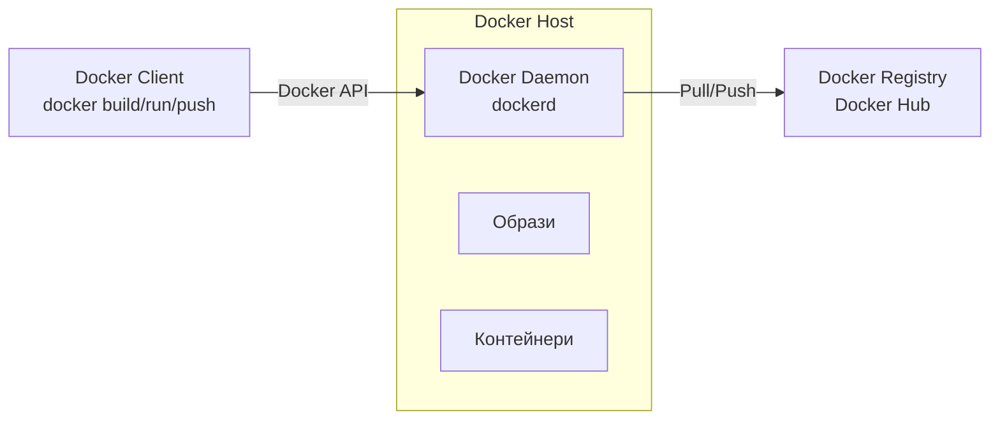
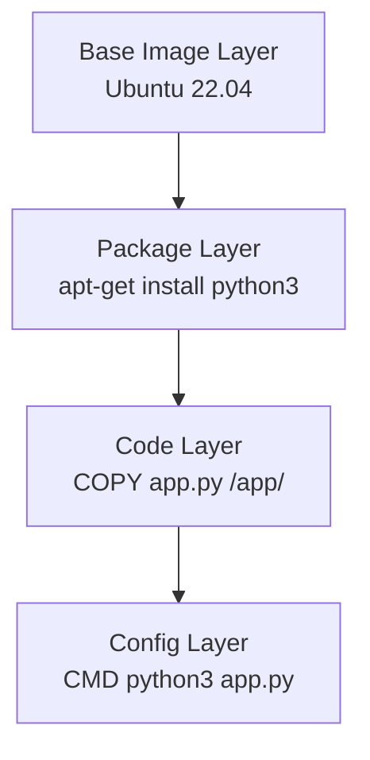
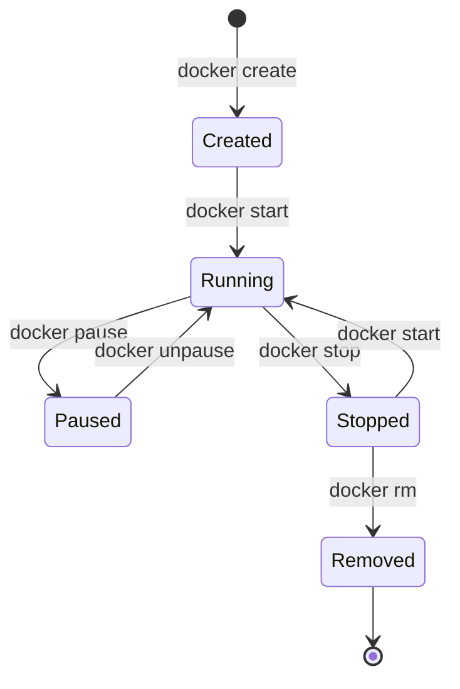

# 🎯 Лекція 4 Технологія контейнеризації Docker

---

# 💡 Що таке контейнеризація?

Контейнеризація — це метод віртуалізації на рівні операційної системи, який дозволяє запускати ізольовані застосунки на спільному ядрі ОС

**Ключові характеристики:**
- Легковісна віртуалізація
- Швидкий запуск (секунди vs хвилини)
- Портативність між середовищами
- Ефективне використання ресурсів

---

# 🆚 Віртуалізація vs Контейнеризація



---

# 🆚 Віртуалізація vs Контейнеризація



---

# 📊 Порівняння: ВМ vs Контейнери

| Характеристика | Віртуальні машини | Контейнери |
|----------------|-------------------|------------|
| **Час запуску** | Хвилини | Секунди |
| **Розмір** | Гігабайти | Мегабайти |
| **Ізоляція** | Повна (апаратна) | Процесна (ОС) |
| **Продуктивність** | Нижча | Вища |
| **Портативність** | Обмежена | Висока |
| **Щільність** | 10-20 ВМ | 100+ контейнерів |

---

# 🏗️ Архітектура Docker



---

# 🔧 Ключові компоненти Docker

**Docker Client** 📱
- Інтерфейс командного рядка
- Відправляє команди до Docker Daemon

**Docker Daemon** ⚙️
- Керує Docker об'єктами
- Взаємодія з containerd та runc

**Docker Registry** 📦
- Зберігання Docker образів
- Docker Hub, приватні реєстри

---

# 🎨 Docker образи

Образ — шаблон тільки для читання для створення контейнерів

**Особливості:**
- Складається з шарів (layers)
- Кожен шар незмінний
- Спільне використання шарів між образами
- Ідентифікація через IMAGE ID та теги

---

# 📚 Структура Docker образу



---

# 🚀 Docker контейнери

Контейнер — запущений екземпляр образу

**Життєвий цикл:**
- Created → Running → Paused → Stopped → Removed

**Основні команди:**
```bash
docker run -d -p 8080:80 nginx:latest
docker ps
docker stop container_name
docker rm container_name
```

---

# 🔄 Життєвий цикл контейнера



---

# 💾 Docker томи

Томи — механізм збереження даних поза життєвим циклом контейнера

**Типи монтування:**
- **Volumes** — керовані Docker (рекомендовано)
- **Bind mounts** — прямий маппінг директорій хоста
- **tmpfs mounts** — тимчасове сховище в пам'яті

---

# 💾 Робота з томами

```bash
# Створення тому
docker volume create postgres-data

# Використання тому
docker run -d \
  -v postgres-data:/var/lib/postgresql/data \
  postgres:15

# Резервне копіювання
docker run --rm \
  -v postgres-data:/data \
  -v $(pwd):/backup \
  ubuntu tar czf /backup/backup.tar.gz /data
```

---

# 🌐 Docker мережі

Мережі дозволяють контейнерам спілкуватися між собою

**Типи мереж:**
- **Bridge** — стандартна мережа для контейнерів
- **Host** — використання мережевого стеку хоста
- **None** — відсутність мережі
- **Overlay** — для розподілених застосунків

---

# 🌐 Приклад створення мережі

```bash
# Створення власної мережі
docker network create app-network

# Запуск контейнерів у мережі
docker run -d --name backend \
  --network app-network node-api:latest

docker run -d --name frontend \
  --network app-network react-app:latest

# Контейнери звертаються один до одного за іменами
# frontend → http://backend:3000
```
