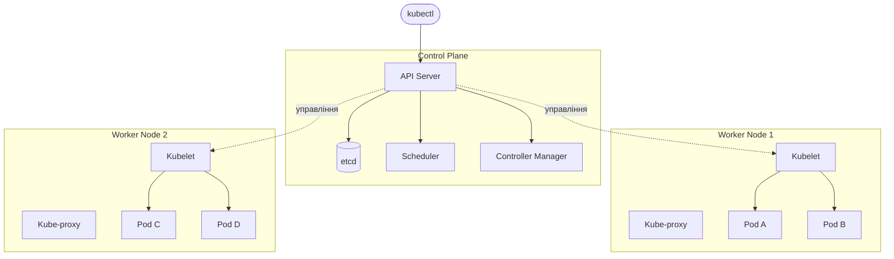
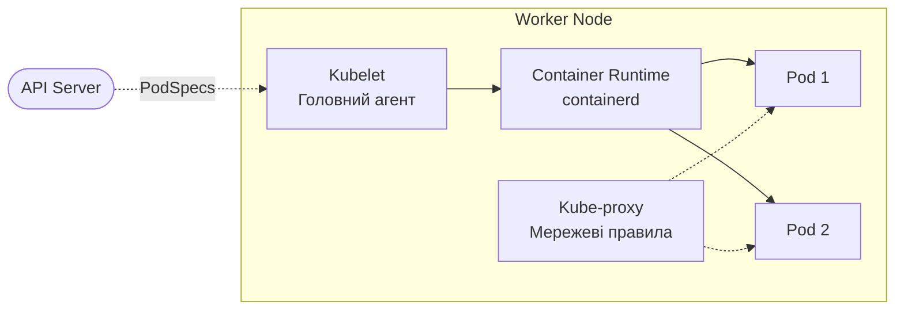
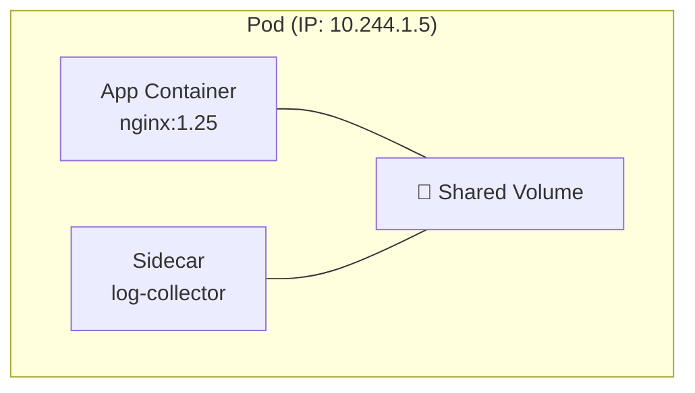
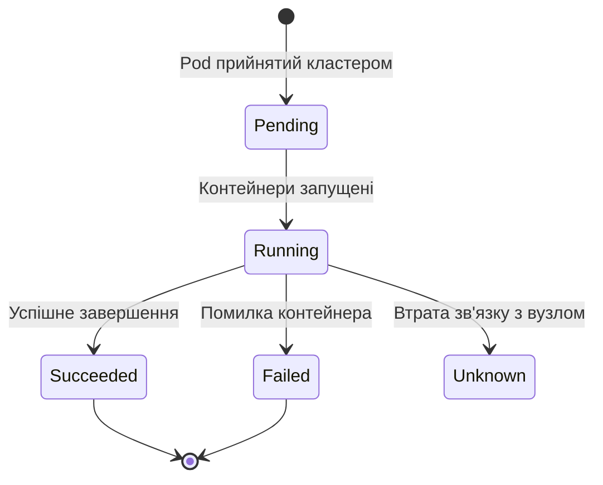
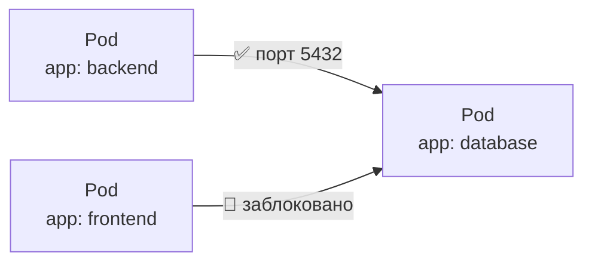

# 🎯 Лекція 6: Оркестрація контейнерів за допомогою Kubernetes

---

# 💡 Що таке Kubernetes?

Kubernetes (K8s) — платформа оркестрації контейнерів, яка автоматизує розгортання, масштабування та управління контейнеризованими застосунками

**Kubernetes вирішує:**
- Автоматичне розгортання на доступні сервери
- Самовідновлення при збоях вузлів та контейнерів
- Горизонтальне масштабування за навантаженням
- Rolling updates без простою сервісу
- Управління конфігурацією та секретами

---

# ⚙️ Декларативна модель управління

Замість команд «що зробити» — опис «якого стану досягти»

```yaml
apiVersion: apps/v1
kind: Deployment
spec:
  replicas: 3          # хочемо 3 екземпляри
  selector:
    matchLabels:
      app: nginx
  template:
    spec:
      containers:
      - image: nginx:1.25
```

Kubernetes постійно порівнює фактичний стан з описаним та усуває розбіжності — це **reconciliation loop**

---

# 🏗️ Архітектура кластера Kubernetes



---

# 🧠 Компоненти Control Plane

**API Server** 🔌
- Центральна точка взаємодії з кластером
- Обробляє REST-запити, валідує та зберігає стан

**etcd** 💾
- Розподілене сховище стану кластера
- Єдине джерело правди — резервні копії обов'язкові

**Scheduler** 📋
- Вирішує, на якому вузлі запустити под
- Враховує ресурси CPU/RAM, affinity, taints

**Controller Manager** ⚙️
- Набір контролерів: Replication, Node, Endpoints
- Постійно підтримує бажаний стан системи

---

# 🖥️ Компоненти Worker Node



---

# 🖥️ Роль кожного компонента вузла

**Kubelet** 🤖
- Головний агент вузла
- Отримує PodSpecs від API Server, запускає контейнери
- Виконує liveness/readiness перевірки, звітує про стан

**Container Runtime** 📦
- Відповідає за фактичний запуск контейнерів через CRI
- Стандарт: containerd, альтернативи: CRI-O, cri-dockerd

**Kube-proxy** 🌐
- Управляє мережевими правилами (iptables або IPVS)
- Реалізує Services — балансує трафік між подами

---

# 📦 Pod — основна одиниця розгортання



---

# 📦 Властивості Pod

Pod — один або кілька контейнерів, що завжди запускаються разом на одному вузлі

**Спільні ресурси всередині Pod:**
- Мережа — контейнери звертаються один до одного через `localhost`
- Томи — для обміну файлами між контейнерами
- Одна унікальна IP-адреса на весь Pod

**Важливо знати:**
- Pod є ефемерним — не самовідновлюється після видалення
- При перезапуску Pod отримує нову IP-адресу
- Для самовідновлення використовують Deployment

---

# 🔄 Фази життєвого циклу Pod



---

# 🔄 Health Checks у Pod

```yaml
containers:
- name: app
  livenessProbe:      # перезапустити при невдачі
    httpGet:
      path: /health
      port: 8080
    initialDelaySeconds: 10
    periodSeconds: 5

  readinessProbe:     # виключити з балансування при невдачі
    httpGet:
      path: /ready
      port: 8080

  startupProbe:       # для застосунків з тривалою ініціалізацією
    failureThreshold: 30
    periodSeconds: 10
```

---

# 🌐 Мережева модель Kubernetes

Три фундаментальні принципи:

**1.** Усі Pods можуть спілкуватися між собою **без NAT**

**2.** Вузли комунікують з Pods без NAT і навпаки

**3.** IP, яку Pod бачить для себе = IP, яку бачать інші

**Типи IP-адрес:**
- **Pod IP** — унікальна, ефемерна, змінюється при перезапуску
- **Service IP** — стабільна, віртуальна, реалізується через iptables/IPVS
- **Node IP** — IP самого вузла, для NodePort-доступу ззовні

---

# 🌐 CNI плагіни та DNS

**Container Network Interface (CNI)** — специфікація для мережевих плагінів:
- **Calico** — мережева політика через BGP або VXLAN
- **Flannel** — простий overlay network
- **Cilium** — eBPF для високої продуктивності

**CoreDNS — вбудований DNS кластера:**

```bash
# Повна адреса сервісу
nginx.default.svc.cluster.local

# Скорочена (всередині того самого namespace)
nginx
```

Поди автоматично налаштовуються через `/etc/resolv.conf`

---

# 🔒 Network Policy



---

# 🔒 Налаштування Network Policy

```yaml
spec:
  podSelector:
    matchLabels:
      app: database
  ingress:
  - from:
    - podSelector:
        matchLabels:
          app: backend
    ports:
    - port: 5432
```

Коли до пода застосована Network Policy — весь трафік, не дозволений явно, блокується
