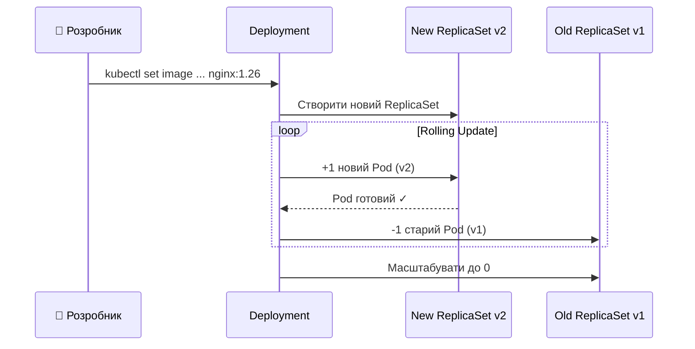
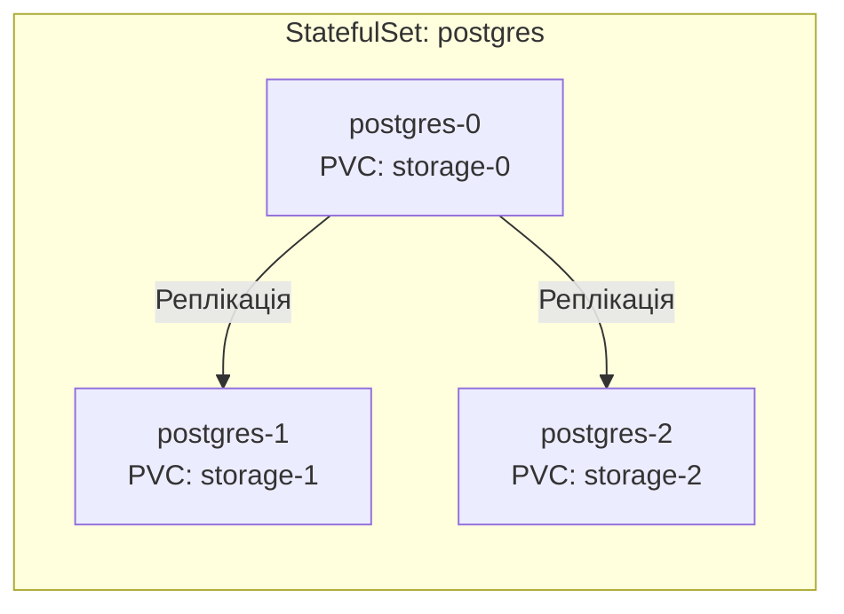
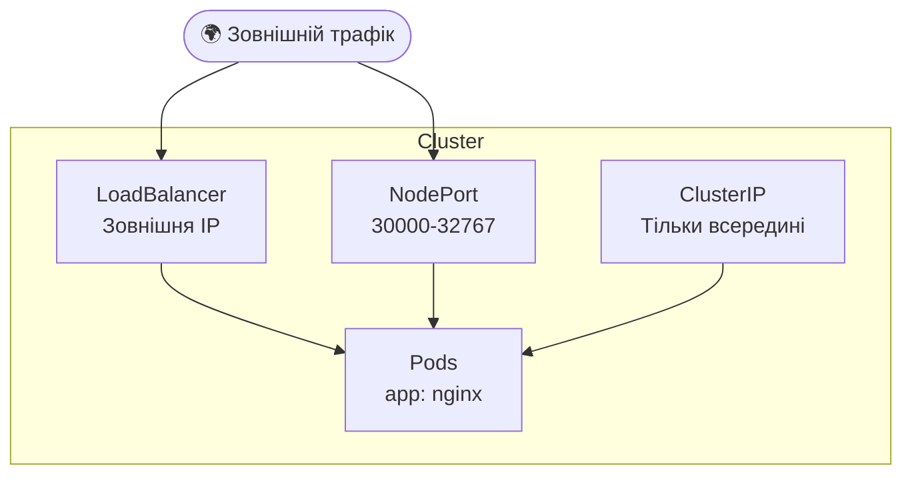
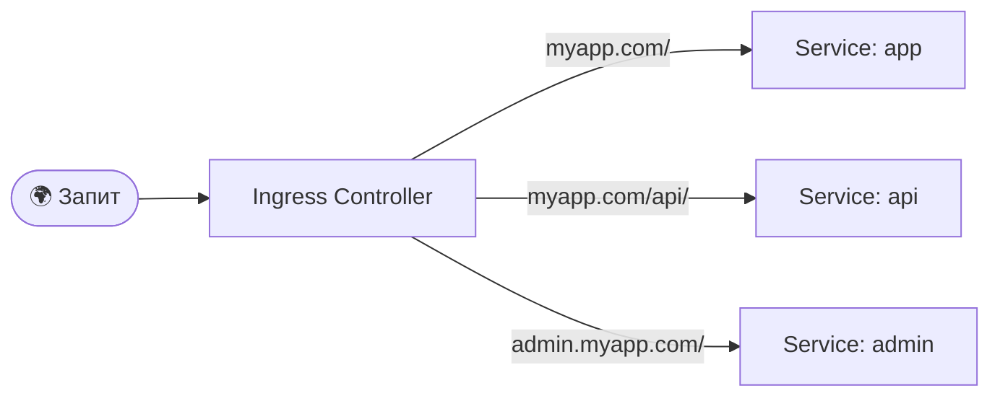
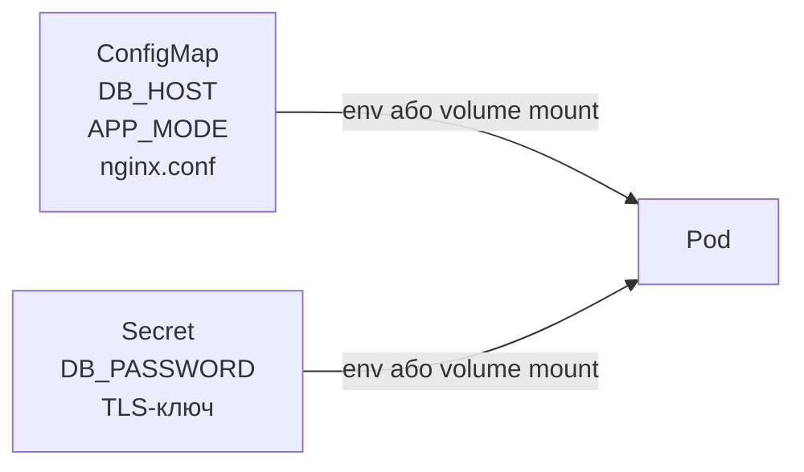
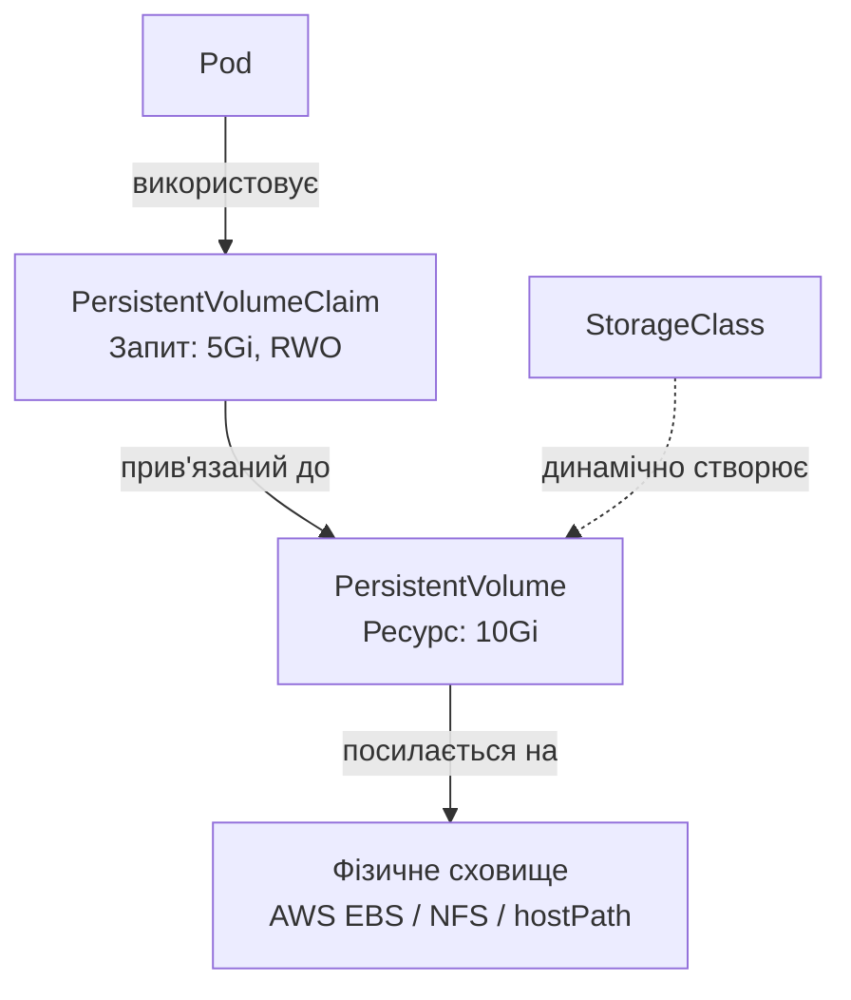

# 🎯 Лекція 7: Управління застосунками в Kubernetes

---

# 💡 Об'єкти управління застосунками

Безпосереднє управління Pods є ненадійним у продакшн середовищі. Kubernetes надає об'єкти вищого рівня:

**Для запуску застосунків:**
- **ReplicaSet** — підтримує задану кількість реплік
- **Deployment** — декларативні оновлення та відкати
- **StatefulSet** — управління stateful застосунками

**Для мережевого доступу:**
- **Service** — стабільна точка доступу до Pods
- **Ingress** — HTTP/HTTPS маршрутизація

**Для конфігурації та сховища:**
- **ConfigMap / Secret** — управління налаштуваннями
- **PersistentVolume** — постійне зберігання даних

---

# 🔁 ReplicaSet

ReplicaSet гарантує, що завжди запущена задана кількість ідентичних Pods

```yaml
apiVersion: apps/v1
kind: ReplicaSet
metadata:
  name: frontend
spec:
  replicas: 3
  selector:
    matchLabels:
      app: frontend     # відстежує Pods з цією міткою
  template:
    metadata:
      labels:
        app: frontend
    spec:
      containers:
      - name: nginx
        image: nginx:1.25
```

Якщо один із трьох Pods падає — ReplicaSet негайно створює новий. На практиці ReplicaSet рідко створюють напряму — для цього є Deployment

---

# 🚀 Deployment — Rolling Update



---

# 🚀 Налаштування стратегії оновлення

```yaml
strategy:
  type: RollingUpdate
  rollingUpdate:
    maxSurge: 1        # максимум +1 додатковий Pod
    maxUnavailable: 1  # максимум 1 недоступний Pod
```

**Основні команди:**

```bash
# Оновити образ
kubectl set image deployment/app nginx=nginx:1.26

# Перевірити статус
kubectl rollout status deployment/app

# Відкатити до попередньої версії
kubectl rollout undo deployment/app

# Переглянути історію
kubectl rollout history deployment/app
```

Старі ReplicaSets зберігаються зі scale=0, тому відкат займає секунди

---

# 🗄️ StatefulSet



---

# 🗄️ Deployment vs StatefulSet

| Властивість | Deployment | StatefulSet |
|-------------|-----------|-------------|
| **Назви Pods** | Випадкові (app-abc12) | Стабільні (app-0, app-1) |
| **DNS запис** | Немає для окремого Pod | postgres-0.svc.cluster.local |
| **Сховище** | Спільне або відсутнє | Власний PVC для кожного |
| **Порядок запуску** | Паралельний | Послідовний: 0 → 1 → 2 |

**Типові застосування StatefulSet:**
- Бази даних: PostgreSQL, MySQL, MongoDB
- Черги повідомлень: Kafka, RabbitMQ
- Пошукові системи: Elasticsearch

---

# 🌐 Service — типи



---

# 🌐 Типи Service

**ClusterIP** — доступний тільки всередині кластера
- Стандартний тип, для внутрішньої комунікації між компонентами

**NodePort** — відкриває порт на кожному вузлі (30000–32767)
- Зовнішній доступ: `<NodeIP>:<NodePort>`

**LoadBalancer** — інтегрується з хмарним провайдером
- Автоматично створює зовнішній балансувальник у AWS/GCP/Azure

**ExternalName** — переадресовує на зовнішнє DNS-ім'я
- Корисно для інтеграції з зовнішніми сервісами без зміни коду

---

# 🔀 Ingress — маршрутизація HTTP



---

# 🔀 Налаштування Ingress

```yaml
rules:
- host: myapp.com
  http:
    paths:
    - path: /
      pathType: Prefix
      backend:
        service:
          name: app-service
          port:
            number: 80
    - path: /api/
      pathType: Prefix
      backend:
        service:
          name: api-service
          port:
            number: 8080
```

Ingress також забезпечує **SSL-термінацію** — один TLS-сертифікат для всього домену

Популярні контролери: nginx-ingress · Traefik · HAProxy

---

# ⚙️ ConfigMap та Secret



---

# ⚙️ Використання ConfigMap та Secret

```yaml
env:
- name: DB_HOST
  valueFrom:
    configMapKeyRef:
      name: app-config
      key: db_host

- name: DB_PASSWORD
  valueFrom:
    secretKeyRef:
      name: db-secret
      key: password
```

**ConfigMap** — нечутливі дані: порти, режими, конфігураційні файли

**Secret** — чутливі дані, зберігаються в base64

Типи Secret: `Opaque` · `kubernetes.io/tls` · `kubernetes.io/dockerconfigjson`

---

# 💾 Persistent Volumes



---

# 💾 Режими доступу та Reclaim Policies

**Режими доступу:**
- **ReadWriteOnce (RWO)** — один вузол, читання + запис
- **ReadOnlyMany (ROX)** — багато вузлів, тільки читання
- **ReadWriteMany (RWX)** — багато вузлів, читання + запис (NFS/CephFS)

**Reclaim Policies після видалення PVC:**
- **Retain** — зберегти PV та дані, адміністратор вирішує що робити далі
- **Delete** — автоматично видалити PV та фізичне сховище

---

# 💾 StorageClass — динамічне провізіонування

```yaml
apiVersion: storage.k8s.io/v1
kind: StorageClass
metadata:
  name: fast-ssd
provisioner: kubernetes.io/aws-ebs
parameters:
  type: gp3
  iops: "3000"
  encrypted: "true"
allowVolumeExpansion: true
volumeBindingMode: WaitForFirstConsumer
```

Розробник вказує лише `storageClassName: fast-ssd` у своєму PVC і не знає деталей інфраструктури

`WaitForFirstConsumer` — том створиться в тій самій зоні доступності, що й Pod
