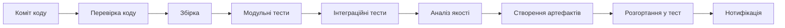
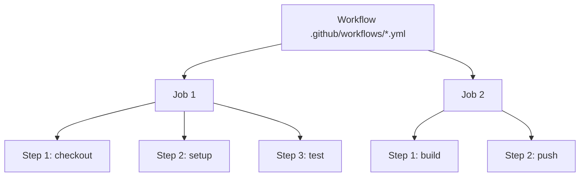
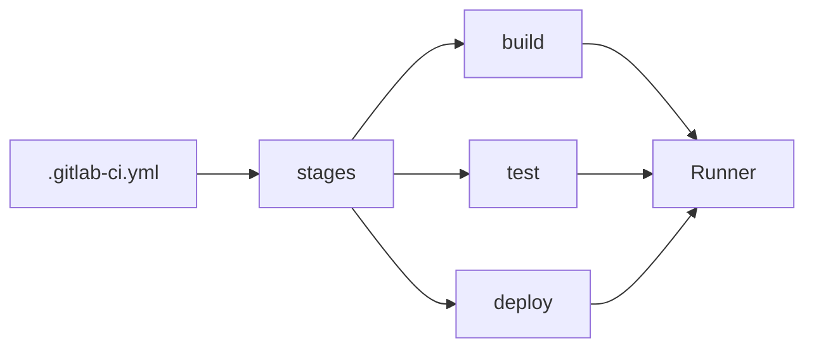
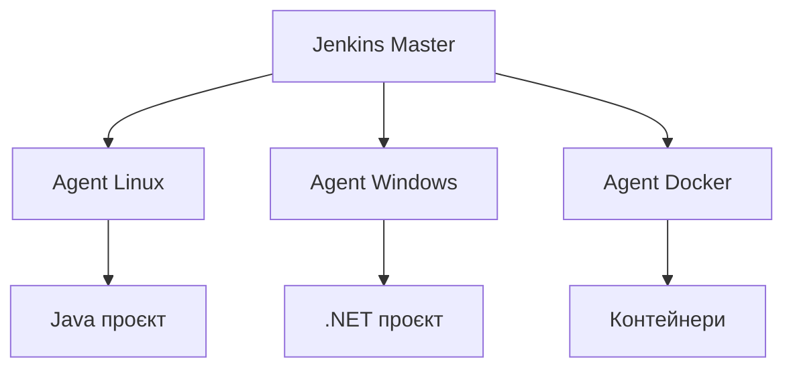
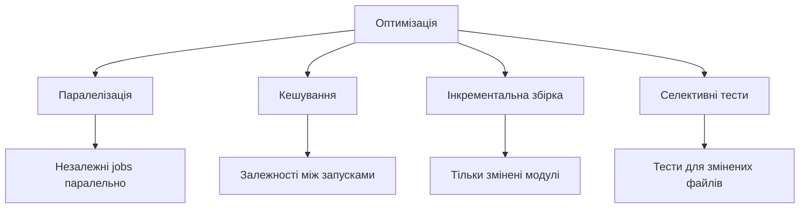

# Лекція 08 🔄 Побудова CI конвеєрів у сучасних платформах


## Що таке безперервна інтеграція?

Ключова ідея: **чим раніше виявлено проблему — тим дешевше її виправити**

- 🕐 Хвилини після коміту → розробник пам'ятає контекст
- 📅 Тижні або місяці → пошук та виправлення коштує в рази дорожче

---

## 8 принципів безперервної інтеграції

1. Єдине джерело правди (система контролю версій)
2. Автоматизована збірка одною командою
3. Самотестувальна збірка
4. Щоденні коміти до основної гілки
5. Кожен коміт запускає збірку
6. Швидке виправлення зламаних збірок
7. Тести у середовищі, близькому до продакшн
8. Легкий доступ до останньої збірки

---

## Анатомія CI конвеєра



---

## Етапи конвеєра — детальніше

| Етап | Що відбувається | Інструменти |
|------|----------------|-------------|
| Перевірка коду | Лінтинг, статичний аналіз | ESLint, Flake8, SonarQube |
| Збірка | Компіляція, управління залежностями | Maven, npm, Gradle |
| Тестування | Unit → Integration → Functional | pytest, JUnit, Playwright |
| Аналіз якості | Покриття, складність, дублікати | Coverage, CodeClimate |
| Артефакти | Docker образи, JAR, APK | Docker, JFrog Artifactory |

---

## GitHub Actions — основні концепції



- **Workflow** — повний процес автоматизації у YAML файлі
- **Job** — набір кроків на одному runner
- **Step** — окрема дія або команда
- **Action** — багаторазовий компонент

---

## Тригери GitHub Actions

```yaml
on:
  push:
    branches: [main, develop]   # При коміті
  pull_request:
    branches: [main]             # При PR
  schedule:
    - cron: '0 2 * * *'         # За розкладом
  workflow_dispatch:             # Ручний запуск
```

Будь-яка подія у репозиторії може стати тригером.

---

## Матрична стратегія — тестування на кількох версіях

```yaml
jobs:
  test:
    strategy:
      matrix:
        node-version: [18.x, 20.x, 22.x]
    steps:
      - uses: actions/setup-node@v4
        with:
          node-version: ${{ matrix.node-version }}
```

Одна конфігурація → **3 паралельні задачі** автоматично 🚀

---

## GitLab CI/CD — єдина платформа



- Контроль версій + CI/CD + реєстр образів в одному місці
- Хмара або власний сервер
- Runners: shared або self-hosted

---

## GitLab CI/CD — синтаксис

```yaml
stages: [build, test, deploy]

test:
  stage: test
  image: python:3.11
  services:
    - postgres:16          # Сервіс БД для тестів
  before_script:
    - pip install -r requirements.txt
  script:
    - pytest --cov=src
  artifacts:
    reports:
      coverage_report:
        coverage_format: cobertura
        path: coverage.xml
```

---

## Jenkins — гнучкість та контроль



- Декларативний або скриптовий Jenkinsfile
- Тисячі плагінів
- Повний контроль над інфраструктурою

---

## Порівняння платформ

| Критерій | GitHub Actions | GitLab CI/CD | Jenkins |
|---------|---------------|-------------|---------|
| Налаштування | Мінімальне | Мінімальне | Складне |
| Інтеграція | GitHub | GitLab | Будь-яка |
| Хостинг | Хмара | Хмара / Self | Self |
| Екосистема | Marketplace | Велика | Величезна |
| Безкоштовно | Ліміти | Ліміти | Так |

---

## Оптимізація CI: ключові підходи



---

## Метрики CI конвеєра

- ⏱️ **Час виконання** — ідеально до 10 хвилин
- 💔 **Частота провалів** — індикатор якості процесу
- 🔍 **Час до виявлення помилки** — чим менше, тим краще
- 📊 **Покриття тестами** — мінімум 70% для критичного коду

Регулярний моніторинг метрик виявляє можливості для покращення.

---

## 🎯 Підсумок

- CI — це культура частої інтеграції, підкріплена автоматизацією
- Конвеєр проходить послідовні етапи: перевірка → збірка → тести → артефакти
- GitHub Actions, GitLab CI, Jenkins — різні інструменти для різних потреб
- Оптимізація конвеєра = швидший зворотний зв'язок для команди
