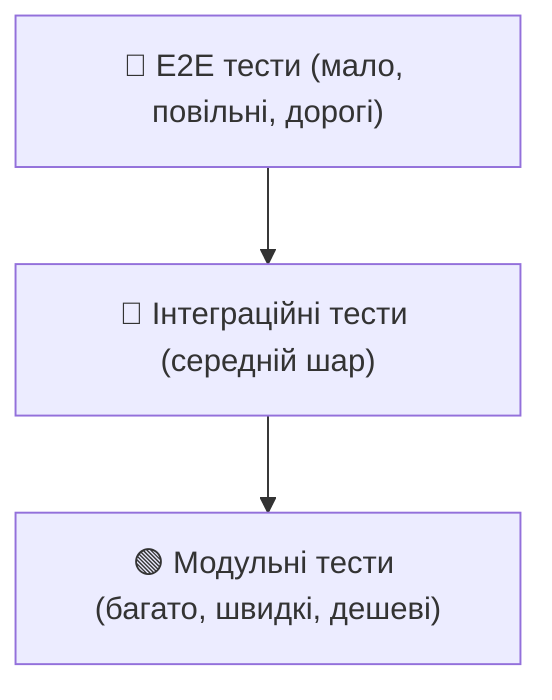
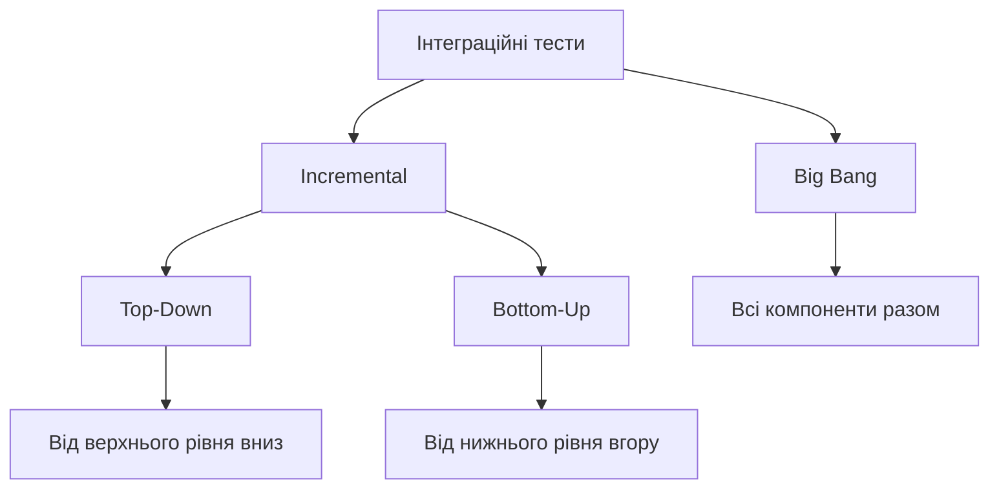
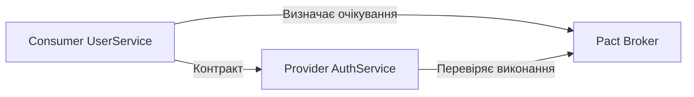
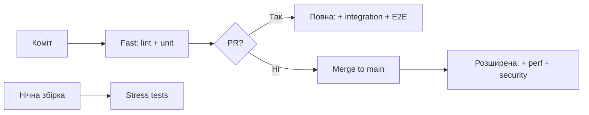

# 🧪 Лекція 09 Стратегії автоматизованого тестування та контролю якості


---

## Чому автоматизоване тестування критичне?

Без автоматизованих тестів CI конвеєр — це лише автоматична збірка.

- 🐛 Дефекти виявляються пізно — виправлення дороге
- 😰 Команда боїться вносити зміни — регресія непомітна
- 🔁 Ручне тестування — повільне та ненадійне

**Тести = впевненість команди у стабільності системи**

---

## Піраміда тестування




---

## Характеристики рівнів піраміди

| Рівень | Швидкість | Вартість | Стабільність | Кількість |
|--------|-----------|---------|-------------|----------|
| Модульні | Тисячі/сек | Низька | Висока | Багато |
| Інтеграційні | Хвилини | Середня | Середня | Середньо |
| E2E | Десятки хвилин | Висока | Низька | Мало |

---

## Модульні тести — принципи FIRST

- **F**ast — виконуються дуже швидко
- **I**ndependent — незалежні один від одного
- **R**epeatable — однаковий результат щоразу
- **S**elf-validating — чітко pass або fail
- **T**imely — пишуться разом з кодом

---

## Патерн Arrange-Act-Assert

```python
def test_ten_percent_discount_for_premium_customer(self, calculator):
    # Arrange — налаштовуємо вхідні дані
    amount = Decimal('100.00')
    customer_type = CustomerType.PREMIUM

    # Act — виконуємо дію
    result = calculator.calculate_discount(amount, customer_type)

    # Assert — перевіряємо результат
    assert result == Decimal('10.00')
```

Також відомий як **Given-When-Then** у BDD.

---

## Параметризовані тести

```python
@pytest.mark.parametrize("amount,customer_type,expected", [
    (Decimal('50.00'), CustomerType.REGULAR, Decimal('0.00')),
    (Decimal('50.00'), CustomerType.PREMIUM, Decimal('5.00')),
    (Decimal('50.00'), CustomerType.VIP, Decimal('10.00')),
])
def test_discount_scenarios(self, calculator, amount, customer_type, expected):
    result = calculator.calculate_discount(amount, customer_type)
    assert result == expected
```

Один шаблон тесту → багато сценаріїв без дублювання коду.

---

## Мокування зовнішніх залежностей

```python
def test_get_temperature(self):
    mock_response = Mock()
    mock_response.json.return_value = {'main': {'temp': 20.5}}

    with patch('requests.get', return_value=mock_response):
        temperature = WeatherService('key').get_temperature('London')
        assert temperature == 20.5
```

- Мок замінює реальний HTTP-запит
- Тест швидкий, стабільний, без мережі

---

## Інтеграційні тести — підходи



---

## Testcontainers — реальна БД у тестах

```python
@pytest.fixture(scope='module')
def postgres_container():
    with PostgresContainer("postgres:16") as postgres:
        yield postgres   # Реальний PostgreSQL у Docker!

class TestUserRepository:
    def test_create_user_saves_to_database(self, user_repository):
        user = user_repository.create_user(username='john', email='j@ex.com')
        saved = db_session.query(User).filter_by(id=user.id).first()
        assert saved.username == 'john'
```

Ізольоване тестове середовище без залежності від зовнішніх сервісів.

---

## Наскрізні тести (E2E) з Playwright

```python
def test_user_can_login_and_view_dashboard(page):
    page.goto('https://app.example.com/login')
    page.fill('input[name="username"]', 'testuser')
    page.fill('input[name="password"]', 'testpass')
    page.click('button[type="submit"]')

    expect(page).to_have_url(re.compile(r'.*/dashboard'))
    expect(page.locator('h1')).to_contain_text('Вітаємо')
```

Playwright підтримує Chrome, Firefox, WebKit — крос-браузерне тестування.

---

## Контрактне тестування у мікросервісах



- Consumer описує, що очікує від Provider
- Provider автоматично перевіряє відповідність контракту
- Несумісності виявляються **до інтеграції**

---

## Організація тестів у CI



---

## Рівні перевірки в CI

| Тригер | Тести | Час |
|--------|-------|-----|
| Кожен коміт | Lint + Unit | < 5 хв |
| Pull Request | + Integration + API + E2E | 15–30 хв |
| Merge to main | + Performance + Security | до 1 год |
| Нічна збірка | Stress, довгі сценарії | необмежено |

---

## Покриття коду тестами

```yaml
- name: Запуск тестів з покриттям
  run: pytest --cov=src --cov-report=xml

- name: Завантаження до Codecov
  uses: codecov/codecov-action@v3
  with:
    files: ./coverage.xml
    fail_ci_if_error: true
```

- 🎯 Реалістична ціль: **70–80%** для критичного коду
- 💯 Прагнення до 100% — часто контрпродуктивне
- 📈 Важливіше відстежувати **тренд** покриття з часом

---

## Статичний аналіз коду — SonarQube

```yaml
- name: Аналіз SonarQube
  uses: SonarSource/sonarcloud-github-action@master
  env:
    SONAR_TOKEN: ${{ secrets.SONAR_TOKEN }}
  with:
    args: >
      -Dsonar.projectKey=my-project
      -Dsonar.coverage.exclusions=**/test/**
```

Аналізує: покриття, дублікати, складність, вразливості, code smells.

---

## 🎯 Підсумок

- Піраміда тестування — основа для правильного співвідношення тестів
- Модульні тести: швидкі, ізольовані, за принципом FIRST
- Інтеграційні тести + Testcontainers = реальне середовище без складності
- E2E тести перевіряють систему очима користувача
- CI організує тести в рівні: від швидких до повних
