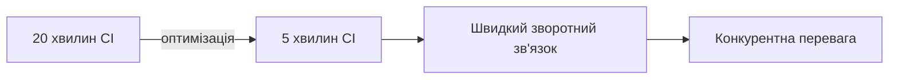
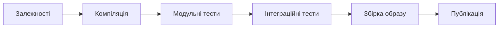
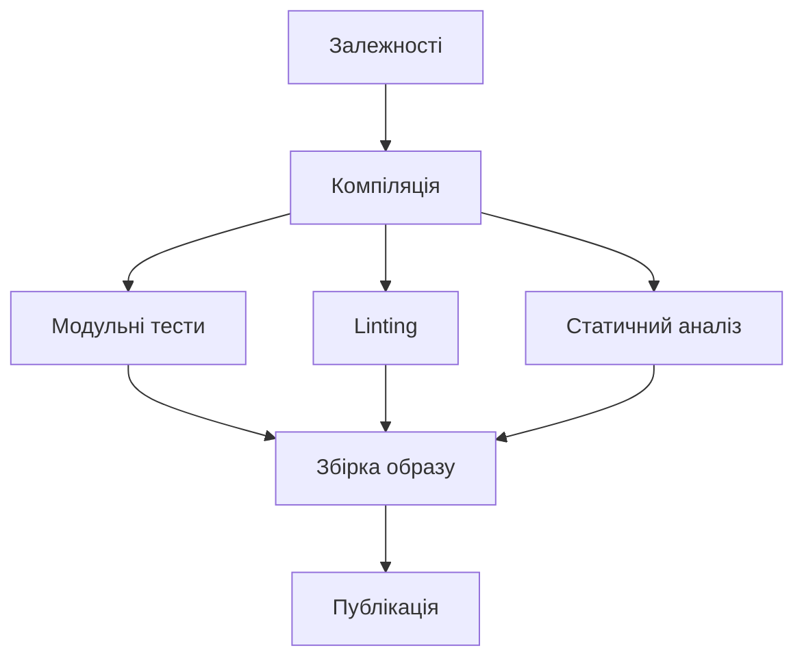
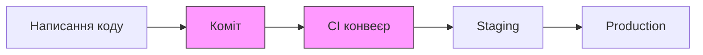
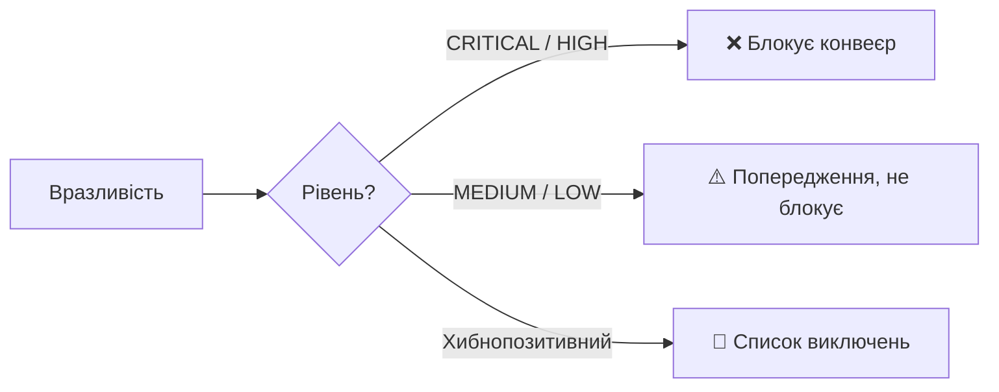
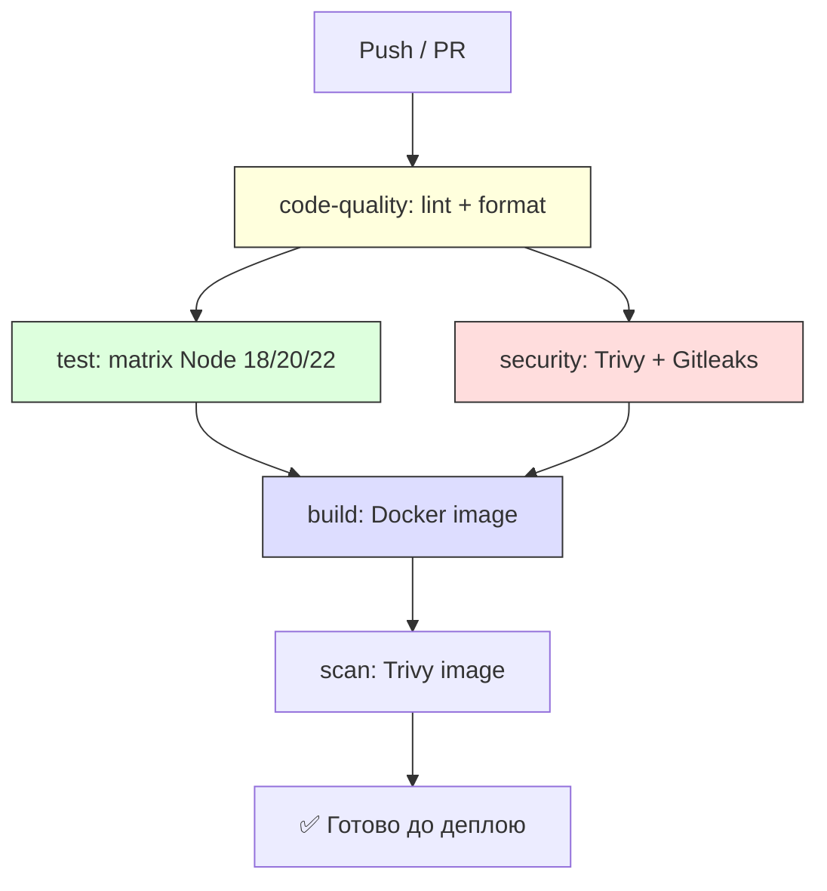
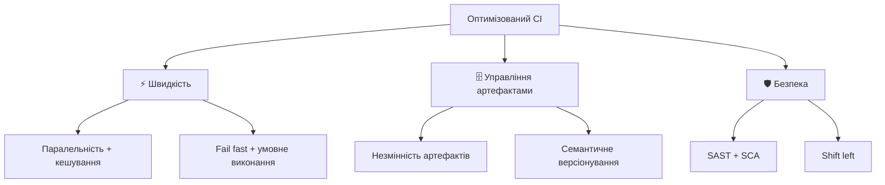

# Оптимізація CI процесів та управління артефактами

---

# Чому швидкість CI має значення? ⚡

> 10 розробників × кілька комітів на день × 20 хвилин очікування = **хаос**



**Проблема** — помилки виявляються пізно, черга задач накопичується

**Рішення** — паралельне виконання, кешування, розумна архітектура конвеєра

---

# Паралельне виконання 🔀

## Послідовний конвеєр — втрачений потенціал



**6 кроків × 3 хвилини = 18 хвилин**

Один потік виконання — весь потенціал CI-платформи простоює

---

# Паралельне виконання 🔀

## Паралельний конвеєр — скорочення на третину



C, D, E — **паралельно**: 18 → **12 хвилин**

---

# Паралельне виконання 🔀

## GitHub Actions: незалежні jobs

```yaml
jobs:
  build:
    runs-on: ubuntu-latest
    steps:
      - run: npm run build

  unit-tests:
    needs: build      # ← після build
    runs-on: ubuntu-latest
    steps:
      - run: npm test

  lint:
    needs: build      # ← паралельно з unit-tests
    steps:
      - run: npm run lint
```

---

# Матрична стратегія 🎯

## Автоматична генерація паралельних задач

```yaml
jobs:
  test:
    strategy:
      matrix:
        node-version: [18, 20, 22]
        os: [ubuntu-latest, windows-latest]
    runs-on: ${{ matrix.os }}
    steps:
      - uses: actions/setup-node@v4
        with:
          node-version: ${{ matrix.node-version }}
      - run: npm test
```

**3 версії × 2 ОС = 6 паралельних задач** з одного шаблону ✨

---

# Кешування залежностей 💾

## Проблема: npm install займає 2–5 хвилин

**Ідея**: якщо `package-lock.json` не змінився — нащо завантажувати знову?

```yaml
- name: Відновлення кешу npm
  uses: actions/cache@v4
  with:
    path: ~/.npm
    key: ${{ runner.os }}-npm-${{ hashFiles('**/package-lock.json') }}
    restore-keys: |
      ${{ runner.os }}-npm-
```

| Стан | Час |
|------|-----|
| Без кешу | 2–5 хвилин |
| З кешем (файл не змінився) | **секунди** |

---

# Кешування залежностей 💾

## Різні екосистеми — схожий підхід

```yaml
# Python
- uses: actions/cache@v4
  with:
    path: ~/.cache/pip
    key: ${{ runner.os }}-pip-${{ hashFiles('requirements.txt') }}

# Java (Gradle)
- uses: actions/cache@v4
  with:
    path: |
      ~/.gradle/caches
      ~/.gradle/wrapper
    key: ${{ runner.os }}-gradle-${{ hashFiles('**/*.gradle*') }}
```

**Принцип**: ключ кешу = хеш файлу залежностей

---

# Кешування Docker-шарів 🐳

## CI стартує з чистого середовища — шари втрачаються

```yaml
- uses: docker/build-push-action@v5
  with:
    context: .
    push: true
    tags: myapp:latest
    cache-from: type=registry,ref=myapp:buildcache
    cache-to: type=registry,ref=myapp:buildcache,mode=max
```

**Реєстр контейнерів** як сховище кешу між запусками

---

# Стратегія "Fail Fast" ⚡

## Найшвидші перевірки — першими

| Порядок | Крок | Час |
|---------|------|-----|
| 1️⃣ | Lint та форматування | секунди |
| 2️⃣ | Компіляція | секунди — хвилини |
| 3️⃣ | Модульні тести | хвилини |
| 4️⃣ | Інтеграційні тести | хвилини — десятки хвилин |
| 5️⃣ | Наскрізні тести та безпека | десятки хвилин |

**Якщо крок 1 провалився** → конвеєр зупиняється негайно, ресурси не витрачаються

---

# Оптимізація Dockerfile 🏗️

## Порядок інструкцій має значення!

```dockerfile
# ❌ Неоптимально
COPY . .          # будь-яка зміна анулює кеш npm install
RUN npm ci        # виконується завжди заново

# ✅ Оптимально
COPY package.json package-lock.json ./
RUN npm ci        # кешується окремо від коду!
COPY . .          # зміни коду не торкаються попереднього шару
RUN npm run build
```

**Правило**: часто змінювані інструкції — якомога пізніше

---

# Багатоетапна збірка 📦

## Build-образ ≠ Production-образ

```dockerfile
# Етап 1: важкі інструменти збірки
FROM node:20-alpine AS builder
RUN npm ci && npm run build

# Етап 2: лише те, що потрібно для роботи
FROM node:20-alpine AS production
COPY --from=builder /app/dist ./dist
COPY --from=builder /app/node_modules ./node_modules
USER node
CMD ["node", "dist/server.js"]
```

| Образ | Розмір |
|-------|--------|
| З усіма інструментами | 500+ МБ |
| Оптимізований виробничий | **50–100 МБ** |

---

# Управління артефактами 🗄️

## Що таке артефакт CI/CD?

Будь-який файл — **результат** виконання конвеєра:

- 📦 Скомпільовані бінарні файли, JAR/WAR архіви
- 🌐 Зібрані статичні ресурси (HTML, CSS, JS після мінімізації)
- 🐳 Docker-образи контейнерів
- 📚 Пакети бібліотек (npm, pip, Maven)
- 📊 Результати тестування та покриття коду
- 📄 Автоматично згенерована документація

**Навіщо** — відтворюваність, уникнення повторної збірки, трасовність розгортань

---

# Управління артефактами 🗄️

## Тимчасові артефакти між задачами

```yaml
jobs:
  build:
    steps:
      - run: npm run build
      - uses: actions/upload-artifact@v4
        with:
          name: build-output
          path: dist/
          retention-days: 7     # ← контроль витрат

  deploy:
    needs: build
    steps:
      - uses: actions/download-artifact@v4
        with:
          name: build-output
          path: dist/
      - run: ./scripts/deploy.sh
```

---

# Реєстри контейнерів та SemVer 🏷️

## Стратегія тегування образів

```yaml
- uses: docker/metadata-action@v5
  with:
    tags: |
      type=sha,prefix=sha-          # точна ідентифікація коміту
      type=ref,event=branch         # назва гілки
      type=semver,pattern={{version}}  # 1.2.3
      type=raw,value=latest,enable={{is_default_branch}}
```

## Семантичне версіонування (SemVer)

| Тип зміни | Версія | Conventional Commit |
|-----------|--------|---------------------|
| Виправлення помилок | PATCH ↑ | `fix: ...` |
| Нова функціональність | MINOR ↑ | `feat: ...` |
| Зламані зміни API | MAJOR ↑ | `feat!: ...` |

---

# Безпека в CI — концепція "Shift Left" 🛡️

## Перенести перевірки безпеки якомога раніше



**Дешевше виправляти вразливість під час написання коду**, ніж після production-деплою

Розробник отримує зворотний зв'язок, поки контекст ще свіжий 🧠

---

# SAST — статичний аналіз коду 🔍

## Аналіз без виконання: SQL-ін'єкції, XSS, небезпечна криптографія

| Мова | Інструмент |
|------|------------|
| JS/TS | ESLint + плагіни безпеки, Semgrep |
| Python | Bandit, Semgrep |
| Java | SpotBugs, SonarQube |
| Будь-яка | **Semgrep**, **CodeQL** (GitHub) |

```yaml
- uses: semgrep/semgrep-action@v1
  with:
    config: >-
      p/default
      p/owasp-top-ten
      p/javascript
```

---

# SCA — аналіз залежностей 📋

## Перевірка сторонніх бібліотек на відомі вразливості

**Бази даних**: CVE · NVD · OSV

| Інструмент | Особливості |
|------------|-------------|
| Dependabot | Вбудований у GitHub, автоматичні PR |
| Trivy | Сканує залежності та Docker-образи |
| OWASP Dependency-Check | Підтримка багатьох екосистем |
| Snyk | Комерційний, безкоштовний для open source |

```yaml
- uses: aquasecurity/trivy-action@master
  with:
    scan-type: fs
    severity: CRITICAL,HIGH
    exit-code: 1
    format: sarif
    output: trivy-results.sarif
```

---

# Сканування Docker-образів та секретів 🔐

## Образ може містити вразливості базового образу

```yaml
- uses: aquasecurity/trivy-action@master
  with:
    image-ref: myapp:${{ github.sha }}
    exit-code: 1          # блокує публікацію!
    severity: CRITICAL
```

**Рекомендації для зменшення вразливостей**:
- Мінімалістичні образи: Alpine Linux, Distroless
- Регулярні оновлення базових образів
- Ніколи не запускати контейнер від `root`

## Виявлення витоку секретів

```yaml
- uses: gitleaks/gitleaks-action@v2    # паролі, токени, API-ключі
```

---

# Диференційована реакція на вразливості ⚖️

## "Блокувати все" → розробники ігнорують сканування



```yaml
- uses: aquasecurity/trivy-action@master
  with:
    severity: CRITICAL,HIGH
    exit-code: 1        # ← блокує

- uses: aquasecurity/trivy-action@master
  with:
    severity: MEDIUM,LOW
    exit-code: 0        # ← лише попередження
```

---

# Комплексний оптимізований конвеєр 🚀



---

# Комплексний конвеєр — що реалізовано ✅

| Практика | Реалізація |
|----------|------------|
| Fail Fast | Lint — першим |
| Паралельність | test + security одночасно |
| Матриця | Node 18, 20, 22 |
| Кешування npm | `cache: npm` у setup-node |
| Кешування Docker | Registry buildcache |
| Автотегування | docker/metadata-action |
| Сканування залежностей | Trivy fs |
| Виявлення секретів | Gitleaks |
| Сканування образу | Trivy image |
| Блокування при CRITICAL | `exit-code: 1` |

---

# Підсумок 🎓

## Три кити оптимізованого CI



> **Ключова думка**: CI-конвеєр — це **система раннього попередження**, а не бар'єр. Швидко, надійно, безпечно.
