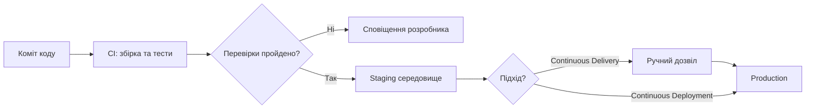
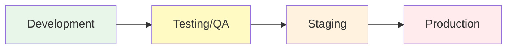
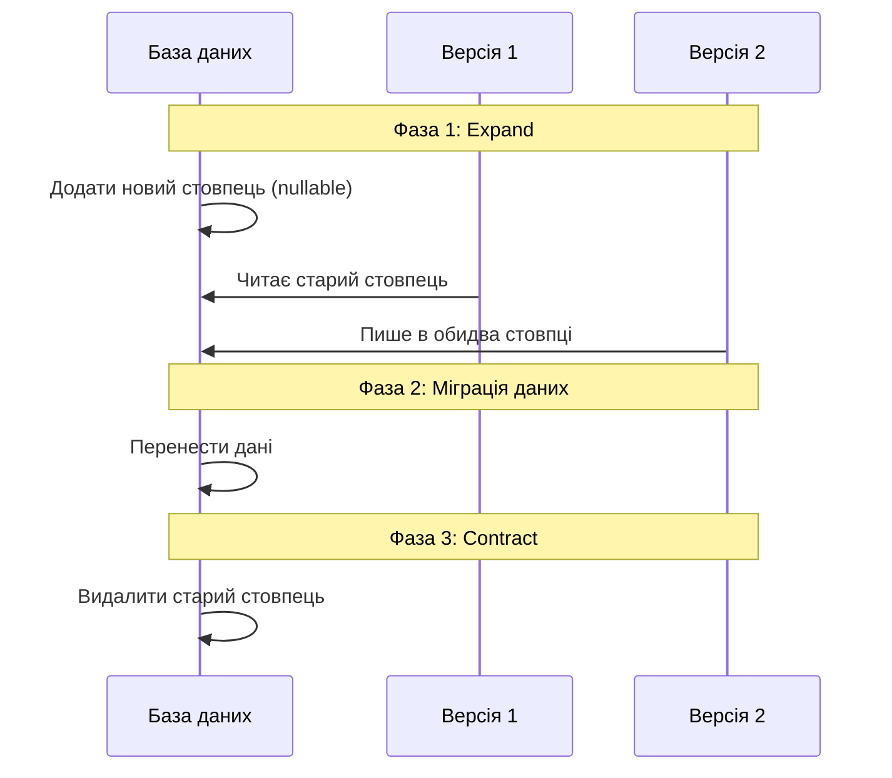
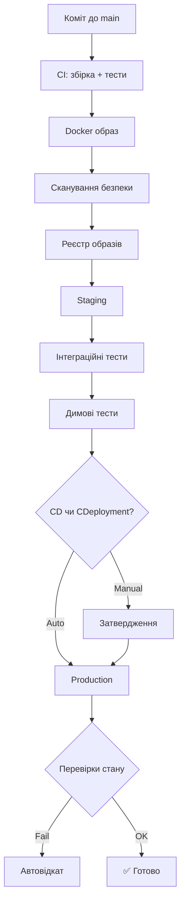

# 🚀 Організація процесів безперервної доставки


---

# 📌 План лекції

- Continuous Delivery vs Continuous Deployment
- Огляд стратегій випуску
- Управління середовищами
- Міграції бази даних у CD
- Повна картина CD-конвеєра

---

# 🔄 Continuous Delivery

**Continuous Delivery (CD)** — програмне забезпечення **завжди** готове до розгортання у production.

- Кожна зміна проходить через конвеєр автоматично
- Фінальне рішення про випуск — **за людиною**
- Підходить для regulated-галузей та консервативних продуктів

> "Натискання кнопки — свідомий акт, а не технічне обмеження."

---

# ⚡ Continuous Deployment

**Continuous Deployment** — успішна зміна **автоматично** потрапляє у production.

- Нульове ручне втручання після пуш-комміту
- Amazon, Netflix, Etsy — десятки розгортань на день
- Підходить для стартапів, SaaS, продуктів з частими оновленнями

Спільна вимога обох підходів — **якісні автоматизовані тести**.

---

# 📊 CD vs CDeployment: схема



---

# 🗺️ Стратегії випуску: огляд

| Стратегія | Суть | Простій |
|---|---|---|
| Recreate | Зупинити старе → запустити нове | Так |
| Rolling Update | Поступова заміна екземплярів | Ні |
| Blue-Green | Два середовища, миттєве перемикання | Ні |
| Canary | Частковий трафік на нову версію | Ні |
| Feature Flags | Код у production, функція вимкнена | Ні |

---

# 🔁 Rolling Update

Екземпляри замінюються **по черзі** — нова і стара версія працюють паралельно.

- Мінімальні витрати на інфраструктуру
- Kubernetes реалізує за замовчуванням
- ⚠️ Вимагає зворотної сумісності між версіями

---

# 🔵🟢 Blue-Green

Два ідентичних середовища, трафік — лише на одне.

- Нова версія розгортається в неактивне середовище
- Перемикання та відкат — **миттєві**
- ⚠️ Подвоєні витрати на інфраструктуру

---

# 🐦 Canary Releases

Нова версія отримує **невеликий** відсоток реального трафіку.

- 5% → 20% → 50% → 100%
- Рішення на основі реальних метрик
- Мінімальний ризик для більшості користувачів
- Вимагає інструментів: Flagger, Argo Rollouts

---

# 🚩 Feature Flags

Код розгорнуто у production, але **функція вимкнена**.

```python
if feature_flags.is_enabled("new_checkout", user=current_user):
    return new_checkout()
else:
    return old_checkout()
```

- Розриває зв'язок між деплойментом і бізнес-рішенням
- Підтримує trunk-based development
- ⚠️ Потребує дисципліни: прапорці треба прибирати вчасно

---

# 🌍 Управління середовищами



---

# 🌍 Призначення середовищ

- **Development** — локальна розробка, тестові дані, спрощені залежності
- **Testing/QA** — автоматизовані та ручні тести, синтетичні дані
- **Staging** — максимально точна копія production, UAT, перевірка конфігурацій
- **Production** — реальні користувачі, максимальна стабільність

---

# ⚖️ Паритет середовищ

> "У мене локально все працює" — найпоширеніша причина проблем при розгортанні.

Рішення:

- Контейнеризація (однакове оточення скрізь)
- Конфігурація з середовища, а не з образу
- ConfigMaps, змінні середовища, системи секретів
- Принцип Twelve-Factor App

---

# 🗄️ Міграції БД у CD

Схема бази даних — **найскладніший** аспект CD.

На відміну від коду — не можна просто відкотити, дані вже змінились.

Проблема: під час rolling або blue-green розгортання одночасно можуть працювати **дві версії застосунку** з однією базою.

---

# 🗄️ Патерн Expand-Contract



---

# 🗄️ Інструменти міграцій

**Flyway** та **Liquibase** — стандарт для управління версіями схеми БД.

- Пронумеровані скрипти міграцій зберігаються поруч з кодом
- Відстежують застосовані міграції
- Забезпечують відтворюваність у будь-якому середовищі
- Запускаються як крок конвеєра або init-контейнер у Kubernetes

---

# 🏗️ Повна картина CD-конвеєра



---

# ✅ Підсумок

- **Continuous Delivery** — завжди готово, людина вирішує коли
- **Continuous Deployment** — автоматично, якщо тести зелені
- **Стратегії випуску**: Recreate → Rolling → Blue-Green → Canary → Feature Flags
- **Середовища**: Dev → QA → Staging → Production з паритетом конфігурацій
- **Міграції БД**: патерн Expand-Contract для безпечних змін схеми
