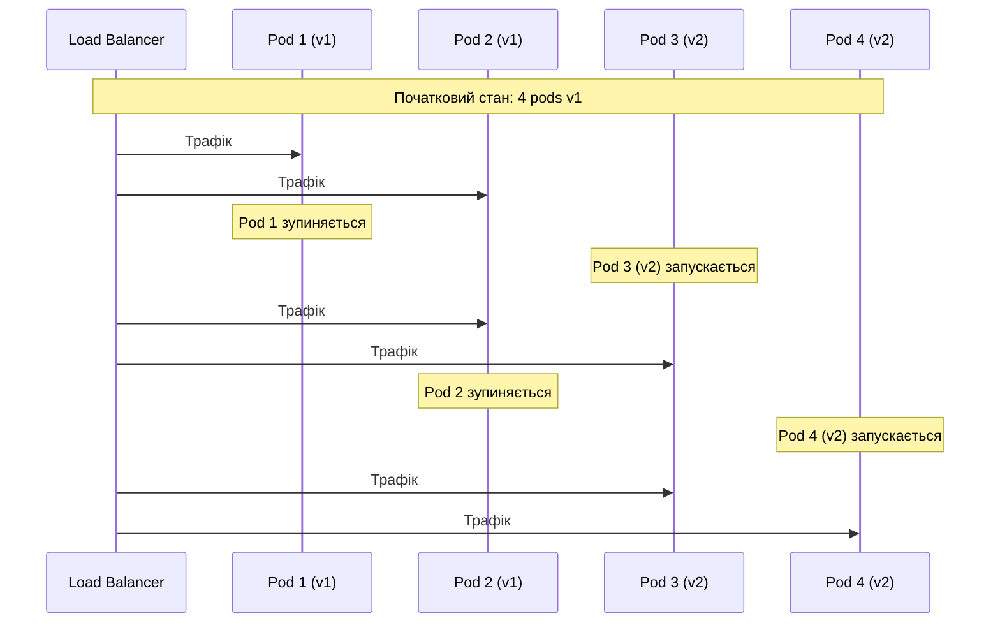
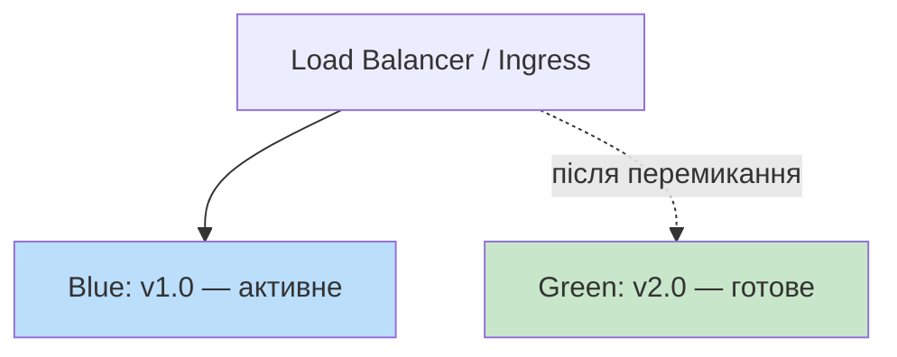
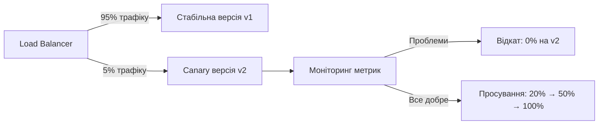
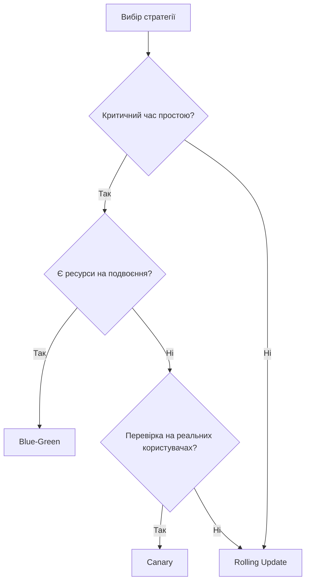

# 🛡️ Стратегії безпечного розгортання застосунків


---

# 📌 План лекції

- Rolling Deployment: поступове оновлення
- Blue-Green розгортання
- Canary releases
- Feature Flags
- Порівняння стратегій і вибір

---

# 🔁 Rolling Deployment

**Поступове оновлення** — найпростіша з безпечних стратегій.

Екземпляри замінюються новою версією **по черзі**, а не всі одночасно.

У будь-який момент у кластері присутні і стара, і нова версія.

---

# 🔁 Rolling Deployment: конфігурація Kubernetes

```yaml
spec:
  replicas: 4
  strategy:
    type: RollingUpdate
    rollingUpdate:
      maxUnavailable: 1   # макс. 1 pod може бути недоступним
      maxSurge: 1         # макс. 1 зайвий pod понад бажану кількість
```

- `maxUnavailable` — скільки екземплярів можна виводити з ладу одночасно
- `maxSurge` — скільки додаткових екземплярів можна створити

---

# 🔁 Rolling Deployment: процес



---

# 🔁 Rolling Deployment: оцінка

✅ Мінімальні ресурси, проста реалізація

✅ Kubernetes реалізує за замовчуванням

⚠️ Дві версії одночасно в production

⚠️ Підходить лише для сумісних між собою версій

---

# 🔵🟢 Blue-Green розгортання

Два **повністю ідентичних** виробничих середовища.

- **Blue** — активне, обслуговує реальний трафік
- **Green** — резервне, готується до наступного випуску



---

# 🔵🟢 Blue-Green: реалізація в Kubernetes

```yaml
apiVersion: v1
kind: Service
metadata:
  name: my-app
spec:
  selector:
    app: my-app
    version: blue   # змінити на "green" для перемикання
  ports:
    - port: 80
      targetPort: 8080
```

Переключення трафіку — зміна одного рядка в маніфесті.

---

# 🔵🟢 Blue-Green: оцінка

✅ Миттєве перемикання трафіку

✅ Миттєвий відкат — достатньо змінити селектор назад

✅ Обидві версії завжди готові до роботи

⚠️ Подвоєні витрати на інфраструктуру

⚠️ Не вирішує проблему несумісних змін схеми БД

---

# 🐦 Canary Releases

Назва — від практики шахтарів брати канарку як індикатор небезпечного газу.

Невелика частина користувачів першою отримує нову версію. Якщо проблем немає — розгортання продовжується.



---

# 🐦 Canary: типовий сценарій

- 5% трафіку → нова версія (спостереження 30 хвилин)
- 20% трафіку → нова версія (спостереження 1 година)
- 50% трафіку → нова версія (спостереження кілька годин)
- 100% трафіку → нова версія, стара виводиться з обігу

---

# 🐦 Canary: реалізація в Kubernetes

```yaml
# Стабільна версія: 9 реплік
apiVersion: apps/v1
kind: Deployment
metadata:
  name: my-app-stable
spec:
  replicas: 9
  selector:
    matchLabels:
      app: my-app
      track: stable
```

```yaml
# Canary: 1 репліка (~10% трафіку)
apiVersion: apps/v1
kind: Deployment
metadata:
  name: my-app-canary
spec:
  replicas: 1
  selector:
    matchLabels:
      app: my-app
      track: canary
```

Спільний Service з селектором `app: my-app` — трафік розподіляється пропорційно кількості pods.

---

# 🐦 Canary: метрики аналізу

Що відстежувати під час canary-розгортання:

- Частота помилок HTTP (відсоток відповідей 5xx)
- Затримка відповідей (95-й та 99-й перцентилі)
- Успішність бізнес-транзакцій (наприклад, завершених замовлень)
- Споживання ресурсів (CPU, пам'ять)

Інструменти автоматизації: **Flagger**, **Argo Rollouts**

---

# 🚩 Feature Flags

Механізм, що дозволяє розгортати код у **вимкненому** стані та активувати окремо від деплойменту.

```python
# З feature flags
if feature_flags.is_enabled("new_checkout_flow", user=current_user):
    return new_checkout()
else:
    return old_checkout()
```

Прапорець активується через конфігурацію — без нового деплойменту.

---

# 🚩 Типи feature flags

| Тип | Призначення |
|---|---|
| Release flags | Приховування незавершеної функціональності |
| Experiment flags | A/B тестування різних груп користувачів |
| Ops flags | Вимикання важких операцій під навантаженням |
| Permission flags | Доступ лише для окремих груп (бета, платні) |

---

# 🚩 Feature Flags: оцінка

✅ Trunk-based development без довгоживучих гілок

✅ Розгортання відокремлене від бізнес-рішення

✅ Миттєве вимкнення функції без деплойменту

⚠️ Ускладнює код умовними переходами

⚠️ «Технічний борг прапорців» — старі прапорці треба видаляти

---

# 📊 Порівняння стратегій

| Критерій | Rolling | Blue-Green | Canary |
|---|---|---|---|
| Час простою | Мінімальний | Відсутній | Відсутній |
| Витрати на інфраструктуру | Низькі | Подвоєні | Помірні |
| Швидкість відкату | Повільна | Миттєва | Швидка |
| Ризик для користувачів | Середній | Низький | Мінімальний |
| Складність реалізації | Низька | Середня | Висока |

---

# 🧭 Як обрати стратегію?



---

# 🔗 Комбінування стратегій

На практиці стратегії часто поєднуються:

- Blue-Green для перемикання між основними версіями
- Feature Flags для поступового розкриття окремих функцій всередині версії

Це дає максимальний контроль над ризиком при мінімальному часі простою.

---

# ✅ Підсумок

- **Rolling Update** — простий вибір для типових оновлень з мінімальними ресурсами
- **Blue-Green** — нульовий простій і миттєвий відкат ціною подвоєних ресурсів
- **Canary** — перевірка на реальному трафіку з мінімальним ризиком
- **Feature Flags** — деплоймент і бізнес-рішення незалежні одне від одного
